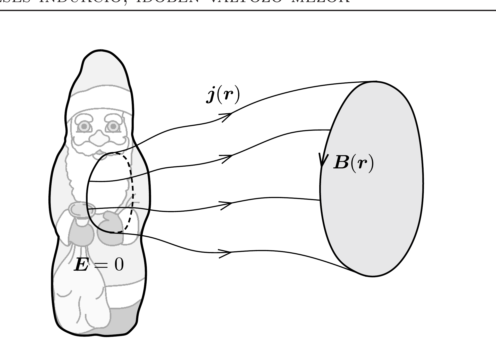

## Útmutatás

A mágneses teret nemcsak a levegőben folyó áramok alakítják, hanem a csokimikulás időben változó elektromos tere is (eltolási áram).

## Megoldás

A feltöltött csokimikulás körül elektrosztatikus mező alakul ki, amely megragadja a levegőben található töltéshordozókat, és így elektromos áram indul meg a „végtelen” felé (valójában a mikulástól távoli, földelt vezetők felé). A mikulást körülvevő mágneses teret azonban nemcsak a levegőben folyó áramok keltik! Az elektrosztatikus tér - a mikulás időben fokozatosan csökkenő töltése miatt - időben változik, ami eltolási áram formájában szintén létrehoz mágneses teret.

A csokimikulás körül kialakuló mágneses mező indukcióvonalai zártak, mert a mágneses mező forrásmentes. Válasszunk ki egy tetszőleges indukcióvonal-hurkot és egy erre a hurokra illeszkedó zsákfelületet (ez az ábrán látható szürke felület). Ha a zárt hurokra kiszámítjuk a mágneses mező
\[
\ddot{O}_{B}=\sum \boldsymbol{B}(\boldsymbol{r}) \Delta \boldsymbol{r}
\]
örvényerősségét (a $B$-vonal irányítottságával megegyező körüljárási irányban), akkor csak nemnegatív értéket kaphatunk eredményül, hiszen az indukció iránya és a hurok érintő́je által bezárt szög a hurok mentén nulla. Pontosan zérus örvényerősséget akkor és csak akkor kapunk, ha a hurok mentén a mágneses indukció értéke azonosan nulla.

Az Ampère-féle gerjesztési törvény értelmében a zárt hurok örvényerőssége arányos a hurokra illeszkedő zsákfelületen áthaladó eredő áramerősséggel (ami a töltések által keltett elektromos áram és a változó elektromos tér miatt keletkező eltolási áram összege). Egy furfangos gondolattal ezt az eredő áramerősséget könnyen meghatározhatjuk! A szürke felület helyett válasszunk olyan zsákfelületet, amely benyúlik a csokimikulás belsejébe, a mikuláson kívül pedig a zárt hurokra illeszkedő áramvonalak határolják. Mivel a mikulás belsejében az elektromos térerósség és az áramsúrúség is zérus, a zsákfelület mikuláson kívüli részét pedig nem döfi át sem a töltéshordozók vezetési árama, sem pedig elektromos térerősség (hiszen a differenciális Ohm-törvény szerint az elektromos térerősség arányos és azonos irányú az áramsűrúséggel), így a mágneses mező $O_{B}$ örvényerőssége a zsák száját alkotó hurokra zérus. Ez azt jelenti, hogy a hurok mentén a mágneses indukció végig nulla.

A mikulás körül tehát nem alakulnak ki indukcióvonalak, a mágneses indukció értéke az egész térben azonosan nulla.
