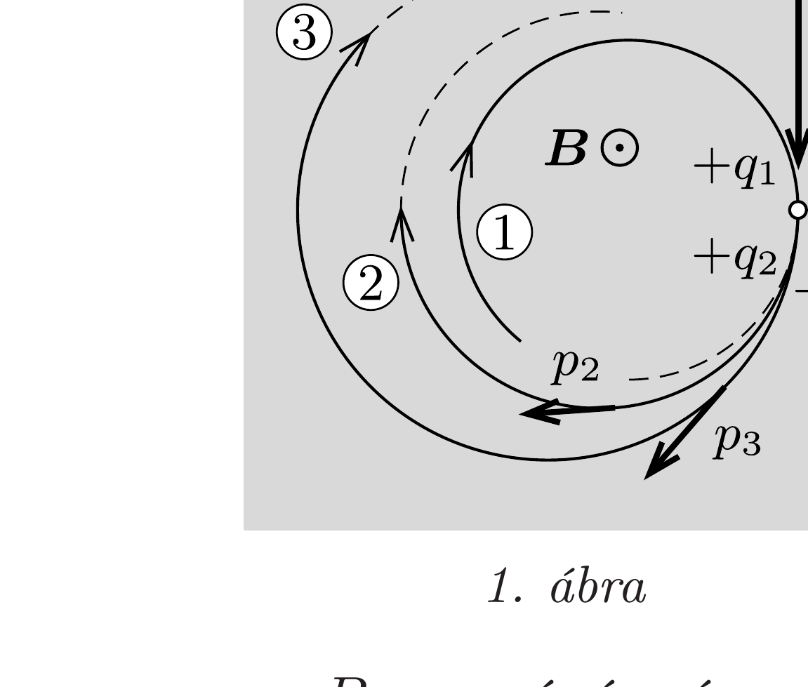
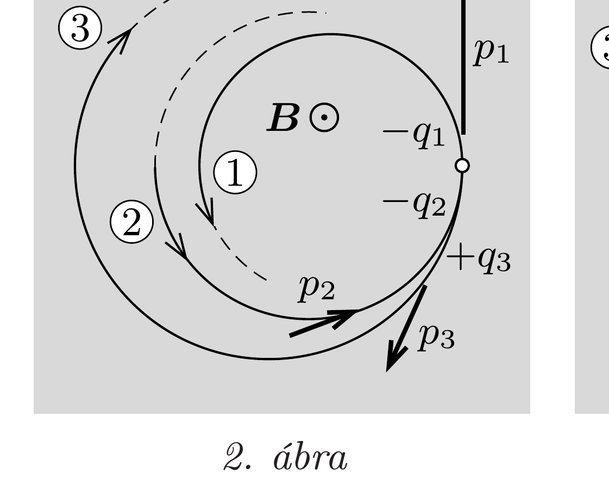
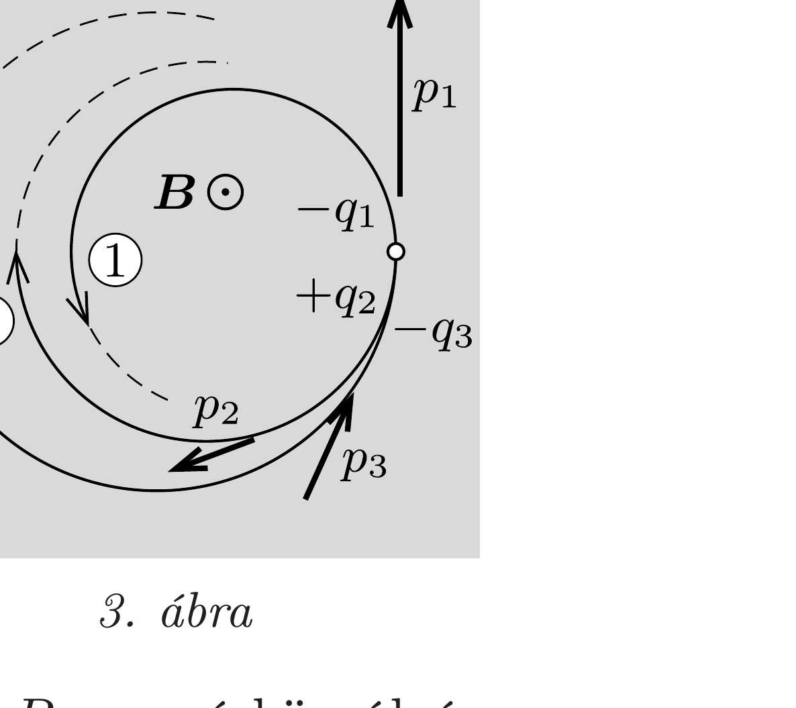

## Útmutatás

Homogén mágneses mezőben a fékeződésmentesen mozgó töltött részecske a mágneses térre merőleges síkban egyenletes körmozgást végez. A bomlás során érvényes az elektromos töltés, valamint az impulzus megmaradási törvénye. A válasz nem függ attól, hogy a részecskék relativisztikusan mozognak-e.

## Megoldás

Homogén mágneses mezőben a fékeződésmentesen mozgó töltött részecske a mágneses térre merőleges síkban egyenletes körmozgást végez, amihez még a mágneses térrel párhuzamos irányú egyenletes mozgás is hozzáadódhat. Az ábrán látható felvétel (ha egyáltalán létezik ilyen) a mágneses mezó irányából készült (hiszen a pályák körívek). A mágneses tér irányú mozgás - ami nem látszik
a felvételen - a továbbiakban figyelmen kívül hagyható. Feltételezhetjük, hogy a mágneses tér a közölt ábra síkjára merőlegesen felfelé mutat. (Ha nem így lenne, akkor tekintsük a felvételt a túlsó oldaláról; onnan nézve a mágneses tér ellentétes irányú, a körpályák pedig változatlanok maradnak.)

Számozzuk meg a részecskepályákat belülről kifelé haladva, és jelöljük a pályasugarakat $R_{1}$-gyel, $R_{2}$-vel és $R_{3}$-mal. A közölt ábrán látható, hogy
\[
R_{1}<R_{2}<R_{3} .
\]
Ugyanilyen sorrendben jelöljük a részecskék impulzusának nagyságát $p_{1}$-gyel, $p_{2}$ vel és $p_{3}$-mal, az elektromos töltésük nagyságát pedig $q_{1}$-gyel, $q_{2}$-vel és $q_{3}$-mal! $R_{i}, p_{i}$ és $q_{i}(i=1,2,3)$ mindegyike pozitív, hiszen a megfeleló fizikai mennyiség nagyságát jelöli. Ha valamelyik részecske impulzusa vagy töltése ellentétes lenne a másikéval, ezt a tényt a képletekben kiírt negatív elójellel vesszük figyelembe.

$B$ nagyságú mágneses indukciójú mezőben $v$ sebességgel, $R$ sugarú körpályán mozgó $m$ tömegú, $q$ töltésú részecske (nemrelativisztikus) mozgásegyenlete:
\[
\frac{m v^{2}}{R}=q v B, \quad \text { azaz } \quad m v=q B R,
\]
ami a részecske $p=m v$ impulzusával kifejezve:
\[
p=q B R .
\]

Megjegyzés. Az előzó feladat megoldásában láttuk, hogy a (2) egyenlet akkor is érvényben marad, ha a részecske mozgását a relativisztikus dinamika törvényeivel írjuk le. A következő érvelésünk tehát igaz relativisztikusan mozgó részecskék esetén is.

A bomlási folyamat során a részecskék (előjelhelyesen felírt) elektromos össztöltése, valamint az impulzusok előjeles összege változatlan marad (megmaradó mennyiség). Az ábráról nem tudjuk megállapítani, hogy melyik részecske bomlik, így mind a három lehetséges esetet külön-külön meg kell vizsgálnunk.
(i) Ha az 1-es részecske bomlik (1. ábra), akkor mindhárom részecske „jobbra kanyarodik", tehát pozitív töltésú. Az impulzus- és töltésmegmaradás szerint
\[
p_{1}=p_{2}+p_{3} \quad \text { és } \quad q_{1}=q_{2}+q_{3},
\]
ahonnan (2) alkalmazásával
\[
R_{1}=\frac{q_{2} R_{2}+q_{3} R_{3}}{q_{2}+q_{3}} .
\]
Ez azonban lehetetlen, mert $R_{2}$ és $R_{3}$, vagyis a két nagyobb pályasugár pozitív együtthatókkal súlyozott középértéke nem lehet a legkisebb sugárral egyenlő.
(ii) Ha a 2-es részecske bomlik (2. ábra), akkor csak a 3-as részecske pozitív töltésú, a másik kettő (balra kanyarodó) részecskének negatív elektromos töltésúnek kell lennie. Az impulzus- és töltésmegmaradás egyenletei:
\[
p_{2}=p_{1}-p_{3} \quad \text { és } \quad-q_{2}=-q_{1}+q_{3},
\]
ahonnan (2) alkalmazásával ismét az ellentmondásos (3) összefüggést kapjuk.
(iii) Végül, ha a 3-as részecske bomlik (3. ábra), akkor csak a 2-es részecske pozitív töltésú, a másik kettő töltése negatív, és a megmaradási törvények szerint
\[
p_{3}=p_{1}-p_{2} \quad \text { és } \quad-q_{3}=-q_{1}+q_{2},
\]
ami ugyancsak az ellentmondásos (3) összefüggésre vezet.
Összefoglalva megállapíthatjuk, hogy az ábrán bemutatott „nyomok" nem fordulhatnak elő egyetlen (a valóságban végbement bomlásról készített) ködkamrás felvételen sem!
