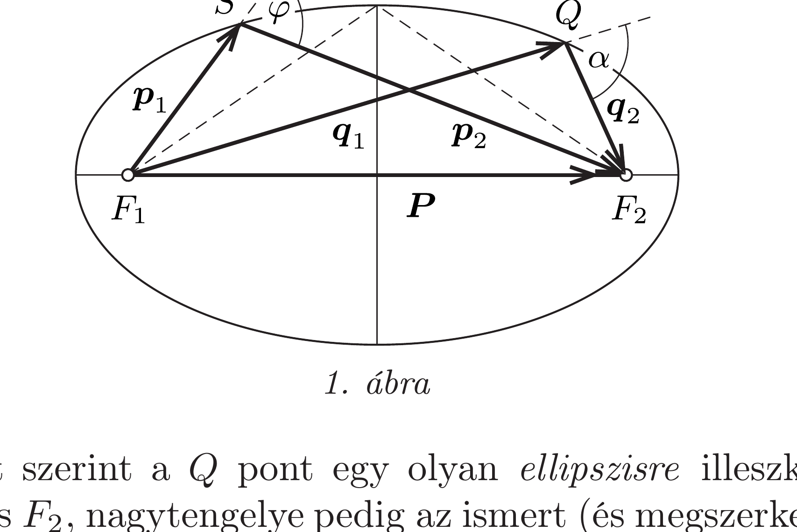
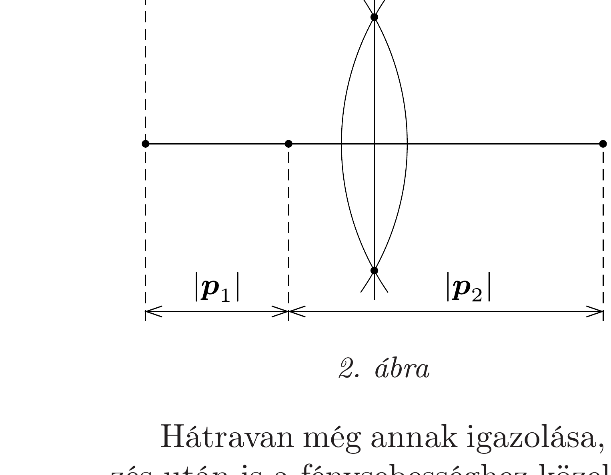
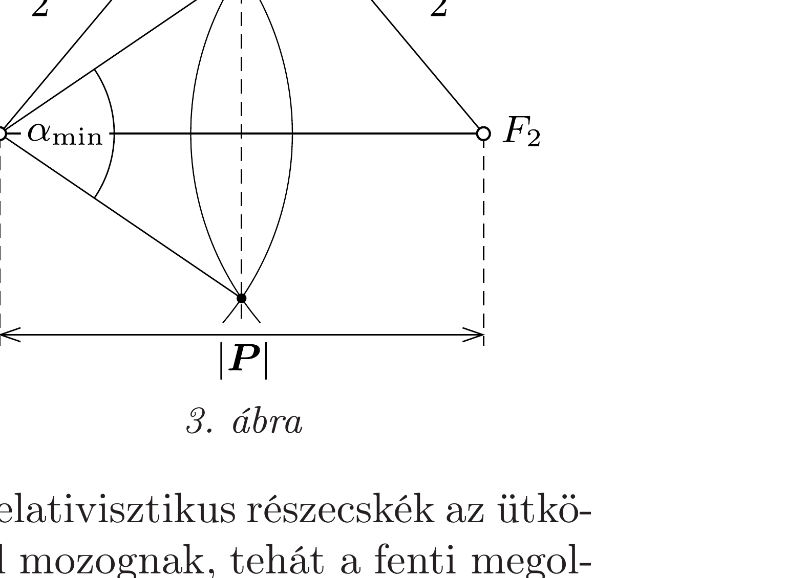

## Útmutatás

Az ultrarelativisztikus részecskék energiája az impulzusuk nagyságával arányos. Az energia- és az impulzusmegmaradás törvényét alkalmazva beláthatjuk, hogy ha a részecskék ütközés előtti és utáni impulzusvektorait közös pontból indítva felrajzoljuk, akkor végpontjaik egy ismert görbére illeszkednek.

## Megoldás

Rugalmas ütközésnél a részecskék összenergiája is és impulzusuk vektori összege is változatlan marad. Ezeket a mennyiségeket a fénysebességet megközelító sebességeknél a relativisztikus mechanika törvényei szerint számíthatjuk ki. Egy $m$ nyugalmi tömegú, $\boldsymbol{v}$ sebességú részecske (teljes) energiája és impulzusa
\[
E=\frac{m c^{2}}{\sqrt{1-v^{2} / c^{2}}}, \quad \text { illetve } \quad \boldsymbol{p}=\frac{m \boldsymbol{v}}{\sqrt{1-v^{2} / c^{2}}},
\]
ezekből
\[
\boldsymbol{p}=\frac{E}{c^{2}} \boldsymbol{v}
\]
is következik. Ultrarelativisztikus határesetben (vagyis amikor $|\boldsymbol{v}|=v \approx c$ ) az energia és az impulzus nagyságának kapcsolata:
\[
E \approx p c .
\]

Megjegyzés. Ugyanez az összefüggés a sebesség kiküszöbölése után (1)-ből közvetlenül adódó
\[
E^{2}=(p c)^{2}+\left(m c^{2}\right)^{2}
\]
tömeghéj-feltételből is leolvasható, ha abban - ultrarelativisztikus határesetben - az $m c^{2}$ nyugalmi energiát a részecske teljes $E$ energiája mellett elhanyagoljuk.

Jelöljük a feladatunkban szereplő részecskék ütközés utáni impulzusát $\boldsymbol{q}_{1}$-gyel és $\boldsymbol{q}_{2}$-vel. Feltételezve, hogy ezek is ultrarelativisztikus impulzusok, a megmaradási törvények így írhatók fel:
\[
\boldsymbol{p}_{1}+\boldsymbol{p}_{2}=\boldsymbol{q}_{1}+\boldsymbol{q}_{2},
\]
illetve $p_{1} c+p_{2} c=q_{1} c+q_{2} c$, vagyis
\[
p_{1}+p_{2}=q_{1}+q_{2} .
\]

A fenti egyenleteket az 1. ábrán látható módon szemléltethetjük. A részecskék adott $\boldsymbol{p}_{1}$ és $\boldsymbol{p}_{2}$ impulzusából megszerkeszthetó az összimpulzus $\boldsymbol{P}=\boldsymbol{p}_{1}+\boldsymbol{p}_{2}$ vektora, amely egyúttal az ütközés utáni impulzusok összege. Az energiamegmaradás (3) képlete szerint a még ismeretlen $Q$ pontnak a $\boldsymbol{P}$ vektor végpontjaitól mért távolságösszege adott:

A (4) egyenlet szerint a $Q$ pont egy olyan ellipszisre illeszkedik, amelynek fókuszpontjai $F_{1}$ és $F_{2}$, nagytengelye pedig az ismert (és megszerkeszthető) $p_{1}+p_{2}$ távolság.

Vajon az ellipszis mely pontjánál lesz a szétrepülő részecskék mozgásiránya, vagyis az ábrán látható $\alpha$ szög a legkisebb? Belátjuk, hogy $\alpha$ akkor minimális, amikor $Q$ az ellipszis kistengelyének valamelyik végpontja, vagyis amikor $q_{1}=q_{2}$. Emeljük négyzetre a (2) összefüggést (vagy írjuk fel az $F_{1} S F_{2}$ és az $F_{1} Q F_{2}$ háromszögekre a koszinusz-tételt):
\[
p_{1}^{2}+p_{2}^{2}+2 p_{1} p_{2} \cos \varphi=P^{2}=q_{1}^{2}+q_{2}^{2}+2 q_{1} q_{2} \cos \alpha,
\]
illetve képezzük a (3) egyenlet mindkét oldalának négyzetét:
\[
p_{1}^{2}+p_{2}^{2}+2 p_{1} p_{2}=q_{1}^{2}+q_{2}^{2}+2 q_{1} q_{2} .
\]
A (6) és (5) egyenletek különbségét képezve kapjuk:
\[
2 p_{1} p_{2}(1-\cos \varphi)=2 q_{1} q_{2}(1-\cos \alpha),
\]
ahonnan a kérdéses szög koszinusza kifejezhető:
\[
\cos \alpha=1-\frac{p_{1} p_{2}(1-\cos \varphi)}{q_{1} q_{2}} .
\]
Látható, hogy $\alpha$ akkor a legkisebb, amikor a $q_{1} q_{2}$ szorzat a legnagyobb, hiszen a többi kifejezés a $Q$ pont helyzetétől független. Mivel $q_{1}+q_{2}$ adott érték, a számtani és mértani közepekre vonatkozó egyenlőtlenség szerint
\[
q_{1} q_{2} \leq\left(\frac{q_{1}+q_{2}}{2}\right)^{2}=\left(\frac{p_{1}+p_{2}}{2}\right)^{2},
\]
és az egyenlőség akkor teljesül, ha $q_{1}=q_{2}$.
A fenti eredmények ismeretében az $\alpha$ szöget a következőképpen szerkeszthetjük meg:
1. Az egyik vektor párhuzamos eltolásával (az 1. ábrán látható módon) megszerkesztjük a $\boldsymbol{p}_{1}$ és $\boldsymbol{p}_{2}$ vektorok összegét, $\boldsymbol{P}$-t.
2. Egy egyenesre felmérjük $p_{1}$-et és $p_{2}$-t, majd a $p_{1}+p_{2}$ hosszúságú szakaszt (a felezőmerőleges megszerkesztésével) elfelezzük (2. ábra).
3. Megrajzoljuk azt a két kört, amelyek sugara $\left(p_{1}+p_{2}\right) / 2$, középpontjuk pedig $\boldsymbol{P}$ kezdő-, illetve végpontja ( $F_{1}$ és $F_{2}$ ). A körök metszéspontjai kitúzik $\boldsymbol{q}_{1}$ és $\boldsymbol{q}_{2}$ irányát, és megadják a legkisebb szétrepülési szög nagyságát (3. ábra).

Hátravan még annak igazolása, hogy az ultrarelativisztikus részecskék az ütközés után is a fénysebességhez közeli sebességekkel mozognak, tehát a fenti megoldásban alkalmazott ultrarelativisztikus energiaképlet jogos közelítés. Tételezzük fel ennek ellenkezőjét, vagyis azt, hogy az egyik részecske az ütközés után nagyon lassan mozog. (Mindkettő nem lassulhat le, hiszen az összes energia sokkal nagyobb, mint a részecskék nyugalmi energiája.) Ha ez bekövetkezne, akkor az energia- és az impulzusmegmaradás képlete így nézne ki:
\[
\begin{array}{r}
p_{1} c+p_{2} c \approx q_{1} c, \\
\boldsymbol{p}_{1}+\boldsymbol{p}_{2} \approx \boldsymbol{q}_{1},
\end{array}
\]
mert a „lassú" részecske energiája is és impulzusa is elhanyagolható a másik (gyors) részecske megfelelő adatai mellett. Ez azonban nem lehetséges, a fenti két egyenlet egymásnak ellentmond, hiszen a háromszög-egyenlőtlenség szerint
\[
q_{1}=\left|\boldsymbol{p}_{1}+\boldsymbol{p}_{2}\right| \leq\left|\boldsymbol{p}_{1}\right|+\left|\boldsymbol{p}_{2}\right|,
\]
tehát
\[
p_{1} c+p_{2} c \geq q_{1} c .
\]
(Az egyenlőség csak akkor állhatna fenn, ha $\boldsymbol{p}_{1}$ és $\boldsymbol{p}_{2}$ párhuzamosak lennének, ez pedig - a megadott rajz szerint - nem teljesül.

Megjegyzések. 1. A megoldás során sehol nem kapott szerepet a részecskék nyugalmi tömege, az (ultrarelativisztikus közelítésben) meg se jelent a képletekben. Emiatt a levont következtetés akkor is érvényben marad, ha az ütközés után nem az eredeti részecskék, hanem azoknál nagyobb (vagy kisebb) nyugalmi tömegú részecskepár repül szét. Ilyen folyamat valóban megfigyelhető a Természetben; példa erre az
\[
\mathrm{e}^{+}+\mathrm{e}^{-} \longrightarrow \mu^{+}+\mu^{-}
\]
ütközés. ( $\mu$ az elektronnál kb. 200-szor nagyobb tömegû́, müon nevú részecskét jelöli, $\mathrm{e}^{+}$ pedig a pozitront.)
2. A szétrepülő részecskék szögének legnagyobb értéke akár 180° is lehet, tehát egymással ellentétes irányban is mozoghatnak.
