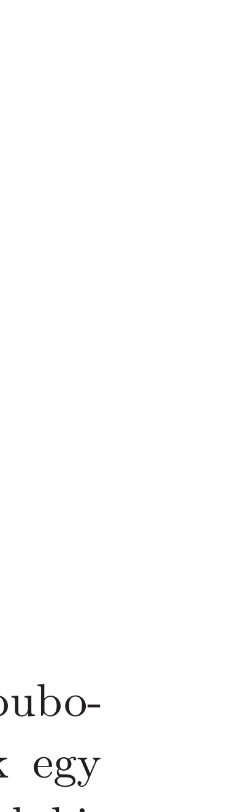

## Útmutatás

Bontson fel az Olvasó egy üveg pezsgőt, töltsön magának, és figyelje meg a jelenséget! Mialatt nem keveset (de nem is túl sokat) fogyaszt az italból, bizonyára rá fog jönni a buborékok gyorsulásának okára.

## Megoldás

A buborékokat figyelve nemcsak azt vehetjük észre, hogy felfelé gyorsulva mozognak, hanem azt is, hogy a méretük növekszik. Mivel a pezsgőben lévő szén-dioxid túltelített, így a buborékok emelkedése közben folyamatosan gáz szabadul fel. Ez a magyarázata a méretnövekedésnek, ami a felhajtóerő folyamatos növekedésével jár együtt. A felhajtóerő a buborék térfogatával arányos, míg a közegellenállási erő a buborék felületével és a sebesség négyzetével arányos. A buborékra ható összes erő eredője a buborék kicsi „effektív” tömege miatt lényegében mindvégig nulla. Ez a feltétel csak úgy teljesülhet, hogy a felszálló buborékok mérete mellett a sebességük is fokozatosan növekszik.

Megjegyzés. Vajon mi az oka annak, hogy csak néhány pontban keletkeznek buborékok a pohár alján? A buborékok keletkezése energiát igényel, létrejöttük csak egy bizonyos kritikus méret felett jár energianyereséggel, ezért akárhol nem alakulhatnak ki. A pezsgő pohárba öntésekor a pohár falán és az alján lévő mikroszkopikus egyenetlenségek, szennyeződések körül nagyon apró, (de a kritikus méretnél nagyobb) levegővel teli zsákocskák keletkeznek. A zsákocskák felületén a pezsgőből kioldódó szén-dioxid növelni kezdi a zsák méretét, majd elegendően nagyra hízva egy buborék leválik. A visszamaradó, gázzal teli zsákocska azután újra hízásnak indul, és minden kezdődik elölről: így alakulnak ki a felfelé szálló buborékfüzérek.

Függelék
