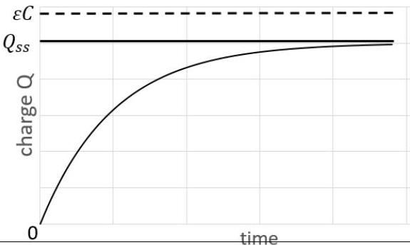

Qu 2

\begin{itemize}
\item[a)] - Projected areas: $A_{\text {p.lid }}=A_{\text {lid }} \sin \theta$ $A_{\text {p.side }}=A_{\text {side }} \cos \theta$
\item[] Bonus: Correct use of $\sin \theta$ and $\cos \theta$ ✓
\[
\begin{aligned}
A_{\mathrm{p}} & =2 r \cdot h \cos \theta+\pi r^{2} \sin \theta \\
& =r(2 h \cos \theta+\pi r \sin \theta) \\
& =0.03\left(2 \times 0.1 \times \cos 50^{\circ}+\pi \times 0.03 \times \sin 50^{\circ}\right) \\
& =3.86 \times 10^{-3}+2.17 \times 10^{-3} \\
& =6.023 \times 10^{-3} \mathrm{~m}^{2} \quad \text { a mark for each area or two for the total } \checkmark \checkmark
\end{aligned}
\]
\begin{itemize}
\item[-] $P=\frac{m c \Delta T}{t}=\frac{0.3 \times 4180 \times 3}{20 \times 60}=\frac{3762}{1200}=3.135 \mathrm{~W}=3.1 \mathrm{~W}$ ✓
\item[-] Solar intensity $=\frac{3.135}{6.023 \times 10^{-3}}=521=520 \mathrm{~W} \mathrm{~m}^{-2}$ ✓ (7 marks)
\end{itemize}
\item[b)] (i)
\[
\begin{aligned}
\varepsilon=V_{R}+V_{r} & =I R+V_{c} \text { since } V_{r}=V_{c} \\
& =I R+\frac{Q}{C}
\end{aligned}
\]
✓
\begin{itemize}
\item[(ii)] Current $I$ is through $r$ and into $C: I=i_{c}+i_{r}$ where $i_{c}=\frac{\mathrm{d} Q}{\mathrm{~d} t}$ and $i_{r}=\frac{1}{r} \frac{Q}{C}$ Hence $I=i_{c}+i_{r}=\frac{\mathrm{d} Q}{\mathrm{~d} t}+\frac{Q}{r C}$ ✓
\item[(iii)] Then
\[
\begin{aligned}
\varepsilon & =V_{R}+V_{r}=\left(\frac{\mathrm{d} Q}{\mathrm{~d} t}+\frac{Q}{r C}\right) R+\frac{Q}{C} \\
& =\frac{\mathrm{d} Q}{\mathrm{~d} t} R+\frac{Q}{C}\left(\frac{R}{r}+1\right)
\end{aligned}
\]
✓ $\left[\right.$ This can be integrated to give $Q=\frac{\varepsilon r C}{(R+r)}\left(1-e^{-\frac{(R+r)}{R r C} t}\right)$ but is not required]
\item[(iv)] By inspection: $\frac{\mathrm{d} Q}{\mathrm{~d} t}=\frac{\varepsilon}{R}-Q\left(\frac{R+r}{R r C}\right)$ so $\quad \tau=\frac{R r C}{(R+r)}$ ✓
\item[(v)] The capacitor will charge up and so will reach a steady state. The potential will be divided as a potential divider circuit with two resistors in series.
When $C$ is charged, there is no change in the flow of current, and therefore $V_{c}$ is given by $V_{c}=\varepsilon \frac{r}{(R+r)}$ and hence $Q_{\mathrm{ss}}=V_{c} C=\frac{\varepsilon r C}{(R+r)}$ ✓
\item[(vi)] Correct shape of graph and asymptote at $Q_{\mathrm{ss}}$. Ignore $\varepsilon C$ line. ✓
\item[] charging the capacitor
 (6 marks)
\end{itemize}
\end{itemize}
\begin{itemize}
\item[c)] (i) $I_{r}=\frac{V}{r} \quad$ and $I_{C}=\frac{\mathrm{d} Q}{\mathrm{~d} t} \quad$ with $\quad I_{0}=i_{r}+I_{C}=\frac{Q}{r C}+\frac{\mathrm{d} Q}{\mathrm{~d} t}$
[This can be integrated to give $Q=I_{0} r C\left(1-e^{-\frac{t}{r C}}\right)$ but is not expected]
At steady state, there is no change on $Q_{\text {capacitor }}$, so $\frac{\mathrm{d} Q}{\mathrm{~d} t}=0$ and then $\frac{Q_{\mathrm{ss}}}{C}=I_{0} r$
\[
Q_{\mathrm{ss}}=I_{0} r C
\] \(\square\)
and the energy stored $=\frac{Q_{\mathrm{ss}}^{2}}{2 C}=\frac{1}{2} I_{0}^{2} r^{2} C$ \(\square\)
\item[(ii)] Power incident - power lost = rate of increase of energy,
\[
P_{\text {can }}-k\left(T_{\text {can }}-T_{0}\right)=m c \frac{\mathrm{~d}\left(T_{\text {can }}-T_{0}\right)}{\mathrm{d} t}
\]
i.e. $\quad P_{\text {can }}-k T=m c \frac{\mathrm{~d} T}{\mathrm{~d} t} \quad$ (if a + sign is use then $k$ is negative) \(\square\)
where $T$ is the excess temperature above the surroundings.
[ This can be integrated as $\frac{\mathrm{d} t}{m c}=\frac{\mathrm{d} T}{P_{\text {can }}-k T}$ to give $T=\frac{P_{\text {can }}}{k}\left(1-e^{-\frac{k t}{m c}}\right)$ but is not required]
\item[(iii)] Steady state result is $T_{\mathrm{ss}}=\frac{P_{\text {can }}}{k}$ \(\square\)
\item[(iv)] $k=\frac{m c \Delta T}{T_{\text {excess }}}=\frac{0.3 \times 4180 \times(34.2-32.8)}{\left(\frac{34.2+32.8}{2}-31\right) \times 40 \times 60}=0.2926=0.29 \mathrm{~W}^{\circ} \mathrm{C}^{-1}$ \(\square\)
Use of $T_{\text {excess }}=\left(\frac{34.2+32.8}{2}-31\right)=2.5^{\circ} \mathrm{C}$ \(\square\)
[The equation for $k, \quad \frac{\mathrm{~d} Q}{\mathrm{~d} t}=-k T$ can be integrated to give $T_{\text {cold }}=T_{\text {hot }} e^{-\frac{k t}{m c}}$
This results in $\left.k=\frac{m c}{t} \ln \frac{T_{\text {hot }}}{T_{\text {cold }}}=\frac{0.3 \times 4180}{40 \times 60} \times \ln \frac{3.2}{1.8}=0.3006=0.30 \mathrm{~W}^{\circ} \mathrm{C}^{-1}\right]$
\item[(v)] Power heating the water in Part (a) was 3.135 W.
Average temperature rise is 1.5 °C
Hence corrected power is $(k=0.2926) P=3.135+0.2926 \times 1.5=3.57=3.6 \mathrm{~W}$ Or
\[
(k=0.3006) P=3.135+0.3006 \times 1.5=3.59=3.6 \mathrm{~W}
\]
This is a 16\% increase and hence the solar intensity
of part (a) is increased by $16 \%$ from $520 \mathrm{~W} \mathrm{~m}^{-1}$ to $\approx 600 \mathrm{~W} \mathrm{~m}^{-1}$ \(\square\)
Not as in question \(\square\)
\item[d)] (i) Power of the Sun = Solar intensity × area of sphere
\[
=1360 \times 4 \times \pi \times\left(1.5 \times 10^{11}\right)^{2}=3.84 \times 10^{26} \mathrm{~W}
\]
□
Volume of Sun $=\frac{4}{3} \pi R^{3}=\frac{4}{3} \pi\left(6.96 \times 10^{8}\right)^{3}=1.41 \times 10^{27} \mathrm{~m}^{3}$ □
Power/volume $=0.27 \mathrm{~W} \mathrm{~m}^{-3}$ □
\item[(ii)] $m=\frac{E}{c^{2}}=\frac{3.84 \times 10^{26}}{9 \times 10^{16}}=4.3 \times 10^{9} \mathrm{~kg} \mathrm{~s}^{-1}$ □
Not as in question □
\end{itemize}
