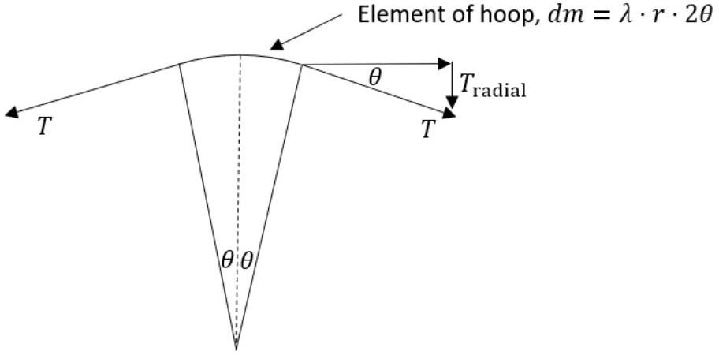

## Q3

a) (i) $\quad B+F_{\mathrm{d}}=m_{\mathrm{h}} \cdot g$
  - $B-F_{\mathrm{d}}=m_{\ell} \cdot g$
  - Add $B=\frac{m_{\mathrm{h}}+m_{\ell}}{2} g$
  - Subtract $2 F_{\mathrm{d}}=\left(m_{\mathrm{h}}-m_{\ell}\right) g$ $F_{\mathrm{d}}=\frac{m_{\mathrm{h}}-m_{\ell}}{2}g$
(ii) $B=\left(n_{\text {cold }}-n_{\text {hot }}\right) \cdot \mu \cdot g \quad \mu$ is the molar mass, $n$ is in moles
  - Using $p V=n R T$ the buoyancy force is $B=\frac{p V}{R}\left(\frac{1}{T_{\text {cold }}}-\frac{1}{T_{\text {hot }}}\right) \cdot \mu \cdot g$ $B=\frac{1.01 \times 10^{5}}{8.3145} \times \frac{4}{3} \pi(0.05)^{3} \times 28 \times 10^{-3} \times 9.81\left(\frac{1}{290}-\frac{1}{298}\right)$ $B=1.617 \times 10^{-4}=1.6 \times 10^{-4} \mathrm{~N}$
- **(iii)** $F_{\mathrm{d}}=k v=1.2 \times 10^{-3} \times 0.06=7.2 \times 10^{-5} \mathrm{~N}$ ✓
  - $\Delta m=\left(m_{\mathrm{h}}-m_{\ell}\right)=\frac{2 \times F_{\mathrm{d}}}{g}=1.47 \times 10^{-5} \mathrm{~kg}$ ✓
  - $\Delta m=t \frac{\mathrm{~d} m}{\mathrm{~d} t}$ so that $t=\Delta m / \frac{\mathrm{d} m}{\mathrm{~d} t}=\frac{1.47 \times 10^{-5}}{4 \pi \times 0.08^{2} \times 2.4 \times 10^{-5}}=7.6 \mathrm{~s}$
- **(iv)** mass= density × surface area × thickness ✓
  - i.e. $\quad m_{\mathrm{h}}=\rho \cdot 4 \pi \cdot r^{2} \cdot \delta t$ Then $\quad \delta t=\frac{m_{\mathrm{h}}}{\rho \cdot 4 \pi \cdot r^{2}}$ We have seen that $\quad B+F_{\mathrm{d}}=m_{\mathrm{h}} g$ Hence $m_{\mathrm{h}}=\frac{B+F_{\mathrm{d}}}{g}=\frac{1.62 \times 10^{-4}+7.2 \times 10^{-5}}{9.81}=2.4 \times 10^{-6} \mathrm{~kg}$ ✓
  - So $\quad \delta t=\frac{2.4 \times 10^{-6}}{998 \times 4 \pi \times 0.08^{2}}=3.0 \times 10^{-7} \mathrm{~m}$ ✓ Not as on question paper (12 marks)
- **b)** (i) The tension in two strings provides the centripetal force on a mass.
So $\quad 2 T \cos 45^{\circ}=\frac{m v^{2}}{r}$ ✓
$T \sqrt{2}=\frac{m v^{2}}{\ell / \sqrt{2}}$
Hence $\quad T=\frac{m v^{2}}{\ell}$ ✓
Then with 45°, we have $\quad T_{\mathrm{r}}=T_{\mathrm{t}}=\frac{T}{\sqrt{2}}=\frac{m v^{2}}{\sqrt{2} \ell}$ ✓
- **(ii)** By dimensions (calculating formally or by observation of the units) $T_{\text {tangential }}=\lambda v^{2} \quad \checkmark$
- **(iii)** Elastic band: When stationary: tension in spring,
\[
\begin{aligned}
& T=(18.5-15.0) \times 10^{-2} \times 2000=70 \mathrm{~N} \\
& \lambda=\frac{25 \times 10^{-3}}{18.5 \times 10^{-2}}=0.135 \mathrm{~kg} \mathrm{~m}^{-1}
\end{aligned}
\]
✓
✓
Hence $\quad v=\sqrt{\frac{70}{0.135}}=22.8=23 \mathrm{~m} \mathrm{~s}^{-1}$
✓
and $\quad \omega=v / r=770 \mathrm{rad} \mathrm{s}^{-1}$
✓
Not as on question paper
(8 marks)

- **c)** The hoop expands by change in radius $\delta r$ so that the circumference changes by $2 \pi \delta r$.
✓
  - The tension $T$ will be $k \cdot 2 \pi \cdot \delta r$
✓
  - From the diagram, the radial restoring force is $2 T \sin \theta \approx 2 T \theta$
  - the element of mass being radially accelerated is $\mathrm{d} m=\lambda \cdot r \cdot 2 \theta$ with $\lambda$ the mass per unit length
  - Hence NII gives
\[
2 T \sin \theta=-(\lambda \cdot r \cdot 2 \theta) a_{\text {radial }} \quad\left(r \text { outwards and } T_{\text {radial }} \text { inwards }\right)
\]
mark for - sign in force equation
So, $\quad(k \cdot 2 \pi \cdot \delta r) \times 2 \theta=-(\lambda \cdot r \cdot 2 \theta) a_{\text {radial }}$
\[
a_{\text {radial }}=-\omega^{2} \delta r=\left(\frac{k \cdot 2 \pi}{\lambda \cdot r}\right) \delta r
\]
  - Hence $f=\frac{\omega}{2 \pi}=\frac{1}{2 \pi} \sqrt{\frac{2 \pi k}{\lambda r}}$
Other approaches are possible here.
( 5 marks)
