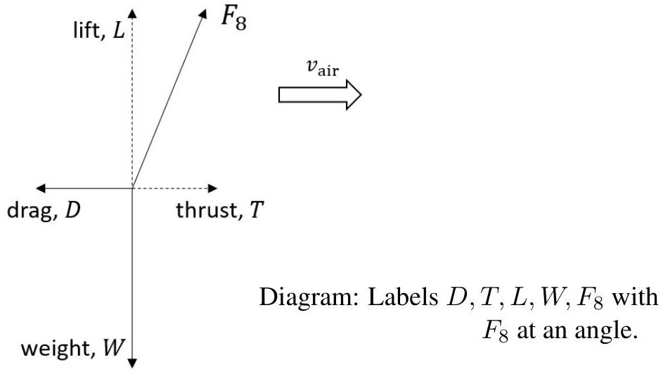

## Q4
- **a)** $\frac{\mathrm{d} N}{\mathrm{~d} t}=-\lambda N$
$P=\frac{\mathrm{d} N}{\mathrm{~d} t} \cdot \delta E=\lambda \cdot N \cdot \delta E \quad$ use of this result ✓ $P=\frac{\ln 2}{t_{\frac{1}{2}}} \cdot$ moles $\cdot N_{\mathrm{A}} \cdot \delta E \cdot e \quad$ use of moles and $N_{\mathrm{A}}$ to substitute for $N \checkmark$ use of moles and $N_{\mathrm{A}}$ to substitute for $N$ ✓
  - $P=\left(\frac{0.693}{87.7 \times 365 \times 24 \times 3600}\right) \times \frac{4800(\mathrm{~g})}{238(\mathrm{~g})} \times 6.02 \times 10^{23} \times 5.5 \times 10^{6} \times 1.6 \times 10^{-19}$ $=2677=2700 \mathrm{~W}$ (3 marks)
- **b)** $\frac{\mathrm{d} Q}{\mathrm{~d} t}=k A \frac{\mathrm{~d} T}{\mathrm{~d} x} \quad$ construct/apply the equation from the wording in the question ✓ $2000=0.035 \times A \times \frac{179}{0.05}$ $A=\frac{2000}{0.035} \times \frac{0.05}{179}=15.96=16 \mathrm{~m}^{2}$ ✓ (2 marks)
- **c)** (i) General expression for lift: $F=\frac{\Delta(m v)}{\Delta t}=v \cdot \rho_{\text {air }} \frac{\Delta \ell \cdot A}{\Delta t}=v \rho_{\text {air }} \cdot A \cdot v$ $F=\rho_{\text {air }} \cdot A \cdot v^{2}$ ✓
  - **(ii)** Then $\quad F_{8}=F_{\text {lift }}=\rho_{\mathrm{T}} \cdot A_{8} \cdot v^{2} \quad$ require symbols $A_{8}, \rho_{\mathrm{T}}$ in expression for $F_{\text {lift }}\left(=F_{8}\right)$ ✓
Since we know the lift force, then $m_{\mathrm{D}} \cdot g_{\mathrm{T}}=\rho_{\mathrm{T}} \cdot A_{8} \cdot v^{2}$ So $\quad v=\sqrt{\frac{m_{\mathrm{D}} \cdot g_{\mathrm{T}}}{\rho_{\mathrm{T}} \cdot A_{8}}}$ ✓
Knowing $\quad P=F \cdot v \quad$ we have $\quad P=\rho_{\mathrm{T}} \cdot A_{8} \cdot v^{3}$ ✓
Then $P=\rho_{\mathrm{T}} \cdot A_{8} \cdot\left(\frac{m_{\mathrm{D}} \cdot g_{\mathrm{T}}}{\rho_{\mathrm{T}} \cdot A_{8}}\right)^{\frac{3}{2}}=\sqrt{\frac{m_{\mathrm{D}}^{3} \cdot g_{\mathrm{T}}^{3}}{\rho_{\mathrm{T}} \cdot A_{8}}}$ ✓
  - **(iii)** $\frac{P_{\mathrm{T}}}{P_{\mathrm{E}}}=\sqrt{\frac{g_{\mathrm{T}}^{3} \cdot \rho_{\mathrm{E}}}{g_{\mathrm{E}}^{3} \cdot \rho_{\mathrm{T}}}}=\sqrt{\frac{1.35^{3} \times 1.22}{9.81^{3} \times 5.35}}=0.0244=0.024$ ✓
  - **(iv)** $P_{\mathrm{T}}=\sqrt{\frac{m_{\mathrm{D}}^{3} \cdot g_{\mathrm{T}}^{3}}{\rho_{\mathrm{T}} \cdot A_{8}}}=\sqrt{\frac{420^{3} \times 1.35^{3}}{5.35 \times 8 \cdot \pi \cdot 0.68^{2}}}=1710 \mathrm{~W}$ ✓
  - **(v)** Calculate the energy used on the flight:
8000 m at $10 \mathrm{~m} \mathrm{~s}^{-1}=800 \mathrm{~s}: 800 \times 1710=1.37 \times 10^{6} \mathrm{~J}$ ✓
  - Time to rise and fall is $100 \mathrm{~s}: 100 \times 1710=1.71 \times 10^{5} \mathrm{~J}$
  - Energy to rise $=m g h=420 \times 1.35 \times 500=2.83 \times 10^{5} \mathrm{~J}$
  - Total energy is $1.82 \times 10^{6} \mathrm{~J}$ ✓
  - Using the power calculated in part (a): $t=\frac{1.82 \times 10^{6} \times 0.06}{2680}=11300 \mathrm{~s}=3.14$ hours ✓ (10 marks)
- **d)** (i) - $F_{8}=\sqrt{D^{2}+W^{2}}$

  - **(ii)**
\[
D=\sqrt{F_{8}^{2}-W^{2}}=\sqrt{\left(\rho_{\mathrm{T}} \cdot A_{8} \cdot v_{\mathrm{tip}}^{2}\right)^{2}-\left(m_{\mathrm{D}} \cdot g_{\mathrm{T}}\right)^{2}}
\]
Hence
\[
D^{2}=\rho_{\mathrm{T}}^{2} \cdot A_{8}^{2} \cdot v_{\mathrm{air}}^{4}=\left(\rho_{\mathrm{T}}^{2} \cdot A_{8}^{2} \cdot v_{\mathrm{tip}}^{4}\right)-\left(m_{\mathrm{D}}^{2} \cdot g_{\mathrm{T}}^{2}\right)
\]
So
\[
v_{\text {air }}^{4}=v_{\text {tip }}^{4}-\frac{m_{\mathrm{D}}^{2} \cdot g_{\mathrm{T}}^{2}}{\rho_{\mathrm{T}}^{2} \cdot A_{8}^{2}}
\]
  - **(iii)**
\[
\begin{aligned}
& =r^{4} \cdot(2 \pi)^{4} \cdot f^{4}-\frac{m_{\mathrm{D}}^{2} \cdot g_{\mathrm{T}}^{2}}{\rho_{\mathrm{T}}^{2} \cdot A_{8}^{2}} \\
& =0.68^{4} \cdot(2 \pi)^{4} \cdot\left(\frac{500}{60}\right)^{4}-\frac{420^{2} \times 1.35^{2}}{5.35^{2} \times\left(8 \cdot \pi \cdot 0.68^{2}\right)^{2}} \\
v_{\text {air }} & =2.5 \mathrm{~m} \mathrm{~s}^{-1}
\end{aligned}
\]
(6 marks)
- **e)** (i) $F=k \rho^{\alpha} v^{\beta} r^{\gamma}$
with $\alpha=1, \quad \beta=2, \quad \gamma=2$
So that
\[
F_{\text {drag }}=k \rho v^{2} r^{2}
\]
(ii)
\[
\text { - At terminal velocity so } \quad F_{\text {drag }}=m g
\]
    - Using the result for $F_{\text {drag }}$, we have
\[
\rho_{\mathrm{T}}=\frac{m \cdot g_{\mathrm{T}}(600 \mathrm{~km})}{v^{2} \cdot r^{2}}
\]
    - .
\[
g_{\mathrm{T}}=\frac{G M_{\mathrm{T}}}{R_{\mathrm{T}}^{2}}
\]
    - At 600 km
\[
g_{\mathrm{T}}(600 \mathrm{~km})=\frac{6.67 \times 10^{-11} \times 1.345 \times 10^{23}}{\left[(2575+600) \times 10^{3}\right]^{2}}=0.89 \mathrm{~m} \mathrm{~s}^{-1}
\]
    - Hence $\rho=\frac{400 \times 0.89}{7300^{2} \times 1.85^{2}}=1.95 \times 10^{-6}=2.0 \times 10^{-6} \mathrm{~kg} \mathrm{~m}^{-3}$
(4 marks)
