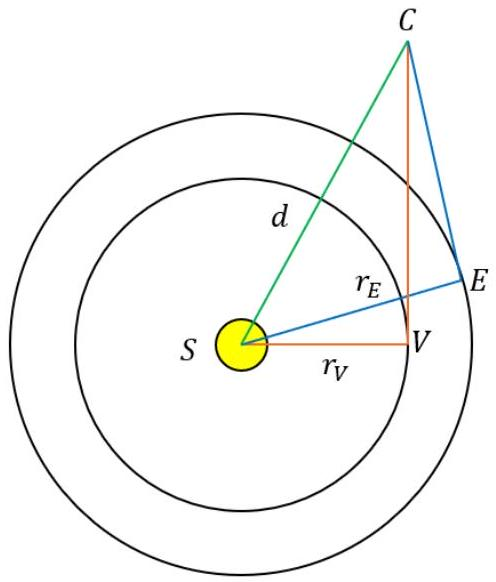
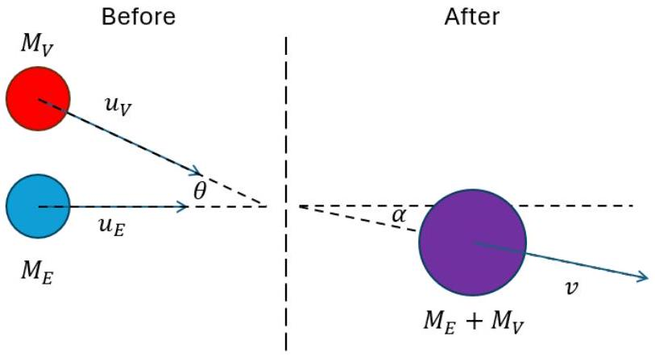

## Q5 -- Venearth [25 marks]

There are multiple ways to solve some of the questions; please accept all good solutions that arrive at the correct answer. Students getting the answer in a box will get all the marks available for that calculation / part of the question (as indicated in red), so long as there are no unphysical / nonsensical steps or assumptions made (students may not explicitly calculate the intermediate stages and should not be penalised for this so long as their argument is clear). Allow 2 or 3 s.f. answers unless specified.
- **a.** Consider a planet of mass $m_{p}$, orbiting a star of mass $M_{s}$ in a circular orbit of radius $r$ which takes a time $T$ to complete one orbit.
  - **i.** By balancing centripetal and gravitational forces, show that the orbital speed $v \propto r^{-1 / 2}$.
Balancing centripetal and gravitational forces:
\[
\frac{m_{p} v^{2}}{r}=\frac{G M_{s} m_{p}}{r^{2}} \quad \therefore\quad v=\sqrt{\frac{G M_{s}}{r}}\left(\text { so } v \propto r^{-1 / 2}\right)
\]
[Allow any valid method that shows that $v \propto r^{-1 / 2}$. They are not required to show the constant of proportionality SO LONG AS the method is clear - suspected bluff = zero. No penalty if they use $m$ and $M$ instead of $m_{p}$ and $M_{s}$ ]
  - **ii.** Hence, show that the total energy of the planet (KE + GPE), $E_{\text {total }} \propto r^{-1}$.
Substituting in their expression for $v$ for the formula for KE AND negative GPE
\[
\begin{aligned}
& E_{\text {total }}=K E+G P E=\frac{1}{2} m_{p} v^{2}-\frac{G M_{s} m_{p}}{r}=\frac{1}{2} m_{p}\left(\frac{G M_{s}}{r}\right)-\frac{G M_{s} m_{p}}{r} \\
& \left.\therefore E_{\text {total }}=-\frac{G M_{s} m_{p}}{2 r} \quad \text { (so } E_{\text {total }} \propto r^{-1}\right)
\end{aligned}
\]
[Allow any valid method that shows that $E_{\text {total }} \propto r^{-1}$. They are not required to show the constant of proportionality SO LONG AS the method is clear. No penalty if they use $m$ and $M$ instead of $m_{p}$ and $M_{s}$ ]
  - **iii.** By considering the speed of a planet in its orbit around the planet in terms of $r$ and $T$, show that the relationship between orbital period and orbital radius is $T^{2} \propto r^{3}$. (This is known as Kepler's Third Law.)
The other expression for speed hinted at is $v=\frac{2 \pi r}{T}$ so equating it to part i. expression
\[
\frac{2 \pi r}{T}=\sqrt{\frac{G M_{s}}{r}} \therefore T^{2}=\frac{4 \pi^{2}}{G M_{s}} r^{3} \quad\left(\text { so } T^{2} \propto r^{3}\right)
\]
[Allow any valid method that shows that $T^{2} \propto r^{3}$. They are not required to show the constant of proportionality SO LONG AS the method is clear. No penalty if they use $M$ instead of $M_{s}$ ]
  - **iv.** Given the Earth has an orbital radius $r_{E}=1.50 \times 10^{11} \mathrm{~m}$ and orbital period $T_{E}=365$ days, calculate the mass of the Sun in kg.
Converting $T_{E}$ into seconds and using the value of $G$ from constants page in exam paper
\[
\begin{aligned}
M_{\text {Sun }}=\frac{4 \pi^{2}}{G T_{E}^{2}} r_{E}^{3} & =\frac{4 \pi^{2}}{6.67 \times 10^{-11} \times(365 \times 24 \times 60 \times 60)^{2}} \times\left(1.50 \times 10^{11}\right)^{3} \\
& =2.01 \times 10^{30} \mathrm{~kg}
\end{aligned}
\]
[Expect an answer $\geq 3$ s.f. Allow 2 s.f. ONLY if the working is clear and correct. Do not allow a value that could have been read from a formula sheet e.g. $1.99 \times 10^{30} \mathrm{~kg}$ ]
  - **v.** Using your result from part (iii), if you use the Earth values of $r_{E}=1$ au and $T_{E}=1$ year orbiting a star of mass $M_{s}=1 M_{\text {Sun }}$, what is the value (and units) of $G$ in just these given quantities and units?
\[
G=\frac{4 \pi^{2}}{M_{s} T^{2}} r^{3}=\frac{4 \pi^{2}}{1 \times 1^{2}} \times 1^{3}=4 \pi^{2} \text { au }^{3} \mathrm{M}_{\text {Sun }}^{-1} \text { year }^{-2}
\]
[Allow 0.5 marks for the value of $4 \pi^{2}$ (or decimal equivalent 39.478...) and 0.5 marks for the correct units]
- **b.** Disaster strikes and the Sun disappears! This causes all the planets to be perturbed from their orbits. In this question we will just look at Venus and Earth. Assume that the loss of the Sun's gravity was felt instantaneously by both planets, and that both are travelling in coplanar circular orbits. Venus has a mass of $0.815 M_{\text {Earth }}$, where $M_{\text {Earth }}=5.97 \times 10^{24} \mathrm{~kg}$, and an orbital radius of 0.723 au. Venus and Earth happened to be at such a point in their orbit when the Sun disappeared that they are on a collision course.
  - **i.** Calculate the orbital speeds of Earth and Venus, $v_{E}$ and $v_{V}$.

For Earth:
\[
v_{E}=\sqrt{\frac{G M_{\text {Sun }}}{r_{E}}}=\sqrt{\frac{6.67 \times 10^{-11} \times 2.01 \times 10^{30}}{1.50 \times 10^{11}}}=2.99 \times 10^{4} \mathrm{~m} \mathrm{~s}^{-1}
\]
[Alternative: $v_{E}=\sqrt{\frac{G M_{\text {Sun }}}{r_{E}}}=\sqrt{\frac{4 \pi^{2} \times 1}{1}}(=2 \pi)=6.28$ au year $^{-1}$ ]
For Venus:
\[
v_{V}=\sqrt{\frac{G M_{\text {Sun }}}{r_{V}}}=\sqrt{\frac{6.67 \times 10^{-11} \times 2.01 \times 10^{30}}{0.723 \times 1.50 \times 10^{11}}}=3.51 \times 10^{4} \mathrm{~m} \mathrm{~s}^{-1}
\]
[Alternative: $v_{E}=\sqrt{\frac{G M_{\text {Sun }}}{r_{V}}}=\sqrt{\frac{4 \pi^{2} \times 1}{0.723}}=7.39$ au year $^{-1}$ ]
  - **ii.** Determine the time, $t$, until they crash. Give your answer in days.

Suitable diagram showing two right-angled triangles with a shared hypotenuse
From Pythagoras' theorem:
\[
\begin{aligned}
& d^{2}=r_{V}^{2}+\left(v_{V} t\right)^{2}=r_{E}^{2}+\left(v_{E} t\right)^{2} \\
& \therefore v_{V}^{2} t^{2}-v_{E}^{2} t^{2}=r_{E}^{2}-r_{V}^{2}
\end{aligned}
\]
\[
t =\sqrt{\frac{\left(1.50 \times 10^{11}\right)^{2}-\left(0.723 \times 1.50 \times 10^{11}\right)^{2}}{\left(3.51 \times 10^{4}\right)^{2}-\left(2.99 \times 10^{4}\right)^{2}}}
\]
[Second marking point is for any valid method, third marking point is for an expression for $t$ and fourth marking point is ONLY if the final answer is given in days. If using the alternative units then $t=\sqrt{\frac{1^{2}-0.723^{2}}{7.39^{2}-6.28^{2}}}=0.1776$ years $=64.8$ days . Allow slight differences down to rounding errors. In the alternative units $v=2 \pi r^{-1 / 2}$ so they may simplify their expression for $t$ into one just dependent on $r$ - all versions get third mark:]
\[
t=\sqrt{\frac{r_{E}^{2}-r_{V}^{2}}{v_{V}^{2}-v_{E}^{2}}}=\frac{1}{2 \pi} \sqrt{\frac{r_{E}^{2}-r_{V}^{2}}{r_{V}^{-1}-r_{E}^{-1}}}=\frac{1}{2 \pi} \sqrt{\frac{\left(r_{E}-r_{V}\right)\left(r_{E}+r_{V}\right)}{r_{E}-r_{V} / r_{V} r_{E}}}=\frac{1}{2 \pi} \sqrt{r_{V} r_{E}\left(r_{E}+r_{V}\right)}
\]
  - **iii.** Show that the distance d from the Sun's original location when they crash is ~ 1.5 au.
Using the Sun-Earth-Collision triangle
\[
\begin{aligned}
d=\sqrt{r_{E}^{2}+\left(v_{E} t\right)^{2}} & =\sqrt{\left(1.50 \times 10^{11}\right)^{2}+\left(2.99 \times 10^{4} \times 5.60 \times 10^{6}\right)^{2}} \\
& =2.25 \times 10^{11} \mathrm{~m}=1.50 \mathrm{au}
\end{aligned}
\]
[Since the question is a 'show that', the answer MUST have $\geq 3$ s.f. to get the mark. In alternative units $d=\sqrt{r_{E}^{2}+\left(v_{E} t\right)^{2}}=\sqrt{1^{2}+(6.28 \times 0.1776)^{2}}=1.50 \mathrm{au}$. Accept use of the Sun-Venus-Collision triangle instead. Allow for slight rounding errors from earlier.]
  - **iv.** Show that the angle between their velocity vectors as they approach is $\sim 13^{\circ}$.
From the diagram:
\[
\begin{aligned}
& \text { Angle VCE }=\text { Angle SCE }- \text { Angle SCV } \\
& \begin{aligned}
\therefore \angle V C E=\sin ^{-1}\left(\frac{r_{E}}{d}\right)-\sin ^{-1}\left(\frac{r_{V}}{d}\right) & =\sin ^{-1}\left(\frac{1}{1.50}\right)-\sin ^{-1}\left(\frac{0.738}{1.50}\right) \\
& =41.86^{\circ}-28.85^{\circ}=13.0^{\circ}
\end{aligned}
\end{aligned}
\]
[Since the question is a 'show that', the answer MUST have $\geq 3$ s.f. to get the mark.
Allow for slight rounding errors from earlier.]
  - **v.** Find the Earth-Sun-Venus angle at the moment the Sun disappeared in order for this crash to occur.
From the diagram, triangle VCE and VSE are similar $\therefore \angle E S V=13.0^{\circ}$
[Give this mark for stating the same angle as what they calculated in iv. OR 13 ° (2 s.f)]
- **c.** The collision between them is inelastic, causing them to stick together and make a new, heavier planet: "Venearth".
  - **i.** Show that the speed of Venearth, $v$, just after the collision is ~ 6.7 au year ${ }^{-1}$.

Suitable diagram [Allow $\theta$ labelled as 13°]
Conserving horizontal momentum:
\[
M_{E} u_{E}+M_{V} u_{V} \cos \theta=\left(M_{E}+M_{V}\right) v \cos \alpha
\]
Conserving vertical momentum:
\[
M_{V} u_{V} \sin \theta=\left(M_{E}+M_{V}\right) v \sin \alpha
\]
Squaring both equations and adding them together
\[
\begin{aligned}
& \left(M_{E} u_{E}+M_{V} u_{V} \cos \theta\right)^{2}+\left(M_{V} u_{V} \sin \theta\right)^{2}=\left(M_{E}+M_{V}\right)^{2} v^{2}\left(\cos ^{2} \alpha+\sin ^{2} \alpha\right) \\
& \therefore M_{E}^{2} u_{E}^{2}+2 M_{E} M_{V} u_{E} u_{V} \cos \theta+M_{V}^{2} u_{V}^{2}=\left(M_{E}+M_{V}\right)^{2} v^{2} \\
& \therefore v=\sqrt{\frac{M_{E}^{2} u_{E}^{2}+2 M_{E} M_{V} u_{E} u_{V} \cos \theta+M_{V}^{2} u_{V}^{2}}{\left(M_{E}+M_{V}\right)^{2}}} \\
& =\sqrt{\frac{1^{2} \times\left(2.99 \times 10^{4}\right)^{2}+2 \times 1 \times 0.815 \times 2.99 \times 10^{4} \times 3.51 \times 10^{4} \times \cos 13.0^{\circ}+0.815^{2} \times\left(3.51 \times 10^{4}\right)^{2}}{(1+0.815)^{2}}} \\
& =3.20 \times 10^{4} \mathrm{~m} \mathrm{~s}^{-1}=6.74 \text { au year }^{-1}
\end{aligned}
\]
  - **ii.** Determine the angle between Venearth's velocity vector and Earth's initial velocity vector before the collision.
From the diagram, this is just the angle labelled as $\alpha$ :
\[
\alpha=\sin ^{-1}\left[\frac{M_{V} u_{V} \sin \theta}{\left(M_{E}+M_{V}\right) v}\right]=\sin ^{-1}\left[\frac{0.815 \times 3.51 \times 10^{4} \sin 13.0^{\circ}}{(1+0.815) \times 3.20 \times 10^{4}}\right]=6.37^{\circ}
\]
[If using the 'show that' value from part i., $6.7 \mathrm{au} \mathrm{year}^{-1}=3.19 \times 10^{4} \mathrm{~m} \mathrm{~s}^{-1}$ so it gives $6.40^{\circ}$ - allow this as an ecf]
  - **iii.** Calculate the percentage of kinetic energy lost in the collision.
Considering the KE before and after the collision:
\[
\begin{aligned}
\text { Fraction of KE lost } & =1-\frac{K E \text { after }}{K E \text { before }}=1-\frac{\frac{1}{2}\left(M_{E}+M_{V}\right) v^{2}}{\frac{1}{2} M_{E} u_{E}^{2}+\frac{1}{2} M_{V} u_{V}^{2}} \\
& =1-\frac{(1+0.815) \times\left(3.20 \times 10^{4}\right)^{2}}{1 \times\left(2.99 \times 10^{4}\right)^{2}+0.815 \times\left(3.51 \times 10^{4}\right)^{2}}=0.0193=1.93 \%
\end{aligned}
\]
[If left as decimal and not converted to a percentage lose 0.5 marks. If using $v=$ 6.7 au year ${ }^{-1}$ then will get 2.98\% - allow this as an ecf]
- **d.** At the moment of the collision, a new star magically appears in the location that the Sun used to be. Again, assume its gravitational effects are felt instantaneously throughout the Solar System.
  - **i.** What is the minimum mass of this new star necessary for Venearth to still be bound within the Solar System? Give your answer in units of $M_{\text {Sun }}$.
Venearth will be bound if $v<$ the escape velocity:
\[
\begin{aligned}
& v=v_{e s c}=\sqrt{\frac{2 G M}{d}} \\
& \therefore M=\frac{v^{2} d}{2 G}=\frac{\left(3.20 \times 10^{4}\right)^{2} \times 2.25 \times 10^{11}}{2 \times 6.67 \times 10^{-11}}=1.73 \times 10^{30} \mathrm{~kg}=0.861 M_{\text {Sun }}
\end{aligned}
\]
[The first mark is for a suitable method - this can either be for the escape velocity approach or if they use the total energy $=0$ approach (i.e. $E_{\text {total }}=K E+G P E=0 \therefore$ $\frac{1}{2} m v^{2}-\frac{G M m}{d}=0 \therefore M=\frac{v^{2} d}{2 G} \ldots$ etc.). Must be in units of $M_{\text {Sun }}$ for the second mark. If using $v=6.7$ au year ${ }^{-1}$ then will get $M=1.71 \times 10^{30} \mathrm{~kg}=0.852 M_{\text {Sun }}$ - allow this as an ecf]
  - **ii.** If in fact, the new star has a mass equal to $M_{\text {Sun }}$, what will be the orbital period of Venearth? Give your answer in years.
Considering the energy of a circular orbit with the same total energy (using a. ii.):
\[
\begin{aligned}
& \frac{1}{2} m v^{2}-\frac{G M_{\text {Sun }} m}{d}=-\frac{G M_{\text {Sun }} m}{2 r} \\
& \begin{aligned}
\therefore r=\frac{G M_{\text {Sun }}}{\frac{2 G M_{\text {Sun }}}{d}-v^{2}} & =\frac{6.67 \times 10^{-11} \times 2.01 \times 10^{30}}{\frac{2 \times 6.67 \times 10^{-11} \times 2.01 \times 10^{30}}{2.25 \times 10^{11}}-\left(3.20 \times 10^{4}\right)^{2}} \\
& =8.10 \times 10^{11} \mathrm{~m}(=5.40 \mathrm{au})
\end{aligned} \\
& \begin{aligned}
\therefore T=\sqrt{\frac{4 \pi^{2}}{G M_{\text {Sun }}} r^{3}} & =\sqrt{\frac{4 \pi^{2}}{6.67 \times 10^{-11} \times 2.01 \times 10^{30}} \times\left(8.10 \times 10^{11}\right)^{3}} \\
& =3.96 \times 10^{8} \mathrm{~s}=12.55 \text { years }
\end{aligned}
\end{aligned}
\]
[Must be in units of years for the final mark. If using $v=6.7$ au year ${ }^{-1}$ then will get $r=$ $7.59 \times 10^{11} \mathrm{~m}=5.06$ au and $T=3.59 \times 10^{8} \mathrm{~s}=11.39$ years - allow this as an ecf]
