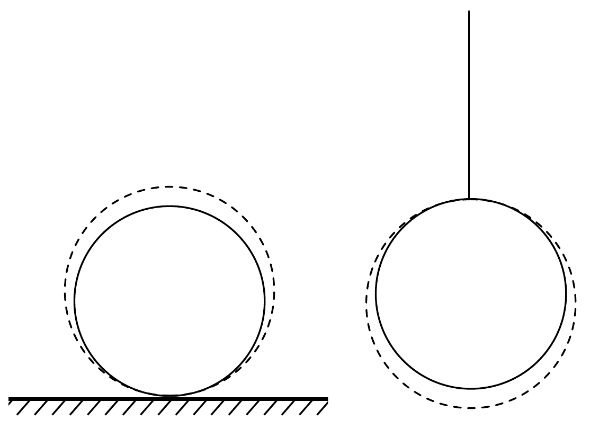

## Megoldás 3

A feladat szövegében a „Mindegyik golyónak ugyanakkora hőmennyiséget adunk" kifejezés nem teljesen egyértelmú. Intuitíven arra gondolhatunk, hogy mindkét rendszer (A a felfüggesztett, B a vízszintes síkon lévó golyó) ugyanakkora energiát kap kívülről. Azonban nem ez az egyetlen értelmezés, de kövessük most ezt.

5. ábra.

Ha a golyókat felmelegítjük, tömegközéppontjuk elmozdul, mivel a golyók sugara megváltozik. Az A golyó tömegközéppontja lefelé, a B-é felfelé. Ezt mutatja az 5. ábra. A tömegközéppont elmozdulása változást jelent a golyó gravitációs
potenciális energiájában. Az A golyó esetében ez az energia csökken. A hőtan első főtétele értelmében a közölt hő mellett ez tovább növeli a golyó belső energiáját $(\Delta E=Q+W)$. A B golyó gravitációs potenciális energiája pedig növekszik, tehát az első főtétel miatt ekkor a közölt hőnél kevesebb fordítódik a belső energia növelésére, a másik része a golyót emeli meg. Ezért a B golyó végső hőmérséklete alacsonyabb lesz, mint az A golyóé.

Adjunk számszerú becslést a két hőmérséklet különbségére (noha a versenyen nem volt elvárás). Tekintsünk két 10 cm sugarú ólomgolyót és közöljünk velük külön-külön $Q=200 \mathrm{~kJ}$ hőmennyiséget.

A számolás során feltesszük, hogy a külső légnyomás ellen végzett munka elhanyagolható, mert nyilván kicsi. Másrészt mindkét golyó esetén majdnem ugyanakkora. Tehát nem befolyásolja lényegesen a hőmérsékletek különbségét. Továbbá feltesszük, hogy az ólom fajhője és hốtágulási együtthatója állandó (nem függnek a hőmérséklettől).

A golyók hőmérséklet-változásához szükséges hốt írhatjuk a
\[
Q_{\mathrm{i}}=c m \Delta t_{\mathrm{i}}
\]
alakba, ahol $\mathrm{i}=\mathrm{A}, \mathrm{B}, m$ a golyó tömege, $c$ az ólom fajhője, $\Delta t_{\mathrm{i}}$ pedig a golyó hőmérséklet-változása.

A golyók gravitációs potenciális energia-változásának abszolút értéke:
\[
\Delta E_{\mathrm{i}}=m g r \alpha \Delta t_{\mathrm{i}},
\]
ahol $g$ a nehézségi gyorsulás, $r$ a golyó kezdeti sugara, $\alpha$ az ólom lineáris hốtágulási együtthatója. Feltesszük, hogy a folyamat során a fonál hossza nem változik.

Felhasználva a feladat szövegében megadott feltétel megoldás elején adott értelmezését, írhatjuk, hogy
\[
\begin{aligned}
& Q=Q_{\mathrm{A}}-\Delta E_{\mathrm{A}}, \\
& Q=Q_{\mathrm{B}}+\Delta E_{\mathrm{B}} .
\end{aligned}
\]
A fenti kifejezések behelyettesítésével adódik, hogy
\[
\begin{aligned}
\Delta t_{\mathrm{A}} & =\frac{Q}{c m-\operatorname{mgr} \alpha}, \\
\Delta t_{\mathrm{B}} & =\frac{Q}{c m+m g r \alpha} .
\end{aligned}
\]
Ahonnan a két golyó végső hőmérsékletének különbsége:
\[
\Delta t=\Delta t_{\mathrm{A}}-\Delta t_{\mathrm{B}}=\frac{2 Q g r \alpha}{m\left[c^{2}-(g r \alpha)^{2}\right]} \approx \frac{2 Q g r \alpha}{m c^{2}},
\]
ahol $\alpha^{2}$-es tagot elhagyhatjuk, mivel $\alpha$ nagyon kicsiny. A megadott adatokat behelyettesítve ólom esetén a különbség $10^{-5} \mathrm{~K}$ nagyságrendú, ami nagyon kicsi. Az
idő- és térbeli fluktuációk miatt ilyen kicsiny különbséget kísérletileg gyakorlatilag lehetetlen érzékelni.

Ahhoz, hogy valóban eldönthessük, melyik golyó lesz melegebb, a fenti közelítés nem elegendő, mivel más, a gravitációs energia megváltozásával azonos nagyságrendú (kicsiny) változásokat is figyelembe kellene venni. Ehhez azonban mélyebb termodinamikai és anyagszerkezeti ismeretre van szükség. Egy 2015-ben készített tanulmány szerint - ellentétben az itt közölt eredménnyel - a B golyó fog jobban felmelegedni. További megfontolások a Gnädig P., Honyek Gy., Vigh M.: 333+ Furfangos Feladat Fizikából c. könyv 184. feladatánál találhatók.

Pótfeladat. Vizsgáljuk meg, 100 °C-on van-e víz a tartályban (várhatóan nincs, mert a tartály térfogata sokkal nagyobb, mint a víz térfogata). Ha van víz a tartályban (és egyensúlyi állapot áll fenn), akkor benne - a levegő mellett - telített gőz található. Ezen a hőmérsékleten a telített vízgőz súrúség ${ }^{2} 0,6 \mathrm{~kg} / \mathrm{m}^{3}$. Viszont, ha a teljes vízmennyiség gőzként lenne jelen, akkor a súrúsége $3 \mathrm{~g} / 10 \mathrm{dm}^{3}=$ $=0,3 \mathrm{~kg} / \mathrm{m}^{3}$ lenne, ami kisebb, mint az előbb megadott súrúség, azaz, ha még lenne benne víz, akkor a vízgőz nem lenne telített, ami viszont nem egyensúlyi állapotot jelent. Vagyis ez azt jelenti, hogy nincs víz a tartályban, hanem csak levegő és telítetlen vízgőz.

Mind a levegőt, mind a telítetlen vízgőzt tekinthetjük ideális gáznak. 100 °Con a tartályban lévő nyomás a levegő és a gőz parciális nyomásából származik (Dalton-törvény).

A gőz nyomása:
\[
p_{\text {göz }}=\frac{m R T}{M V} \approx 0,52 \cdot 10^{5} \mathrm{~Pa},
\]
ahol $m=3 \mathrm{~g}, T=373 \mathrm{~K}, M=18 \mathrm{~g} / \mathrm{mol}$ és $V=10$ liter.
A levegő gyakorlatilag izochor állapotváltozáson megy keresztül:
\[
p_{\text {levegö }}=p_{0} \frac{T}{T_{0}} \approx 1,37 \cdot 10^{5} \mathrm{~Pa},
\]
ahol $p_{0}=10^{5} \mathrm{~Pa}, T_{0}=273 \mathrm{~K}$. Ezzel a folyamat végén a tartályban uralkodó nyomás:
\[
p=p_{\text {göz }}+p_{\text {levegö }} \approx 1,89 \cdot 10^{5} \mathrm{~Pa} .
\]

\footnotetext{
${ }^{2}$ A versenyzők használhattak táblázatokat. A jelenlegi szabályok szerint viszont erre nincs lehetőség. Ha szükség van valamilyen adatra, azt a feladatlap tartalmazza.

\title{
