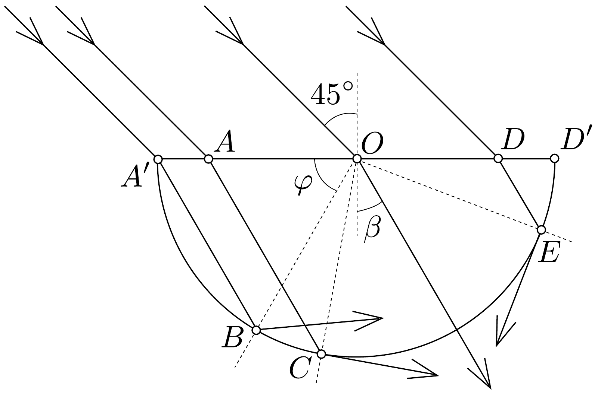

## Megoldás 3

Jellemezzük a fénysugár helyzetét a $\varphi$ szöggel. A törési törvény alapján:
\[
\frac{\sin 45^{\circ}}{\sin \beta}=\sqrt{2}, \quad \sin \beta=\frac{1}{2}, \quad \beta=30^{\circ} .
\]
A törési szög az üvegben haladó valamennyi megtört fénysugárra nézve 30°.
Azonnal látjuk, hogy $\varphi=60^{\circ}$ alatt geometriai okból nem érkezik fénysugár a hengerpalást belső felszínére ( $A^{\prime} B O$ háromszög a 10, ábrán).

A teljes visszaverődés határszöge $\beta_{t}$; erre nézve:
\[
\sin \beta_{t}=\frac{1}{n}=\sqrt{2}, \quad \beta_{t}=45^{\circ} .
\]

Minden fénysugár esetében $O A C \varangle=60^{\circ}$. A teljes visszaverődés esetében $A C O \varangle=45^{\circ}$, tehát $\varphi=180^{\circ}-60^{\circ}-45^{\circ}=75^{\circ}$ az az érték, ameddig a palástot
$B C$ íven elérő fénysugarak teljesen visszaverődnek és nem lépnek ki. Amikor $\varphi$ nagyobb lesz 75°-nál, kilép fénysugár a hengerpaláston.

Továbbhaladva újból elérjük a teljes visszaverődés határesetét, amikor $O E D<$ egyenló lesz 45°-kal. $O D E \varangle=120^{\circ}$, így $D O E \varangle=180^{\circ}-120^{\circ}-45^{\circ}=15^{\circ}$. Eszerint újból teljes visszaverődés kezdődik $\varphi=180^{\circ}-15^{\circ}=165^{\circ}$-tól felfelé.

A hengerpaláston akkor lép ki fénysugár, amikor:
\[
75^{\circ}<\varphi<165^{\circ} .
\]
A kilépő sugarak $C E$ ívéhez éppen $90^{\circ}$-os középponti szög tartozik.
Ki lehet mutatni, hogy a $B C$ és $D^{\prime} E$ ívhez tartozó, a paláston teljesen visszaverődő fénysugarak úgy érik el a felső sík lapot, hogy ott nem következik be teljes visszaverődés, tehát nem kell attól tartanunk, hogy ilyen teljesen visszaverődött sugarak valahol a hengerpalást egyéb részén kilépnek.

\title{
