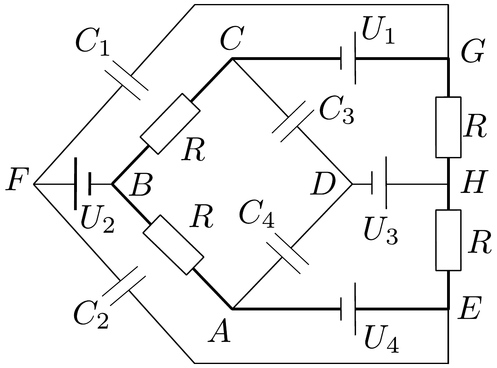
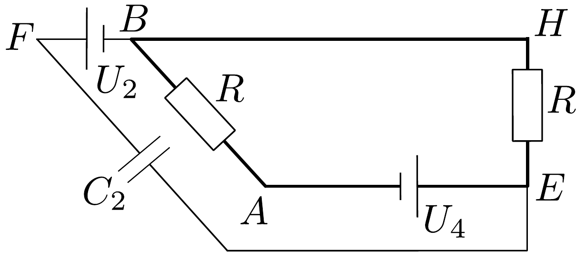

## Megoldás 3

A kondenzátor $Q=C U$ töltésének és $W=C U^{2} / 2$ energiájának kiszámításához a feszültségre van szükségünk.

23. ábra.

Terítsük ki a hálózatot síkba (lásd a 23. ábrát). Az egyenáram nem folyhat át kondenzátorokon, ezért csak a vastagon rajzolt vezetékeken folyik áram. Ebben az áramkörben $4 R$ ellenállásra $U_{4}-U_{1}=12 \mathrm{~V}$ feszültség van kapcsolva, tehát az áramerősség (iránya az óramuató járásával ellentétes):
\[
I=\frac{U_{4}-U_{1}}{4 R} .
\]

Az ellenállásokon eső feszültségek és a telepek feszültségeinek felhasználásával kiszámítjuk az egyes pontok potenciálját az $A$ ponthoz viszonyítva, amit nullának veszünk.

\begin{tabular}[t]{|l|l|l|}
\hline $A$ & & 0 V \\
\hline B & $\left(U_{4}-U_{1}\right) / 4$ & 3 V \\
\hline C & $\left(U_{4}-U_{1}\right) / 2$ & 6 V \\
\hline G & $\left(U_{4}-U_{1}\right) / 2+U_{1}$ & 10 V \\
\hline E & $U_{4}$ & 16 V \\
\hline $H$ & $U_{4}-\left(U_{4}-U_{1}\right) / 4$ & 13 V \\
\hline $D$ & $U_{4}-\left(U_{4}-U_{1}\right) / 4-U_{3}$ & 1 V \\
\hline F & $\left(U_{4}-U_{1}\right) / 4+U_{2}$ & 11 V \\
\hline
\end{tabular}

A kondenzátorok feszültsége, töltése és energiája:

\begin{tabular}[t]{|l|l|l|l|}
\hline & $U(\mathrm{~V})$ & $Q(\mathrm{C})$ & $W(\mathrm{~J})$ \\
\hline $C_{1}$ & $11-10=1$ & $1 \cdot 10^{-6}$ & $0,5 \cdot 10^{-6}$ \\
\hline $C_{2}$ & $16-11=5$ & $5 \cdot 10^{-6}$ & $12,5 \cdot 10^{-6}$ \\
\hline $C_{3}$ & $6-1=5$ & $5 \cdot 10^{-6}$ & $12,5 \cdot 10^{-6}$ \\
\hline $C_{4}$ & $1-0=1$ & $1 \cdot 10^{-6}$ & $0,5 \cdot 10^{-6}$ \\
\hline
\end{tabular}

A kondenzátorok összes energiája $26 \cdot 10^{-6} \mathrm{~J}$.
Ha a $H$ és a $B$ pontokat összekötjük, akkor két külön áramkör alakul ki. Ezek csak egyetlen $H B$ pontban függenek össze. Az alsó áramkörben (lásd a 24. ábrát) $U_{4} / 2 R$ erősségú áram folyik (az óramuató járásával ellentétesen), és $A$-hoz képest $E$ potenciálja $U_{4}=16 \mathrm{~V}, H$ és $B$ potenciálja $U_{4} / 2=8 \mathrm{~V}$. Az $F$ pont potenciálja $U_{4} / 2+U_{2}=16 \mathrm{~V}$. Így $C_{2}$ kondenzátor mindkét lemezének potenciálja 16 V , tehát ennek a kondenzátornak nincs töltése.

