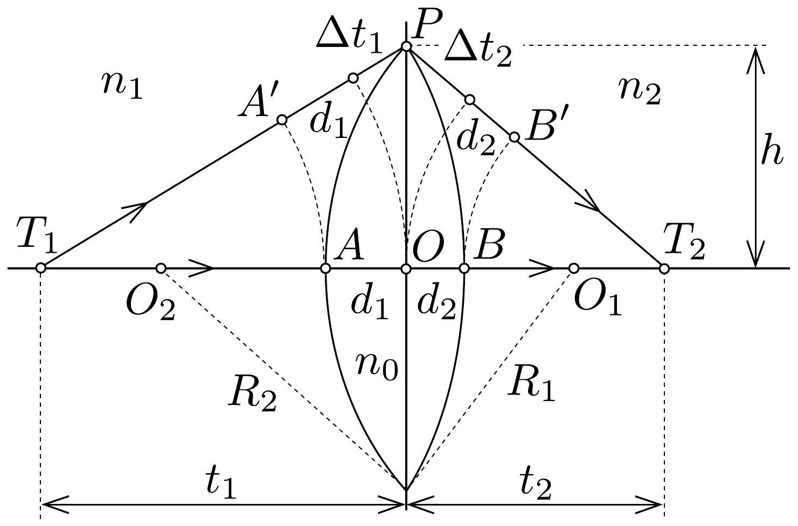
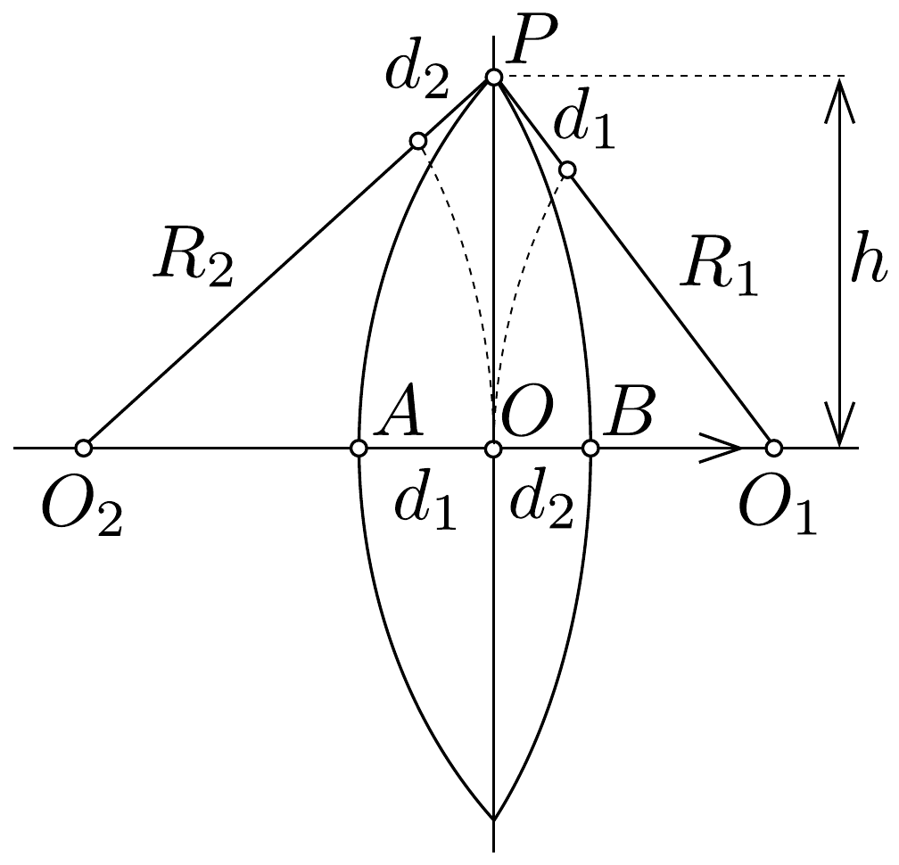
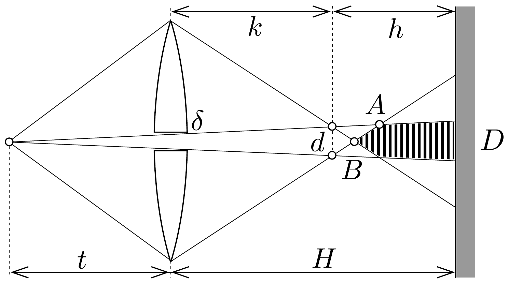

## Megoldás 4

a) A jelöléseket a 30. ábra mutatja. A lencse a $T_{1}$ pontban lévố

tárgyat a $T_{2}$-be képezi le. Tekintsük a $T_{1} P T_{2}$ és a $T_{1} O T_{2}$ fénysugarakat. A Fermatelv értelmében a két fénysugárhoz azonos optikai úthossz tartozik. Ehhez elegendő az $A O B$ és az $A^{\prime} P B^{\prime}$ optikai útvonalak egyenlőségét vizsgálni:
\[
\begin{gathered}
s_{A O B}=s_{A^{\prime} P B^{\prime}} \\
n_{0}\left(d_{1}+d_{2}\right)=n_{1}\left(d_{1}+\Delta t_{1}\right)+n_{2}\left(d_{2}+\Delta t_{2}\right) .
\end{gathered}
\]

\footnotetext{
${ }^{4}$ A hivatalos angol nyelvú megoldás szerint az egyensúly kialakulása során a gravitációs energia növekedése a kondenzátor energiacsökkenésével azonos. Azonban ez nem igaz, mert a folyamat során disszipációval is számolni kell, pl. azzal, hogy a töltések átrendeződnek, felgyorsulnak, majd lelassulnak. Megmutatható, hogy $h \ll H$ közelítéssel a kondenzátor energiája a felére csökken. A másik fele fordítódik a folyadék megemelésére és veszteségre.

Használjuk ki, hogy az optikai tengelyhez közeli sugarakat vizsgálunk, valamint, hogy a lencse vékony. A kicsiny $\Delta t_{1}$ távolság:
\[
\Delta t_{1}=\sqrt{t_{1}^{2}+h^{2}}-t=t\left[\sqrt{1+\left(\frac{h}{t}\right)^{2}}-1\right] .
\]
Mivel $h \ll t_{1}$, használjuk az $\left(1+x^{n}\right) \approx 1+n x$ közelítést:
\[
\Delta t_{1}=\frac{h^{2}}{2 t_{1}} .
\]
Ugyanígy $\Delta t_{2}$-re:
\[
\Delta t_{2}=\frac{h^{2}}{2 t_{2}} .
\]

Hasonlóan kell eljárni az $O O_{2} P$ vagy az $O O_{1} P$ háromszögekben $d_{1}$ és $d_{2}$ közelítéséhez felhasználva még, hogy $R_{1}-d_{1} \approx R_{1}$, illetve $R_{2}-d_{2} \approx R_{2}$ (31. ábra):
\[
d_{1}=\frac{h^{2}}{2 R_{1}}, \quad d_{2}=\frac{h^{2}}{2 R_{2}} .
\]

31. ábra.

Felhasználva ezeket a közelítő formulákat (72-6)-ban, egyszerúsítések után kapjuk a lencse leképezési törvényét:
\[
\frac{n_{1}}{t_{1}}+\frac{n_{2}}{t_{2}}=\frac{n_{0}-n_{1}}{R_{1}}+\frac{n_{0}-n_{2}}{R_{2}} .
\]

Az $f_{1}$ gyújtótávolság az $n_{2}$ törésmutatójú anyagból párhuzamosan érkező sugarak találkozási pontjának távolságát jelenti. A $t_{2}=\infty$ helyettesítés (72-7)-ból ezt adja:
\[
\frac{n_{1}}{f_{1}}=\frac{n_{0}-n_{1}}{R_{1}}+\frac{n_{0}-n_{2}}{R_{2}},
\]
innen:
\[
n_{1}=f_{1}\left[\frac{n_{0}-n_{1}}{R_{1}}+\frac{n_{0}-n_{2}}{R_{2}}\right] .
\]

Hasonlóan az $n_{1}$-bő̌l párhuzamosan érkező sugarakra $t_{1}=\infty$ alapján:
\[
n_{2}=f_{2}\left[\frac{n_{0}-n_{1}}{R_{1}}+\frac{n_{0}-n_{2}}{R_{2}}\right] .
\]

A (72-8) és (72-9) alatti eredményeket (72-7)-ben az egyenlet bal oldalán $n_{1}$ és $n_{2}$ helyére írva, és a szögletes zárójelben levő kifejezéssel egyszerúsítve:
\[
\frac{f_{1}}{t_{1}}+\frac{f_{2}}{t_{2}}=1 .
\]

Az eredeti feladat egy speciálisabb esetben kívánta meg a bizonyítást. Ha $n_{1}=n_{2}=1$, a közismert lencsetörvényt kapjuk meg.
b) Az $f$ gyújtótávolságú lencse elé $t$ távolságba helyezett pontszerú fényforrásról két valódi képet kapunk $k=t f /(t-f)$ távolságban (lásd a 32. ábrát). Ha a rés szélessége $\delta$, akkor a valódi képek egymástól mért távolsága a $d / \delta=(t+k) / t$ aránypár alapján:
\[
d=\delta \cdot \frac{t+k}{t}=\frac{\delta t}{t-f} .
\]

Ez a két valódi kép két koherens fényforrás, és közös fénykúpjukban interferenciát figyelhetünk meg (bevonalkázott rész a 32 ábrán). Az ernyő pontjában erősítést tapasztalunk, ha a fényforrások képeiből érkező fénysugarak által megtett utak különbsége a hullámhossz egész számú többszöröse. Egy $\alpha_{n}$ szögú irányban:
\[
d \sin \alpha_{n}=n \lambda .
\]
Az erósítés helye az ernyőn (felhasználva, hogy $d \ll h$ )
\[
y_{n}=h \operatorname{tg} \alpha \approx h \sin \alpha=n \frac{\lambda h}{d},
\]
amivel az interferenciacsíkok távolsága:
\[
s=\frac{\lambda h}{d} .
\]
A mi esetünkben $h=H-k$, továbbá (72-10) felhasználásával:
\[
s=\frac{\lambda}{\delta t}[H-(t-f)-t f] .
\]
A felfogóernyőn a közös fénykúp $D$ átmérője a $D / \delta=(H+t) / t$ aránypár alapján:
\[
D=\delta \cdot \frac{H+t}{t} .
\]
Az interferenciacsíkok $N$ darabszámát $D$ és $s$ osztásával kapjuk:
\[
N=\frac{D}{s}=\frac{\delta^{2}}{\lambda} \cdot \frac{H+t}{H(t-f)-t f} .
\]
Számadatok példaképpen: $f=10 \mathrm{~cm}, t=20 \mathrm{~cm}, \delta=0,1 \mathrm{~cm}, \lambda=0,5 \mu \mathrm{~m}$, $H=50 \mathrm{~cm}, N \approx 47$.

Ha az ernyő az $A$ pontnál közelebb kerül, új számítást kell végeznünk $D$ meghatározására, mert más hasonló háromszögeket kell vizsgálnunk. A $B$ ponttól balra nem keletkezik interferencia.

\title{
