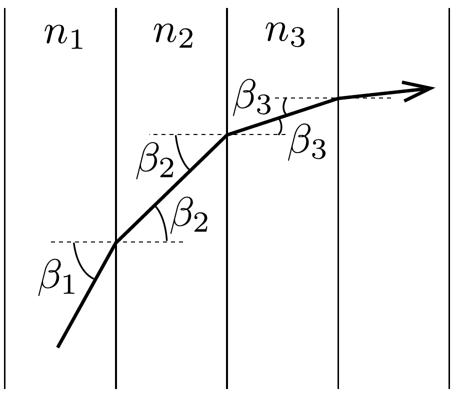
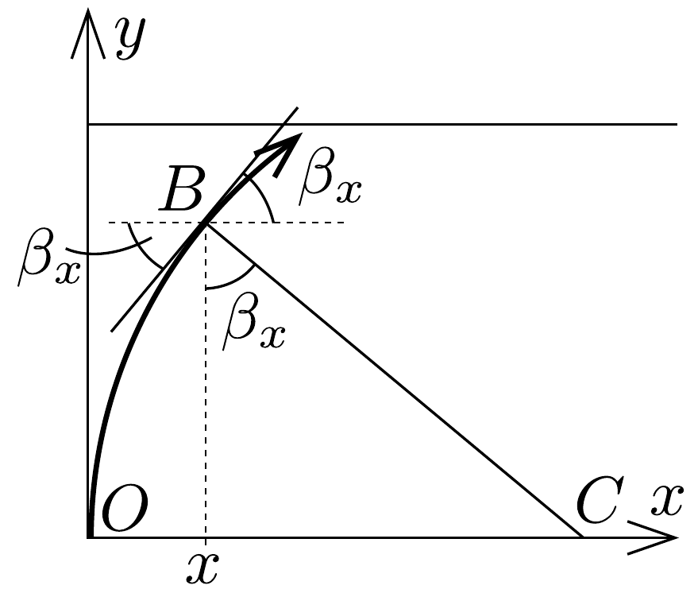
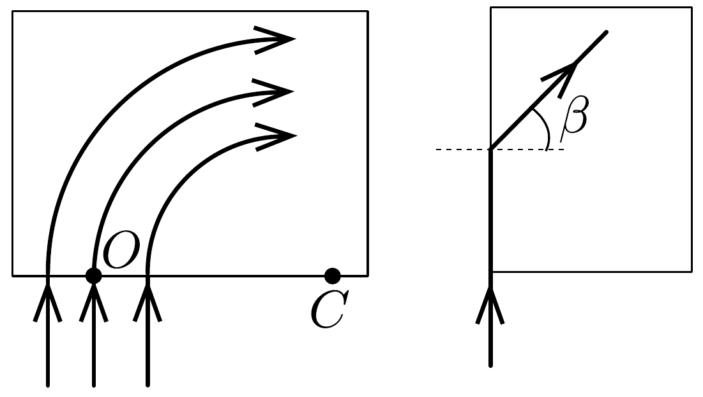

## Megoldás 2

Milyen a fénysugár pályájának az alakja? Ha egymás után állított planparalel lemezeken megy át a fény (34. ábra), amelyek törésmutatója fokozatosan változik, akkor az egyes törésekre felírt törési törvény szerint:
\[
\frac{\sin \beta_{1}}{\sin \beta_{2}}=\frac{n_{2}}{n_{1}}, \quad \frac{\sin \beta_{2}}{\sin \beta_{3}}=\frac{n_{3}}{n_{2}}, \ldots,
\]
illetve
\[
n_{1} \sin \beta_{1}=n_{2} \sin \beta_{2}, \quad n_{2} \sin \beta_{2}=n_{3} \sin \beta_{3}, \ldots
\]

Ez az összefüggés akármilyen vékony rétegekből álló sorozat esetében is igaz,

34. ábra.
ezért minden olyan esetben, ha a törésmutató csak az $x$ tengely mentén változik:
\[
n_{x} \sin \beta_{x}=\text { konstans. }
\]

A mi esetünkben a fény $n_{0}$ törésmutatójú helyen alulról az $O$ pontban merőlegesen lép a lemezbe, amikor is $n_{x}=n_{0}$ és $\beta_{x}=90^{\circ}$, tehát a konstans $n_{0}$, és bárhol a lemezben:
\[
n_{x} \sin \beta_{x}=n_{0} .
\]
Azonban ismerjük $n_{x}$ függését $x$-től és így a lemez belsejében a fénysugár mentén igaz, hogy:
\[
\sin \beta_{x}=\frac{n_{0}}{n_{x}}=1-\frac{x}{r}=\frac{r-x}{r} .
\]
Rajzoljunk a $B$ pontban a fénysugár érintőjére meróleges egyenest (lásd a 35. ábrát). Az ábrát egybevetve a fizikai levezetésből származó eredménnyel, azonnal látszik, hogy a fénypálya egy $C$ középpontú körív, amelynek rádiusza $O C=B C=r$, éppen az alapképletben szereplő konstans. Pontosabban: erre a körívre nyilván teljesül a $\sin \beta_{x}=(r-x) / r$ összefüggés; azt pedig, hogy más görbe nem felel meg, azt annak alapján láthatjuk be, hogy az adott $O$ ponton áthaladó görbe deriváltja, azaz érintőjének iránytangense adott:
\[
\frac{\mathrm{d} y}{\mathrm{~d} x}=\operatorname{tg} \beta_{x}=\frac{\sin \beta_{x}}{\sqrt{1-\sin ^{2} \beta_{x}}}=\frac{r-x}{y} .
\]

A következő differenciálegyenlet adódik:
\[
y \mathrm{~d} y=(r-x) \mathrm{d} x,
\]
amit integrálva:
\[
\frac{y^{2}}{2}=x r-\frac{x^{2}}{2}+C,
\]
ahol $C$ egy állandó. Tudjuk, hogy a fénysugár átmegy az origón, ezért $C=0$. Tehát a fénysugár pályaegyenlete teljes négyzetté alakítás után:
\[
(x-r)^{2}+y^{2}=r^{2} .
\]
Esetünkben (vagyis már a $\sin \beta_{x}$-re kapott kifejezés ismeretében) ezt az eredményt a $B C$ átfogójú háromszögre felírt Pithagorasz-tételből is megkaphatjuk, általános $n(x)$ esetén differenciálegyenlet megoldása szükséges.

Ez igen érdekes eredmény, amit legfeljebb abból lehetett előre sejteni, hogy a konstans jelölése $r$ volt.

Sorban válaszolunk a kérdésekre. Az $A$ pontban, tekintettel a levegőbe való kilépésre, a fénytörés törvénye szerint
\[
\frac{\sin \alpha}{\sin \left(90^{\circ}-\beta_{A}\right)}=n_{A}=\frac{\sin \alpha}{\cos \beta_{A}} .
\]
Azonban az $n_{A} \sin \beta_{A}=n_{0}$ szerint $\sin \beta_{A}=n_{0} / n_{A}, \cos \beta_{A}=\sqrt{1-\left(n_{0} / n_{A}\right)^{2}}$, és ezt felhasználva:
\[
n_{A}=\frac{\sin \alpha}{\sqrt{1-\left(n_{0} / n_{A}\right)^{2}}} .
\]
Innen $n_{A}=\sqrt{n_{0}^{2}+\sin ^{2} \alpha}$; az $n_{0}=1,2$ és $\sin \alpha=0,5$ értékek felhasználásával $n_{A}=1,3$. Az $A$ pont $x$ koordinátája az $n(x)$-re megadott összefüggéssel $x=1 \mathrm{~cm}$.

A falvastagságot a fénypálya egyenletéből kapjuk meg $x=1$ cm helyettesítéssel: $d=5 \mathrm{~cm}$.

Felvethető az a gondolat, mi történik, ha az üveglapba nem az 1,2-es törésmutatójú helyen, hanem odébb, balra vagy jobbra engedjük be merőlegesen a
fénysugarat (36) ábra). Az $O$-ban beejtett fénysugár legfeljebb negyedkört írhat le, mert $O C=r=13 \mathrm{~cm}$ távolságban a törésmutató végtelen lesz. Az előbbihez hasonló gondolatmenetből következik, hogy valamennyi fénysugár koncentrikus negyedkörön futna, így egy véges vastagságú fénysugár elkanyarodna. De a beejtés pontját nem szabad $O$-tól balra messzebbre, mint 2,6 cm-re vinni, mert ott a törésmutató 1 lesz.

Először azt hinnénk, hogy az alulról merőlegesen beejtett sugárnak irányváltozás nélkül kellene továbbhaladnia, hiszen a merőleges vonal mentén a törésmutató mindenütt ugyanannyi. Ugyanolyan határesetről van szó, mint amikor egy üvegtömbre súrlódva ejtünk be egy fénysugarat, amelynek azután a törvény szerint $\sin \beta=1 / n$ törőszöggel kellene továbbmennie (36, ábra jobb oldala). Egyetlen homogén üvegtömbnél ez a határeset gyakorlatilag kivitelezhetetlen, de a mi lemezünknél alkalmazhatunk véges vastagságú nyalábot (és ez a helyzet a gyakorlatban), és az ilyen kísérletet el lehet végezni.
