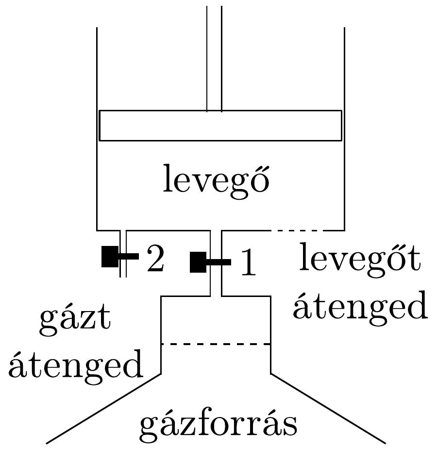

## Megoldás 3

A következő fizikai törvényeket kell ismerni. Ha egy tartályban többféle gáz van, akkor parciális nyomásnak azt a nyomást nevezzük, amelyet a gáz akkor fejtene ki, ha egyedül volna jelen a tartályban. A gázkeverék tartályára kapcsolt nyomásméró ezeknek a parciális nyomásoknak az összegét mutatja. Ha egy membrán valamely gázra nézve átjárható, akkor ennek a gáznak a membrán mindkét oldalán ugyanannyi lesz a parciális nyomása.

A 37. ábra mutat egy ilyen gépet. A dugattyú alatt mindig 1 atmoszféra a levegő parciális nyomása, tekintettel a henger alján lévő szúrőre. Tehát munkavégzés szempontjából nem kell foglalkoznunk a légköri levegő nyomásával. A gáz viszont nem tud megszökni a hengerből.

Kinyitjuk az 1-es szelepet, melynek vezetékében van a gázt átengedő membrán. Ennek mindkét oldalán 1 atmoszféra lesz a gáz parciális nyomása, így a hengerben a dugattyú alatt is. A dugattyú alatt az összes nyomás 2 atmoszféra, fölötte csak 1, ezért a dugattyú felfelé megy és munkát végez. Egy idő múlva lezárjuk az 1. szelepet. A dugattyú tovább megy felfelé, a bezárt gáz parciális nyomása közben a Boyle-Mariotte-törvény szerint közeledik a nullához, illetőleg az összes nyomás az 1 atmoszférához. Feltételeztük, hogy a henger fala jó hővezető anyagból készült, és a dugattyút elég lassan engedjük mozogni ahhoz, hogy a hőmérséklet mindig kiegyenlítődjék. 1 mol, $T$ hőmérsékletú gáz térfogatának $V_{1}$-ról $V_{2}$-re való izotermikus növelése közben $R T \ln \left(V_{2} / V_{1}\right)$ munkát végez, azaz

mivel $V_{2}$ nagyságát semmi sem korlátozza, tetszőleges $V_{1}$ eredeti térfogatú gázból is végtelen mennyiségú energiát nyerhetünk. (Természetesen más feltételekkel is kiszámíthattuk volna az energianyereséget - pl. adiabatikus tágulást feltételezve -, az eredmény akkor is végtelen.)

Ha a dugattyú felfelé tartó menetét abba kell hagynunk, az 1-es szelepet bezárjuk és kinyitjuk a 2-es szelepet, erre teljes külső-belső nyomásegyenlőség jön létre, a dugattyú visszaesik, illetve munka nélkül visszatolható. Újabb gázadaggal az eljárás megismételhető.

A munkavégzés a készüléknél a környezet lehúlésével jár együtt, mert a dugattyú felfelé menetelekor teljes egészében munkavégzésként kaptuk meg a környezetből felvett hőt. Azonban nincs ellentmondás a termodinamika II. főtételével: a gáz egyes adagjai irreverzibilisen keverednek a légkörben, állandósítva a környezet és a rendszer hőmérsékletét.

A két membránnal ugyanazt az állapotot értük el, mintha csak a gázforrás létezett volna, de légkör nélkül, vákuumban.

\title{
