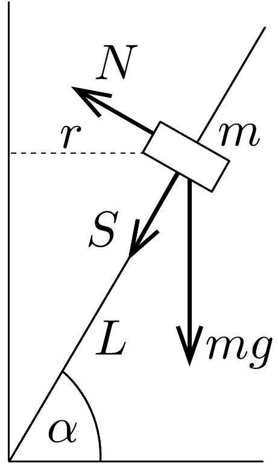
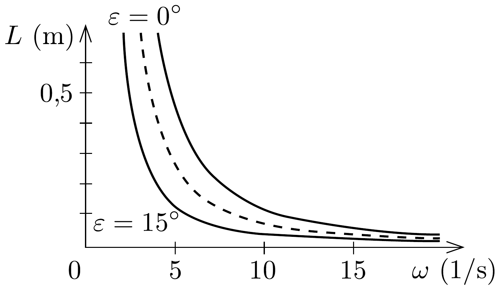
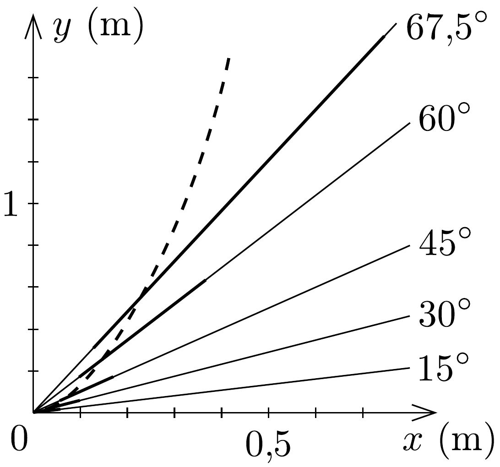

## Megoldás 1

Legyen a test $L$ távolságra a rúd alsó végétől, körpályájának sugara $r=L \cos \alpha$ (40. ábra). Ha a test a felfelé csúszás határán van, a mozgásegyenletek:
\[
\begin{gathered}
m r \omega^{2}=N \sin \alpha+S \cos \alpha, \\
0=m g-N \cos \alpha+S \sin \alpha .
\end{gathered}
\]
Az $S$ súrlódási erőt és az $N$ nyomóerőt az $S \leq \mu N$ feltételbe helyettesítve kapjuk,

40. ábra.
hogy
\[
\frac{\mu \cos \alpha+\sin \alpha}{\cos \alpha-\mu \sin \alpha} \geq \frac{\omega^{2} r}{g} .
\]
Ahhoz, hogy jobban kezelhető alakot kapjunk, használjuk a $\mu=\operatorname{tg} \varepsilon$ kifejezést, ami annak a lejtőnek a legnagyobb $\varepsilon$ hajlásszögét adja meg, amelyről a test még éppen nem csúszik le. Ezzel
\[
\operatorname{tg}(\alpha+\varepsilon) \geq \frac{\omega^{2} r}{g}, \quad \text { ha } \quad \alpha+\varepsilon<\pi / 2 .
\]
(Ha $\alpha+\varepsilon \geq \pi / 2$, a test már csak lefelé mozdulhat el.)
Hasonlóan tárgyalható a lefelé csúszás esete. A súrlódási erő előjele a mozgásegyenletekben megváltozik, így az egyenlőtlenség a
\[
\operatorname{tg}(\alpha-\varepsilon) \leq \frac{\omega^{2} r}{g}
\]
alakot ölti. Összefoglalva, a test helyben maradásának feltétele:
\[
\begin{gathered}
\operatorname{tg}(\alpha-\varepsilon) \leq \frac{\omega^{2} L \cos \alpha}{g} \leq \operatorname{tg}(\alpha+\varepsilon), \quad \text { ha } \quad \alpha+\varepsilon<\pi / 2, \\
\operatorname{tg}(\alpha-\varepsilon) \leq \frac{\omega^{2} L \cos \alpha}{g}, \quad \text { ha } \quad \alpha+\varepsilon \geq \pi / 2 .
\end{gathered}
\]

Elég bonyodalmas a négy változó szerepének a vizsgálata. Triviális, hogy nyugalomban levő rúd esetében, amikor $\omega=0$, az állandó helyzet feltétele: $\varepsilon \geq \alpha$. Ha nincs súrlódás, $\varepsilon=0$, csak ez a feltétel jelent egyensúlyt:
\[
\frac{\omega^{2} L \cos \alpha}{g}=\operatorname{tg} \alpha
\]

Az eredményből látható, hogy a test a rúdon egy alsó $L_{\mathrm{a}}$-tól egy felső $L_{\mathrm{f}}$-ig terjedó intervallumban marad meg változatlan helyen:
\[
\frac{g}{\omega^{2} \cos \alpha} \operatorname{tg}(\alpha-\varepsilon) \leq L \leq \frac{g}{\omega^{2} \cos \alpha} \operatorname{tg}(\alpha+\varepsilon) .
\]
Ha $\alpha \leq \varepsilon$, akkor az alsó határ a tengelynél van $\left(L_{\mathrm{a}}=0\right)$. A 41, a) ábra adott, $\alpha=$

41. ábra.
$=30^{\circ}$-os rúdhelyzetnél mutatja meg az $m$ tömegü test $L$ távolságának nagyságát, mint $\omega$ függvényét. A szaggatott vonal mutatja a lehetséges egyensúlyi helyzeteket $\varepsilon=0$ esetén. A súrlódás növekedésével mindig szélesebb sáv lép ennek helyébe, az ábrán $\varepsilon=15^{\circ}$, azaz $\mu=0,268$ esete látható.

A 41.b) ábra egy $\omega=10 \mathrm{~s}^{-1}$ szögsebességgel forgatott rudat mutat különböző helyzetekben, a súrlódást jellemző szög ismét $\varepsilon=15^{\circ}$ ( $x$ és $y$ jelöli a rúd pontjainak vízszintes, illetve függőleges helykoordinátáit). A rúd vastagon kihúzott részei jelzik azokat a helyeket, ahol a test a helyén marad. Az $L_{\mathrm{a}}$ alsó határ $\alpha=15^{\circ}$-ig alul a tengelyen marad, aztán mindig jobban felfelé húzódik, a végtelenig. Az $L_{\mathrm{f}}$ felső határ $\alpha=0^{\circ}$ esetében $\mu g / \omega^{2}$, azután mindig feljebb húzódik: 60°-nál 0,73 m; $67,5^{\circ}$-nál $1,95 \mathrm{~m}$. Az $\alpha=90^{\circ}-\varepsilon=75^{\circ}$ fölött a felső határ végtelen, a tömeg minden $L_{\mathrm{a}}$-nál nagyobb távolságban a helyén marad. A középső, szaggatott görbe a súrlódás nélküli esetben érvényes egyensúlyi helyzeteket jelöli meg.

A stabilitás kérdését illetően az a helyzet, hogy kilépve a nyugalmat jelentő sávból a test vagy felrepül a rúd végére, vagy leesik az aljára. A súrlódás nélküli esetben az egyensúlyi helyzet labilis. Függőleges rúd esetében súrlódás mellett is az egész rúdon labilis az egyensúlyi helyzet és a test leesik az origóba.
