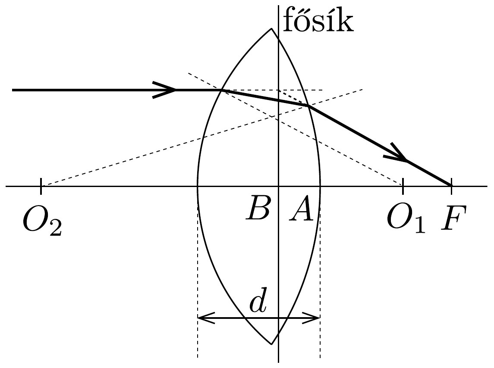
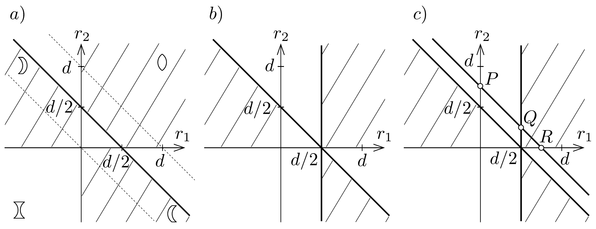

## Megoldás 2

Egy vastag lencse az alábbi, 42. ábrán látható. $O_{1}$ és $O_{2}$ a két felület görbületi középpontja. A lencse adatai: a gömbfelületek rádiusza $r_{1}$ és $r_{2}$ (kívülről nézve homorú felület esetében negatív), a vastagság $d$, a törésmutató $n$. A fókusztávolságot a fósíktól mérve $(f=B F)$, a vastag lencsékre vonatkozó egyenlet
\[
\frac{1}{f}=(n-1)\left[\frac{1}{r_{1}}+\frac{1}{r_{2}}-d \cdot \frac{n-1}{n} \cdot \frac{1}{r_{1} r_{2}}\right] .
\]

42. ábra.

A $B$ főpont távolsága a felülettől:
\[
B A=h=\frac{d r_{2}}{n\left(r_{1}+r_{2}\right)-d(n-1)} .
\]

Ha a fénysugár az ellentétes irányból érkezik, akkor $r_{1}$ és $r_{2}$ felcserélésével ugyanazt az $f$ fókusztávolságot, de egy másik fősíkot kapunk.

A lencse anyagának diszperziója van, ez azt jelenti, hogy különböző hullámhosszaknál más a törésmutató, $\lambda_{\mathrm{a}}$-nál $n_{\mathrm{a}}, \lambda_{\mathrm{b}}$-nél $n_{\mathrm{b}}$.

A (75-1) összefüggést $n$ hatványai szerint rendezve:
\[
f\left(r_{1}+r_{2}-d\right) n^{2}+\left[2 f d-f\left(r_{1}+r_{2}\right)-r_{1} r_{2}\right] n-f d=0 .
\]
Az egyenlet $n$-ben másodfokú, tehát általában megvan annak a lehetősége, hogy adott $f$-hez két $n$ tartozzon (diszkrimináns pozitív).

A (75-1)-ből kifejezve a gyújtótávolságot:
\[
f=\frac{n r_{1} r_{2}}{(n-1)\left[n\left(r_{1}+r_{2}\right)-d(n-1)\right]} .
\]

A feladat kérdésére úgy válaszolunk, hogy ezt a fókusztávolságot $n_{\mathrm{a}}$ és $n_{\mathrm{b}}$ törésmutatókra számítjuk ki és ezeket egyenlővé tesszük:
\[
\frac{n_{\mathrm{a}} r_{1} r_{2}}{\left(n_{\mathrm{a}}-1\right)\left[n_{\mathrm{a}}\left(r_{1}+r_{2}\right)-d\left(n_{\mathrm{a}}-1\right)\right]}=\frac{n_{\mathrm{b}} r_{1} r_{2}}{\left(n_{\mathrm{b}}-1\right)\left[n_{\mathrm{b}}\left(r_{1}+r_{2}\right)-d\left(n_{\mathrm{b}}-1\right)\right]} .
\]

Az egyenlet rendezése az alábbi feltételt adja:
\[
r_{1}+r_{2}=d\left(1-\frac{1}{n_{\mathrm{a}} n_{\mathrm{b}}}\right) .
\]

A diszkusszió első lépéseként látjuk, hogy plankonvex vagy plankonkáv lencse esetében a feltétel nem teljesülhet, mert a bal oldal végtelen volna, a jobb oldal pedig mindenképpen véges. Mivel a törésmutatók 1-nél nagyobbak, a zárójeles rész 1-nél kisebb lesz, tehát a sugarak összege kisebb lesz a vastagságnál, így általában igen vastag lencséket kapunk. Érdekes, hogy az $n_{\mathrm{a}}-n_{\mathrm{b}}$ diszperzió nem szerepel a feltételben, csak a törésmutatók szorzata.

További vizsgálat céljából mérjük fel a koordináta-tengelyekre $r_{1}$ és $r_{2}$ rádiuszokat $d$-ben mint egységben mérve. Először általánosságban, egyetlen törésmutató esetében vizsgáljuk a problémát, és példaként $n=2$ értéket tételezzünk fel, ami speciális flintüvegnél lehetséges. Megvizsgáljuk, mi a feltétele annak, hogy egy vastag lencse gyüjtőlencse legyen. Planparalel lemezként viselkedő lencsét akkor kapunk, ha $f \rightarrow \infty$, vagyis (75-3) nevezóje nulla:
\[
(n-1)\left[n\left(r_{1}+r_{2}\right)-d(n-1)\right]=0 .
\]
Innen a feltétel:
\[
r_{1}+r_{2}=d\left(1-\frac{1}{n}\right) .
\]

A 43. a) ábrán $n=2$ esetében a vastag vonal tünteti fel az összetartozó értékpárokat, a ferde vonalat $r_{1}=0,5 d$ és $r_{2}=0,5 d$ között húzva $(n=1$-nél az origón, $n=\infty$-nél a $(d, d)$ pontokon mennének át ezek a ferde egyenesek; az egyes síknegyedekre jellemző lencsealakok is láthatóak). Gyüjtőlencsét akkor kapunk, ha $f>0$, illetve $1 / f>0$. A (75-3) összefüggés alapján:
\[
\frac{(n-1)\left[n\left(r_{1}+r_{2}\right)-d(n-1)\right]}{n r_{1} r_{2}}>0 .
\]

Átrendezve:
\[
\frac{r_{1}+r_{2}}{r_{1} r_{2}}>\frac{d}{r_{1} r_{2}}\left(1-\frac{1}{n}\right) .
\]

Az elsó́ síknegyedben ( $r_{1}>0$ és $r_{2}>0$ ) akkor kapunk gyűjtőlencsét, ha $r_{1}$ és $r_{2}$ adatait a 43,a) ábrán látható vastag ferde vonal fölötti területről választjuk ki. Ha alatta választjuk ki, a vastag lencse két domború felülete ellenére szórólencsét kapunk. A többi síknegyedben az előjelek tekintetében óvatosnak kell lennünk. A harmadik negyedben, ahol $r_{1}$ és $r_{2}$ is negatív, a (75-5) egyenlőtlenség nem teljesülhet. A második és negyedik negyedben az egyenlótlenség egy negatív tényezóvel szorozva így alakul:
\[
r_{1}+r_{2}<d\left(1-\frac{1}{n}\right),
\]
tehát itt a vastag vonal alatti területek jelentik a gyújtőlencsét. A 43. ábrán a vonalkázás jelzi a gyűjtőlencsék tartományát.

A lencse használatakor praktikus kívánság, hogy a fókusz az üveganyagon kívülre essék. Ennek feltétele (75-2) és (75-3) alapján:
\[
\frac{n r_{1} r_{2}}{(n-1)\left[n\left(r_{1}+r_{2}\right)-d(n-1)\right]}>\frac{d r_{2}}{n\left(r_{1}+r_{2}\right)-d(n-1)} .
\]
A fókusz akkor esik a kilépő felületre, ha $h=f$, amiből könnyen adódik az $r_{1}=d(1-1 / n)$ feltétel. A 43.b) ábrán a 0,5d-nél húzott függőleges jelenti ezt. Az első síknegyedben, ahol minden görbületi sugár pozitív, a fókusz az anyagon kívülre esik, ha $r_{1}>d(1-1 / n)$, vagyis az $\left(r_{1} ; r_{2}\right)$ pontnak a függőlegestől jobbra kell feküdnie. A többi síknegyedben ismét óvatosnak kell lennünk. A harmadik negyedben a feltétel nem teljesülhet, mert (76-6) bal oldala itt negatív, jobb oldala pozitív. A második negyedben egyszerúsíthetünk $r_{2}$-vel és a (76-6) alatti egyenlőtlenség csak úgy teljesülhet, ha a nevező a negatív:
\[
n\left(r_{1}+r_{2}\right)-d(n-1)<0,
\]
amiből következik az itt érvényes feltétel:
\[
r_{1}+r_{2}<d\left(1-\frac{1}{n}\right) .
\]
A negyedik negyed körülményeinek kivizsgálására írjuk fel $f$ és $h$ különbségét (75-3) és (75-2) felhasználásával:
\[
\frac{n r_{1} r_{2}-d r_{2}(n-1)}{(n-1)\left[n\left(r_{1}+r_{2}\right)-d(n-1)\right]}=r_{2} \cdot \frac{r_{1}-d(1-1 / n)}{(1-1 / n)\left[n\left(r_{1}+r_{2}\right)-d(n-1)\right]} .
\]
Minthogy $r_{2}$ negatív, ez a különbség úgy lehet pozitív, ha a számláló és a nevező ellentétes előjelú. Mivel ebben a síknegyedben $r_{1}+r_{2}<d(1-1 / n)$, ezért a számláló pozitív:
\[
r_{1}-d\left(1-\frac{1}{n}\right)>0
\]
azaz ismét a függőlegestől jobbra lévő ( $r_{1} ; r_{2}$ ) pontpárok jöhetnek szóba. A 43,b) ábrán a vonalkázás jelöli meg azokat a területeket, ahol a használható $r_{1}, r_{2}$ pontok elhelyezkednek, ha gyűjtőlencsét lencsén kívüli fókuszponttal szeretnénk készíteni.

Ezután térjünk vissza eredeti problémra, és rajzoljuk be azon $r_{1}, r_{2}$ pontok mértani helyét, amelyekre $n_{\mathrm{a}}$ és $n_{\mathrm{b}}$ törésmutatók esetében egyezők a fókusztávolságok (43.c) ábra). A (75-4) feltétel egy egyenest jelent, amely a tengelyeket $d\left(1-1 / n_{\mathrm{a}} n_{\mathrm{b}}\right)$ távolságokban metszi. Legyen például $n_{\mathrm{a}}=2,02$ és $n_{\mathrm{b}}=1,98$, ekkor $1-1 / n_{\mathrm{a}} n_{\mathrm{b}}=0,75$. Ezen az egyenesen $P$-től balra olyan konkáv-konvex (!) szórólencséket találunk, amelyek fókusza az üvegben van. $P$-től $Q$-ig olyan bikonvex gyújtőlencsék következnek, amelyek fókusza még mindig az anyagban van. $Q$-tól $R$-ig a fókusz az anyagon kívül van, ezek bikonvex gyújtőlencsék. $R$-től lefelé konvex-konkáv szórólencséket találunk, de fókuszuk az üvegben van. Valamelyest praktikus értelmük csak a $Q R$ közötti gyüjtőlencséknek van. Gyakorlatban ezek sem érnének sokat, mert hiába egyeznek a fókusztávolságok, ezeket a $B$ főponttól kell felmérni, ennek helye pedig (75-3) szerint függ a törésmutatótól.
