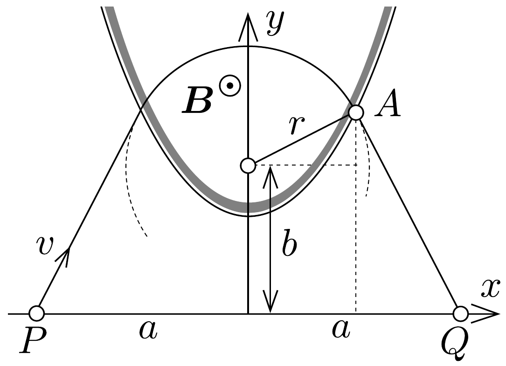
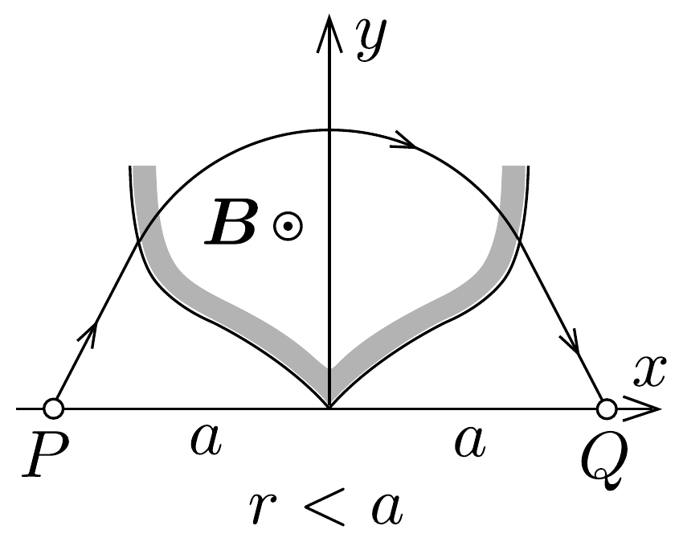
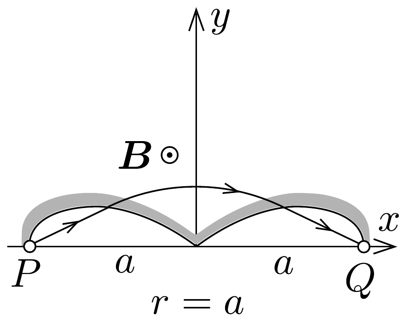
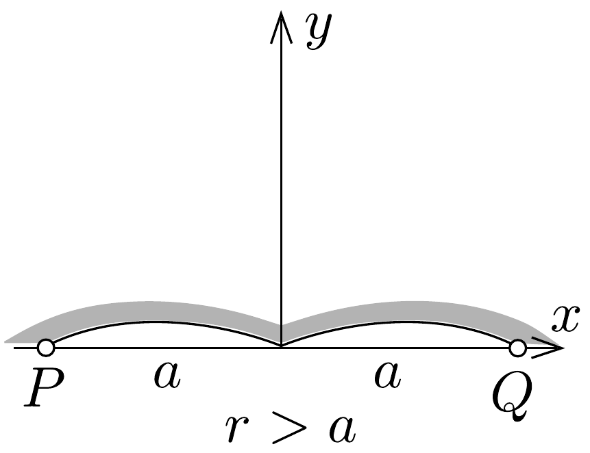

## Megoldás 3

Homogén mágneses térben egy töltött részecske körpályán mozog, közben a $Q$ töltésre ható $Q v B$ Lorentz-eró szolgáltatja a $v^{2} / r$ centripetális gyorsulást: $Q v B=m v^{2} / r$, innen a körpálya sugara:
\[
r=m v / Q B .
\]

A mi esetünkben a mágneses térben mindegyik ion ugyanakkora sugarú körpályán mozog. Pozitív töltésú ionok esetében hátulról előre irányuló mágneses térre van szükség. Amíg az ion a mágneses térben mozog, addig pályája az adott sugarú kör. Amint az ion kilép a térből, a kör utolsó pontjának érintője mentén repül tovább. A határvonalat úgy kell megválasztani, hogy valamennyi ion ugyanabba a $Q$ pontba repüljön. Ezt a matematikai problémát kell megoldani: hol kell a köröket abbahagyni, hogy az utolsó érintő eltalálja az $Q$ pontot. A szimmetria folytán elég az ábra egyik felével foglalkozni, továbbá a körök középpontjai az $y$-tengelyen vannak.

Az $r$ sugarú körpályán repülő ion az $(x ; y)$ koordinátájú $A$ pontban lép ki a
térből és az érintő mentén repül $Q$-ba (44. ábra). Hasonló háromszögekből:
\[
\frac{y-b}{x}=\frac{a-x}{y} .
\]
Azonkívül érvényes a kör egyenlete :
\[
x^{2}+(y-b)^{2}=r^{2} .
\]
$y$, illetve $(y-b)$ kiküszöbölésével azonnal megkapjuk az ilyen tulajdonságú $A$ pontok mértani helyét, vagyis a mágneses tér határát megadó függvényt:
\[
y=\frac{x(a-x)}{\sqrt{r^{2}-x^{2}}} .
\]
Ez negyedfokú függvény. A függvénygörbének csak az első síknegyedbe eső részére

45. ábra.
van szükségünk és ezt tükrözzük az $y$ tengelyre. A térhatárolás három esetét mutatja a 45. ábra. A határvonalak típusa aszerint alakul, hogy az $a$ távolság és az $r$ pályasugár hogyan viszonyul egymáshoz.

A 45, ábrán $a=10 \mathrm{~cm}$ és a sugarak rendre 7,5 cm, 10 cm és 20 cm. Ha $1,67 \cdot 10^{-27} \mathrm{~kg}$ tömegú, $1,6 \cdot 10^{-19} \mathrm{C}$ töltésú protonokról és $B=0,1 \mathrm{~T}$ erősségú mágneses térról van szó, akkor a szükséges 720 km/s, 960 km/s és 1920 km/s repülési sebességek 2600 V, 4600 V és 18400 V gyorsító feszültségek hatására jönnek létre. Elvben mindegyik megrajzolt esetben a negyedsíkban kiinduló valamennyi ion összegyújthető, de $r<a$ esetében ehhez a végtelenig terjedő térre volna szükség. A határoló görbe végtelenbe menő ága akkor csap le hirtelen a $Q$ pontba, amikor $r$ egyenlő lesz $a$-val. Még tovább növekedő $r$-nél a tér határvonala lelaposodik.

\title{
