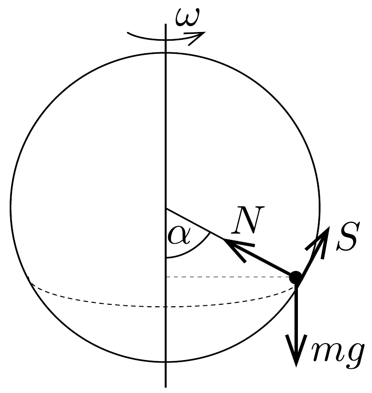
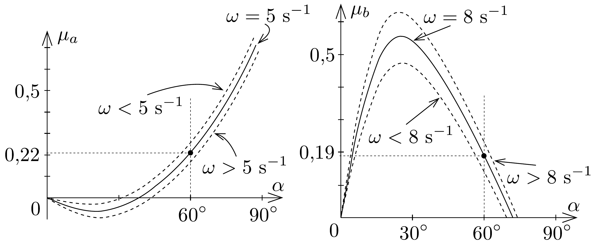

## Megoldás 1

$a$ ) A test $R \sin \alpha$ sugarú vízszintes körön mozog (esetünkben $\alpha=$ $=60^{\circ}$ ). A testre ható erók (48. ábra): az $m g$ nehézségi erő, az $N$ nyomóerő és az $S$ súrlódási erő. A test gyorsulása (centripetális gyorsulás) vízszintes, nagysága $\omega^{2} R \sin \alpha$.

A mozgásegyenletek:
\[
\begin{gathered}
m \omega^{2} R \sin \alpha=N \sin \alpha-S \cos \alpha, \\
0=m g-N \cos \alpha-S \sin \alpha .
\end{gathered}
\]
Az egyenletrendszer megoldása:
\[
\begin{aligned}
& S=\left(m g-m \omega^{2} R \cos \alpha\right) \sin \alpha \\
& N=m g \cos \alpha+m \omega^{2} R \sin ^{2} \alpha
\end{aligned}
\]
A súrlódási erő a felvett irányba mutat, ha $m g>m \omega^{2} R \cos \alpha$, azaz, ha $\omega<$ $<\sqrt{g /(R \cos \alpha)}=6,26 \mathrm{~s}^{-1}$, tehát ebben az esetben lefelé csúszás történhet meg. A test nem csúszik le, ha $S \leq \mu_{a} N$, azaz ha
\[
\mu_{a} \geq \sin \alpha \cdot \frac{1-\frac{\omega^{2} R}{g} \cos \alpha}{\cos \alpha+\frac{\omega^{2} R}{g} \sin ^{2} \alpha}=0,22
\]
b) Ebben az esetben $\omega>\sqrt{g /(R \cos \alpha)}$, azaz a súrlódási erő az ábrán felvett iránnyal ellentétes és a felcsúszást akadályozza meg. A feltétel hasonló számítással:
\[
\mu_{b} \geq \sin \alpha \cdot \frac{\frac{\omega^{2} R}{g} \cos \alpha-1}{\cos \alpha+\frac{\omega^{2} R}{g} \sin ^{2} \alpha}=0,19 .
\]
c) A testre ható eredő erőkomponensek vizsgálatánál egyszerúbb annak a vizsgálata, hogy kis elmozdulással, vagy kis szögsebesség-változással a mozgás fenntartásához szükséges minimális súrlódási együttható hogyan módosul a részfeladatokban kiszámolthoz képest. A szükséges minimális súrlódási együtthatónak $\alpha$-tól való függését az $a$ ) és $b$ ) esetben a 49. ábra mutatja; ezekből vonhatjuk le következtetéseinket. (Mivel a függvényt program nélkül nehezebb ábrázolni, az is megfelelő, ha egy-egy kicsivel megváltoztatott $\alpha$, illetve $\omega$ értéket helyettesítünk be a súrlódási együttható formulájába, és megvizsgáljuk, hogy az így kapott súrlódási együttható milyen viszonyban áll az $a$ ) és $b$ ) esetben kiszámoltakkal.)

(i) Az $\omega=5 \mathrm{~s}^{-1}$ szögsebességre megadott görbén $\alpha=60^{\circ}$-nál felfelé menve a mozgásállapot fenntartásához szükséges legkisebb súrlódási együttható $\mu>$ $>\mu_{a}^{\text {min }}=0,22$, és mivel $\omega<6,26 \mathrm{~s}^{-1}$, a test visszacsúszik a kezdeti állapotba. Ha lefelé mozdul el a test, $\mu_{a}^{\text {min }}$-nél kisebb súrlódási együttható elegendő, ezért a test ott marad.

Ha $\mathrm{az} \omega=8 \mathrm{~s}^{-1}$ esetén felrajzolt görbét nézzük, akkor felfelé mozdulásnál kisebb súrlódási együttható is elegendő, mint $\mu_{b}^{\text {min }}=0,19$, a test ott marad. Lefelé mozdulás esetén a szükséges minimális súrlódási együttható $\mu>\mu_{b}^{\text {min }}$, így a test felfelé visszacsúszik (hiszen most $\omega>6,26 \mathrm{~s}^{-1}$ ).
(ii) $\mathrm{Az} \omega=5 \mathrm{~s}^{-1}$ esetben kissé megnövelve a szögsebességet, az $\alpha=60^{\circ}$-os helyzetben maradva a szükséges súrlódási együttható értéke kisebb, mint $\mu_{a}{ }^{\text {min }}$, tehát a test megtartja a helyzetét. Csökkentve a szögsebességet a szükséges súrlódási együttható értéke nagyobb, $\operatorname{mint} \mu_{a}^{\min }$, így a test lecsúszik és megállapodik olyan $\alpha$ szögü helyzetben, amelyre $\mu=\mu_{a}^{\text {min }}$.

A másik esetben, vagyis ha $\omega=8 \mathrm{~s}^{-1}$, kicsit megnövelve a szögsebességet, a szükséges legkisebb súrlódási együttható értéke nagyobb kell legyen $\mu_{b}^{\text {min }}$-nél,
vagyis felcsúszik egy másik egyensúlyi pozícióba. Kisebb szögsebességnél a szükséges súrlódási együttható értéke kisebb, így a test helyben marad.
