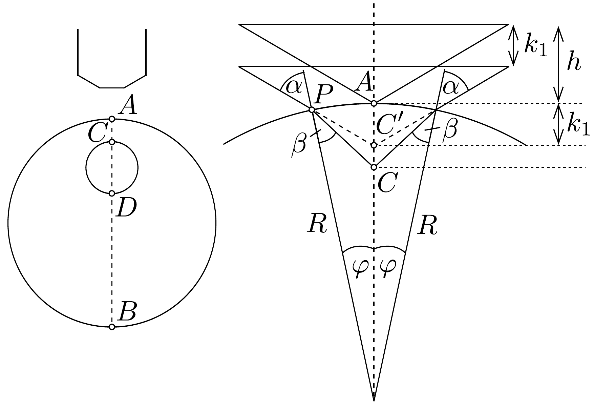
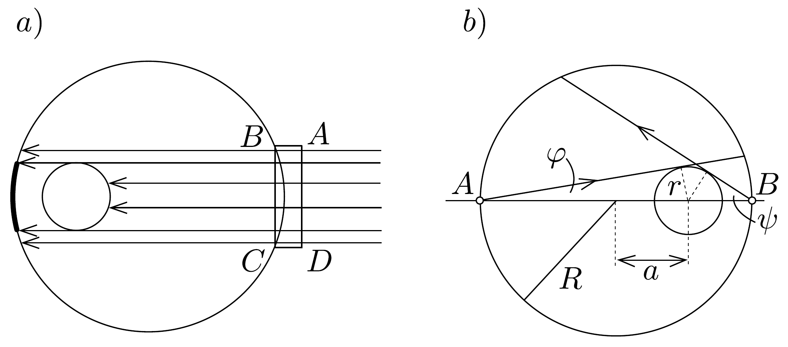
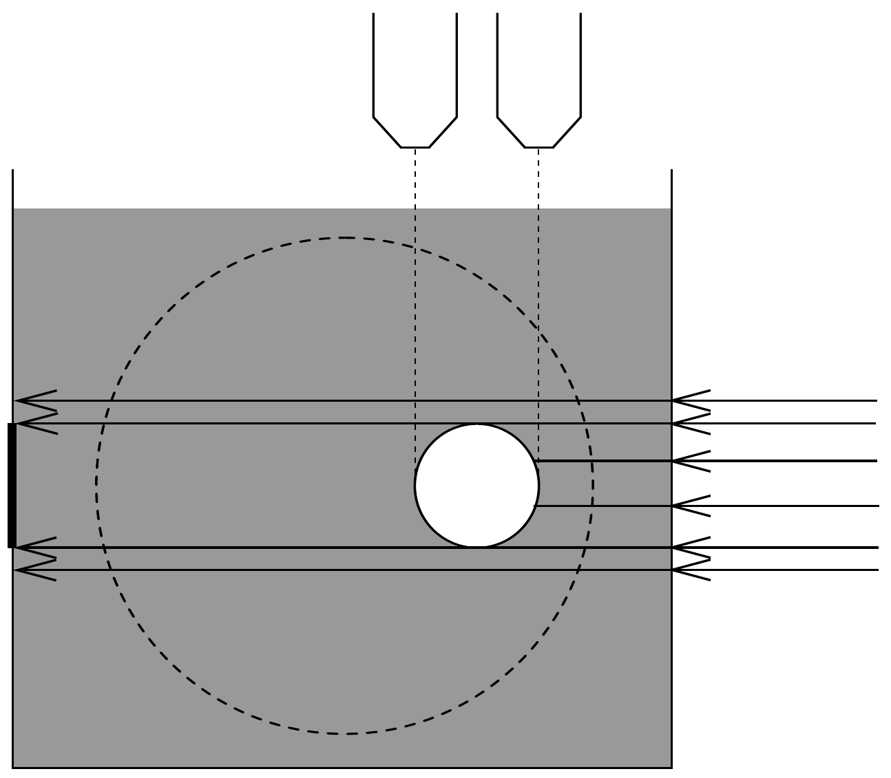

## Megoldás 3

Az üveg súrúsége nem meghatározott adat, ez mint ismert érték nem használható fel. Az üveggolyó anyagának törésmutatóját meg lehet határozni egy olyan fénysugár útjának követésével, amely a gömbön úgy megy keresztül, hogy nem éri a buborékot.

A két gömb középpontját összekötő egyenes (tengely) helyzetére sokszor szükség van. A tengely meghatározható, ha a golyót keljfeljancsiként asztalra tesszük vagy higanyon úsztatjuk. A gömbön megjelölhetjük a tengely buborékhoz közelebbi és távolabbi végét.

Sok módszerrel meg lehet határozni a buborék átmérőjét, néhánynak a vázlatát ismertetjük ( $R$ a gömbsugár, $n$ a törésmutató).

A tengely mentén haladva két vastag szórólencséből álló lencserendszerünk van. A buborék átmérőjét így optikai úton meghatározhatjuk, viszont a vastag lencsékre vonatkozó számítás végrehajtása hosszadalmas.

Mikroszkóppal mérve először élesre állítjuk azt a tengely 50. ábrán látható $A$ pontjára, majd a $C$ pontjára. Eközben a mikroszkóp tubusát $k_{1}$ távolsággal kell süllyeszteni. Ha nem lenne ott az üveg, akkor a mikroszkópot a $C^{\prime}$ pontra fókuszálnánk a süllyesztés után, azaz $A C^{\prime}=k_{1}$ (szemünk távol helyezkedik el a tubus aljától). Az üveg viszont megtöri a sugarakat, így az $A C$ távolság ennél nagyobb lesz. Használjuk a kis szögekre érvényes közelítéseket. Az 50. ábra alapján

az $A P=R \varphi$ ívhosszt kétféleképpen közelíthetjük:
\[
\begin{gathered}
R \varphi=k_{1} \operatorname{tg}(\alpha+\varphi) \approx k_{1}(\alpha+\varphi), \\
R \varphi=A C \cdot \operatorname{tg}(\beta+\varphi) \approx A C \cdot(\beta+\varphi) .
\end{gathered}
\]
Felhasználva még, hogy $\sin \alpha / \sin \beta \approx \alpha / \beta=n$, az egyenletekből adódik az $A C$ távolság:
\[
A C=k_{1} \cdot \frac{n R}{R+k_{1}(n-1)} .
\]
(Látható, hogy ha nem vennénk figyelembe a határfelület görbültségét, azaz ha $R \rightarrow \infty$, akkor $A C=n k_{1}$ lenne.) Ugyanígy határozható meg a tengely másik végénél a $B D$ távolság. A buborék átméróje $2 r=2 R-A C-B D$.

Másik lehetőség, hogy a gömbhöz olyan, a gömbével megegyezó törésmutatójú plankonkáv lencsét illesztünk az 51, a) ábrán látható módon, amellyel az $A B C D$
rész planparalel lemezzé válik. Ezután párhuzamos sugárnyalábbal világítjuk át a gömböt és a túlsó falon (homályos bevonaton) észleljük a buborék átmérőjét.

További módszer, ha gömbfelszín 51. b) ábrán látható $A$ pontjára sugárnyalábot fókuszálunk. Ekkor a gömbben is egyetlen pontból kiinduló sugárnyalábot kapunk. Ez a túlsó oldalon egy süveget világít meg, amelynek nagyságából megállapítható a $\varphi$ szög. Ugyanígy kapjuk a $\psi$ szöget, ha a $B$-nél fókuszálunk. Ezután
\[
\sin \varphi=\frac{r}{R+a}, \quad \sin \psi=\frac{r}{R-a} .
\]
Az egyenletrendszer megoldása:
\[
r=2 R \cdot \frac{\sin \psi \sin \varphi}{\sin \psi+\sin \varphi}, \quad a=R \cdot \frac{\sin \psi-\sin \varphi}{\sin \psi+\sin \varphi} .
\]

Az üveggolyót anyagával egyező törésmutatójú folyadékkal telt párhuzamos falú üvegedénybe mártjuk (52. ábra). Ilyenkor a külső felszín láthatatlan, és a helyzet olyan, mintha a folyadékban csak egy gömb alakú légbuborék volna. Ezután a buborék határai vízszintesen eltolható mérőmikroszkóppal mérhetők le, vagy oldalról párhuzamos sugárnyalábbal tapogathatók le.

Ha a buborék nem túl nagy, átmérőjének optikai úthosszát, illetve az erre merőleges úthossztól való eltérését interferométeres módszerrel is lehet mérni.

A röntgensugarak üvegben nem törnek meg, de részben elnyelődnek. Tehát a golyót lehetőleg párhuzamosan érkező sugarakkal meg kell röntgenezni.

A tengelyre vonatkozó tehetetlenségi nyomaték mérését is választhatjuk. Például torziós szálon való lengésidő mérésével. Ekkor a buborékot a gömb közepébe is képzelhetjük, így a tehetetlenségi nyomaték:
\[
\Theta=\varrho \cdot \frac{4 \pi}{3} \cdot R^{3} \cdot \frac{2}{5} \cdot R^{2}-\varrho \cdot \frac{4 \pi}{3} \cdot r^{3} \cdot \frac{2}{5} \cdot r^{2}=\frac{8 \pi}{15} \cdot \varrho\left(R^{5}-r^{5}\right) .
\]
Megmérjük a tömeget is:
\[
m=\frac{4 \pi}{3} \cdot \varrho\left(R^{3}-r^{3}\right) .
\]

Az egyenletek osztásával kapjuk a keresett $r$-re, hogy
\[
2 m r^{5}-5 \Theta r^{3}+5 \Theta R^{3}-2 m R^{5}=0 .
\]
Ha $r$ ismert, $\varrho$ is számítható.
Ha megmérjük a tengelyre merőleges átmérő körüli tehetetlenségi nyomatékot is (pl. lejtőn való legurítással, gyorsulás mérésével, vagy ismét torziós lengésekkel), akkor még egy egyenletünk van és a buborék átmérójén, az üveg súrúségén kívül a buborék helyét is meg tudjuk határozni.

\title{
