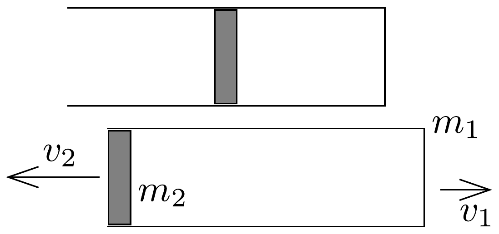

## Megoldás 1

A folyamat elsó része adiabatikus kiterjedés ${ }^{6}$. Kétszeres térfogatra kiterjedve (64. ábra) a hőmérséklet $T$ lesz. Az adiabatikus állapotváltozás törvénye szerint:
\[
T_{0} V_{0}^{\kappa-1}=T\left(2 V_{0}\right)^{\kappa-1},
\]
innen $T=T_{0} / 2^{\kappa-1} \approx 170 \mathrm{~K}$.

64. ábra.

A gáz tágulási munkája a dugattyút és a hengert gyorsította fel. Mivel nincs hőcsere, az I. fótétel értelmében végül is a henger és dugattyú mozgási energiáját a gáz belső energiájának csökkenése fedezi:
\[
\frac{3}{2} n R\left(T_{0}-T\right)=\frac{m_{1} v_{1}^{2}}{2}+\frac{m_{2} v_{2}^{2}}{2} .
\]
Az impulzustétel szerint:
\[
m_{2} v_{2}=m_{1} v_{1} .
\]
Az egyenletrendszer megoldása adja a henger sebességét a folyamat első részének végén:
\[
v_{1}=\sqrt{\frac{3 n R\left(T_{0}-T\right)}{m_{1}\left[1+\left(m_{1} / m_{2}\right)\right]}} \approx 190 \mathrm{~m} / \mathrm{s} .
\]

\footnotetext{
${ }^{6}$ Habár ez a feltevés ellentmondásos, mert - majd látni fogjuk - a dugattyú sebessége összemérhető a gázban terjedő hang sebességével $(\sqrt{\kappa R T / M} \approx 770 \mathrm{~m} / \mathrm{s})$, de kinetikus gázelméletben az adiabatikus folyamat állapotegyenletét akkor kapjuk meg, ha feltesszük, hogy a dugattyú lassú a gázrészecskék termikus átlagsebességéhez képest. A folyamat szigorúan véve irreverzibilis, amire csak a munkatételt, az I. fótételt és a lendületmegmaradást tudjuk felhasználni, az adiabatikus egyenletet nem. Viszont így a hőmérsékletet ismeretlen marad. Ahhoz, hogy ezt megbecsülhessük, a folyamatot adiabatikusnak tekintjük.

A dugattyú sebessége: $v_{2}=m_{1} / m_{2} \cdot v_{1} \approx 380 \mathrm{~m} / \mathrm{s}$.
A folyamat első részének végső pillanatában tehát a henger jobbra mozog $v_{1}$ sebességgel, a dugattyú pedig már éppen kiesett. Ettől kezdve rögzítsük koordinátarendszerünket a hengerhez. Adva van a vákuumban egy nyitott henger, amelyben $n M$ tömegú, $T$ hőmérsékletú gáz van. Ez a gáz nyilván balra kiáramlik és a hengert jobbra löki $v_{x}$ sebességgel. A gáz molekuláinak mozgási energiája:
\[
\frac{n M \cdot v_{\mathrm{m}}^{2}}{2}=\frac{3}{2} \cdot n R T,
\]
tehát a gázmolekulák átlagos repülési sebessége:
\[
v_{\mathrm{m}}=\sqrt{\frac{3 R T}{M}} \approx 1030 \mathrm{~m} / \mathrm{s} .
\]
Egyensúlyban a molekulák egyhatod része repül az egyes koordináta-tengelyek irányában ide és oda. A kiáramlást úgy fogjuk számolni, hogy feltételezzük: a kiáramlás során végig igaz lesz, hogy a molekulák 1/6 része repül a henger lezárt végének. Tudjuk azonban, hogy ez csak első közelítésben van így. Tehát $n M / 6$ tömeg $v_{\mathrm{m}}$ sebességgel repül a henger fenekének, ott rugalmasan ütközik. Ezután a henger $v_{x}$, a gáz $v_{\mathrm{g}}$ sebességgel mozog. Rugalmas ütközés esetében az impulzus megmaradásán kívül a mozgási energia is megmarad. Az impulzus megmaradása szerint:
\[
\frac{n M}{6} \cdot v_{\mathrm{m}}=\frac{n M}{6} \cdot v_{\mathrm{g}}+m_{1} v_{x} .
\]
Az energiamegmaradás törvénye szerint:
\[
\frac{n M v_{\mathrm{m}}^{2}}{6 \cdot 2}=\frac{m M v_{\mathrm{g}}^{2}}{6 \cdot 2}+\frac{m_{1} v_{x}^{2}}{2} .
\]
Az egyenletrendszer megoldása adja a henger sebességét a gáz kiáramlása után:
\[
v_{x}=\frac{2 n M}{6 m_{1}+n M} \cdot v_{\mathrm{m}}=\frac{2 n M}{6 m_{1}+n M} \cdot \sqrt{\frac{3 R T}{M}} \approx 60 \mathrm{~m} / \mathrm{s} .
\]
A gázmolekulák egyhatoda $v_{\mathrm{g}}$ sebességgel pattan vissza, amelynek abszolút értéke kisebb, mint $v_{\mathrm{m}}$. A gáz szükségképp valamelyest lehúl, mert belső energiájának csökkenéséből fedezi a henger (újabb) mozgási energiáját.

A henger végsebessége a talajhoz képest: $v_{1}+v_{x} \approx 250 \mathrm{~m} / \mathrm{s}$.
