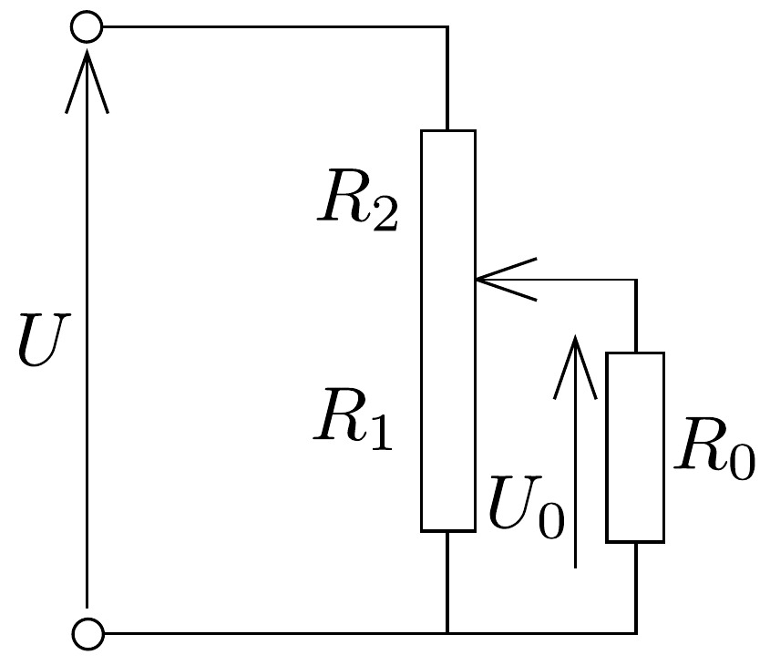
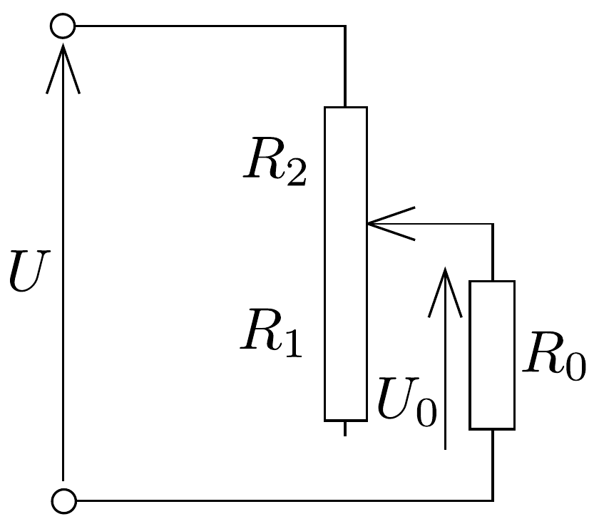

## Megoldás 2

a) A fogyasztón minden esetben $I_{0}=U_{0} / R_{0}=2,25 \mathrm{~A}$ áram folyik keresztül és teljesítménye $P_{0}=U_{0} I_{0}=U_{0}^{2} / R_{0}=10,125 \mathrm{~W}$.

Legyen a feszültségosztó részeinek ellenállása $R_{1}$ és $R_{2}$ (65. ábra). A berendezésen átfolyó teljes áramerósség $I$, és az összes felhasznált teljesítmény: $P=U I$. A hatásfok:
\[
\eta=\frac{P_{0}}{P}=\frac{U_{0}^{2}}{U R_{0} I} .
\]

Minthogy $U_{0}, U, R_{0}$ adott mennyiségek, látható, hogy a hatásfok fordítva arányos a teljes áramerősséggel. Az áramerősség, ha a hatásfok 0,6:
\[
I=\frac{U_{0}^{2}}{U R_{0} \eta}=2,81 \mathrm{~A} .
\]
Ezt kell kibírnia a huzalellenállás $R_{2}$ ellenállású részének.
A huzalellenállás felső részének ellenállása Ohm törvénye szerint:
\[
R_{2}=\frac{U-U_{0}}{I}=0,53 \Omega .
\]
Az alsó rész ellenállása pedig:
\[
R_{1}=\frac{U_{0}}{I-I_{0}}=8 \Omega .
\]
A huzalellenállás összesen $8,53 \Omega$.
b) A (81-1) egyenlet alapján látható, hogy esetünkben a hatásfok csak a teljes áramerősségtől függ. A hatásfok akkor lesz a lehető legnagyobb, ha $I=I_{0}+I_{1}$ a lehetó legkisebb, ahol $I_{1}$ az $R_{1}$-en átfolyó áramerősség. Tehát, ha $I_{1}=0$, vagyis $R_{1} \rightarrow \infty$ (66, ábra).

66. ábra.

A kapcsolásból előtétellenállás lesz. Ekkor
\[
\begin{aligned}
R_{2} & =\frac{U-U_{0}}{I_{0}}=0,67 \Omega, \text { és a hatásfok: } \\
\eta & =\frac{U_{0}^{2}}{U R_{0} I_{0}}=\frac{U_{0}^{2}}{U U_{0}}=\frac{U_{0}}{U}=0,75 .
\end{aligned}
\]
