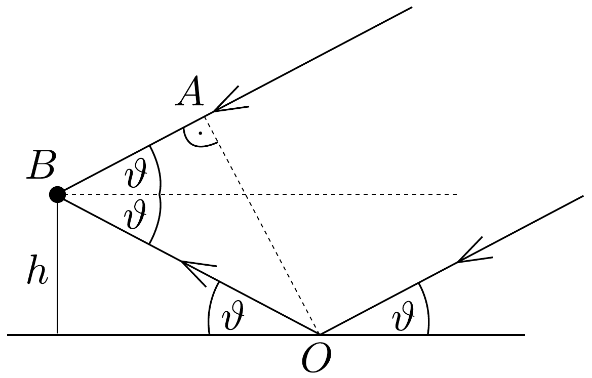

## Megoldás 3

a) A vevóbe a rádióhullámok részben közvetlenül, tehát visszaverődés nélkül, részben pedig a tengerről való visszaverődés után juthatnak be. (A többszörösen visszavert sugarak hatását elhanyagoljuk.) A közvetlenül érkező és a visszavert sugarak különböző utat tesznek meg, ezért fázisuk a detektorban különböző lesz; interferálnak. A geometriai útkülönbséget könnyen meghatározhatjuk a 67. ábra alapján:
\[
\overline{O B}-\overline{A B}=\frac{h}{\sin \vartheta}-\frac{h}{\sin \vartheta} \cos (2 \vartheta)=2 h \sin \vartheta .
\]

Az interferenciamaximum- és minimumhelyek kiszámításához még azt is figyelembe kell vennünk, hogy most visszaverődéskor $\pi$ fázisugrás következik be.

A maximum feltétele tehát:
\[
2 h \sin \vartheta_{\max }+\frac{\lambda}{2}=k \lambda,
\]
vagyis
\[
\sin \vartheta_{\max }=\frac{\lambda}{2 h}\left(k-\frac{1}{2}\right),
\]
ahol $k=1,2,3, \ldots$
A minimum feltétele:
\[
2 h \sin \vartheta_{\min }+\frac{\lambda}{2}=(2 k+1) \frac{\lambda}{2},
\]
vagyis
\[
\sin \vartheta_{\min }=\frac{\lambda}{2 h} k,
\]
ahol $k=0,1,2,3, \ldots$
b) A felkelés pillanatában $\vartheta=0$, ami (81-3) szerint minimumot jelent. Tehát $\vartheta$ növelésével maximum felé haladunk, az intenzitás növekszik.
c) Minimum esetében az eredeti és a visszavert hullámok amplitúdói kivonódnak ( $E$ az elektromos térerősség amplitúdója):
\[
E-E \cdot \frac{n-\sin \vartheta_{\min }}{n+\sin \vartheta_{\min }}=\frac{2 \sin \vartheta_{\min }}{n+\sin \vartheta_{\min }} \cdot E .
\]
Felhasználva (81-3)-at, ez a különbség
\[
\frac{\frac{\lambda}{h} \cdot k}{n+\frac{\lambda}{2 h} \cdot k} \cdot E
\]
A vétel erőssége az amplitúdó négyzetével arányos, ezért az egymás után következő minimumok intenzítása, $k$ értékétől függően (konstans szorzótól eltekintve):
\[
\left(\frac{2 \lambda k}{2 n h+\lambda k}\right)^{2} \cdot E^{2} .
\]

Maximum esetében az eredeti és visszavert hullámok amplitúdói összeadódnak:
\[
E+E \cdot \frac{n-\sin \vartheta_{\max }}{n+\sin \vartheta_{\max }}=\frac{2 n}{n+\sin \vartheta_{\max }} \cdot E .
\]
Felhasználva (81-2)-t, az összeg
\[
\frac{2 n}{n+\frac{\lambda}{2 h} \cdot\left(k-\frac{1}{2}\right)} \cdot E .
\]
Az intenzitás az amplitúdó négyzetével arányos, ezért az egymás után következő minimumok intenzitása, $k$ értékétől függően:
\[
\left[\frac{2 n}{n+\frac{\lambda}{2 h} \cdot\left(k-\frac{1}{2}\right)}\right]^{2} \cdot E^{2} .
\]

Az alábbi táblázat áttekintést ad a számértékekről:

\begin{tabular}[t]{|l|l|l|l|l|l|}
\hline $k_{\text {min }}$ & $k_{\text {max }}$ & $\vartheta_{\text {min }}$ & $\vartheta_{\text {max }}$ & Int. min. & Int. max. \\
\hline 0 & & 0 & & 0 & \\
\hline & 1 & & 1,504° & & $3,9768 \cdot E^{2}$ \\
\hline 1 & & 3,009° & & $0,000135 \cdot E^{2}$ & \\
\hline & 2 & & 4,517° & & $3,9309 \cdot E^{2}$ \\
\hline 2 & & 6,027° & & $0,000532 \cdot E^{2}$ & \\
\hline & 3 & & 7,542° & & $3,8858 \cdot E^{2}$ \\
\hline 3 & & 9,062° & & $0,00118 E^{2}$ & \\
\hline
\end{tabular}

A maximum és minimum intenzitások hányadosa:
\[
\frac{I_{\max }}{I_{\min }}=\frac{4 n^{2} h^{2}}{\lambda^{2} k^{2}} \frac{\left(n+\frac{\lambda}{2 h} k\right)^{2}}{\left(n+\frac{\lambda}{2 h}\left(k-\frac{1}{2}\right)\right)^{2}} .
\]

Mivel $\lambda /(2 h) \ll n$, így ahogyan a csillag emelkedik ( $k$ növekszik), az egymást követő maximumok és minimumok hányadosa csökken:
\[
\frac{I_{\max }}{I_{\min }} \approx \frac{4 n^{2} h^{2}}{\lambda^{2} k^{2}}
\]

\section*{
