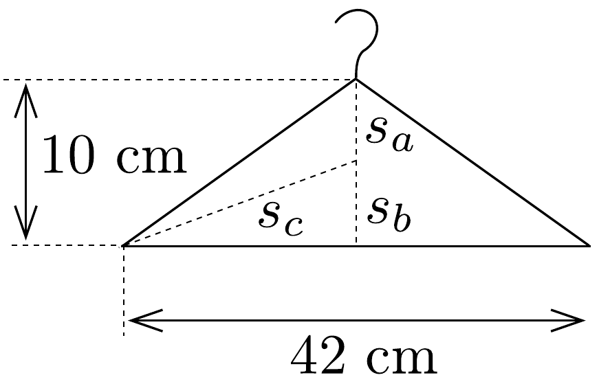

## Megoldás 2

A fizikai inga lengésideje:
\[
T=2 \pi \sqrt{\frac{\Theta}{m g s}},
\]
ahol $\Theta$ a felfüggesztési pontra vonatkozó tehetetlenségi nyomaték, $s$ a súlypont felfüggesztési ponttól mért távolsága. A tehetetlenségi nyomaték Steiner-tétel szerint
\[
\Theta=\Theta_{0}+m s^{2},
\]
ahol $\Theta_{0}$ a tömegközéppontra vonatkoztatott tehetetlenségi nyomaték. Az előző két összefüggés alapján
\[
m s^{2}-\left(\frac{T}{2 \pi}\right)^{2} m g s+\Theta_{0}=0 .
\]
Ennek a másodfokú egyenletnek legfeljebb két gyöke lehet. Legyen a három esetben a tengely és a tömegközéppont távolsága rendre $s_{a}, s_{b}$ és $s_{c}$ (71. ábra). Ebből kettőnek meg kell egyeznie.

71. ábra.
\[
s_{c}>21 \mathrm{~cm}>s_{a}+s_{b}=10 \mathrm{~cm} .
\]
Ezért $s_{a}=s_{b}=5 \mathrm{~cm}$, és $s_{c}=\sqrt{(21 \mathrm{~cm})^{2}+s_{b}^{2}}=21,5 \mathrm{~cm}$. A gyökök és együtthatók közötti összefüggés alapján (Viéte-formulák)
\[
s_{a}+s_{c}=\left(\frac{T}{2 \pi}\right)^{2} g,
\]
amiból $T=1,03 \mathrm{~s}$.
