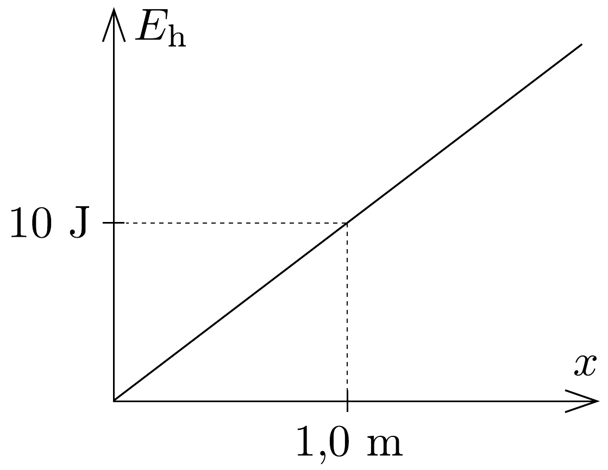
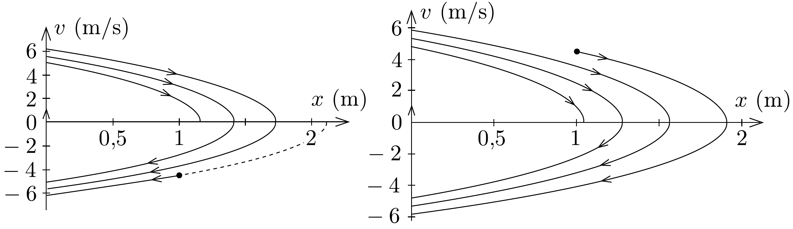

## Megoldás 1

a) A mozgásra gondolhatunk úgy, mintha a test egy vízszintes talajon pattogna, miközben rá az $F$ nehézségi erő és a mozgásával ellentétes irányú, állandó nagyságú „közegellenállási erő” hatna. A talajjal az ütközés tökéletesen rugalmas.

A grafikonról leolvashatjuk, hogy a számunkra érdekes $x>0$ tartományban az $F(x)$ eró nem függ $x$-től, tehát egy $F=10 \mathrm{~N}$ nagyságú, balra ható erőről van szó. $x>0$ esetén a részecskére ható súrlódási erő kisebb, mint az $F$ erő, ezért a részecske csak az origóban állhat meg véglegesen. A visszaveró falon addig fog pattogni, amíg a helyzeti és mozgási energiája teljes egészében a súrlódási erő ellen végzett munkává alakul, azaz $F_{\mathrm{f}} \cdot s=F x_{0}+E_{0}$, ahol $s$ a megállásig megtett út, $F x_{0}$ pedig a helyzeti energia megváltozása az indulás és a megállás között. Az egyenletből $s$-et kifejezve és az adatokat behelyettesítve $s=20 \mathrm{~m}$-t kapunk.
b) Állandó erő által létrehozott erốtérben a helyzeti energia $U(x)=E_{\mathrm{h}}=$ $=F x+c$, ahol $c$ tetszóleges állandó. $c$-t nullának választva, a keresett grafikon a 76. ábrán látható.

c) Ha az $m$ tömegú részecske balra mozog, akkor a gyorsulása $a=-\left(F-F_{\mathrm{f}}\right) / m$. Ha $x^{\prime}$-vel jelöljük azt a helyet, ahonnét balra indul, akkor a helyére és sebességére a következő egyenleteket írhatjuk fel:
\[
x=\frac{a}{2} t^{2}+x^{\prime} ; \quad v=a t .
\]
A három egyenletből
\[
v=-\sqrt{2\left(x-x^{\prime}\right) \frac{F_{\mathrm{f}}-F}{m}} .
\]

Ha a részecske jobbra mozog, akkor $a=-\left(F+F_{f}\right) / m$. $v^{\prime}$-vel jelölve azt a sebességet, amellyel a falról visszapattan, helyének és sebességének egyenlete
most $x=(a / 2) t^{2}+v^{\prime} t ; v=v^{\prime}+a t$, innen
\[
v=\sqrt{\left(v^{\prime}\right)^{2}-2 \frac{F+F_{\mathrm{f}}}{m} x} .
\]

Az (83-1) és (83-2) függvények a $\sqrt{x}$ függvény transzformáltjai, tehát paraboladarabok. Attól függően, hogy a testet az $x_{0}$ pontból balra vagy jobbra indítjuk, kétféle mozgás lehetséges. A két esetben a keresett $v(x)$ grafikont a 77. ábrán láthatjuk kvalitatívan (a test tömege $m=1 \mathrm{~kg}$ ).

Az a) kérdésre a (83-1) és a (83-2) egyenletekkel is válaszolhatunk. Legyen $a_{\leftarrow}=\left(F-F_{\mathrm{f}}\right) / m$ és $a_{\rightarrow}=\left(F_{\mathrm{f}}+F\right) / m$. Vizsgáljuk először azt az esetet, amikor a testet a balra indítjuk el. (83-1) alapján a test indulási helye, ha zérus kezdősebességgel indult volna (a 77. ábra bal oldalán a szaggatott görbe $x$-tengellyel vett metszéspontja)
\[
x_{0}^{\prime}=x_{0}+\frac{v_{0}^{2}}{2 a_{\leftarrow}},
\]
ahol $v_{0}=\sqrt{2 E_{0} / m}$ a test sebessége az $x_{0}$ helyen. Amikor eléri az origót, azaz $x=0$, a test sebessége ismét (83-1) alapján
\[
v_{1}^{\prime}=\sqrt{2 a_{\leftarrow} x_{0}^{\prime}} .
\]
A test a visszapattanás után ugyanekkora sebességel kezd távolodni az origótól, így (83-2) alapján a test az
\[
x_{1}^{\prime}=\frac{\left(v_{1}^{\prime}\right)^{2}}{2 a_{\rightarrow}}
\]
távolságra jut el. Innen ismét elindul az origó felé, és megérkezik oda
\[
v_{2}^{\prime}=\sqrt{2 a_{\leftarrow} x_{1}^{\prime}}
\]
sebességgel. Ezután visszapattan, és
\[
x_{2}^{\prime}=\frac{\left(v_{2}^{\prime}\right)^{2}}{2 a_{\rightarrow}}
\]
távolságra áll meg. Általánosan, ha $n=1,2, \ldots$ :
\[
\begin{gathered}
v_{n}^{\prime}=\sqrt{2 a_{\leftarrow} x_{n-1}^{\prime}}, \\
x_{n}^{\prime}=\frac{\left(v_{n}^{\prime}\right)^{2}}{2 a_{\rightarrow}} .
\end{gathered}
\]
Ezekből $v_{n}^{\prime}$ kiküszöbölésével:
\[
x_{n}^{\prime}=x_{n-1}^{\prime} \cdot \frac{a_{\leftarrow}}{a_{\rightarrow}}=\frac{9}{11} x_{n-1}^{\prime},
\]
vagyis az indulást követően a test az origótól mért legnagyobb távolságai egy $q=9 / 11$ hányadosú mértani sorozat elemei. A teljes megtett út:
\[
s=x_{0}+2\left(x_{1}^{\prime}+x_{2}^{\prime}+\ldots\right)=x_{0}+2 x_{1}^{\prime} \cdot \frac{1}{1-\frac{9}{11}}=x_{0}+11 x_{1}^{\prime} .
\]
A fentiek alapján:
\[
x_{1}^{\prime}=\frac{9}{11} x_{0}^{\prime}=\frac{9}{11}\left(x_{0}+\frac{E_{0}}{F-F_{\mathrm{f}}}\right)=\frac{19}{11} \mathrm{~m} .
\]
Vagyis a teljes megtett út $s=20 \mathrm{~m}$, egyezésben korábbi eredménnyel.
Ha a test jobbra indul el, akkor a megállási hely meghatározásához (83-2) kis kiegészítésre szorul, hiszen most az $x_{0}$ pontból kezdjük a vizsgálódást:
\[
v=\sqrt{v_{0}^{2}-2 a_{\rightarrow}\left(x-x_{0}\right)} .
\]
Tehát a megállás helye:
\[
x_{1}^{\prime}=x_{0}+\frac{v_{0}^{2}}{2 a_{\rightarrow}} .
\]
Innen a test elindul balra a fal felé, amihez (83-1) szerint
\[
v_{1}^{\prime}=\sqrt{2 a_{\leftarrow} x_{1}^{\prime}},
\]
sebességgel elérkezik, majd a falról visszapattan és eljut (83-2) alapján
\[
x_{2}^{\prime}=\frac{\left(v_{1}^{\prime}\right)^{2}}{2 a_{\rightarrow}}
\]
távolságra. Ezután ismét visszaindul a fal felé és eléri azt
\[
v_{2}^{\prime}=\sqrt{2 a_{\leftarrow} x_{2}^{\prime}},
\]
sebességgel, és a visszapattanás után
\[
x_{3}^{\prime}=\frac{\left(v_{2}^{\prime}\right)^{2}}{2 a_{\rightarrow}}
\]
távolságra jut el. Általánosan, ha $n=1,2, \ldots$
\[
\begin{aligned}
& v_{n}^{\prime}=\sqrt{2 a_{\leftarrow} x_{n}^{\prime}} \\
& x_{n+1}^{\prime}=\frac{\left(v_{n}^{\prime}\right)^{2}}{2 a_{\rightarrow}}
\end{aligned}
\]
Ezekből ismét egy mértani sorozatot kapunk:
\[
x_{n+1}^{\prime}=x_{n}^{\prime} \cdot \frac{a_{\leftarrow}}{a_{\rightarrow}}=\frac{9}{11} x_{n}^{\prime} .
\]
A teljes megtett út pedig:
\[
\begin{aligned}
s & =\left(x_{1}^{\prime}-x_{0}\right)+x_{1}^{\prime}+2\left(x_{2}^{\prime}+x_{3}^{\prime}+\ldots\right)= \\
& =2\left(x_{1}^{\prime}+x_{2}^{\prime}+\ldots\right)-x_{0}=\frac{2 x_{1}^{\prime}}{1-\frac{9}{11}}-x_{0}=11 x_{1}^{\prime}-x_{0}
\end{aligned}
\]
(83-3) felhasználásával:
\[
x_{1}^{\prime}=x_{0}+\frac{E_{0}}{F+F_{\mathrm{f}}}=\frac{21}{11} \mathrm{~m} .
\]
A teljes út pedig ismét $s=20 \mathrm{~m}$.
