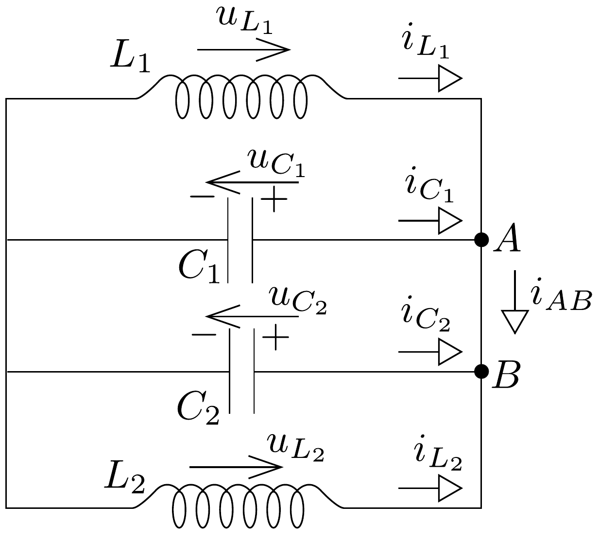

## Megoldás 2

$a)$ Jelöljük $Z$-vel az áramkör eredő impedanciáját. A párhuzamos kapcsolás miatt $\frac{1}{Z^{2}}=\frac{1}{R^{2}}+\left(C \omega-\frac{1}{L \omega}\right)^{2}$, ahol $C=C_{1}+C_{2}$ és $L=\frac{L_{1} L_{2}}{L_{1}+L_{2}}$ az eredó kapacitás és induktivitás.

A hatásos teljesítmény:
\[
P=\frac{U^{2}}{R}=\frac{I^{2} Z^{2}}{R}=\frac{I^{2}}{R} \frac{1}{\frac{1}{R^{2}}+\left(C \omega-\frac{1}{L \omega}\right)^{2}} .
\]
Ebből látható, hogy $P$ akkor maximális, ha $C \omega-\frac{1}{L \omega}=0$, azaz a rezgőkör rezonanciában van. Így $f_{\mathrm{m}}=\frac{1}{2 \pi \sqrt{L C}}$. Szintén a (83-4) összefüggésből olvashatjuk le, hogy a teljesítmény akkor lesz a maximális fele, ha $\frac{1}{R^{2}}=\left(C \omega-\frac{1}{L \omega}\right)^{2}$, azaz
\[
\frac{1}{R}=C \omega_{+}-\frac{1}{L \omega_{+}} \quad \text { és } \quad-\frac{1}{R}=C \omega_{-}-\frac{1}{L \omega_{-}} .
\]
Átalakítva:
\[
\omega_{+}-\omega_{-}=\frac{1}{R C}, \quad \text { így } \quad \Delta f=\frac{1}{2 \pi R C} .
\]
Az eredmény
\[
\frac{f_{\mathrm{m}}}{\Delta f}=R \sqrt{\frac{C}{L}}=150 .
\]
b) A párhuzamos kapcsolás sajátrezgésének frekvenciája $f=\frac{1}{2 \pi \sqrt{L C}}$. A megadott adatokkal $L_{1} C_{1}=L_{2} C_{2}$, tehát az $L_{1} C_{1}$ és az $L_{2} C_{2}$ rezgőkör ugyanazzal a frekvenciával oszcillál egymástól függetlenül. Tehát a sajátrezgés frekvenciája
\[
f=\frac{1}{2 \pi \sqrt{L_{1} C_{1}}}=15,9 \mathrm{kHz}
\]
c) A két rezgőkör függetlensége miatt az $A B$ ágban nem folyik szinuszos áram. A tekercsek ellenállása egyenárammal szemben zérus, ezért egyenáram folyhat az $A B$ ágban. Jelöljük $i_{C_{1}}$-gyel és $i_{C_{2}}$-vel a $t_{0}$ időpillanatban a $C_{1}$ kondenzátorból $A$-ba, ill. a $C_{2}$-ből $B$-be folyó áramerősséget. A kondenzátotok töltései legyenek $q_{1}$ és $q_{2}$.
\[
\begin{gathered}
i_{C_{1}}=\frac{\Delta q_{1}}{\Delta t}=C_{1} \frac{\Delta U}{\Delta t} \quad \text { és } \quad i_{C_{2}}=\frac{\Delta q_{2}}{\Delta t}=C_{2} \frac{\Delta U}{\Delta t}, \\
\text { 1́gy } \quad i_{C_{1}}=\frac{C_{1}}{C_{2}} i_{C_{2}}, \quad \text { azaz } \quad i_{C_{1}}=2 i_{C_{2}} .
\end{gathered}
\]

Az $A$ és $B$ pontokra a csomóponti törvény:
\[
i_{A B}=i_{01}+i_{C_{1}}, \quad i_{A B}+i_{02}=-i_{C_{2}} .
\]

Az utóbbi három egyenletből
\[
i_{A B}=\frac{i_{01}-2 i_{02}}{3}=-0,1 \mathrm{~A} .
\]
d) Jelöljük r indexszel azt az áramerősséget, amit a rezgőkör rezgése hoz létre (levonjuk az egyenáramot). $i_{01 \mathrm{r}}=i_{01}-i_{A B}=0,2 \mathrm{~A}$.

Az $L_{1} C_{1}$ rezgőkörben az energiamegmaradás szerint
\[
L_{1} \frac{i_{1 \mathrm{rmax}}^{2}}{2}=L_{1} \frac{i_{01 \mathrm{r}}^{2}}{2}+C_{1} \frac{U_{0}^{2}}{2} .
\]

A keresett áramerősséget kifejezve:
\[
i_{1 \operatorname{rmax}}=\sqrt{i_{01 \mathrm{r}}^{2}+\frac{C_{1}}{L_{1}} U_{0}^{2}}=0,204 \mathrm{~A} .
\]

A $c$ ) és $d$ ) kérdésekre úgy is válaszolhatunk, ha az egyes elemeken átfolyó áramerősségeket határozzuk meg. A 78, ábrán berajzoltuk az áramok és a feszültségesések a kapcsoló nyitását követő pillanatbeli irányait. Feltettük, hogy a kondenzátorok töltést veszítenek. A rajtuk átfolyó áram iránya is ezt mutatja. Legyen $t=0$ a kapcsoló zárását követő pillanat.

A huroktörvény értelmében:
\[
\begin{aligned}
L_{1} \frac{\mathrm{~d} i_{L_{1}}}{\mathrm{~d} t}+\frac{q_{1}}{C_{1}} & =0 \\
-\frac{q_{1}}{C_{1}}+\frac{q_{2}}{C_{2}} & =0 \\
-\frac{q_{2}}{C_{2}}-L_{2} \frac{\mathrm{~d} i_{L_{2}}}{\mathrm{~d} t} & =0
\end{aligned}
\]

78. ábra.

Mivel a töltés távozik a kondenzátorról:
\[
q_{1}=-\int i_{C_{1}} \mathrm{~d} t ; \quad q_{2}=-\int i_{C_{2}} \mathrm{~d} t
\]

Az $A$ és $B$ pontokra a csomóponti törvény:
\[
\begin{aligned}
i_{C_{1}}+i_{L_{1}} & =i_{A B}, \\
i_{C_{2}}+i_{A B} & =-i_{L_{2}},
\end{aligned}
\]
amiből
\[
i_{C_{1}}+i_{L_{1}}+i_{C_{2}}+i_{L_{2}}=0
\]
(83-6)-ban felhasználva (83-8)-at:
\[
\int\left(\frac{i_{C_{1}}}{C_{1}}-\frac{i_{C_{2}}}{C_{2}}\right) \mathrm{d} t=0 \rightarrow \frac{i_{C_{1}}}{C_{1}}=\frac{i_{C_{2}}}{C_{2}} .
\]
(83-5)-(83-7) egyenletekből:
\[
\frac{\mathrm{d}}{\mathrm{~d} t}\left(L_{1} i_{L_{1}}-L_{2} i_{L_{2}}\right)=0
\]
ahonnan $L_{1} i_{L_{1}}-L_{2} i_{L_{2}}=D=$ állandó. A $D$ állandó értékét a feladatban megadott kezdeti feltétel határozza meg: $D=L_{1} i_{01}-L_{2} i_{02}=-3 \mathrm{mH} \cdot \mathrm{A}$.

Kihasználva a kapott összefüggéseket az áramerősségek között, (83-9)-ből:
\[
i_{C_{1}}+i_{L_{1}}+\frac{C_{2}}{C_{1}} i_{C_{1}}+\frac{L_{1}}{L_{2}} i_{L_{1}}-\frac{D}{L_{2}}=0 .
\]
Átrendezve, majd behelyettesítve az adatokat:
\[
i_{C_{1}}=-i_{L_{1}} \frac{C_{1}}{C_{1}+C_{2}} \cdot \frac{L_{1}+L_{2}}{L_{2}}+\frac{D}{L_{2}} \cdot \frac{C_{1}}{C_{1}+C_{2}}=-i_{L_{1}}-0,1 \mathrm{~A} .
\]

Itt már meg is kaptuk a választ a $c$ ) kérdésre az $A$ pontra felírt csomóponti törvény alapján (általánosságban tovább kellene menni, de az adatok speciális értékei miatt tudunk már válaszolni a kérdésre).

A d) kérdésre a választ további vizsgálattal kapjuk. (83-5) és (83-8) alapján
\[
L_{1} \frac{\mathrm{~d} i_{L_{1}}}{\mathrm{~d} t}=\frac{1}{C_{1}} \int i_{C_{1}} \mathrm{~d} t
\]
amit deriválva $t$-szerint
\[
L_{1} C_{1} \frac{\mathrm{~d}^{2} i_{L_{1}}}{\mathrm{~d} t^{2}}=i_{C_{1}} .
\]
Behelyettesítve (83-10)-et
\[
\frac{L_{1} L_{2}}{L_{1}+L_{2}}\left(C_{1}+C_{2}\right) \frac{\mathrm{d}^{2} i_{L_{1}}}{\mathrm{~d} t^{2}}=-i_{L_{1}}+D .
\]
Látható, hogy ez egy $\omega=1 / \sqrt{L C}$ körfrekvenciájú rezgés egyenlete, ahol $L=$ $=L_{1} L_{2} /\left(L_{1}+L_{2}\right)$ és $C=C_{1}+C_{2}$. Az egyenlet megoldása $i_{L_{1}}(t)=I_{L_{1}} \sin (\omega t+$ $+\varphi)+I$, ahol $I_{L_{1}}$ a váltakozó tag amplitúdója, $\varphi$ a kezdőfázis, és $I$ egy konstans. Visszaírva ezt a megoldást az egyenletbe és felhasználva az adatokat, $I=-0,1 \mathrm{~A}$ adódik. A kezdeti feltételek miatt, ha $t=0$ :
\[
\begin{gathered}
i_{01}=I_{L_{1}} \sin \varphi+I \\
u_{0}=\left.L_{1} \frac{\mathrm{~d} i_{L_{1}}(t)}{\mathrm{d} t}\right|_{t=0}=\omega L_{1} I_{L_{1}} \cos \varphi
\end{gathered}
\]
amiből:
\[
\operatorname{tg} \varphi=\frac{\left(i_{01}-I\right) \omega L_{1}}{u_{0}}=5 .
\]
Vagyis $\varphi=78,69^{\circ}$. Az $L_{1}$ tekercsen átfolyó áram rezgési amplitúdója:
\[
I_{L_{1}}=\frac{i_{01}-A}{\sin \varphi}=0,204 \mathrm{~A} .
\]

Ezek alapján már a többi áramköri elemen átfolyó áram is megadható. Az $i_{02}$ értékét a megoldás során nem használtuk fel, de megmutatható, hogy ezzel a megoldással adódó $i_{L_{2}}(t)$ kifejezés visszaadja azt.
