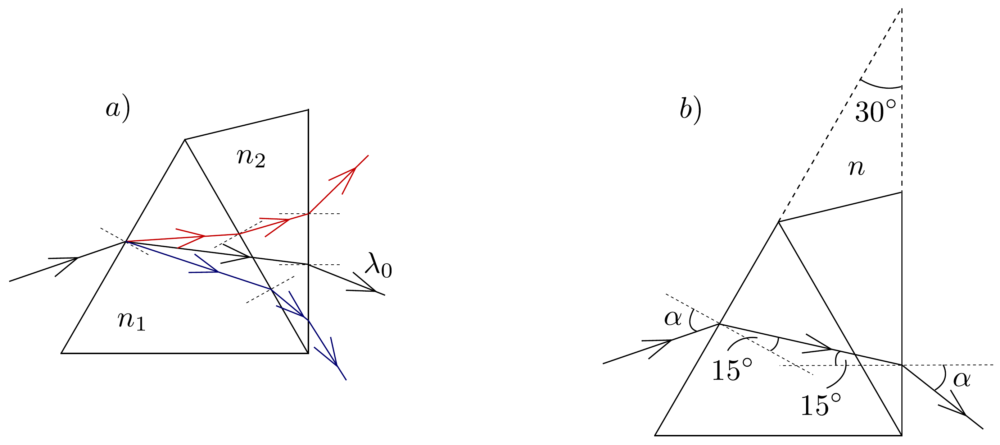
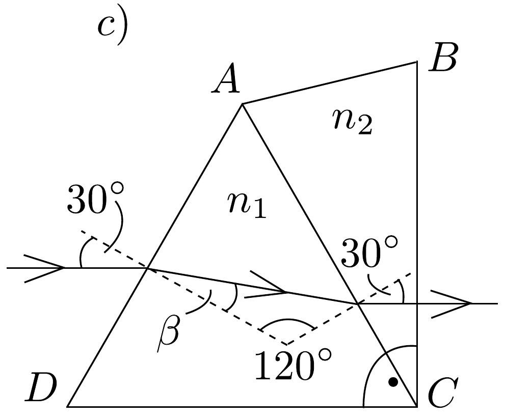

## Megoldás 3

a) Az $A C$ felületre különböző irányból érkező $\lambda_{0}$ hullámhosszú fénysugarak akkor nem törnek meg, ha $n_{1}=n_{2}$, azaz $a_{1}+b_{1} / \lambda_{0}^{2}=a_{2}+b_{2} / \lambda_{0}^{2}$. Átrendezve $\lambda_{0}=\sqrt{\frac{b_{2}-b_{1}}{a_{1}-a_{2}}}=500 \mathrm{~nm}$. Ekkor $n_{1}=n_{2}=1,5$.
b) A $\lambda_{0}$-nál nagyobb hullámhosszú vörös fényre $n_{1}$ és $n_{2}$ is kisebb, mint 1,5, míg a $\lambda_{0}$-nál kisebb hullámhosszú kék fényre mindkét törésmutató nagyobb. Nézzük még meg, hogy az $A C$ felületen hogyan változik a törésmutató. Tudjuk, hogy a $\lambda_{0}$ hullámhosszúságú fényre $n_{2} / n_{1}=1$. Ha a $\lambda_{0}$ helyett $\lambda_{\text {vörös }}$ hullámhosszú

79. ábra.
fényt veszünk, akkor $b_{1}>b_{2}$ miatt $n_{1}$ jobban csökken, mint $n_{2}$, ezért $n_{2} / n_{1}>1$. Hasonlóan látható, hogy kék fényre $n_{2} / n_{1}<1$. A fentiek alapján már megrajzolhatjuk a fénysugarak áthaladását a prizmán (79. a) ábra).
c) A $\lambda_{0}$ hullámhosszú fényre a prizmarendszer úgy viselkedik, mint egy 30°os törőszögü, $n=1,5$ törésmutatójú anyagból készült prizma. Tudjuk, hogy egy prizmán áthaladó fénysugár akkor térül el legkevésbé, ha a prizmán szimmetrikusan halad át, azaz a 79, b) ábra $\alpha$-val jelölt szögek egyenlők. Ekkor a törési törvény $\sin \alpha / \sin 15^{\circ}=1,5$, ahonnan $\alpha=22,8^{\circ}$. A keresett eltérítési szög: $\delta=2 \alpha-30^{\circ}=15,7^{\circ}$.
d) A 79, c) ábra alapján a következő összefüggéseket írhatjuk fel:
\[
\frac{\sin 30^{\circ}}{\sin \beta}=n_{1}, \quad \frac{\sin \left(60^{\circ}-\beta\right)}{\sin 30^{\circ}}=\frac{n_{2}}{n_{1}} .
\]

A két egyenletből $\beta$-t kiküszöbölve: $3 n_{1}^{2}=n_{2}^{2}+n_{2}+1$.
Az $n_{1}$ re és $n_{2}$-re adott összefüggéseket felírva és átrendezve:
\[
\begin{gathered}
\left(3 a_{1}^{2}-a_{2}^{2}-a_{2}-1\right) \lambda^{4}+\left(6 a_{1} b_{1}-b_{2}-2 a_{2} b_{2}\right) \lambda^{2}+ \\
+3 b_{1}^{2}-b_{2}^{2}=0
\end{gathered}
\]

Ez $\lambda^{2}$-re másodfokú egyenlet, aminek megoldása $\lambda=1,18 \mu \mathrm{~m}$.
