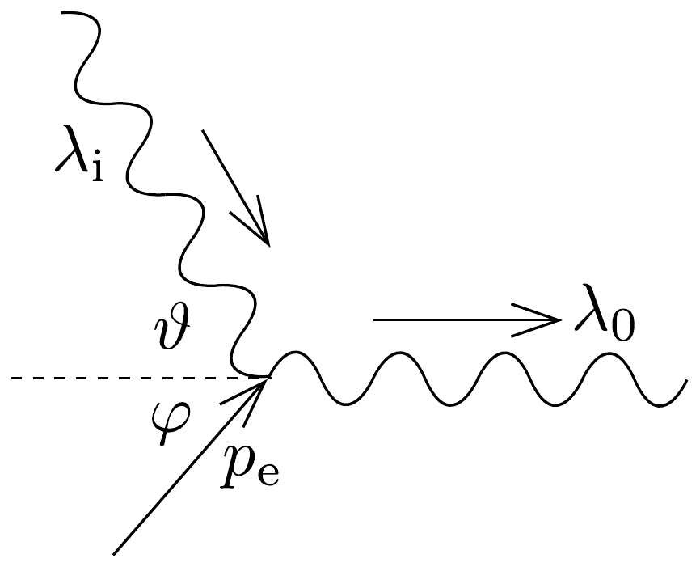

## Megoldás 4

Az elsó ütközésre az energiamegmaradás:
\[
h f_{\mathrm{i}}+E_{\mathrm{e}}=h f_{0}+m_{\mathrm{e}} c^{2}
\]
ahol $f$ a foton frekvenciája, és $E_{\mathrm{e}}$ az elektron energiája. Az impulzusmegmaradást a kirepülő $\lambda_{0}$ hullámhosszúságú foton mozgásirányában és arra merőlegesen írjuk fel (80. ábra):
\[
\begin{gathered}
\frac{h}{\lambda_{\mathrm{i}}} \cos \vartheta+p_{\mathrm{e}} \cos \varphi=\frac{h}{\lambda_{0}}, \\
\frac{h}{\lambda_{\mathrm{i}}} \sin \vartheta-p_{\mathrm{e}} \sin \varphi=0,
\end{gathered}
\]
ahol $p_{\mathrm{e}}$ az elektron impulzusa.

Az utóbbi két egyenletből $\varphi$-t kiküszöbölve, és $\lambda$ helyére $c / f$-et írva
\[
\left(h f_{0}\right)^{2}+\left(h f_{\mathrm{i}}\right)^{2}-2 h^{2} f_{0} f_{\mathrm{i}} \cos \vartheta=p_{\mathrm{e}}^{2} c^{2} .
\]
Felhasználva a
\[
E_{\mathrm{e}}^{2}=\left(m_{\mathrm{e}} c^{2}\right)^{2}+\left(p_{\mathrm{e}} c\right)^{2}
\]
relativisztikus összefüggést, valamint a (83-11) és (83-12) egyenletekből:
\[
f_{0}=\frac{f_{\mathrm{i}}}{1-\frac{h f_{\mathrm{i}}}{m_{\mathrm{e}} c^{2}}(1-\cos \theta)} .
\]
Átalakítva:
\[
\lambda_{\mathrm{i}}-\lambda_{0}=\frac{h}{m_{\mathrm{e}} c}(1-\cos \vartheta) .
\]

A második ütközés az első fordítottja, így ugyanazt az eredményt kapjuk csak $\lambda_{\mathrm{i}}-\mathrm{t}$ kell $\lambda_{\mathrm{f}}-\mathrm{re}$ cserélni:
\[
\lambda_{\mathrm{f}}-\lambda_{0}=\frac{h}{m_{\mathrm{e}} c}(1-\cos \vartheta) .
\]
Tehát $\lambda_{\mathrm{i}}=\lambda_{\mathrm{f}}$. Kiszámítva $\lambda_{0}=1,238 \cdot 10^{-10} \mathrm{~m}$.

Az elektron energiáját impulzusát (83-12) alapján számíthatjuk ki visszaírva a hullámhosszt:
\[
p_{\mathrm{e}}=h \sqrt{\frac{1}{\lambda_{0}^{2}}+\frac{1}{\lambda_{\mathrm{i}}^{2}}-\frac{2}{\lambda_{0} \lambda_{\mathrm{i}}} \cos \vartheta}=5,31 \cdot 10^{-24} \mathrm{kgm} / \mathrm{s} .
\]
A keresett elektronhullámhossz $\lambda_{\mathrm{e}}=h / p_{\mathrm{e}}=1,24 \cdot 10^{-10} \mathrm{~m}$.
Megjegyzés: Ha a relativisztikus $p_{\mathrm{e}}=m_{\mathrm{e}} v^{2} / \sqrt{1-v^{2} / c^{2}}$ összefüggés alapján kiszámítjuk az elektron sebességét, $5,83 \cdot 10^{6} \mathrm{~m} / \mathrm{s}$ kapunk, ami a fénysebesség kevesebb, mint 2\%-a, tehát a nemrelativisztikus számítás is elfogadható.
