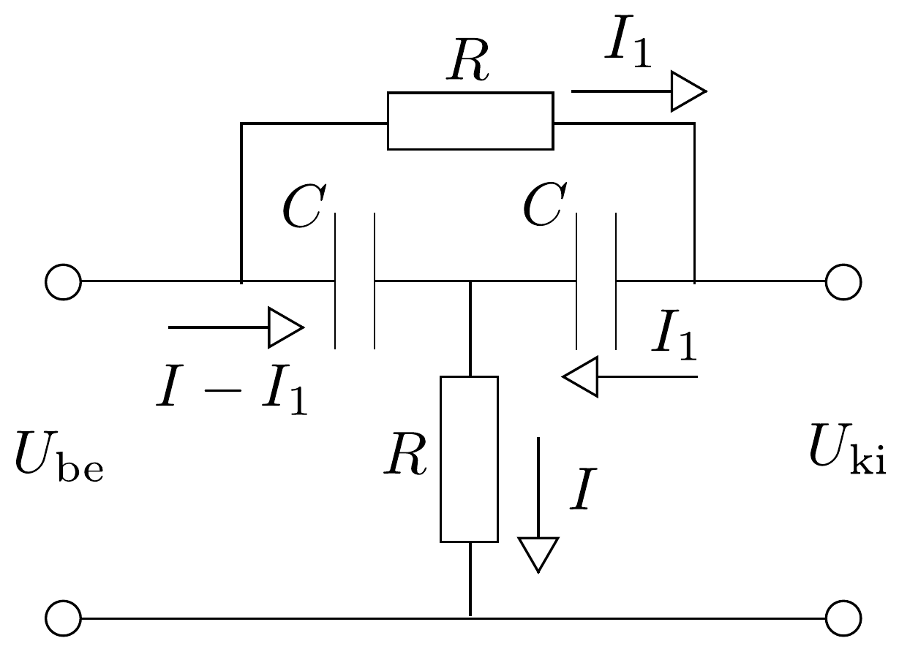

## Megoldás 3

Az $A(\omega)=U_{\mathrm{ki}} / U_{\mathrm{be}}$ hányadost átviteli függvénynek nevezzük. A 88. ábrán látható kapcsolás egy lehetséges esetet mutat. Ha $\omega \rightarrow 0$, azaz egyenfeszültséget kapcsolunk a rendszerre, akkor a kondenzátorok szakadást jelentenek, $U_{\mathrm{be}}$-vel megegyező feszültségre töltődnek fel, ezért $A(0)=1$. Nagyfrekvenciás határesetben a kondenzátorok vezetékként foghatók fel, így ismét $A(\omega \rightarrow \infty)=1$.

Az átviteli függvény meghatározása lehetséges forgóvektorok alkalmazásával. Azonban egyszerúbben célhoz érünk, ha komplex írásmódot használunk, mert azokra a Kirchhoff-törvények a szokásos alakban érvényesek. Tekintsük az ábrán megadott komplex áramokat. Ezekkel kifejezve a komplex feszültségeket:
\[
\begin{gathered}
U_{\mathrm{ki}}=\frac{1}{\mathrm{i} \omega C} I_{1}+R I \\
U_{\mathrm{be}}=\frac{1}{\mathrm{i} \omega C}\left(I-I_{1}\right)+R I
\end{gathered}
\]

Huroktörvény:
\[
R I_{1}+\frac{1}{\mathrm{i} \omega C} I_{1}=\frac{1}{\mathrm{i} \omega C}\left(I-I_{1}\right) .
\]
Ebből adódik, hogy
\[
I_{1}=\frac{I}{2+\mathrm{i} \omega R C}
\]
Ezt felhasználva:
\[
\tilde{A}(\omega)=\frac{\frac{1}{\mathrm{i} \omega C} \cdot \frac{1}{2+\mathrm{i} \omega R C}+R}{\frac{1}{\mathrm{i} \omega C}\left(1-\frac{1}{2+\mathrm{i} \omega R C}\right)+R}=\frac{1-\omega^{2} R^{2} C^{2}+2 \mathrm{i} \omega R C}{1-\omega^{2} R^{2} C^{2}+3 \mathrm{i} \omega R C} .
\]
Mivel a valós átviteli függvényt kell megadni, ezért ennek a kifejezésnek az abszolútérték négyzete kell. Legyen $a=1-\omega^{2} R^{2} C^{2}$ és $b=\omega R C$. Ezzel:
\[
\tilde{A}(\omega)=\frac{a+2 \mathrm{i} b}{a+3 \mathrm{i} b}=\frac{a^{2}+6 b^{2}}{a^{2}+9 b^{2}}-\mathrm{i} \frac{a b}{a^{2}+9 b^{2}} .
\]

A valós átviteli függvény az átalakításokat elvégezve:
\[
A(\omega)=\sqrt{[\operatorname{Re} \tilde{A}(\omega)]^{2}+[\operatorname{Im} \tilde{A}(\omega)]^{2}}=\sqrt{\frac{1+\omega^{4} R^{4} C^{4}+2 \omega^{2} R^{2} C^{2}}{1+\omega^{4} R^{4} C^{4}+7 \omega^{2} R^{2} C^{2}}} .
\]
Ezt ábrázolva, a feltételnek megfeleló függvényt kapunk. Minimumértékét további átalakítással (vagy deriválással) megkaphatjuk. Legyen $\omega R C=x$ :
\[
A(x)=\sqrt{\frac{1+x^{4}+2 x^{2}}{1+x^{4}+7 x^{2}}}=\sqrt{1-\frac{5 x^{2}}{1+x^{4}+7 x^{2}}}=\sqrt{1-\frac{5}{\frac{1}{x^{2}}+x^{2}+7}} .
\]
A kifejezés akkor minimális, ha a tört értéke maximális, azaz, ha $\frac{1}{x^{2}}+x^{2}$ minimális. Felhasználva a számtani és mértani közép közötti egyenlőtlenséget:
\[
\frac{1}{2}\left(\frac{1}{x^{2}}+x^{2}\right) \geq 1
\]

A kifejezés a minimális értéket akkor veszi fel, ha $\frac{1}{x^{2}}=x^{2}$, azaz $\omega_{0}=1 /(R C)$, $f_{0}=\omega_{0} /(2 \pi) \approx 1,6 \mathrm{kHz}$. Ekkor a feszültséghányados értéke $A\left(\omega_{0}\right)=2 / 3$.

Ha $\tilde{A}(\omega)$ (84-6) kifejezésébe $\omega_{0}$-t behelyettesítjük, tisztán valós kifejezést kapunk, vagyis ebben az esetben $U_{\mathrm{ki}}$ és $U_{\mathrm{be}}$ között valóban nincs fáziskülönbség.

További lehetőség, ha a kondenzátort és az ellenállást kicseréljük egymással, illetve ha a kondenzátorokat tekercsekkel helyettesítjük. Ezekben az esetekben az $A(\omega)$ meghatározása hasonló módon történik.

\title{
