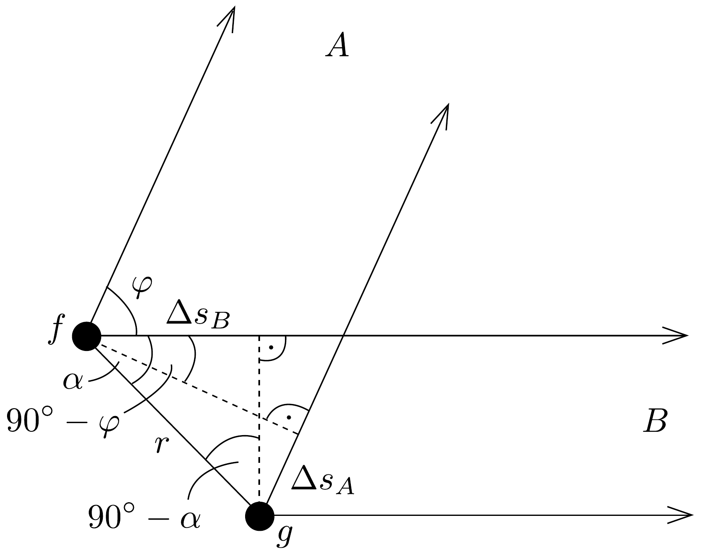
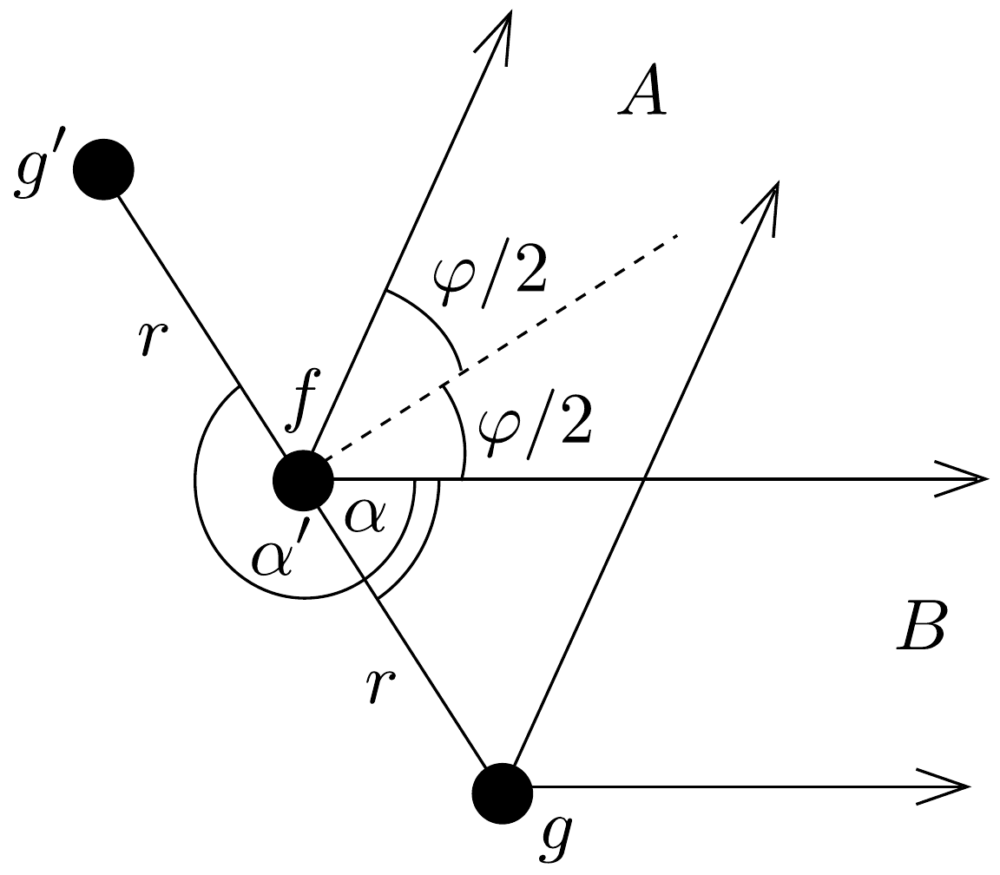

## Megoldás 1

a) A 89. ábra felülnézetben mutatja az $f$ és a $g$ antennát. A két antennából az $A$ város irányába sugárzott jelek útkülönbsége
\[
\Delta s_{A}=r \sin \left[\alpha-\left(90^{\circ}-\varphi\right)\right]=-r \cos (\alpha+\varphi)
\]
A $B$ város irányában sugárzott jelek útkülönbsége $\Delta s_{B}=r \cos \alpha$. Az útkülönb-

ségek lehetnek pozitívak, illetve negatívak is, attól függően, hogy a két város felé vett $\varphi$ irány hegyesszög vagy tompaszög, illetve hogy a két antennát összekötő szakasz $B$ iránnyal vett $\alpha$ szöge hegyesszög vagy tompaszög, sőt lehet akár negatív is, ha a $g$ antenna az ábrán a $B$ felé irányuló egyenes fölé kerül. Fontos, hogy az útkülönbségekből adódó fázisok előjeles mennyiségek.

Az $f$ antenna kezdeti fázisa késsen $\delta$-val a $g$ antenna kezdeti fázisához képest. (Lehetne fordítva is, a szerep lényegtelen, hiszen mindkét város felé ugyanaz a kezdőfázis látszik. Az előjeles útkülönbségek ezt növelik vagy csökkentik.)

Ha a $g$ antenna az ábrának megfelelően messzebb helyezkedik el az $A$ várostól, akkor a kezdőfázist az útkülönbség megnöveli $\left(\alpha+\varphi>90^{\circ}\right)$, így az $A$ városba érkezó jelek fáziskülönbsége
\[
\Delta \phi_{A}=\delta+\frac{2 \pi}{\lambda} \Delta s_{A}=\delta-\frac{2 \pi}{\lambda} r \cos (\alpha+\varphi) .
\]
A $B$ város esetén fordított a helyzet, $g$ közelebb van, mint $f$, ezért az ebből származó fázis a kezdőfázist lecsökkenti. Ezért a $B$ városba érkező jelek fáziskülönbsége:
\[
\Delta \phi_{B}=\delta-\frac{2 \pi}{\lambda} \Delta s_{B}=\delta-\frac{2 \pi}{\lambda} r \cos \varphi .
\]

Ha a rádióamatőr az $A$ városban lévő lánnyal beszélget, akkor a feladat feltétele szerint
\[
\Delta \phi_{A}=2 k \pi \quad \text { és } \quad \Delta \phi_{B}=(2 n+1) \pi,
\]
ahol $k$ és $n$ egész számok. Kivonva (85-1)-ból (85-2)-t és felhasználva (85-3)-at:
\[
r=\frac{k-n-\frac{1}{2}}{-\cos (\alpha+\varphi)+\cos \alpha} \lambda .
\]

Az $r$ távolságot kell minimalizálnunk. Az elrendezéstől független számláló abszolút értéke akkor minimális, ha értéke $1 / 2$, azaz ha $k=n$ vagy $k=n+1$. Ahhoz, hogy a nevező abszolút értékének maximumát megtaláljuk, előbb alakítsuk át. Kihasználva a $\sin \varphi=2 \sin \frac{\varphi}{2} \cos \frac{\varphi}{2}$ és a $\cos \varphi=1-2 \sin ^{2} \frac{\varphi}{2}$ azonosságokat:
\[
-\cos (\alpha+\varphi)+\cos \alpha=2 \sin \frac{\varphi}{2} \sin \left(\alpha+\frac{\varphi}{2}\right) .
\]

Mivel a két város elhelyezkedése adott, ezért $\varphi$ állandó, így a kifejezés abszolút értéke akkor lesz maximális, ha $\sin (\alpha+\varphi / 2)= \pm 1$, azaz ha
\[
\alpha=\frac{\pi}{2}-\frac{\varphi}{2}+\ell \pi,
\]
$\operatorname{ahol} \ell=1,2$ (nagyobb $\ell$-re már túlvagyunk egy teljes fordulaton). Mivel $\varphi / 2+\alpha=$ $\pi / 2$ vagy $3 \pi / 2$, ezért a két antenna által meghatározott egyenes merőleges a két város közti szög felezőjére, ahogy a 90, ábrán látszik. A $g^{\prime}$ antenna helyzete az $\alpha^{\prime}=3 \pi / 2-\varphi / 2$ szöghöz tartozó helyzet. Vagyis ilyen az antennapár irányultsága. A legkisebb távolságuk pedig:
\[
r_{\min }=\frac{\lambda}{2} \cdot \frac{1}{2 \sin \frac{\varphi}{2}}
\]

A minimális távolsággal, valamint (85-1) és (85-3) segítségével
\[
2 k \pi=\delta-\frac{2 \pi}{\lambda} \frac{\lambda}{4 \sin \frac{\varphi}{2}} \cos (\alpha+\varphi) .
\]
Felhasználva $\alpha$ lehetséges értékeit, $\cos (\alpha+\varphi)= \pm \sin \frac{\varphi}{2}$. Ezzel a kezdeti fáziskülönbség:
\[
\delta=2 k \pi \pm \frac{\pi}{2} .
\]

Mivel $0 \leq \delta \leq 2 \pi$, ezért $\delta=\pi / 2$. Ha a $\delta$ fáziskülönbséget $\pi / 2$-ről $3 \pi / 2$-re változtatjuk, akkor mindkét városba érkezó jelek fáziskülönbsége $\pi$-vel változik. Ekkor a rádióamatőr a $B$ városban lévő lánnyal tud beszélgetni és az $A$ városban levő lány nem hallja.
b) A jel hullámhossza $\lambda=c / f=11,1 \mathrm{~m}$, ahol $c=3 \cdot 10^{8} \mathrm{~m} / \mathrm{s}$ a fénysebesség. A két város iránya közötti szög $\varphi=157^{\circ}-72^{\circ}=85^{\circ}$ (mindkét megadott város az északi iránytól jobbra helyezkedik el). Így a numerikus értékek $\alpha=47,5^{\circ}$, $r_{\text {min }}=4,1 \mathrm{~m}$.
