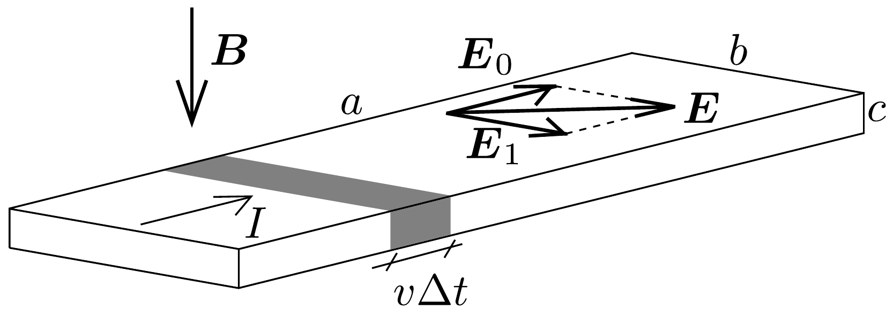
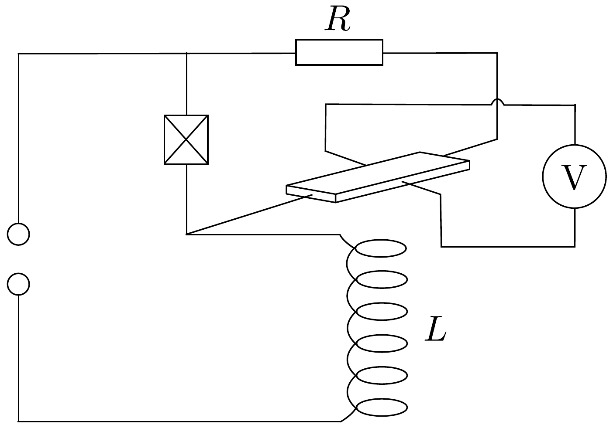
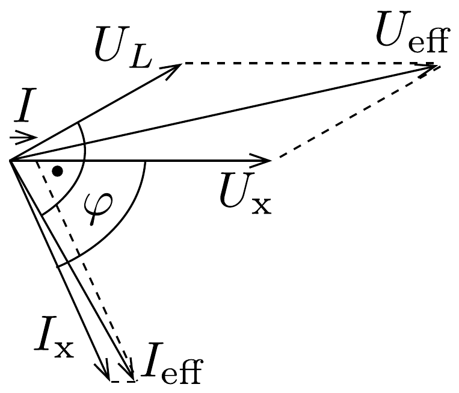

## Megoldás 2

a) Először számítsuk ki az elektronok sebességét a félvezetőben, valamint a mozgásukat létrehozó $E_{0}$ elektromos tér nagyságát. A 91, ábra szerint $\Delta t$ idő alatt az $a$ élre merőleges oldallapon enbcv $\Delta t$ töltés halad át, ahol $n$ az elektronok sürúsége és $v$ a sebessége. Az áramerősség tehát $I=e n b c v$. Innen
\[
v=\frac{I}{e n b c}=25 \mathrm{~m} / \mathrm{s} .
\]

A feladat szövegéből tudjuk, hogy $v=\mu E_{0}$, így
\[
E_{0}=\frac{v}{\mu}=\frac{I}{e n b c \mu}=3,2 \mathrm{~V} / \mathrm{m} .
\]

A mágneses tér jelenléte miatt a félvezetőben mozgó elektronokra sebességükre merőlegesen, azaz a $b$ éllel párhuzamosan hat a Lorentz-erő. Ennek hatására a $b$ élre merőleges két oldallap annyira töltődik fel, hogy a feltöltődés által létrehozott $E_{1}$ elektromos tér a félvezetőben semlegesítse a Lorentz-erő hatását (91. ábra). (A jelenség valamelyest hasonlít ahhoz, mint amikor egy vezetőt külső elektromos térbe helyezünk.) Tehát $e E_{1}=e v B$. A (85-4) kifejezés felhasználásával
\[
E_{1}=v B=\frac{B I}{e n b c}=2,5 \mathrm{~V} / \mathrm{m} .
\]

Az eredő elektromos tér nagysága $E=\sqrt{E_{0}^{2}+E_{1}^{2}}=4,06 \mathrm{~V} / \mathrm{m}$, a tér iránya az $a$ éllel $\varphi=\operatorname{arctg}\left(E_{1} / E_{0}\right) \approx 38^{\circ}$-os szöget zár be.
b) A keresett feszültség a két pont között
\[
U=E_{1} b=\frac{B I}{e n c}=25 \mathrm{mV} .
\]
- c) A b) eredményét felhasználva
\[
U(t)=\frac{B_{0} I_{0}}{e n c} \sin \omega t \cdot \sin (\omega t+\varphi) .
\]
Az egyenfeszültségú rész az időátlagolt érték ( $U(t)$ mekkora feszültségérték körül oszcillál). Trigonometriai átalakítások segítségével ezt a következő alakra hozhatjuk:
\[
U(t)=\frac{B_{0} I_{0}}{e n c} \sin ^{2} \omega t \cdot \cos \varphi-\frac{B_{0} I_{0}}{e n c} \sin 2 \omega t \cdot \sin \varphi .
\]
Látható, hogy a második tag egy $2 \omega$ körfrekvenciájú szinuszos váltakozó feszültség, amelynek nincs egyenfeszültség komponense.
Az elsớ tag egy $\sin ^{2} \omega t$ szerint változó feszültség. Mivel $\sin ^{2} \omega t$ átlagos értéke $1 / 2$, ezért az átlagos egyenfeszültség
\[
\langle U\rangle=\frac{B_{0} I_{0} \cos \varphi}{2 e n c} .
\]
d) A keresett áramkör egy lehetséges megvalósítása a 92. ábrán látható. A félvezető rúd a tekercs mágneses terében van, a vizsgálandó készüléket az x-szel jelölt doboz ábrázolja.

Tegyük fel, hogy az készüléken átfolyó áram és a rajta esó feszültség között $\varphi$ fáziskülönbség van. A készüléken folyjon $I_{\mathrm{x}}$, a tekercsen $I_{\text {eff }}$ és a félvezetőn $I$ effektív értékú váltakozó áram. A feszültségek effektív értékei a készüléken, a tekercsen, az $R$ ellenálláson és az $R_{1}$ ellenállású félvezetőn rendre $U_{\mathrm{x}}, U_{L}, R I$ és $R_{1} I$. A feszültségforrás feszültsége $U_{\text {eff }}$.
A készülék hatásos teljesítménye:
\[
P_{\mathrm{x}}=U_{\mathrm{x}} I_{\mathrm{x}} \cos \varphi .
\]
Az $R$ ellenálláson és a félvezetőn esó́ feszültség fázisban van a készüléken eső feszültséggel, ezért
\[
U_{\mathrm{x}}=R I+R_{1} I \rightarrow I=\frac{U_{\mathrm{x}}}{R+R_{1}} .
\]

Ha $R$-et elég nagynak választjuk, akkor $I \ll I_{\text {eff }}$, így $I_{\mathrm{x}} \approx I_{\text {eff }}$. Mivel esetünkben a tekercs által létrehozott mágneses indukció és a tekercs árama fázisban van, ezért a mágneses indukció és a félvezetőn átfolyó áram között jó közelítéssel $\varphi$ a fáziskülönbség, hiszen $U_{\mathrm{x}}$ és $I$ között nincs fáziskülönbség (lásd a 93. ábrát). A voltméró által mért feszültség (85-5) szerint, felhasználva, hogy szinuszos változás esetén az effektív érték az amplitúdó $\sqrt{2}$-ed része, valamint, hogy $R_{1} \ll R$
\[
\langle U\rangle=\frac{B_{\mathrm{eff}} \sqrt{2} \cdot I \sqrt{2} \cos \varphi}{2 e n c}=\frac{B_{\mathrm{eff}} U_{\mathrm{x}} \cos \varphi}{e n c R} .
\]
A tekercs mágneses tere kalibrálható, azaz a mágneses indukció és a tekercsen átfolyó áram közötti $C$ arányossági tényező megmérhető: $B_{\text {eff }}=C \cdot I_{\text {eff }}$. Ezt behelyettesítve:
\[
\langle U\rangle=\frac{C I_{\mathrm{eff}} U_{x} \cos \varphi}{e n c R},
\]
amiből látható, hogy a hatásos teljesítmény arányos a voltméró által mért egyenfeszültséggel:
\[
P=\frac{e n c R}{C}\langle U\rangle .
\]
A voltmérőt ismert teljesítménnyel kalibrálva meghatározhatjuk a készülék teljesítményét. Másik lehetőség, hogy az en szorzatot egy másik méréssel határozzuk meg, amiben a félvezetőn ismert áramot hajtunk át és ismert mágneses teret alkalmazunk.
