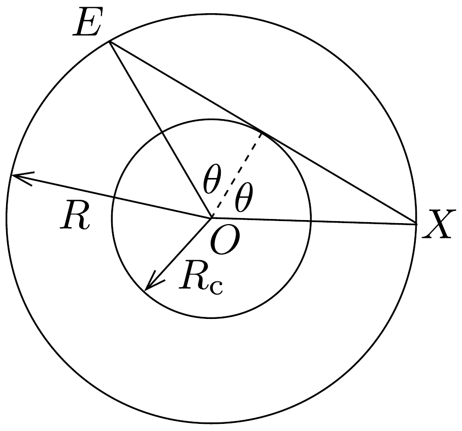
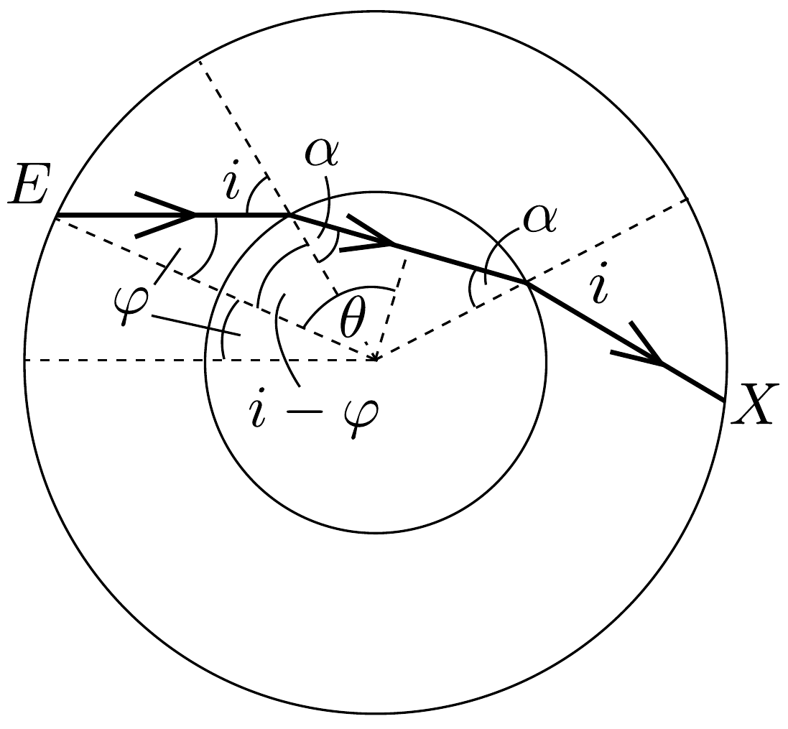
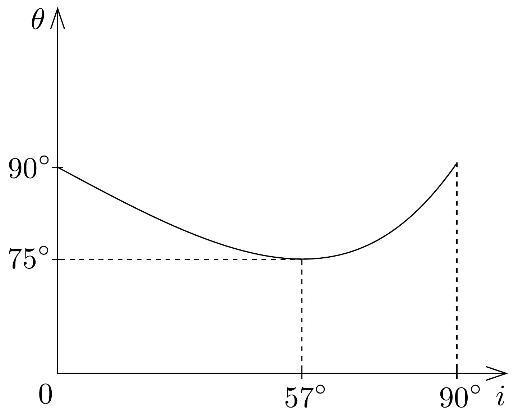
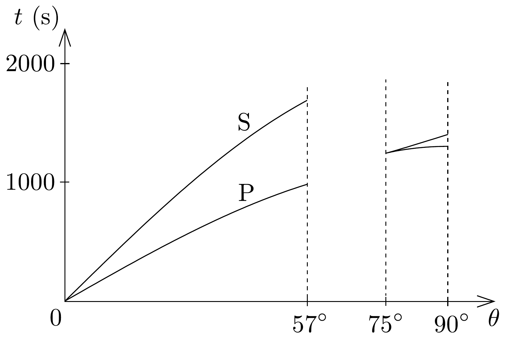
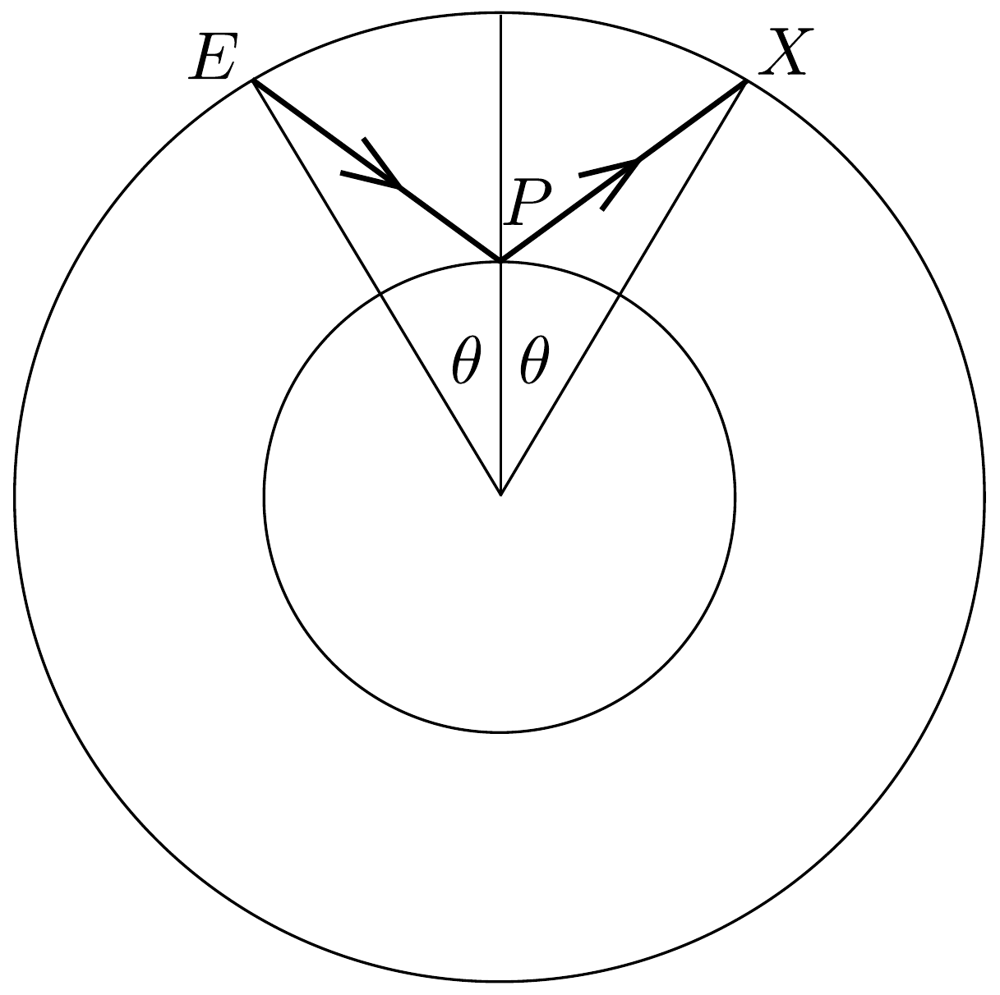

## Megoldás 2

a) A 102. ábrán látható $E$ és az $X$ pontok távolsága $d=2 R \sin \theta$,

- 102. ábra.

az egyenesvonalú terjedés ideje tehát
\[
t=\frac{d}{v}=\frac{2 R \sin \theta}{v},
\]
ahol $v$ a hullám típusától függően vagy $v_{\mathrm{P}}$, vagy pedig $v_{\mathrm{S}}$. A fenti összefüggés csak akkor érvényes, ha a hullám végig a köpenyben terjed, tehát a Föld középpontjától mért legkisebb távolsága is legalább $R_{\mathrm{c}}$ :
\[
R \cos \theta \geq R_{\mathrm{c}},
\]
vagyis
\[
\theta \leq \arccos \frac{R_{\mathrm{c}}}{R} .
\]
b) A köpeny és a mag határfelületén a longitudinális hullám megtörik, éppen

103. ábra.
úgy, mint a fény egy
\[
n=\frac{v_{\mathrm{P}}}{v_{\mathrm{cP}}}>1
\]
törésmutatójú anyag határán. Az irányváltozás szöge az optikából ismert Snellius-Descartes-törvényből számolható (lásd a 103, ábrát):
\[
\frac{\sin i}{\sin \alpha}=n, \quad \alpha=\arcsin \left(\frac{\sin i}{n}\right),
\]
az $i$ beesési szöghöz tartozó $\theta$ szög pedig
\[
\theta=\left(90^{\circ}-\alpha\right)+(i-\varphi) .
\]
Mivel
\[
\frac{\sin \varphi}{\sin \left(180^{\circ}-i\right)}=\frac{R_{\mathrm{c}}}{R},
\]

így
\[
\theta=90^{\circ}+i-\arcsin \left(\frac{R_{\mathrm{c}}}{R} \sin i\right)-\arcsin \left(\frac{\sin i}{n}\right) .
\]
c) A megadott számadatok mellett $i$ és $\theta$ kapcsolatát a 104. ábrán látható függvény adja meg (pl. 10°-onként kiszámítva meghatározható). A fenti függvény minimuma $\theta_{\text {min }} \approx 75^{\circ}$. Viszont az a) rész alapján tudjuk, hogy a hullám csak $\theta>\arccos \left(R_{\mathrm{c}} / R\right) \approx 57^{\circ}$ esetén léphet ki a köpenyből, ezért a $\theta \approx 57^{\circ}$ és a $\theta \approx 75^{\circ}$ közötti értékeknek megfelelő $X$ helyekre egyáltalán nem jut el szeizmikus hullám.

A terjedési idő a $0<\theta<\arccos \left(R_{\mathrm{c}} / R\right) \approx 57^{\circ}$-os tartományban kétértékú (az a) kérdésnek megfelelően), két különböző amplitúdójú szinuszfüggvény. Az 57° és 75° közötti tartományban nincs értelmezve a függvény. A $\theta>75^{\circ}$ esetén pedig csak a P típusú hullámnak megfelelő ág folytatható, ez azonban maga is kétértékú, hiszen a $\theta(i)$ függvény grafikonjáról leolvasható, hogy ezen $\theta$ értékekhez kétféle $i$, tehát kétféle - és általában eltéró terjedési idejú - pálya tartozik. $\operatorname{A} t(\theta)$ függvény grafikonját numerikusan lehet elkészíteni (105. ábra).
d) P és S hullám csak a $0<\theta<57^{\circ}$-es tartományban érkezhet el a megfigyelőhöz. A beérkezés időkülönbsége
\[
t=2 R \sin \theta \cdot\left(\frac{1}{v_{\mathrm{S}}}-\frac{1}{v_{\mathrm{P}}}\right),
\]
ahonnan a numerikus adatok felhasználásával $\theta=8,92^{\circ}$ adódik.
$e$ ) További hullámok a magköpeny határfelületről visszaverődő hullámok lehetnek. Ezek $2 \cdot E P$ távolságot tesznek meg (lásd a 106. ábrát), amelynek nagysága a koszinusztétel értelmében
\[
s=2 \sqrt{R^{2}+R_{\mathrm{c}}^{2}-2 R R_{\mathrm{c}} \cos \theta}=5980 \mathrm{~km} .
\]

Ennek a távolságnak
\[
t^{\prime}=s\left(\frac{1}{v_{\mathrm{S}}}-\frac{1}{v_{\mathrm{P}}}\right)
\]
időkülönbség felel meg, és ez valóban 6 perc és 37 másodperccel egyenlő.
