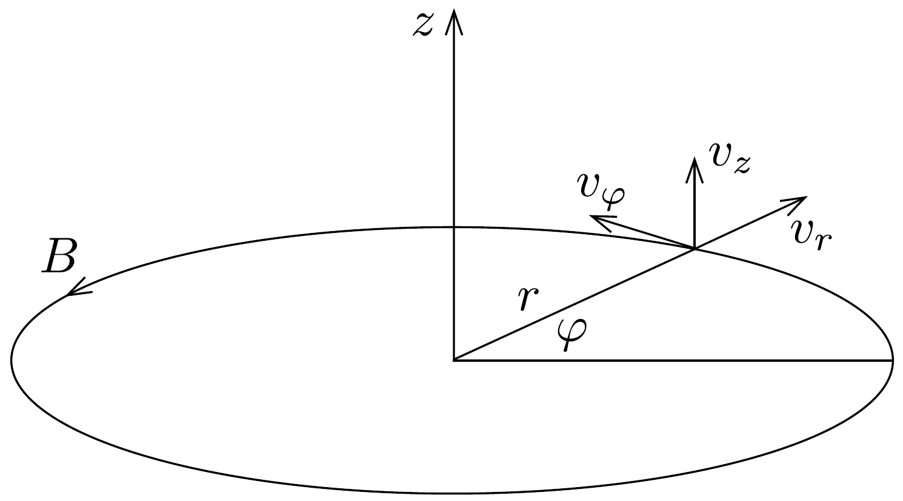
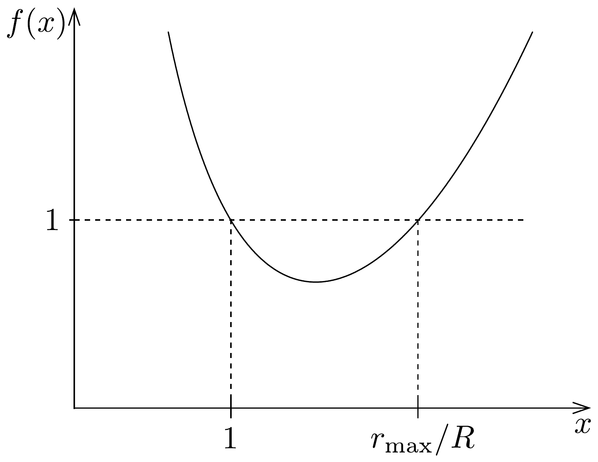

## Megoldás 2

$a$ ) A $V_{0}$ gyorsítófeszültség hatására az $e$ töltésú, $m$ tömegú elektronok $v_{0}$ sebességre tesznek szert. Ennek a sebességnek a nagyságát a munkatételből kaphatjuk meg:
\[
\frac{m}{2} v_{0}^{2}=e V_{0},
\]
ahonnan
\[
v_{0}=\sqrt{\frac{2 e V_{0}}{m}}=3,25 \cdot 10^{7} \mathrm{~m} / \mathrm{s} .
\]
(Ez a sebesség sokkal kisebb, mint a fénysebesség, jogosan számoltunk tehát a klasszikus mechanika energiaképletével. Relativisztikus hatásokat csak sokkal nagyobb gyorsítófeszültségek esetén kellene figyelembe vennünk.) A $v_{0}$ sebességgel $R$ sugarú körpályán keringő elektron mozgásegyenlete:
\[
\frac{m v_{0}^{2}}{R}=e v_{0} B_{1},
\]
innen
\[
B_{1}=\frac{m v_{0}}{e R}=3,69 \cdot 10^{-3} \mathrm{~T} .
\]
b) A mágneses térben körpályán mozgó elektronok szögsebessége a fenti képlet szerint
\[
\omega_{1}=\frac{v_{0}}{R}=\frac{e B_{1}}{m} .
\]
Bontsuk fel a $P$ pontból majdnem párhuzamosan induló elektronok sebességét egy $\boldsymbol{B}$-vel párhuzamos $v_{\|}$és egy arra meróleges $v_{\perp}$ összetevőre. Az $\boldsymbol{F}=-e(\boldsymbol{v} \times \boldsymbol{B})$ Lorentz-eró a sebességnek csak a $\boldsymbol{B}$-re merőleges komponensét változtatja meg. $\boldsymbol{B}$-re meróleges síkban a mozgás egy
\[
\omega=\frac{e B}{m}
\]
szögsebességú körmozgás, míg a sebesség $\boldsymbol{B}$-vel párhuzamos összetevője
\[
v_{\|} \approx v_{\| 0} \approx v_{0} \cos \alpha_{0} \approx v_{0}
\]
valamennyi elektronra azonos nagyságú, $\omega_{1}$, szögsebességgel változó irányú vektor. Ha azt akarjuk elérni, hogy az elektronnyaláb a $\boldsymbol{B}$-vel párhuzamos irányban egy negyedkört megtéve fókuszálódjék, vagyis ezalatt valamennyi elektron egy teljes kört tegyen meg a $\boldsymbol{B}$-re merőleges irányban, akkor az $\omega=4 \omega_{1}$ feltételt kell biztosítanunk. Ez
\[
B=4 B_{1}=1,48 \cdot 10^{-2} \mathrm{~T}
\]
esetén teljesül.
c) A toroid belsejében a mágneses eróvonalak kör alakúak, a körök középpontja a toroid tekercs szimmetriatengelyére ( $z$ tengelyre) esik. A feladat szimmetriája azt sugallja, hogy célszerú a $z$ tengelyre merőleges síkban $r$ és $\varphi$ polárkoordinátákat használnunk (lásd a 114. ábrát), és az előforduló vektorokat (sebesség,
mágneses indukció, Lorentz-erő́) is ilyen irányú összetevőkre felbontanunk. Mivel az elektronnyaláb széttartása kicsiny, elegendő egyetlen elektron pályáját vizsgálnunk, egy olyanét, amelyik $R$ sugárnál $v_{0}$ kezdősebességgel érintő irányban lép be a tekercsbe.

Állandó mágneses térben a mozgási energia megmaradó mennyiség:
\[
E=\frac{m}{2}\left(v_{r}^{2}+v_{\varphi}^{2}+v_{z}^{2}\right)=\frac{m}{2} v_{0}^{2} .
\]
Az is igaz továbbá, hogy a Lorentz-erónek nincsen $\varphi$ irányú összetevője (hiszen az erő merőleges $\boldsymbol{B}$-re), és emiatt forgatónyomatéka sincsen a $z$ tengelyre vonatkoztatva. Következésképpen az elektronnak a $z$ tengely körüli perdülete (impulzusnyomatéka) időben állandó, megmaradó mennyiség:
\[
m v_{\varphi} r=m v_{0} R, \Rightarrow v_{\varphi}=v_{0} \frac{R}{r} .
\]
Írjuk fel még az elektron $z$ tengelyirányú mozgásegyenletét! Mivel a Lorentz-erő megfelelő komponense:
\[
F_{z}=-e B v_{r}
\]
(a negatív előjel az elektron negatív töltésére utal), a mozgásegyenlet:
\[
\frac{\Delta v_{z}}{\Delta t}=-\frac{e B}{m} \cdot \frac{\Delta r}{\Delta t} .
\]

Mivel $B$ időben állandó, a fenti egyenlet azt fejezi ki, hogy $v_{z}$ megváltozása pillanatról pillanatra arányos az $r$ koordináta megváltozásával, és ez nem csak kicsiny $\Delta t$, hanem véges nagyságú időtartamokra is igaz. Figyelembe véve, hogy kezdetben $v_{z}(t=0)=0$ és $r(t=0)=R$, később fenn kell álljon, hogy
\[
v_{z}=-\frac{e B}{m}(r-R) .
\]

Vizsgáljuk meg, milyen határok között mozoghatnak az elektronok sugárirányban! Az $r$ irányú mozgásban a fordulópontokat nyilvánvalóan az jellemzi, hogy
$v_{r}=0$. Az egyik ilyen fordulópont a $P$ pont, itt $r=R, v_{\varphi}=v_{0}$ és $v_{r}=v_{z}=0$. Kérdés, hogy vannak-e további fordulópontok.

Helyettesítsük be $v_{\varphi}$ és $v_{z}$ fentebb kapott kifejezéseit az energiamegmaradást kifejező összefüggésbe, és $v_{r}$ helyébe írjunk nullát. Azt kapjuk, hogy
\[
\left(\frac{R}{r}\right)^{2}+A^{2}\left(\frac{r}{R}-1\right)^{2}=1,
\]
ahol $A=\frac{e B R}{m v_{0}}=$ állandó. A fenti egyenlet gyökei megadják azokat az $r$ értékeket, ahol az elektron sugárirányú sebessége előjelet vált, vagyis a sugárirányú mozgás visszafordul. Az egyik ilyen hely a már ismert: $r=R$. Ábrázoljuk a fenti egyenlet $f(x)=1 / x^{2}+A^{2}(x-1)^{2}$ bal oldalát az $x=r / R$ változó függvényében (lásd a 115. ábrát), és nézzük meg, hogy hol vesz fel ez a függvény 1-es értéket! Az ábráról leolvashatjuk, hogy $r=R$ mellett még egy ilyen hely (még egy sugár) létezik: $r=r_{\text {max }}>R$. Az elektron tehát sugárirányban két véges érték között mozog, ilyen irányban nem léphet ki a tekercsből. (Természetesen feltételeztük, hogy $r_{\text {max }}$ még a tekercs belső pontjára utal.)

Mivel a mozgás során mindvégig $r \geq R$ ebből $v_{z} \leq 0$ következik, tehát a mozgás a negatív $z$ tengely irányába indul meg.
