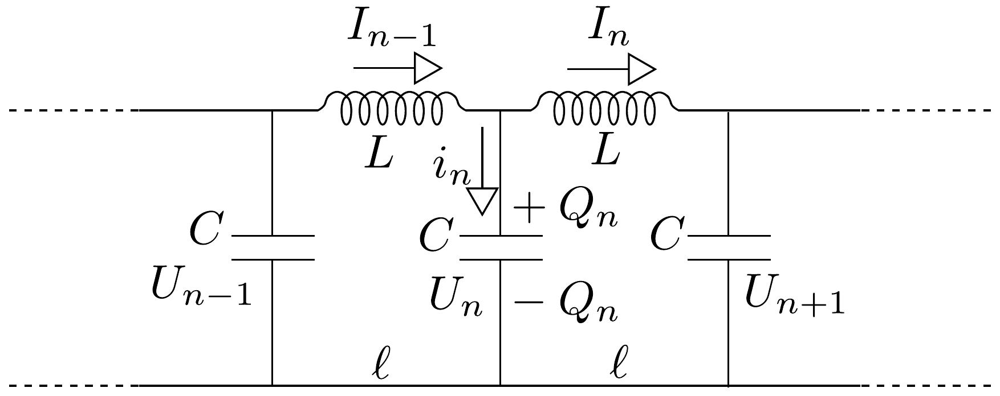
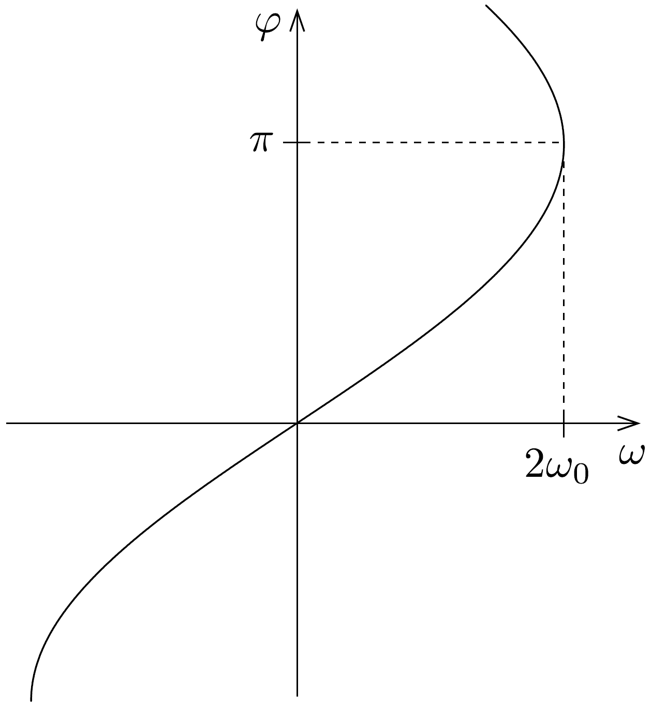

## Megoldás 3

a) Válasszunk ki önkényesen egy „kezdőpontot” a lánc mentén, és jelöljük az innen számított $n$-edik kondenzátor töltését $Q_{n}$-nel, feszültségét $U_{n}$-nel, az $n$-edik tekercsen átfolyó áramot pedig $I_{n}$-nel (lásd a 116. ábrát).

A kondenzátor töltése:
\[
Q_{n}=C U_{n},
\]
a kondenzátor „feltöltődési árama” pedig
\[
i_{n}=\frac{\Delta Q_{n}}{\Delta t}=C \frac{\Delta U_{n}}{\Delta t} .
\]

A csomóponti törvény értelmében
\[
I_{n-1}-I_{n}=i_{n}
\]

Az $n$-edik tekercsben indukált feszültség meg kell egyezzék a végpontjain mérhetó feszültségek különbségével:
\[
-L \frac{\Delta I_{n}}{\Delta t}=U_{n+1}-U_{n}
\]
és ugyanezt felírhatjuk az $(n-1)$-edik tekercsre is
\[
-L \frac{\Delta I_{n-1}}{\Delta t}=U_{n}-U_{n-1} .
\]
Az előző két egyenletet egymásból kivonva és a csomóponti törvény egyenletébe helyettesítve
\[
L \frac{\Delta i_{n}}{\Delta t}=U_{n+1}+U_{n-1}-2 U_{n}
\]
adódik.
A (87-1) és (87-2) egyenletek (melyek az $U_{n}(t)$ és $i_{n}(t)$ függvényekre vonatkozó differenciálegyenletek) megoldása megadná az $L C$-lánc feszültség- és áramviszonyainak legáltalánosabb leírását. Ezt az általános megoldást azonban - szerencsére - nem kell megkeresnünk, hiszen a feladat szövege megadja, hogy a láncon egy szinuszos hullám fut végig, cellánként $\varphi$ fáziskülönbséggel. Válasszuk a kezdőpontként kijelölt $n=0$ jelzésú kondenzátor váltófeszültségének fázisát $t=0$ pillanatban nullának, és jelöljük a hullám amplitúdóját $U$-val. Ekkor
\[
U_{n}(t)=U \sin (\omega t+n \varphi) .
\]
Ezt a függvényt (87-1)-be helyettesítve a töltőáramra
\[
i_{n}(t)=\omega C U \cos (\omega t+n \varphi),
\]
a megváltozására pedig
\[
L \frac{\Delta i_{n}}{\Delta t}=-\omega^{2} L C U \sin (\omega t+n \varphi)
\]
adódik. (A fentiek számításánál kihasználtuk, hogy az $f(x)=\sin x$ függvény „változási sebessége” $\cos x$, a $\cos x$ függvényé pedig $-\sin x$.)

Helyettesítsük be (87-3)-at és (87-4)-et a (87-2) egyenletbe
\[
-\omega^{2} L C \sin (\omega t+n \varphi)=\sin (\omega t+n \varphi+\varphi)+\sin (\omega t+n \varphi-\varphi)-2 \sin (\omega t+n \varphi),
\]
és alkalmazzuk a jobb oldal első két tagjára a megjegyzésben megadott azonosságot. A közös $\sin (\omega t+n \varphi)$ tényezóvel egyszerúsíthetünk (ezáltal az időfüggés eltúnik az egyenletbő̌l, ami azt mutatja, hogy az minden időpillanatban kielégíthető, tehát a megadott „próbamegoldás” megfelelő), és csupán a $\varphi$ fáziskülönbség és az $\omega$ körfrekvencia között kapunk megszorítást:
\[
-\omega^{2} L C=2 \cos \varphi-2,
\]
ami némi átalakítással
\[
\frac{\omega}{2 \omega_{0}}=\sin \frac{\varphi}{2}
\]
alakra hozható, ahol $\omega_{0}=1 / \sqrt{L C}$ a rezgőkörökre jellemző Thomson-féle körfrekvenciát jelöli. A 117. ábrán felrajzoltuk a keresett függvénykapcsolatot. Látható, hogy az $\omega \leq 2 \omega_{0}$ feltételnek teljesülnie kell; a $2 / \sqrt{L C}$ értéknél nagyobb körfrekvenciájú jelek nem képesek csillapítás nélkül terjedni a láncban.

b) A hullám fázisa egy adott helyen $t_{0}=\varphi / \omega$ idő alatt változik annyit, amennyi két szomszédos kondenzátor között a fáziskülönbség. Ennyi idő alatt a $v$ sebességgel haladó hullámnak éppen $\ell$ utat kell megtennie: $\ell=v t_{0}$. Ezen két összefüggésből a hullám sebességére
\[
v=\frac{\omega \ell}{\varphi}=2 \ell \omega_{0} \cdot \frac{\sin \varphi / 2}{\varphi}
\]
adódik, amelyet a
\[
v=\frac{\omega \ell}{2 \arcsin \frac{\omega}{2 \omega_{0}}}
\]
alakba is írhatunk.
c) A (87-5) formula azt mutatja, hogy az $L C$-láncban terjedő hullámok sebessége (az azonos fázisú pontok terjedési sebessége, tehát a fázissebesség) általában függ a körfrekvenciától. - Ez a jelenség hasonló ahhoz, hogy az anyagok (üveg, víz stb.) törésmutatója függ a fény frekvenciájától (színétől), és emiatt a különböző frekvenciájú, monokromatikus fénykomponensek különböző sebességgel haladnak át a közegeken. - Ha viszont $\omega \ll \omega_{0}$, akkor a $\sin x \approx x$ és $\arcsin x \approx x$ közelítő összefüggések miatt fennáll, hogy
\[
v \approx \omega_{0} \ell=\frac{\ell}{\sqrt{L C}}=\text { állandó. }
\]
Ez a formula csak a kis frekvenciájú, az $L$ és $C$ elemekből építhető rezgőkör rezgésidejénél sokkal nagyobb periódusidejú hullámokra érvényes.
d) A vizsgált $L C$-lánccal analóg (tehát hasonló módon viselkedő) mechanikai rendszer például egy „végtelen hosszú", lineáris lánc, amely egyforma erósségú rugókkal összekapcsolt, azonos tömegú tömegpontokból épül fel. Az analógiát a rendszer mozgásegyenleteinek felírásával és az $L C$-lánc megfelelő egyenleteivel való összehasonlításával igazolhatjuk.

Jelöljük az $n$-edik tömegpont elmozdulását $x_{n}$-nel, az impulzusát pedig $p_{n}$-nel. (Feltételezzük, hogy a részecskék csak a lánc mentén tudnak elmozdulni.) A rugók megnyúlásából származó eredő erő:
\[
F_{n}=k\left(x_{n+1}-x_{n}\right)-k\left(x_{n}-x_{n-1}\right)=k\left(x_{n+1}+x_{n-1}-2 x_{n}\right),
\]
tehát a mozgásegyenletek
\[
\begin{gathered}
\frac{\Delta p_{n}}{\Delta t}=k\left(x_{n+1}+x_{n-1}-2 x_{n}\right), \\
p_{n}=m \cdot \frac{\Delta x_{n}}{\Delta t} .
\end{gathered}
\]

Hasonlítsuk össze ezeket az egyenleteket (87-1)-gyel és (87-2)-vel. Könnyen felismerhetjük az egyenletek alaki azonosságát, ha a változók, illetve a paraméterek között az
\[
\begin{aligned}
x_{n} & \leftrightarrow U_{n}, \\
p_{n} & \leftrightarrow i_{n}, \\
m & \leftrightarrow C, \\
k & \leftrightarrow 1 / L
\end{aligned}
\]
megfeleltetést létesítjük. Az egyenletek alaki azonossága lehetőséget nyújt arra, hogy az $L C$-láncnál talált matematikai megoldást a megfelelő átjelölések után az analóg mechanikai rendszerben terjedő hullámok leírására is felhasználhatjuk. Kiszámíthatjuk például az $\omega$ körfrekvenciájú, rugalmas hullámok terjedési sebességét, és leolvashatjuk, hogy ez a sebesség általában frekvenciafüggő, csupán alacsony frekvenciájú határesetben (amikor a hullámhossz sokkal nagyobb, mint a részecskék, az „atomok” közötti távolság) válik állandóvá. Az analógia segítségével meghatározhatjuk, hogy mi a kapcsolat a longitudinális hullámok terjedési sebessége, valamint $m, k$ és $\ell$ között. Ez utóbbiak kapcsolatba hozhatók a modellezni kívánt anyag sürúségével és Young-moduluszával.

Természetesen az itt leírt mechanikai modellen kívül sok más mechanikai rendszer kapcsolatba hozható a vizsgált $L C$-lánccal (például torziós rugókkal összekapcsolt korongok végtelen lánca, vagy transzverzális rezgésekre képes tömegpontok lineáris lánca), sốt még egy adott modell esetén is többféle módon „oszthatjuk ki a szerepeket", különbözőképpen feleltethetjük meg egymásnak az elektromos és a mechanikai mennyiségeket.

\title{
