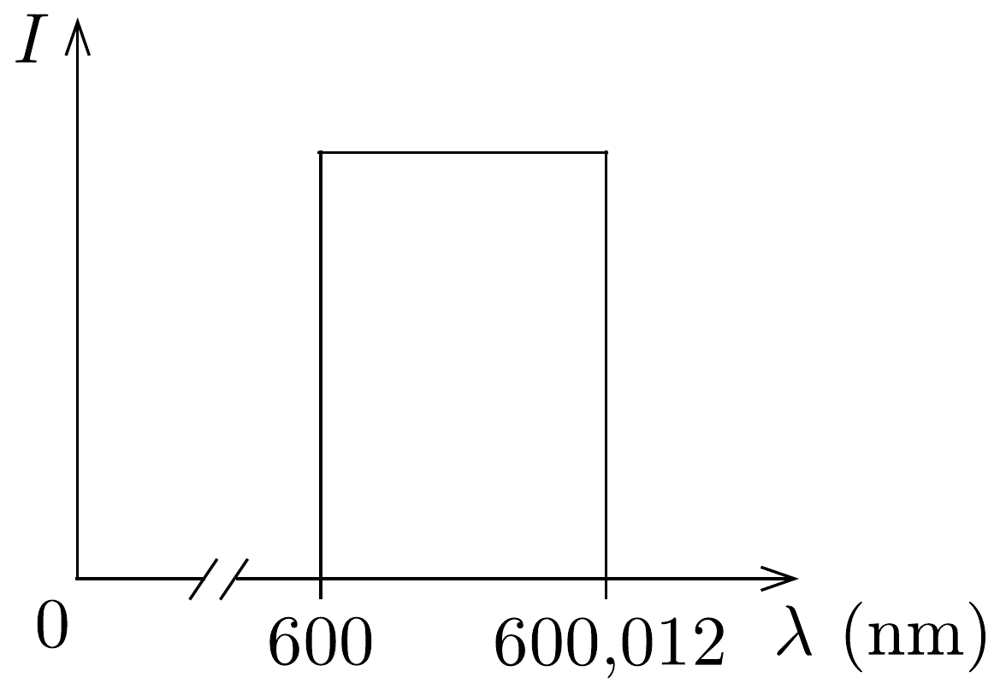
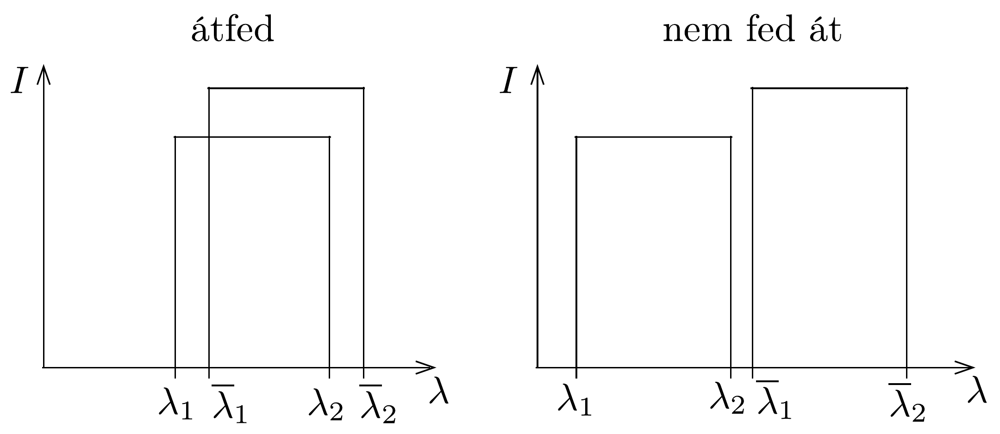

## Megoldás 1

1.1.A. A fény hullámhossza és frekvenciája között fennálló $f=c / \lambda$ összefüggéssel ( $c=3 \cdot 10^{8} \mathrm{~m} / \mathrm{s}$ ) az álló részecskék gerjesztési frekvenciájára $f_{1}=5 \cdot 10^{14} \mathrm{~Hz}$ adódik. A $v \ll c$ sebességgel mozgó részecskék is $f_{1}$ frekvenciát kell érzékeljenek, hogy a gerjesztés létrejöjjön. Az ehhez szükséges lézerfény $f$ frekvenciáját a feladat szerint a klasszikus Doppler-eltolódás összefüggésével kapjuk:
\[
f_{1}=f\left(1+\frac{v}{c}\right) \rightarrow f=\frac{f_{1}}{1+\frac{v}{c}} \approx f_{1}\left(1-\frac{v}{c}\right) .
\]
A legnagyobb sebesség a frekvenciatartomány alsó határát adja meg. Tehát akkor tudjuk valamennyi iont gerjeszteni, ha a lézer frekvenciája a
\[
\Delta f=f_{1} \frac{v_{2}}{c}=10^{10} \mathrm{~Hz},
\]
hullámhossza pedig a
\[
\Delta \lambda=c\left(\frac{1}{f}-\frac{1}{f_{1}}\right)=\frac{c \Delta f}{f \cdot f_{1}}=\frac{c \Delta f}{f_{1}^{2}}\left(1+\frac{v_{2}}{c}\right) \approx \frac{c \Delta f}{f_{1}^{2}}=1,2 \cdot 10^{-2} \mathrm{~nm}
\]
intervallumban változtatható. Mivel az ionok sebesség szerinti eloszlása egyenletes, az általuk kibocsátott fény intenzitása (a fotonok száma) is konstans függvény lesz a fentebb kiszámított hullámhossztartományban (123. ábra).

1.1.B. A relativisztikus képlet szerint
\[
f_{1}=f \sqrt{\frac{1+v / c}{1-v / c}} .
\]
Ismét alkalmazhatjuk az $(1+\varepsilon)^{n} \approx 1+n \varepsilon(\varepsilon \ll 1)$ közelítést:
\[
f_{1}=\frac{1+v / c}{\sqrt{1-v^{2} / c^{2}}} \approx\left(1+\frac{v}{c}\right)\left(1+\frac{v^{2}}{2 c^{2}}\right) .
\]

Az eredmény első tényezője éppen a klasszikus Doppler-képletnek felel meg, az elkövetett (relatív) hiba tehát $\frac{v^{2}}{2 c^{2}}=2 \cdot 10^{-10}$ nagyságrendũ.
1.2. Egy $e$ töltésú, $m$ tömegú részecske $v$ nagyságú sebessége $U$ potenciálkülönbség hatására a munkatétel szerint $v^{\prime}=\sqrt{v^{2}+2 e U / m}$ értékre nő. A kezdeti sebességeloszlás szélső pontjainak megfelelő $v_{1}=0$, illetve $v_{2}=6000 \mathrm{~m} / \mathrm{s}$ sebességgel mozgó részecskék sebessége a gyorsítás után $v_{1}^{\prime}=\sqrt{2 e U / m}$, illetve $v_{2}^{\prime}=\sqrt{v_{2}^{2}+2 e U / m}$. A sebességeloszlás szélessége tehát
\[
v_{2}^{\prime}-v_{1}^{\prime}=\sqrt{v_{2}^{2}+2 e U / m}-\sqrt{2 e U / m}
\]
értékre változik. Ha $2 e U / m \ll v_{2}^{2}$, akkor a sebességeloszlás szélessége gyakorlatilag nem változik, $v_{2}$ a különbség. Ha $v_{2}^{2} \ll 2 e U / m$, a sebességeloszlás szélessége zérus. A fenti kifejezés $2 e U / m$ függvényében szigorúan monoton csökkenő, tehát a gyorsítás utáni sebességkülönbség kisebb lesz, azaz a sebességeloszlás összeszúkül.

Másik lehetőség például, hogy a fenti egyenletet megszorozzuk a két négyzetgyökös tag összegével. Ekkor $\left(v_{2}^{\prime}+v_{1}^{\prime}\right)\left(v_{2}^{\prime}-v_{1}^{\prime}\right)=v_{2}^{2}$ adódik, ahonnan $v_{2}^{\prime}-v_{1}^{\prime}=$ $v_{2}^{2} /\left(v_{2}^{\prime}+v_{1}^{\prime}\right)$. Mivel $v_{2}^{\prime}+v_{1}^{\prime}>v_{2}$, ezért $v_{2}^{\prime}-v_{1}^{\prime}<v_{2}$. Valamint a kezdeti sebességkülönbség $v_{2}$, ezért a sebességeloszlás összeszűkül.
1.3. Ha egy álló iont $\lambda_{1}$ hullámhosszúságú lézerfénnyel lehet gerjeszteni, akkor a különbözó sebességgel mozgó ionok halmaza - az 1.1.A. megoldása szerint - a $\lambda_{1}$ és $\lambda_{2}=\lambda_{1}+12 \cdot 10^{-3} \mathrm{~nm}$ hullámhosszak között hangolható lézerrel gerjeszthető. Hasonlóan a $\bar{\lambda}_{1}$ (nyugalmi) hullámhossznak is egy bizonyos $\left(\bar{\lambda}_{1}, \bar{\lambda}_{2}\right)$ intervallum felel meg. (Mivel $\lambda_{1}$ és $\bar{\lambda}_{1}$ elég közeli hullámhosszak, ezért a $\left.\Delta \bar{\lambda} \approx \Delta \lambda=12 \cdot 10^{-3} \mathrm{~nm}\right)$. A két gerjesztési spektrum akkor fed át egymással, ha a Doppler-eltolódásból adódó $\lambda_{2}-\lambda_{1}$ szélesség nagyobb, mint az ion két különböző kvantumállapotának megfelelő $\bar{\lambda}_{1}-\lambda_{1}$ hullámhossz-különbség (124. ábra). A jelen esetben ez valóban fennáll.

Ha az ionokat elektromos erótérrel gyorsítjuk, akkor sebességük és a Dopplereffektus miatt az óket gerjeszteni képes lézerfény hullámhossza is megváltozik. Jelöljük ezeket a megváltozott hullámhosszakat $\lambda^{\prime}$-vel! A két gerjesztési spektrum átfedése akkor szűnik meg, ha $\bar{\lambda}_{1}^{\prime}>\lambda_{2}^{\prime}$. A Doppler-eltolódás összefüggésével (lásd 1.1.A. feladat elsó egyenletét) a lézer hullámhosszának felső értéke az alacsonyabb energiájú állapotra való gerjesztéshez
\[
\lambda_{2}^{\prime}=\lambda_{1}\left(1+\frac{v_{2}^{\prime}}{c}\right)=\lambda_{1}\left(1+\frac{\sqrt{v_{2}^{2}+2 e U / m}}{c}\right),
\]
a magasabb energiájú állapotra való gerjesztéshez a lézer hullámhosszának alsó értéke pedig
\[
\bar{\lambda}_{1}^{\prime}=\left(\lambda_{1}+10^{-3} \mathrm{~nm}\right)\left(1+\frac{\sqrt{2 e U / m}}{c}\right) \approx \lambda_{1}+10^{-3} \mathrm{~nm}+\lambda_{1} \frac{\sqrt{2 e U / m}}{c} .
\]
Az előbbi egyenletben felhasználtuk, hogy $\lambda_{1} \gg 10^{-3} \mathrm{~nm}$ és $\sqrt{2 e U / m} \ll c$. Az átfedés megszűnésének feltétele
\[
\sqrt{v_{2}^{2}+2 e U / m}-\sqrt{2 e U / m}<\frac{c}{\lambda_{1}} \cdot 10^{-3} \mathrm{~nm} .
\]
Bevezetve az $x=2 e U / m, v_{2}^{2}=a$ és $c \cdot 10^{-3} \mathrm{~nm} / \lambda_{1}=b$ jelöléseket a
\[
\sqrt{a+x}-\sqrt{x}<b
\]
egyenlőtlenséget kapjuk, amelynek megoldása
\[
x>\frac{\left(b^{2}-a\right)^{2}}{4 b^{2}},
\]
azaz $U>160 \mathrm{~V}$. Ekkora gyorsítófeszültség képes a Doppler-kiszélesedés miatt átfedésbe került spektrumvonalakat szétválasztani.
