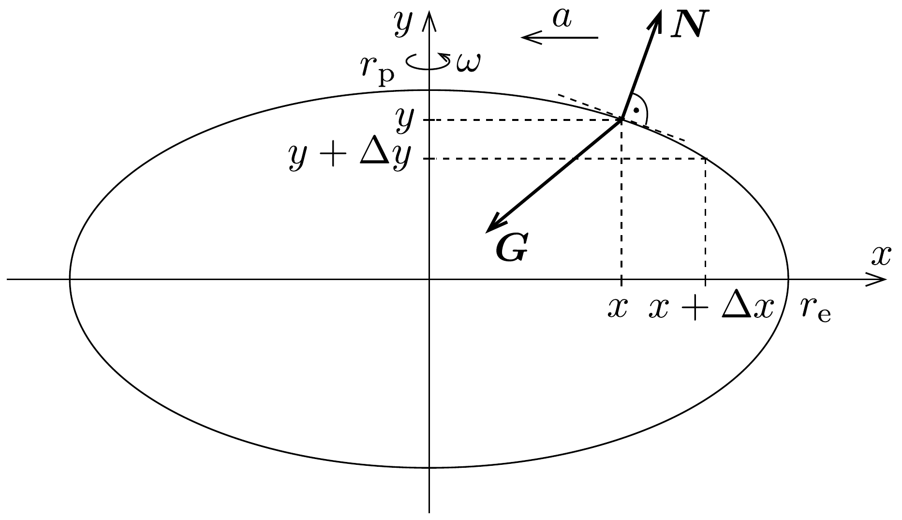

## Megoldás 3

a) A 135. ábrán egy forgó neutroncsillag ellipszis alakú keresztmetszete látható, szándékosan eltorzított arányokkal. Az ellipszis egyenlete
\[
\frac{x^{2}}{r_{\mathrm{e}}^{2}}+\frac{y^{2}}{r_{\mathrm{p}}^{2}}=1 .
\]
Írjuk fel ezt az egyenletet az $(x, y)$ és a hozzá közeli $(x+\Delta x, y+\Delta y)$ koordinátájú pontra, majd vonjuk ki a két egyenletet egymásból. A kicsiny $\Delta x$ és $\Delta y$ mennyiségek négyzetét elhanyagolva az
\[
\frac{x \Delta x}{r_{\mathrm{e}}^{2}}+\frac{y \Delta y}{r_{\mathrm{p}}^{2}}=0
\]
összefüggést kapjuk (nyilván $\Delta y<0$ ).

A csillag felszínén lévő $m$ tömegú anyagdarabkára $a \boldsymbol{G}$ gravitációs erő, valamint a közvetlen közelében lévő anyag által kifejtett $\boldsymbol{N}$ „nyomóerő“ hat. Mivel a csillag csak egy nagyon kicsit lapult, feltételezhetjük, hogy $\boldsymbol{G}$ a csillag középpontja felé mutat és a nagysága a felszín minden pontjában jó közelítéssel ugyanakkora: $G=$ $f m M / r^{2}$, ahol $M$ a csillag tömege, $r$ pedig az átlagos sugara.

Az $\boldsymbol{N}$ vektor iránya könnyen deformálódó (például folyékony halmazállapotú) testeknél merőleges kell legyen a felszínre (pontosabban fogalmazva a felület érintősíkjára), vagyis a 135, ábra jelöléseivel és (90-2)-vel
\[
\frac{N_{x}}{N_{y}}=-\frac{\Delta y}{\Delta x}=\frac{r_{\mathrm{p}}^{2}}{r_{\mathrm{e}}^{2}} \cdot \frac{x}{y} .
\]

A $\boldsymbol{G}$ és az $\boldsymbol{N}$ erő hatására a vizsgált anyagdarabka $a=m \cdot x \cdot \omega^{2}$ centripetális gyorsulású körmozgást végez az $y$ tengely körül. A mozgásegyenlet megfelelő komponensei:
\[
\begin{gathered}
G \cdot \frac{x}{r}-N_{x}=m x \omega^{2}, \\
G \cdot \frac{y}{r}=N_{y} .
\end{gathered}
\]

A fenti egyenletekből az $N_{x} / N_{y}$, arányt kifejezve, és azt a (90-3) egyenlettel összevetve
\[
\frac{\frac{G}{r} x-m \omega^{2} x}{\frac{G}{r} y}=\left(\frac{r_{\mathrm{p}}}{r_{\mathrm{e}}}\right)^{2} \cdot \frac{x}{y}
\]
adódik. Ez az összefüggés a felület minden pontjában teljesül, ha fennáll, hogy
\[
\left(\frac{r_{\mathrm{p}}}{r_{\mathrm{e}}}\right)^{2}=1-\frac{m r \omega^{2}}{G}=1-\frac{r^{3} \omega^{2}}{f M} .
\]
Tehát
\[
\frac{r_{\mathrm{p}}}{r_{\mathrm{e}}}=\sqrt{1-\frac{r^{3} \omega^{2}}{f M}} \approx 1-\frac{r^{3} \omega^{2}}{2 f M},
\]
mivel $r_{\mathrm{p}} \approx r_{\mathrm{e}}$. Ezzel a lapultság
\[
\varepsilon=1-\frac{r_{\mathrm{p}}}{r_{\mathrm{e}}} \approx \frac{r^{3} \omega^{2}}{2 f M}=3,7 \cdot 10^{-4} .
\]
b) A csillagrengés következtében a kéreg $\Theta_{\mathrm{k}}$ tehetetlenségi nyomatéka hirtelen lecsökken valamekkora $\Delta \Theta_{\mathrm{k}}$ értékkel. Nagyon rövid idő alatt a folyékony belső rész nem képes számottevő perdületet átadni a kéregnek, így a kéreg szögsebességének (a perdületmegmaradás törvénye értelmében) meg kell változnia:
\[
\Theta_{\mathrm{k}} \omega_{0}=\left(\Theta_{\mathrm{k}}-\Delta \Theta_{\mathrm{k}}\right) \omega_{1} .
\]

Elegendő hosszú idő után a folyékony belső rész és a kéreg szögsebessége kiegyenlítődik. Mivel a csillag egésze zárt rendszernek tekinthető, a perdületmegmaradás törvénye most is alkalmazható. A folyékony belső rész tehetetlenségi nyomatékát $\Theta_{\mathrm{f}}$-fel jelölve
\[
\left(\Theta_{k}+\Theta_{f}\right) \omega_{0}=\left(\Theta_{k}-\Delta \Theta_{k}+\Theta_{f}\right) \omega_{2} .
\]

A (90-4) és (90-5) egyenletekből $\Delta \Theta_{\mathrm{k}}$ kiküszöbölésével
\[
\frac{\Theta_{f}}{\Theta_{k}}=\frac{\omega_{0}}{\omega_{1}} \cdot \frac{\omega_{1}-\omega_{2}}{\omega_{2}-\omega_{0}}
\]
Mivel a kéreg és a belső rész sűrúsége azonos, ezért
\[
\frac{\Theta_{\mathrm{f}}}{\Theta_{\mathrm{k}}+\Theta_{\mathrm{f}}}=\frac{\varrho r_{\mathrm{f}}^{3} \cdot r_{\mathrm{f}}^{2}}{\varrho r^{3} \cdot r^{2}} .
\]
Az utolsó két egyenletból
\[
r_{\mathrm{f}}=r \sqrt[5]{\frac{\omega_{0}\left(\omega_{1}-\omega_{2}\right)}{\omega_{2}\left(\omega_{1}-\omega_{0}\right)}} \approx 0,98
\]

\title{
