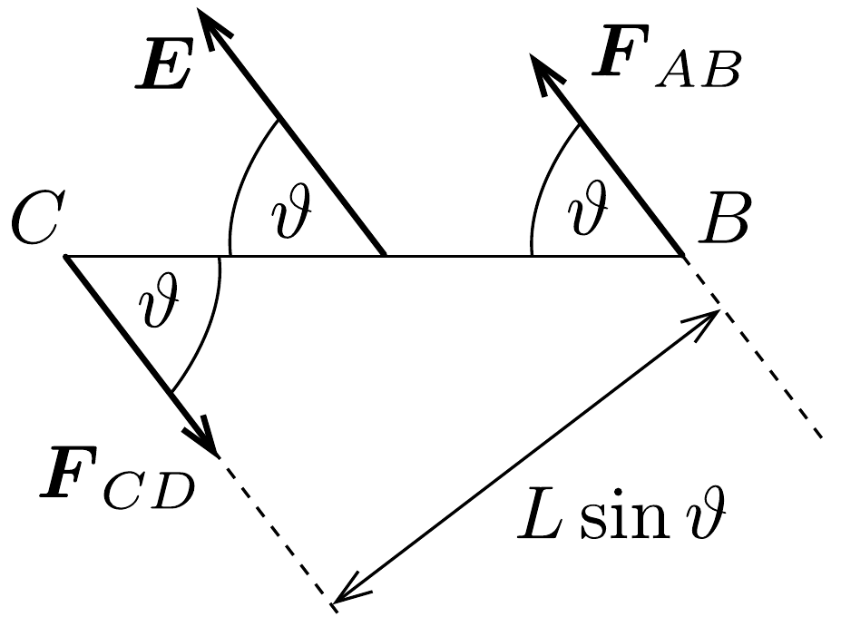
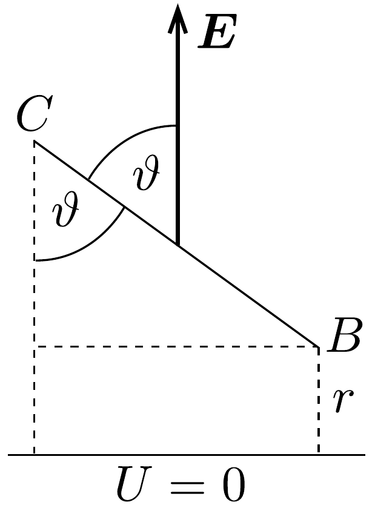

## Megoldás 2

a) Két relativisztikus hatást kell figyelembe venni: a Lorentzkontrakciót és a relativisztikus sebességösszeadást. Abban a koordináta-rendszerben, melyben a golyók nyugalomban vannak, $a_{\text {nyug }}$. távolságuk egymástól így adható meg:
\[
a_{\text {nyug. }}=\frac{a}{\sqrt{1-u^{2} / c^{2}}},
\]
ami a hurok mindegyik oldalára érvényes. A nyugvó megfigyelő az $A B$ oldalon mozgó golyók sebességét $u_{A B}$-nek látja:
\[
u_{A B}=\frac{v+u}{1+u v / c^{2}},
\]
így a golyók közötti távolság a megfigyelő rendszerében:
\[
a_{A B}=\sqrt{1-\frac{u_{A B}^{2}}{c^{2}}} \cdot a_{\text {nyug. }}=\frac{\sqrt{1-v^{2} / c^{2}}}{1+u v / c^{2}} \cdot a .
\]

A $C D$ oldal esetén a számítás a fentiekkel azonos módon történik, azzal a különbséggel, hogy ekkor $u$ előjelet vált $v$-hez képest (a (91-3) egyenletben kivonás
van mind a számlálóban, mind a nevezőben). A megfigyelő a $C D$ oldalon a golyók távolságát
\[
a_{C D}=\frac{\sqrt{1-v^{2} / c^{2}}}{1-u v / c^{2}} a
\]
értékünek látja.
Mivel a keret a megfigyelőhöz képest $A D$, illetve $B C$ irányban nem mozdul el,így:
\[
a_{B C}=a_{D A}=a .
\]
b) A hurokhoz rendelt vonatkoztatási rendszerben bármely oldalra, az oldalt alkotó huzal töltése:
\[
Q_{\mathrm{huzal}}=-\frac{L}{a} q,
\]
hiszen az egyes oldalakon lévő golyók száma $L / a$. Mivel a töltés relativisztikus invariáns, ez az érték bármely oldalra ugyanekkora a megfigyelő rendszerében is. A megfigyeló az $A B$ oldalt $L \sqrt{1-v^{2} / c^{2}}$ hosszúságúnak, a golyók távolságát pedig $a_{A B}$-nek látja, így az $A B$ oldalon lévő golyók töltése a nyugvó vonatkoztatási rendszerben:
\[
Q_{A B, \text { golyók }}=\frac{\sqrt{1-v^{2} / c^{2}} \cdot L}{a_{A B}} \cdot q=\left(1+\frac{u v}{c^{2}}\right) \frac{L}{a} q,
\]
illetve az $A B$ oldalon lévő eredő töltés:
\[
Q_{A B}=Q_{\text {huzal }}+Q_{A B, \text { golyók }}=\frac{u v}{c^{2}} \frac{L}{a} q .
\]

Ugyanezt az eljárást követve, a $C D$ oldal eredő töltése
\[
Q_{C D}=-\frac{u v}{c^{2}} \frac{L}{a} q .
\]
A $B C$ és $D A$ oldalakon lévő golyók töltése:
\[
Q_{B C, \text { golyók }}=Q_{D A, \text { golyók }}=L q / a,
\]
így ezeken az oldalakon az eredő töltés:
\[
Q_{B C}=0 \quad \text { és } \quad Q_{D A}=0 .
\]
Természetesen a rendszer össztöltése is nulla.
- c) Az $A B$ oldalra ható elektrosztatikus eró
\[
\boldsymbol{F}_{A B}=Q_{A B} \boldsymbol{E}=\frac{u v}{c^{2}} \frac{L}{a} q \boldsymbol{E},
\]
míg a $C D$ oldalra ható elektromos erő
\[
\boldsymbol{F}_{C D}=Q_{C D} \boldsymbol{E}=\frac{u v}{c^{2}} \frac{L}{a} q \boldsymbol{E} .
\]

A fenti két erő erőpárt alkot, melynek forgatónyomatéka a 143. ábrának megfelelően
\[
M=\left|\boldsymbol{F}_{A B}\right| L \cdot \sin \Theta=\frac{u v}{c^{2}} \frac{L^{2}}{a} q E \sin \vartheta .
\]
d) Ha az $A B$ és a $C D$ oldalak elektrosztatikus potenciáljai rendre $U_{A B}$ és $U_{C D}$, akkor a $W$ kölcsönhatási energia
\[
W=U_{A B} Q_{A B}+U_{C D} Q_{C D} .
\]

Rögzítsük a potenciál nullértékét $(U=0) E$-re merőlegesen az $A B$ oldaltól tetszőleges $r$ távolságban a 144. ábrán látható módon. Az ekvipotenciális felületek merőlegesek az elektromos térerősség-vektorra, a potenciál növekedési iránya ezzel a vektorral ellentétes, ezért az oldalak potenciálja negatív. Ekkor
\[
W=-E r Q_{A B}-E(r+L \cdot \cos \vartheta) Q_{C D} .
\]
Mivel $Q_{C D}=-Q_{A B}$, így
\[
W=E L Q_{A B} \cos \vartheta=\frac{u v L^{2} q E}{c^{2} a} \cos \vartheta .
\]

Más módon is választ adhatunk a kérdésre. A (91-4) egyenletből a kerethez rendelhetó elektromos dipólmomentum leolvasható az $\boldsymbol{M}=\boldsymbol{p} \times \boldsymbol{E}$ összefüggés alapján:
\[
p=\frac{u v}{c^{2}} \frac{L^{2}}{a} q .
\]
A 143. ábrán a forgatónyomaték-vektor a papír síkjából kifelé mutat, és az elektromos térerősségvektor adott iránya miatt $\boldsymbol{p}$ a $C$-től a $B$ felé mutat ( $A B$ pozitív, $C D$ negatív töltésú). Egy $\boldsymbol{p}$ dipolmomentumú dipól elektrosztatikus energiája $\boldsymbol{E}$ elektromos térben
\[
W=-\boldsymbol{p} \boldsymbol{E}=-p E \cos \left(180^{\circ}-\vartheta\right)=p E \cos \vartheta=\frac{u v L^{2} q E}{c^{2} a} \cos \vartheta .
\]
