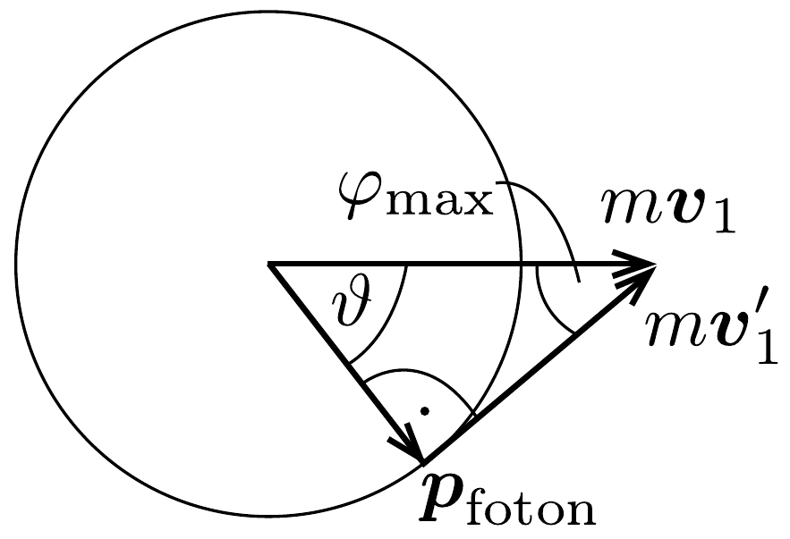

## Megoldás 3

a) A kollimátort elhagyó atomok átlagos mozgási energiájából a következő $v_{0}$ sebességet határozhatjuk meg: $\frac{1}{2} m v_{0}^{2}=\frac{3}{2} k T\left(m \approx 23 m_{\mathrm{p}}\right)$, amiből
\[
v_{0}=\sqrt{\frac{3 k T}{m}} \approx 1,04 \cdot 10^{3} \frac{\mathrm{~m}}{\mathrm{~s}} .
\]
Mivel $v_{0} \ll c$, így elhanyagolhatjuk a relativisztikus effektusokat.
A fénysugarat alkotó fotonok energiája $h \nu$, impulzusuk $h \nu / c$. Alkalmazzuk az energia- és az impulzusmegmaradás törvényét a laboratóriumi vonatkoztatási rendszerben az elnyelődési folyamatra:
\[
\frac{1}{2} m v_{0}^{2}+h \nu=\frac{1}{2} m v_{1}^{2}+E ; \quad m v_{0}-\frac{h \nu}{c}=m v_{1},
\]
amiből
\[
\Delta v_{1}=v_{1}-v_{0}=-\frac{h \nu}{m c},
\]
továbbá
\[
\frac{1}{2} m\left(v_{1}^{2}-v_{0}^{2}\right)=h \nu-E,
\]
amiből
\[
\frac{1}{2} m\left(v_{1}+v_{0}\right)\left(v_{1}-v_{0}\right)=h \nu-E .
\]

Felhasználva, hogy $h \nu / c \sim 10^{-27} \mathrm{kgm} / \mathrm{s} \ll m v_{0} \sim 10^{-23} \mathrm{kgm} / \mathrm{s}$, így $v_{1} \approx v_{0}$, a fenti egyenlet így egyszerúsíthető:
\[
m v_{0} \Delta v_{1}=h \nu-E,
\]
ahol feltettük, hogy $v_{1}+v_{0} \approx 2 v_{0}$.
Ezeknek az egyenleteknek a felhasználásával
\[
\nu=\frac{E / h}{1+v_{0} / c} \approx 5,1 \cdot 10^{14} \mathrm{~Hz},
\]
illetve
\[
\Delta v_{1}=-\frac{E}{m c} \frac{1}{1+v_{0} / c} \approx-3,0 \cdot 10^{-2} \frac{\mathrm{~m}}{\mathrm{~s}} .
\]
b) Rögzített $\nu$ frekvencia esetén (91-5) és (91-6) egyenletekből:
\[
v_{0}=c\left(\frac{E}{h \nu}-1\right) .
\]

Ha $E$ bizonytalansága $\Gamma, v_{0}$ bizonytalansága $\Delta v_{0}$ lesz:
\[
\Delta v_{0}=\frac{c \Gamma}{h \nu}=\frac{c \Gamma\left(1+v_{0} / c\right)}{E} \approx \frac{c \Gamma}{E} \approx 6,3 \frac{\mathrm{~m}}{\mathrm{~s}},
\]
így azok az atomok nyelnek el fotonokat, melyek sebessége a következő intervallumba esik:
\[
\left(v_{0}-\Delta v_{0} / 2, v_{0}+\Delta v_{0} / 2\right) .
\]
c) Írjuk fel kisugárzás esetén is az energia- és az impulzusmegmaradás törvényét:
\[
\begin{gathered}
\frac{1}{2} m v_{1}^{2}+E=\frac{1}{2} m v_{1}^{\prime 2}+h \nu^{\prime} \\
m v_{1}=m v_{1}^{\prime} \cos \varphi+\frac{h \nu^{\prime}}{c} \cos \vartheta \\
0=m v_{1}^{\prime} \sin \varphi-\frac{h \nu^{\prime}}{c} \sin \vartheta
\end{gathered}
\]
ahol $\nu^{\prime}$ a kisugárzott foton frekvenciája. Mivel a feladat szövege szerint sok egymást követő esemény során jön létre akkora változás, hogy $\nu$ frekvenciájú, beeső lézerfény már nem gerjeszt, ezért egy eseményt követően a kisugárzott fény frekvenciája jó közelítéssel $\nu^{\prime} \approx \nu$.

Ahelyett, hogy ezen három egyenlet vizsgálódásába kezdenénk, a maximális $\varphi_{\text {max }}$ eltérülési szöget geometriai megfontlással is megkaphatjuk. A legnagyobb szögú eltérés akkor következik be, ha a lendületmegmaradást szemléltető 145.
ábrán az $m \boldsymbol{v}_{1}$ vektor kezdőpontja körül rajzolt $\boldsymbol{p}_{\text {foton }}$ vektor $h \nu / c$ hosszúságának megfelelő sugarú kört az $m \boldsymbol{v}_{1}^{\prime}$ vektor érinti. Vagyis
\[
m v_{1}^{\prime}=m v_{1} \cos \varphi_{\max }, \quad \text { és } \quad \frac{h \nu}{c}=m v_{1} \sin \varphi_{\max } .
\]
A második egyenletből
\[
\sin \varphi_{\max }=\frac{h \nu}{m v_{1} c} \approx \frac{E}{m v_{1} c} \approx 3 \cdot 10^{-5} \mathrm{rad} .
\]

Mivel a foton lendülete sokkal kisebb, mint a nátriumatomé, így jó közelítéssel azt is mondhatjuk, hogy a $\varphi$ szögeltérülés akkor a legnagyobb, ha $\vartheta=90^{\circ}$ (az érintési pont közel van ehhez a helyzethez). Azaz a fenti lendületmegmaradás így módosítható:
\[
m v_{1}=m v_{1}^{\prime} \cos \varphi_{\max } \quad \text { és } \quad \frac{h \nu}{c}=m v_{1}^{\prime} \sin \varphi_{\max },
\]
amiből
\[
\operatorname{tg} \varphi_{\max }=\frac{h \nu}{m v_{1} c} .
\]
Mivel ez a hányados 1-nél sokkal kisebb, ezért $\operatorname{tg} \varphi_{\text {max }} \approx \sin \varphi_{\text {max }}$, azaz jó közelítéssel ugyanazt az eredményt kapjuk a maximális eltérülési szögre.
d) Az atomok sebességének csökkenésekor a rezonancia-elnyelődéshez szükséges frekvenciának növekednie kell a már megismert $\nu=\frac{E / h}{1+v_{0} / c}$ összefüggésnek megfelelően. Ha a sebesség $v_{0}-\Delta v$, az elnyelődés az energiaszint alsó részén akkor marad csak lehetséges, ha:
\[
h \nu=\frac{E-\Gamma / 2}{1+\left(v_{0}-\Delta v\right) / c}=\frac{E}{1+v_{0} / c},
\]
amiből
\[
\Delta v=\frac{c \Gamma}{2 E}\left(1+v_{0} / c\right) \approx 3,1 \frac{\mathrm{~m}}{\mathrm{~s}} .
\]
e) Ha minden elnyelődési-kisugárzási esemény $\Delta v_{1} \approx-\frac{E}{m c}$ értékkel változtatja meg a sebességet, akkor ahhoz, hogy a $v_{0}$ sebesség csaknem nullára csökkenjen
\[
N=\left|\frac{v_{0}}{\Delta v_{1}}\right| \approx \frac{m c v_{0}}{E} \approx 3,6 \cdot 10^{4}
\]
esemény szükséges.
f) Ha az elnyelődés pillanatszerú, akkor a folyamathoz szükséges időt a spontán kisugárzás határozza meg. Az atom a Heisenberg-féle határozatlansági reláció idő-energia összefüggésének megfelelően bizonyos ideig gerjesztett marad: $\tau=h / \Gamma$. Így a kívánt idő:
\[
\Delta t=N \tau=\frac{N h}{\Gamma}=\frac{m c h v_{0}}{\Gamma E} \approx 3,4 \cdot 10^{-3} \mathrm{~s} .
\]

Az ezalatt megtett távolság $\Delta s=v_{0} \Delta t / 2$, feltéve, hogy a mozgás egyenletesen lassuló. Így:
\[
\Delta s=\frac{1}{2} \frac{m c h v_{0}^{2}}{\Gamma E} \approx 1,8 \mathrm{~m} .
\]

\title{
