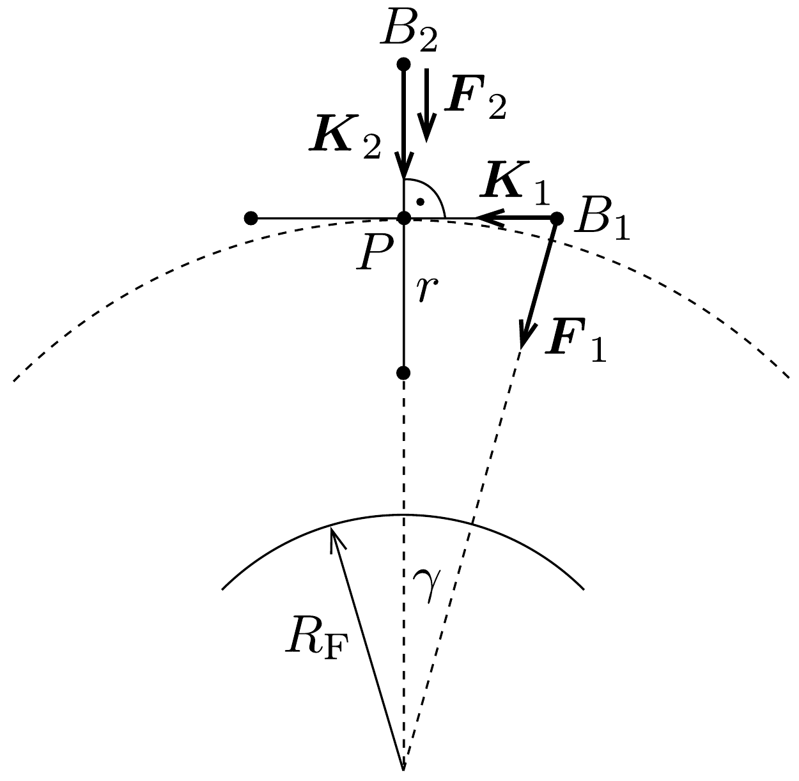
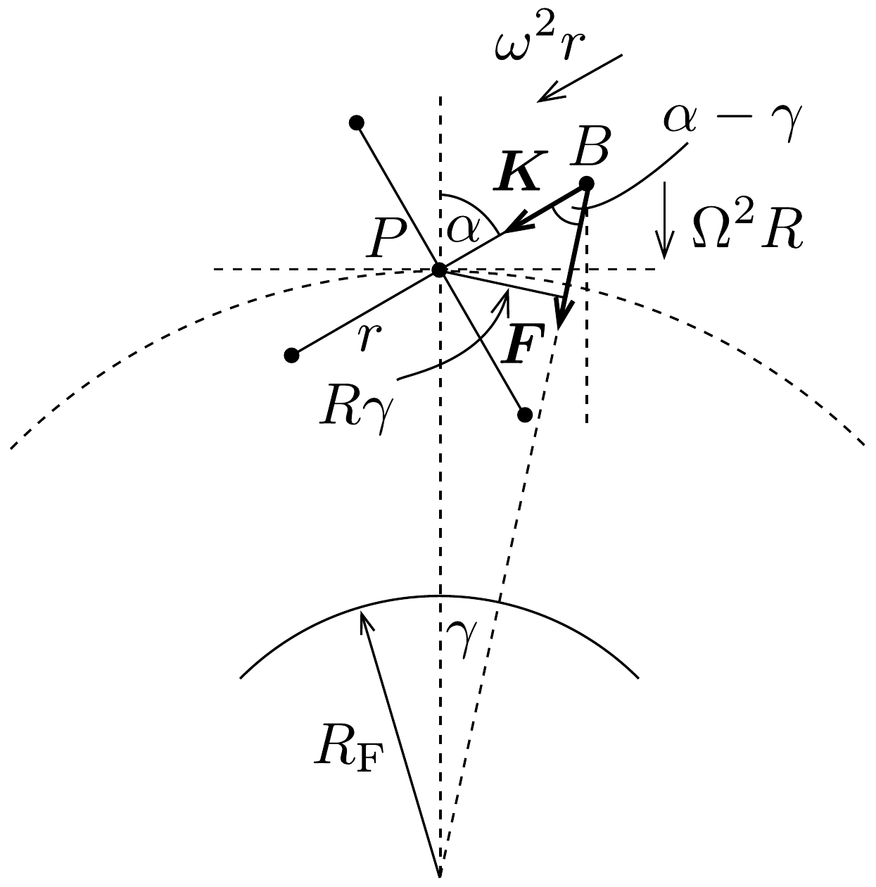

## Megoldás 1

a) A múhold $P$ tömegközéppontja jó közelítéssel időben állandó $R$ sugarú körpályán kering, szögsebessége $\Omega$. (Pontosabb számítások szerint a tömegközéppont helyzete a mühold forgása során egy kicsit „fel-le” imbolyog, hullámvasútszerú mozgást végez.) A rendszer egészének mozgásegyenletéből
\[
G \frac{4 m M_{\mathrm{F}}}{R^{2}}=4 m R \Omega^{2},
\]
azaz
\[
G M_{\mathrm{F}}=C=R^{3} \Omega^{2} .
\]

A $B$-beli testek gyorsulása két vektor összegeként állítható elő. Egyrészt maga a $P$ pont $R \Omega^{2}$ nagyságú és a Föld középpontja felé irányuló gyorsulással mozog, az egyes $B$-beli testek pedig $P$-hez képest $r \omega^{2}$ nagyságú és $P$ irányába mutató gyorsulással rendelkeznek (151. ábra).

A továbbiakban $r \ll R$ miatt az 1 nagyságrendú számok mellett elhanyagoljuk az $(r / R)^{2}$-tel arányos kifejezéseket és csupán az $r / R$ rendú tagokat tartjuk meg. A $r / R$ nagyságrendú szögek szinuszát magával a szöggel, koszinuszát pedig 1-gyel közelítjük.

A $B_{1}$ pontban a gravitációs eró nagysága $\left(\sqrt{R^{2}+r^{2}} \approx R\right.$ felhasználásával)
\[
F_{1}=G \frac{m M_{\mathrm{F}}}{R^{2}},
\]
irányát pedig a $\gamma \approx r / R$ szög jellemzi.

A mozgásegyenlet „vízszintes" komponense
\[
F_{1} \sin \gamma+K_{1}=m r \omega^{2},
\]
innen a fonalat feszítő erőre (92-1) és (92-2) felhasználásával
\[
K_{1}=m r\left(\omega^{2}-\Omega^{2}\right)
\]
adódik.
A $B_{2}$ pontban a gravitációs erő nagysága
\[
F_{2}=G \frac{m M_{\mathrm{F}}}{(R+r)^{2}},
\]
a test „lefelé" mutató gyorsulása pedig $R \Omega^{2}+r \omega^{2}$, a mozgásegyenlet tehát
\[
F_{2}+K_{2}=m\left(R \Omega^{2}+r \omega^{2}\right),
\]
ahonnan a fonalat feszítő erő
\[
K_{2}=m r \omega^{2}+m R \Omega^{2}\left[1-\frac{R^{2}}{(R+r)^{2}}\right] \approx m r\left(\omega^{2}+2 \Omega^{2}\right) .
\]

A „függőlegessel” $\alpha$ szöget bezáró kábeleket feszítő erő kiszámításához tekintsük a 152. ábrát. A $B$ pont $P$ irányú mozgásegyenlete
\[
K+F \cos (\alpha-\gamma)=m\left(\omega^{2} r+\Omega^{2} R \cos \alpha\right),
\]
ahol $\gamma$ továbbra is kicsi szög, ezért ábrán látható háromszögben a szaggatott kis $R \gamma$ körív nagyjából a $P$-ből húzott, $F$-re merőleges kis szakasszal azonos, így:
\[
r \sin (\alpha-\gamma)=R \gamma,
\]

amiben kihasználva, hogy $r \ll R$ :
\[
\gamma=r / R \sin \alpha .
\]
A gravitációs erốt tartalmazó tag:
\[
F \cos (\alpha-\gamma)=\frac{G m M_{\mathrm{F}}}{[R+r \cos (\alpha-\gamma)]^{2}} \cos (\alpha-\gamma) .
\]
A (92-1) egyenettel, majd kihasználva, hogy a nevezőben az $R$ melletti tag sokkal kisebb $R$-nél és két szög koszinuszára vonatkozó addíciós összefüggéssel:
\[
F \cos (\alpha-\gamma)=m \Omega^{2} R\left[1-2 \frac{r}{R}(\cos \alpha+\sin \alpha \cdot \gamma)\right](\cos \alpha+\sin \alpha \cdot \gamma) .
\]
Átalakítás után, elhanyagolva a kicsiny $\gamma \frac{r}{R}$-t tartalmazó tagokat:
\[
F \cos (\alpha-\gamma)=m \Omega^{2} R\left(\cos \alpha+\gamma \sin \alpha-2 \frac{r}{R} \cos ^{2} \alpha\right) .
\]
A (92-6) egyenletet felhasználva:
\[
F \cos (\alpha-\gamma)=m \Omega^{2} R\left(\cos \alpha+\frac{r}{R}-3 \frac{r}{R} \cos ^{2} \alpha\right) .
\]
Ezt beírva a (92-5) egyenletbe, átrendezés után a kötelet feszítő erő:
\[
K(\alpha)=m r\left[\omega^{2}+\Omega^{2}\left(3 \cos ^{2} \alpha-1\right)\right],
\]
tehát $K$ periódusonként valóban kétszer ( $\alpha=0$ és 180°-nál) veszi fel a legnagyobb $K_{\text {max }}=K_{2}$, kétszer ( $\alpha=90^{\circ}$ és 270°-nál) pedig a legkisebb $K_{\text {min }}=K_{1}$ értéket. Az itt kiszámított eróket árapály-eróknek nevezik.
- b) A legnagyobb és a legkisebb kábelerő különbsége
\[
\Delta K=K_{\max }-K_{\min }=3 m r \Omega^{2} .
\]
numerikusan
\[
\Omega=\sqrt{\frac{C}{R^{3}}}=1,24 \cdot 10^{-3} \mathrm{~s}^{-1}, \quad \omega=2 \pi \frac{10}{3600 \mathrm{~s}}=1,75 \cdot 10^{-2} \mathrm{~s}^{-1}, \quad \Delta K=460 \mathrm{~N} .
\]
Körülfordulásonként, vagyis $T_{0}=360$ másodpercenként kétszer van behúzás és kieresztés, így
\[
W=2 \cdot \Delta S \cdot \Delta r=2 \cdot 460 \mathrm{~N} \cdot 10^{3} \mathrm{~m}=9,2 \cdot 10^{5} \mathrm{~J}
\]
munkát végez a gép, az átlagos teljesítménye tehát
\[
P=\frac{W}{T_{0}}=2,6 \mathrm{~kW} .
\]

Megyjegyzés: A „körülfordulást” itt most a Földhöz képest kell érteni, nem pedig az állócsillagokhoz képest. Az állócsillagokhoz képest maga a $P$ pont is kering a Föld körül $\Omega$ szögsebességgel. Attól függően, hogy a $P$ pont körüli, $\omega$ szögsebességü forgás azonos vagy ellentétes irányú a Föld körüli forgással, a $T_{0}$ periódusidó $2 \pi /(\omega-\Omega)$ vagy $2 \pi /(\omega+\Omega)$. Mivel azonban $\omega \gg \Omega$, a kétféle idő között alig van különbség (ezért sem kell két értékes jegynél pontosabban megadni az eredményt).
c) A gépek múködése során a rendszer pályája eltérhet a kör alaktól. A múhold egyetlen körbefordulása során szimmetrikus helyzetekben, négyszer lép múködésbe a gép, ezért a gépek hatását a teljes körülfordulásra lényegében egyenletesnek tekinthetjük. Mivel a változás lassú, feltehetjük, hogy a pálya kör alakú marad még a gépek üzemelése következtében is, azaz a múhold ez egyik kör alakú Keplerpályáról a másikra tér át. A gép időszakos múködése során létrejövő ellipszispályák vizsgálata bonyolult feladat, szerencsére jelen esetben nincs is rá szükség. Megmaradó mennyiségek vizsgálatával kvalitatív eredményekre juthatunk.

A rendszer teljes energiája
\[
E=4 m\left(-\frac{C}{R}+\frac{1}{2} r^{2} \omega^{2}+\frac{1}{2} R^{2} \Omega^{2}\right),
\]
és mivel ez $\Delta t$ idő alatt $P \Delta t$ értékkel növekszik, az $R, \omega$ és $\Omega$ mennyiségek fokozatosan megváltoz(hat)nak. (92-1)-et felhasználva:
\[
E(R, \omega)=2 m\left(r^{2} \omega^{2}-\frac{C}{R}\right) .
\]

A rendszernek a Föld középpontjára vonatkoztatott perdülete (sajátperdület és pályaperdület) időben állandó, hiszen a belső erőkön kívül csak a Föld közepe felé irányuló erők hatnak.
\[
J=4 m\left( \pm r^{2} \omega+R^{2} \Omega\right)=\text { állandó, }
\]
illetve (92-1) felhasználásával
\[
J(R, \omega)=4 m\left( \pm r^{2} \omega+\sqrt{C R}\right)=\text { állandó. }
\]
A fenti formulában $\omega>0$ és a ± jel a múhold kétféle forgásirányára utal. Ennek megfelelően vizsgáljunk két esetet.
(i) Ha a múhold forgása és a keringése ellentétes irányú, akkor (92-8) szerint (a negatív előjellel számolva) $R$ és $\omega$ változása azonos előjelú. Mivel $R$ és $\omega$ csökkenésével (92-7) szerint $E$ is csökkenne, de a valóságban pedig $\Delta E>0$, így ténylegesen $\Delta R>0$ és $\Delta \omega>0$ kell teljesüljön; ugyanakkor viszont $\Delta \Omega<0$ (pl. (92-1) miatt). A „visszafele” forgó múhold tehát a gépek múködése következtében eltávolodik a Földtől, forgási szögsebessége nő, keringési szögsebessége és az $\Omega R=\sqrt{C / R}$ keringési sebessége ugyanakkor csökken. A mühold $-4 m C / R$ gravitációs potenciális energiája $R$ növekedtével növekszik.
(ii) Tárgyaljuk most azt az esetet, amikor a múhold „előrefelé”, a keringésével azonos irányban forog. A (92-8) egyenlet szerint (pozitív előjellel számolva)
\[
\omega=\frac{J}{4 m r^{2}}-\frac{\sqrt{C R}}{r^{2}},
\]
ahonnan az $\omega$ és $R$ mennyiségek kicsiny $\Delta \omega$ és $\Delta R$ megváltozására fenn kell álljon
\[
\Delta \omega=-\frac{1}{2 r^{2}} \sqrt{\frac{C}{R}} \Delta R .
\]
A rendszer energiájának növekedése (92-7) alapján felhasználva az előbbi kifejezést $\Delta \omega$-ra, valamint (92-1)-et:
\[
\Delta E=2 m\left(2 r^{2} \omega \Delta \omega+\frac{C}{R^{2}} \Delta R\right)=2 m \frac{C}{R^{2}}\left(1-\frac{\omega}{\Omega}\right) \cdot \Delta R .
\]
Mivel $\Delta E>0$ és (92-3) szerint $\omega>\Omega$ (hiszen ellenkező esetben a kábel meglazulna), így $\Delta R<0$. A gép múködésének hatására tehát a pályasugár csökken, így (92-8) szerint a forgás $\omega$ szögsebessége, (92-1) szerint a keringés $\Omega$ szögsebessége és múhold $\sqrt{C / R}$ keringési sebessége is növekszik. A mühold gravitációs potenciális energiája pedig csökken.

Az alábbi kitöltött táblázatban + jelöli azt az esetet, amikor $\Omega$ és $\omega$ azonos irányú, - pedig azt, amikor a két szögsebesség ellentétes irányú. Az üresen hagyott esetek nem valósulnak meg a gép múködése során.

\begin{tabular}[t]{|l|l|l|l|l|}
\hline & növekszik, ha & csökken, ha & nem változik, ha & sohasem változik \\
\hline a múkhold keringési sebessége & + & - & & \\
\hline a múhold pályájának $R$ sugara & - & + & & \\
\hline a múhold forgásának $\omega$ szögsebessége & +/- & & & \\
\hline a múkhold gravitációs potenciális energiája & - & + & & \\
\hline
\end{tabular}

A múhold pályasugarát pozitív munkavégzéssel növelni - mint láttuk, - csak akkor lehet, ha a múhold a keringési irányához képest visszafele forog. Adott $J$ perdület esetén, mint az (92-8)-ból leolvasható, nagyon nagy $R$-nél $\omega \sim \sqrt{R}$, a rendszer energiája pedig (92-7) alapján $E \sim R$. A múhold tehát az árapálymotort múködtetve véges nagyságú munkavégzés eredményeképpen nem képes a Földtől nagyon messze kerülni, „elhagyni” a Föld gravitációs terét. Másrészről $\omega$ határtalan növekedtével a kötelekben feszülő $K \sim \omega^{2} \sim R$ eró is határtalanul növekedne, de egyszer csak bizonyos véges $R$ távolságot túllépve elszakadnának.

Érdekes, hogy a múhold a $P$ ponthoz csatlakoztatott kábelek ki-be huzogatásával képes a $P$ pont körüli forgás szögsebességét csökkenteni, vagy éppen növelni. Nem helyes az az érvelés, hogy mivel a $P$-hez rögzített koordináta-rendszerből nézve centrális erők hatnak, a $P$-re vonatkoztatott perdület állandó marad. Azért hibás ez az érvelés, mert a $P$-hez rögzített koordinátarendszer nem inerciarendszer, benne a perdülettétel szokásos megfogalmazása nem érvényes! (Egy piruettező múkorcsolyázó is képes a saját forgási szögsebességét megnövelni olymódon, hogy a karjait behúzza.) A perdületmegmaradás tételét csak a forgásból és a keringésből adódó perdületek összegére tudjuk alkalmazni; külön az egyik, illetve a másik impulzusnyomaték-összetevő változhat a mozgás során!
