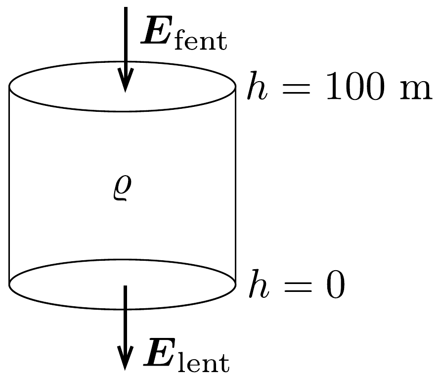
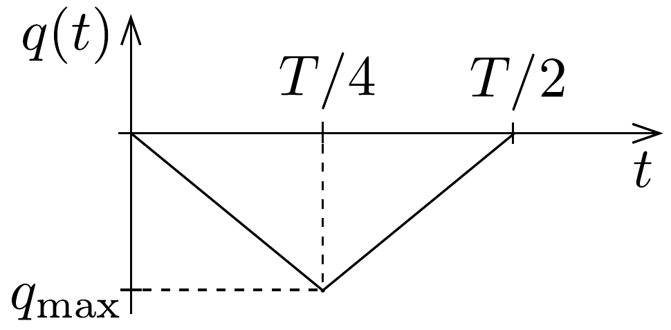
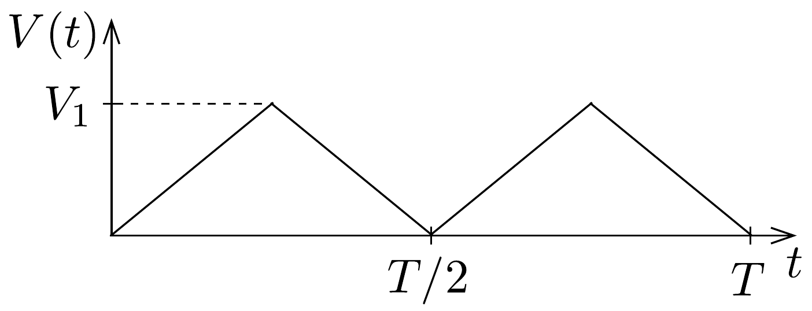
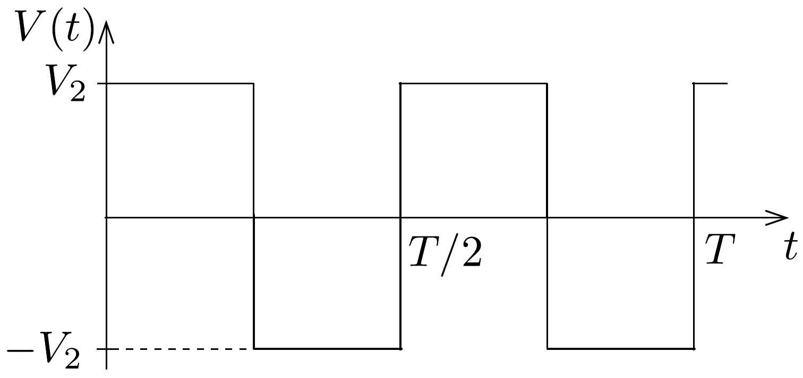

## Megoldás 1

$a)$ Az elektrosztatikai Gauss-törvény értelmében az $R$ sugarú Föld $4 \pi R^{2}$ felszínére vonatkoztatott teljes elektromos fluxus és a Föld $Q$ össztöltése között a
\[
-E_{0} \cdot 4 \pi R^{2}=\frac{Q}{\varepsilon_{0}}
\]
összefüggés áll fenn. Innen numerikusan $Q=-6,7 \cdot 10^{5} \mathrm{C}$, a $\sigma$ felületi töltéssürúségre (felületegységre vonatkoztatott töltésre) pedig
\[
\sigma=-\varepsilon_{0} E_{0}=-1,3 \cdot 10^{-9} \mathrm{C} / \mathrm{m}^{2}
\]
adódik.
b) Képzeljünk el egy $A$ alapterületú, 100 m magas, függőleges hengert és alkalmazzuk erre Gauss-törvényt (161, ábra):
\[
E_{\text {lent }} \cdot A-E_{\text {fent }} \cdot A=\frac{Q_{\text {belül }}}{\varepsilon_{0}}=\frac{\varrho_{\text {átlag }} \cdot(A \cdot 100 \mathrm{~m})}{\varepsilon_{0}} .
\]

Innen a keresett térfogati töltéssűrúség numerikusan: $\varrho_{\text {átlag }}=4,4 \cdot 10^{-12} \mathrm{C} / \mathrm{m}^{3}$.

c) Ha egy vezetó térfogategységenként $n$ darab, egyenként $q$ töltésü, töltött részecskét tartalmaz, és ezek $v$ sebességgel mozognak, akkor a felületegységre jutó áram, az úgynevezett áramsúrúség
\[
j=\frac{I}{A}=\frac{n q \Delta V}{A \Delta t}=\frac{n q A v \Delta t}{A \Delta t}=n q v .
\]
A légkörben egyaránt találunk pozitív és negatív részecskéket (töltésük $\pm e)$. A lefelé mutató elektromos mező a negatív töltéseket felfelé, a pozitívakat pedig lefelé mozgatja. A Föld töltésének csökkenését a pozitív töltések árama okozza, ez (SI-mértékegységeket használva)
\[
j=n_{+} e v=\left(6 \cdot 10^{8}\right) \cdot\left(1,6 \cdot 10^{-19}\right) \cdot\left(1,5 \cdot 10^{-4} E\right)=1,44 \cdot 10^{-14} E .
\]
Mivel a $j$ áramsűrúség a $\sigma$ felületi töltéssúrúség $(\mathrm{d} \sigma / \mathrm{d} t)$ változási ütemével, az $E$ térerősség pedig (a lefelé mutató irányt választva pozitívnak) $-\sigma / \varepsilon_{0}$-lal egyenlő, a fenti egyenlet így is írható:
\[
\frac{\mathrm{d} \sigma}{\mathrm{~d} t}=-1,44 \cdot 10^{-14} \cdot \frac{\sigma}{\varepsilon_{0}} \approx-\frac{1}{600} \sigma .
\]
Vegyük észre, hogy ez az egyenlet éppen olyan, mint a radioaktív bomlást leíró (differenciál)egyenlet, a megoldása tehát az ismert exponenciális bomlástörvénynek megfelelő
\[
\sigma(t)=\sigma_{0} \cdot e^{-t / \tau}, \quad \text { ahol } \tau \approx 600 \mathrm{~s} .
\]
Ezek szerint a légköri ionok mozgása a Föld töltésének felét
\[
T=\tau \cdot \ln 2 \approx 415 \mathrm{~s} \approx 7 \text { perc }
\]
alatt semlegesítené, ha más folyamatok nem játszódnának le. (Amennyiben a kezdeti $j_{0}$ áramsűrúség időbeli változásától eltekintünk, azaz $\sigma(t)$ időben lineárisan csökken, a „felezési időre” kb. 5 perc adódik. Ez az egyszerúsített számolási mód nyilván csak durva közelítésnek, nagyságrendi becslésnek tekinthető.)
d) Ha $t=0$-nak választjuk azt a pillanatot, amikor a forgó korong teljesen leárnyékolja a negyedköröket, a külső elektromos mező pillanatnyi fluxusából számolva a kérdezett töltésre
\[
\begin{gathered}
q(t)=-2 \pi\left(r_{2}^{2}-r_{1}^{2}\right) \varepsilon_{0} E_{0} \cdot \frac{t}{T}, \text { ha } 0 \leq t \leq T / 4, \\
q(t)=-\pi\left(r_{2}^{2}-r_{1}^{2}\right) \varepsilon_{0} E_{0} \cdot\left(1-\frac{2 t}{T}\right), \text { ha } T / 4 \leq t \leq T / 2
\end{gathered}
\]
adódik, és hasonló kifejezések érvényesek a további félperiódusokban is (162. ábra). A lemezekre kerülő legnagyobb (negatív) töltés:
\[
q_{\max }=-\frac{\pi}{2}\left(r_{2}^{2}-r_{1}^{2}\right) \varepsilon_{0} E_{0} .
\]

162. ábra.
$e$ ) Erre a kérdésre az áramköri egyenletek részletes megoldása nélkül is választ lehet adni. Mindössze azt kell észrevennünk, hogy a negyedkörök töltésének csökkenési sebessége (vagyis a negyedkörökről elfolyó áram) két tag összege: az egyik a kondenzátor töltésének $C \cdot \mathrm{~d} V / \mathrm{d} t$ változási sebességével, a másik pedig az ellenálláson átfolyó $V / R$ árammal egyenlő. Attól függően, hogy ezen két mennyiség közül melyik hanyagolható el a másik mellett, két jellegzetes határesetet különböztethetünk meg.
(i) Ha $C V / T \gg V / R$, azaz $T=T_{1} \ll C R$, az $R$ ellenálláson nagyon kevés töltés áramlik át egy periódus alatt. Ebben a határesetben az történik, hogy mialatt a negyedkörök a külső elektromos mező fluxusváltozásának megfelelően egyre több negatív töltéssel kell rendelkezzenek, nyilván csaknem ugyanannyi pozitív töltés kerül a kondenzátorra (hiszen az ellenálláson átfolyó kevés töltést leszámítva az össztöltés állandó marad). A $V(t)$ feszültség tehát $t=0$-tól $t=T / 4$-ig csaknem lineárisan növekszik, majd ugyanennyi ideig lineárisan csökken (163. ábra). A legnagyobb feszültség ebben az esetben
\[
V_{\max }=V_{1} \approx \frac{\left|q_{\max }\right|}{C},
\]
ahol $q_{\text {max }}$ a $d$ ) részben megadott kifejezés.
(ii) A másik határesetben $T=T_{2} \gg C R$. Ilyenkor a töltések könnyen átjutnak az $R$ ellenálláson, $q$ növekedtekor időben közel állandó pozitív, $q$ csökkenésekor pedig állandó nagyságú negatív áram folyik. Az áramerősség nagysága mindkét

esetben $\left|q_{\text {max }}\right| /\left(T_{2} / 4\right)$. Az $R$ ellenálláson mérhető feszültség egy-egy negyedperiódusban közelítőleg állandó, előjele pedig váltakozik 164. ábra). A maximális feszültség:
\[
V_{\max }=V_{2} \approx \frac{4\left|q_{\max }\right| R}{T_{2}} .
\]

164. ábra.

A két határeset megfelelő kifejezéseit összevetve:
\[
\frac{V_{1}}{V_{2}} \approx \frac{T_{2}}{4 C R} .
\]
f) A megadott számértékekkel $R C=0,2 \mathrm{~s}, T=0,02 \mathrm{~s}$, vagyis a $T \ll R C$ határeset valósul meg. Az $e$ ) rész $(i)$ esetének megfeleló összefüggéseket alkalmazva végül a $V_{\text {max }} \approx 1 \mathrm{mV}$ eredmény adódik.
