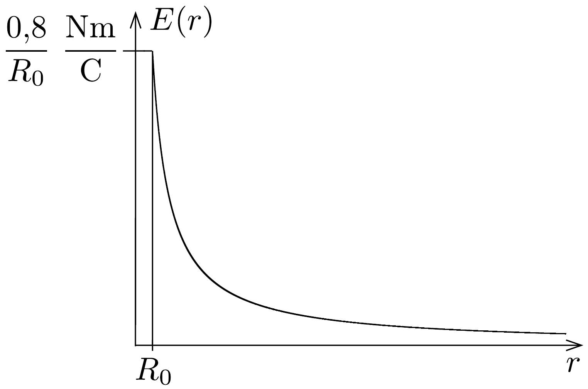
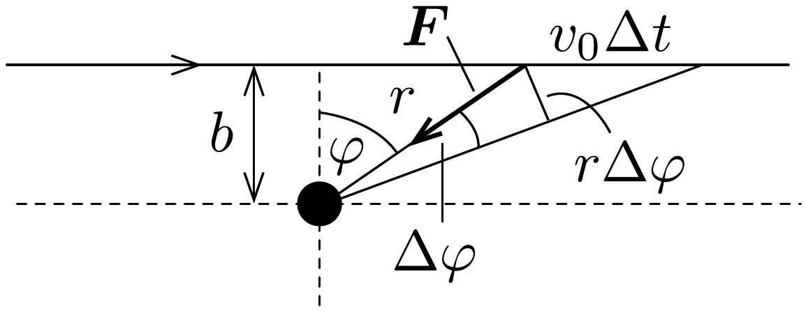
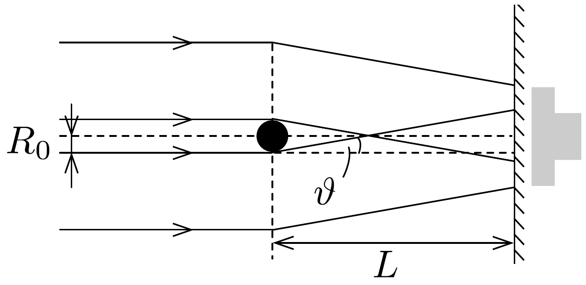
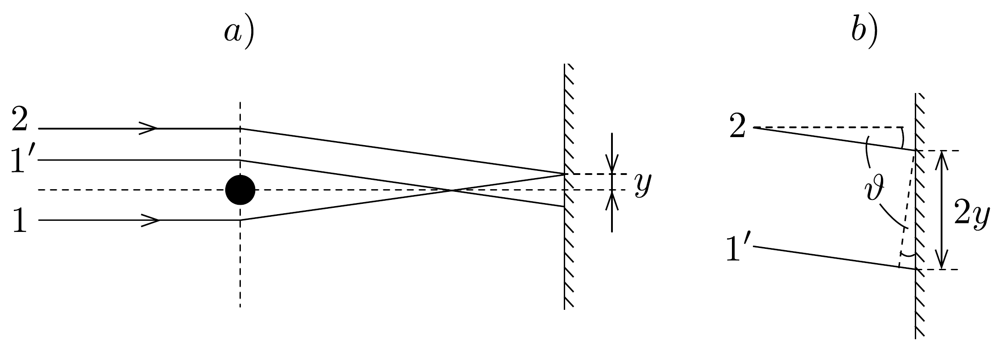
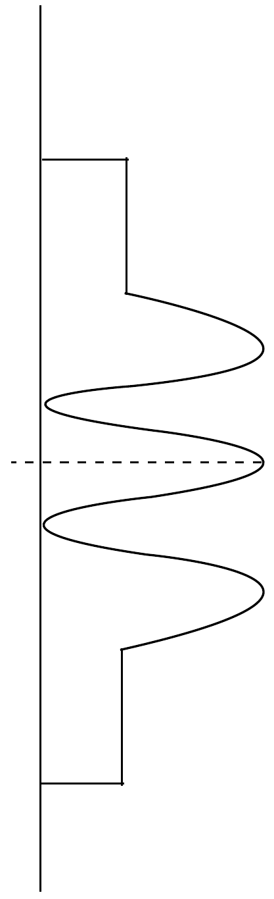

## Megoldás 3

a) A hengerszimmetria miatt az elektromos térerósség a dróthoz képest sugárirányú kell legyen és a nagysága csak a dróttól mért $r$ távolságtól függhet. Helyezzünk gondolatban egy $r>R_{0}$ sugarú hengert a drót köré és alkalmazzuk rá Gauss törvényét:
\[
2 \pi r E(r)=\frac{\sigma}{\varepsilon_{0}},
\]
ahonnan
\[
E(r)=\frac{\sigma}{2 \pi r \varepsilon_{0}}=\frac{0,8}{r} \frac{\mathrm{Nm}}{\mathrm{C}} .
\]
Ha $r<R_{0}$, az elektromos térerősség nulla, hiszen a réz jó elektromos vezető. A vázlatos ábrát a 167. ábrán láthatjuk.

167. ábra.
b) A feladat szövege szerint az elektronok $\vartheta$ eltérülési szöge kicsiny. Ennek a szögnek a nagyságát közelítőleg úgy számíthatjuk ki, hogy elosztjuk az elektronnak a haladás irányára merőlegesen szerzett lendületét a kezdeti lendület nagyságával:
\[
\vartheta \approx \frac{\left|\Delta \boldsymbol{p}_{\perp}\right|}{m v_{0}} .
\]
A merőleges impulzus értékére a következő nagyságrendi becslés adható. A haladás irányára merőleges erő nagysága $b$ távolságban (a drót közelében, vagyis ott, ahol a hatása számottevő́) $e \sigma /\left(2 \pi \varepsilon_{0} b\right)$. Ez az erő hozzávetőlegesen annyi ideig hat a $v_{0}$ sebességgel mozgó elektronra, ameddig az kb. $2 b$ utat tesz meg; vagyis a drót elektrosztatikus tere által kifejtett „erólökés” ideje $t \approx 2 b / v_{0}$. Newton törvénye szerint az eró nagyságának és az idốtartamának szorzata éppen az impulzusváltozás nagyságával egyenlő:
\[
|\Delta \boldsymbol{p}| \approx \frac{e \sigma}{2 \pi \varepsilon_{0} b} \cdot \frac{2 b}{v_{0}}=\frac{e \sigma}{\pi \varepsilon_{0} v_{0}},
\]
az eltérülés szöge pedig (felhasználva az energiamegmaradást kifejező $m v_{0}^{2} / 2=$ $e V_{0}$ összefüggést)
\[
\vartheta \approx \frac{e \sigma}{\pi \varepsilon_{0} m v_{0}^{2}}=\frac{\sigma}{2 V_{0} \pi \varepsilon_{0}}=4 \cdot 10^{-5} .
\]
Megjegyezzük, hogy ez az eltérülési szög nagyon kicsiny és független a $b$ ütközési paramétertől. (Ez utóbbi tulajdonság, amely a feladat kétdimenziós jellegének következménye, első ránézésre igen meglepőnek tünik. A dróttól távolabb elrepülő részecskék azért térülnek el ugyanakkora szöggel, mint a - mondjuk - kétszer közelebb haladók, mert a rájuk ható eró ugyan kétszer kisebb, az erőhatás szempontjából lényeges idő viszont kétszer hosszabb) A rézdrót pozitív elektromos töltése a negatív elektronokat a drót felé téríti el, igaz - mint láttuk - igen kicsiny mértékben.

Pontosabb és elméletileg jobban megalapozott becslést kapunk, ha az elektronok (egyeneshez közeli) pályájának minden részén figyelembe vesszük a merőleges erőhatást, és ezek járulékait összegezve számítjuk ki a merőleges impulzusváltozást.

A 168. ábra jelöléseit használva
\[
\begin{aligned}
& F_{\perp}=\frac{e \sigma}{2 \pi \varepsilon_{0} r} \cos \varphi, \\
& v_{0} \Delta t \cos \varphi=r \Delta \varphi,
\end{aligned}
\]
ahonnan
\[
F_{\perp} \Delta t=\frac{e \sigma}{2 \pi \varepsilon_{0} v_{0}} \Delta \varphi .
\]
Összegezzük most az egyes vonaldarabkákra vonatkozó erőlökéseket. Mivel a $\varphi$ szög $-\pi / 2$-től $+\pi / 2$-ig változik, a teljes impulzusváltozásra
\[
\left|\Delta \boldsymbol{p}_{\perp}\right|=\frac{e \sigma}{2 \varepsilon_{0} v_{0}},
\]
az eltérülés szögére pedig
\[
\vartheta=\frac{e \sigma}{2 \varepsilon_{0} m v_{0}^{2}}=\frac{\sigma}{4 V_{0} \varepsilon_{0}}=6,2 \cdot 10^{-5} .
\]
A korábbi durva becslésétől mindössze egy $\pi / 2$-s tényezőben különböző érték adódik.
c) Az elektronok pályagörbéje két olyan egyenessel közelíthető, melyek a drót közelében megtörnek, hajlásszögük a fentebb kiszámított $\vartheta$. Az ernyőre érkező elektronok mindegyike
\[
\vartheta L=1,9 \cdot 10^{-5} \mathrm{~m} \approx 19 R_{0}
\]
távolsággal tolódik el az eredeti haladási irányához képest. A rézdrót túlsó oldalán haladó elektronok eltolódása ellentétes irányú, így a teljes intenzitáseloszlás az ernyőn két egymásra csúsztatott (összegezett) téglalappal szemléltethető (169. ábra - nem méretarányos; a szürke rész az intenzitást jelöli: középen kétszer akkora, mint a két szélen).

Az átfedő tartomány szélessége
\[
2\left(\vartheta L-R_{0}\right) \approx 36 R_{0}=3,6 \cdot 10^{-5} \mathrm{~m} .
\]
Ebben a tartományban az intenzitás - a klasszikus fizika szerint - egyenletes és éppen kétszerese az eredeti elektronintenzitásnak.
d) A kvantumelmélet (de Broglie hipotézise) szerint a $V_{0}$ feszültséggel $v_{0}$ sebességüre felgyorsított elektronok úgy viselkednek, mint a
\[
\lambda=\frac{h}{m v_{0}}=\frac{h}{\sqrt{2 m e V_{0}}}=8,7 \cdot 10^{-12} \mathrm{~m}
\]
hullámhosszúságú hullámok. A de Broglie-féle hullámhossz sok-sok nagyságrenddel kisebb, mint a nyaláb $2 b_{\text {max }}$ szélessége, emiatt az „egyréses elhajlási effektusokat" nyugodtan elhanyagolhatjuk. A drót jobb oldalán két, egymással kicsiny $(2 \vartheta)$ szögben haladó elektron síkhullám fokozatosan átfedi egymást, és interferenciamaximumok és -minimumok alakulnak ki. Az átfedő tartományban kialakuló maximumok közötti távolság meghatározásához tekintsük a 170, a) ábrát.

Tegyük fel, hogy a szaggatottan jelölt középvonaltól $y$ távolságban az ernyőn az 1-es és a 2-es hullám erósíti egymást. A két hullám közötti optikai útkülönbség meghatározásához tekintsük a középvonalra szimmetrikus 1' hullámot. Mivel a hullámok ugyanabból a forrásból érkeznek, így az 1es és a 2-es hullám közötti útkülönbség megegyezik az 1'-s és a 2-es hullám közötti útkülönbséggel. Ez pedig a 170. b) ábra alapján:
\[
\Delta s=2 y \sin \vartheta .
\]
Erősítés esetén az útkülönbség a hulláhossz egész számú többszöröse: $\Delta s=n \lambda$. Két, egymást követő maximumhelyre tehát:
\[
\begin{gathered}
n \lambda=2 y_{n} \sin \vartheta, \\
(n+1) \lambda=2 y_{n+1} \sin \vartheta .
\end{gathered}
\]
Vagyis a közöttük lévő távolság:

\[
\Delta y=y_{n+1}-y_{n}=\frac{\lambda}{2 \sin \vartheta} \approx \frac{\lambda}{2 \vartheta}=7 \cdot 10^{-8} \mathrm{~m} .
\]
Mivel az átfedési tartomány teljes szélessége $3,6 \cdot 10^{-5} \mathrm{~m}, \mathrm{~kb} .500$ interferenciacsík figyelhető meg. (Megjegyezzük, hogy a csíkok közötti távolság - a szokásos
„kétréses interferenciakísérletektől” eltérően - nem függ sem $b$-től, sem $L$-től.) Az intenzitáseloszlás jellegét (az átfedési tartományban kétréses interferenciának megfelelő intenzitáseloszlás) a vázlatos 171. ábra mutatja.

\title{
