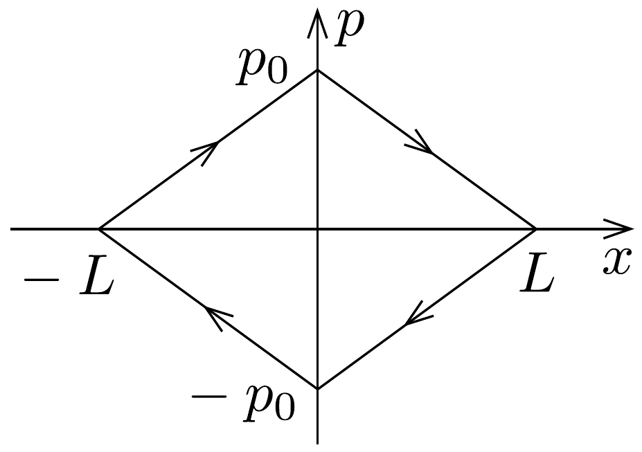
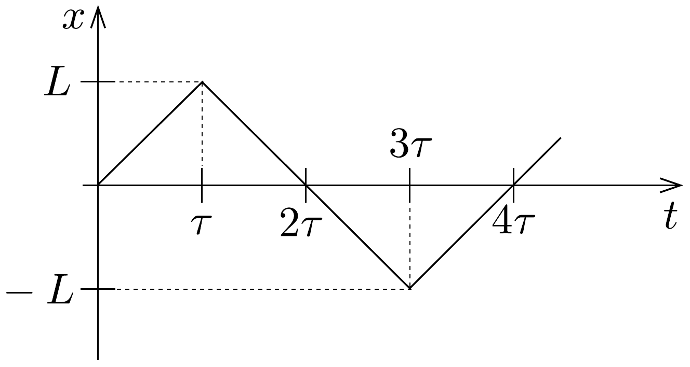
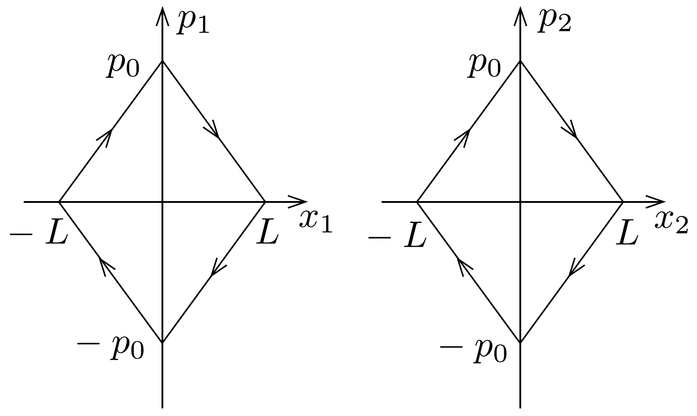
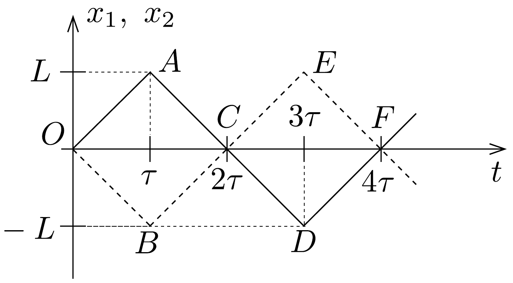
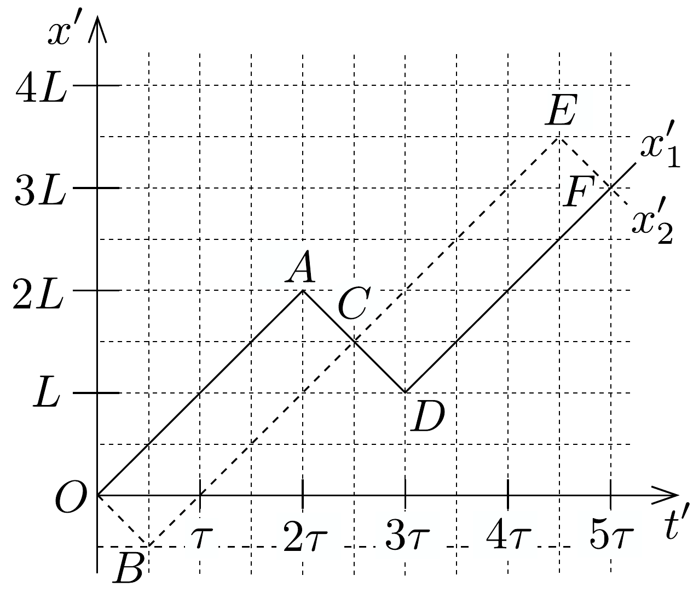

## Megoldás 1

a) A vonzócentrumot az $x=0$ pontba helyezve a potenciális energia $U(x)=f \cdot|x|$ módon adható meg. A teljes energia ekkor
\[
E=\sqrt{p^{2} c^{2}+m_{0}^{2} c^{4}}+f|x|,
\]
ami ultrarelativisztikus határesetben: $E=|p| c+f|x|$. Ez az összefüggés egyben a részecske „fázisgörbéje” a $p-x$ síkon. (176. ábra). A részecske összenergiáját az
\[
E\left(x=0, p=p_{0}\right)=p_{0} c
\]
összefüggés, a fordulópontot pedig az $E(|x|=L, p=0)=p_{0} c$ egyenlet adja meg: $L=p_{0} c / f$.

Ultrarelativisztikus $\left(E \gg m_{0} c^{2}\right)$ határesetben a részecske $p=\frac{m_{0} v}{\sqrt{1-v^{2} / c^{2}}}$ lendülete csak úgy lehet véges nagyságú, ha $|v| \approx c$. Ugyanerre a következtetésre juthatunk az $F=\Delta p / \Delta t$ Newton-egyenletből is:
\[
|v|=\left|\frac{\Delta x}{\Delta t}\right|=\left|\frac{\Delta p}{\Delta t}\right| \cdot\left|\frac{\Delta x}{\Delta p}\right|=f \cdot \frac{c}{f}=c .
\]

A részecske tehát laboratóriumi rendszerben $v \approx \pm c$ sebességgel mozog $x=$ $\pm L$ pontok között (leszámítva a fordulópontok közelében eltöltött rövid időt), ahogy az a 177. ábrán látható. A periodikus mozgás negyed periódusideje: $\tau=$ $L / c=p_{0} / f$.

- b) A két kvarkból álló rendszer teljes energiája:
\[
M c^{2}=\left|p_{1}\right| c+\left|p_{2}\right| c+f\left|x_{1}-x_{2}\right|,
\]
ahol $x_{i}$ és $p_{i}$ az egyes kvarkok helye, illetve lendülete ( $i=1,2$ ).

A mezon tömegközépponti koordináta-rendszerében $p_{1}+p_{2}=0$, emiatt $p_{1}=$ $-p_{2}$ és $x_{1}=-x_{2}$. Tehát a két kvark ellentétes irányban mozog nagyjából $c$ sebességgel, és egy bizonyos $L$ távolságig jutnak el. Mivel ekkor $p_{1}=p_{2}=0$ és a kettejük közötti távolság $2 L$, ezért az energiakifejezésből $L=M c^{2} /(2 f)$. Az idő amíg eljutnak a szélső állapotba az origóból indulva: $\tau=L / c=M c /(2 f)$. A megfelelő diagramok az előzó alponthoz hasonlóan kaphatók (178. és 179. ábra). A $p-x$ diagramon a körüljárások iránya azonos, de a két kvark között „fáziskésés” van.

178. ábra.

179. ábra.
- c) A két részecske az $S^{\prime}$ vonatkoztatási rendszerben is (jó közelítéssel) $\pm c$ sebességgel mozog. Ha az $x^{\prime}=0 ; t=0$ origónak a kvarkok találkozási „eseményét” választjuk ( $O$ pont a 179, ábrán), akkor a következő találkozó $C$ eseménye, amelyet az $S$ rendszerben az $x_{1}=x_{2}=0$ és $t=2 \tau=M c / f$ jellemez, az $S^{\prime}$ rendszerben ( $v=0,6 c$, azaz $\beta=3 / 5, \gamma=5 / 4$ felhasználásával)
\[
\begin{aligned}
x^{\prime} & =\gamma(x+\beta c t)=\frac{5}{4}\left(0+\frac{3}{5} c \cdot 2 \tau\right)=\frac{3}{2} c \tau=1,5 L, \\
y^{\prime} & =\gamma\left(t+\beta \frac{x}{c}\right)=\frac{5}{4} \cdot 2 \tau=2,5 \tau .
\end{aligned}
\]

Az $O$ és $C$ pontokból „fénysebességú", vagyis $\pm c= \pm L / \tau$ meredekségú egyeneseket húzva megkapjuk az $A, B, E, D \ldots$ fordulópontok $\left(x^{\prime}, t^{\prime}\right)$ koordinátáit is (180. ábra). Nyilván ezen pontok koordinátáit a transzformációs összefüggésből is megkaphatjuk.

Erről leolvasható, hogy a részecskék közötti legnagyobb távolság $d^{\prime}=L$ (ez láthatóan kisebb, mint az $S$-ben legnagyobb távolság, ami $2 L$ ).
d) Ha egy $E=M c^{2}=140 \mathrm{MeV}$ energiájú mezon $v=0,6 c$ sebességgel mozog a laborrendszerhez képest, akkor az impulzusa a laborban
\[
p^{\prime}=\frac{M v}{\sqrt{1-v^{2} / c^{2}}}=\frac{M \cdot 0,6 c}{\sqrt{1-0,6^{2}}}=\frac{3}{4} M c
\]
az energiája pedig ugyanebben az $S^{\prime}$ rendszerben
\[
E^{\prime}=\sqrt{p^{\prime 2} c^{2}+M^{2} c^{2}}=M c^{2} \sqrt{\frac{9}{16}+1}=\frac{5}{4} M c^{2}=175 \mathrm{MeV} .
\]
