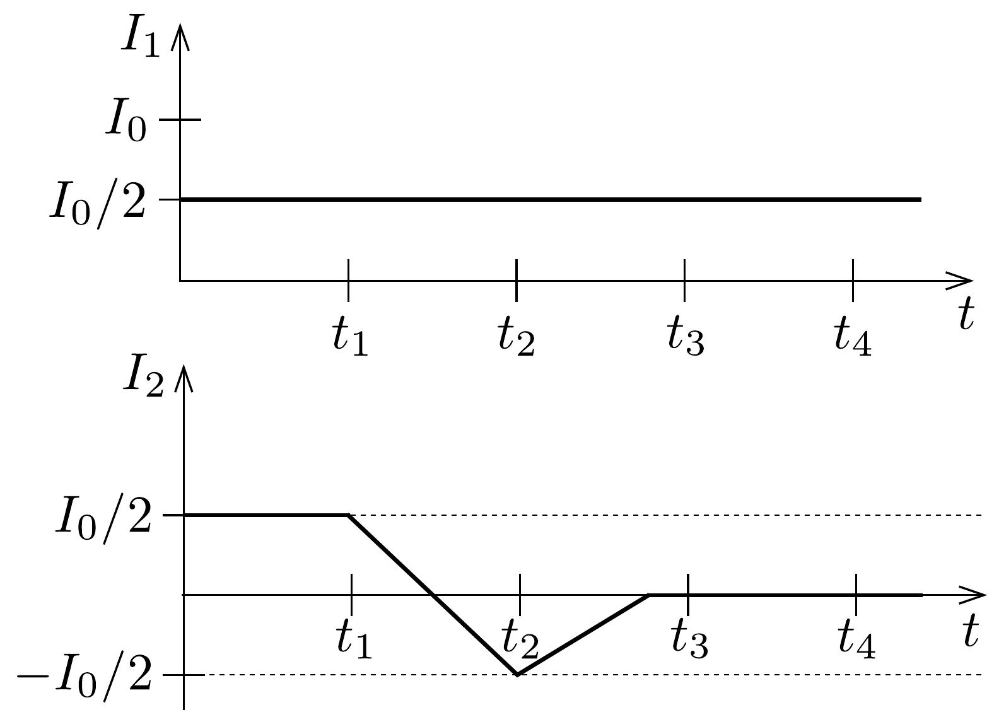
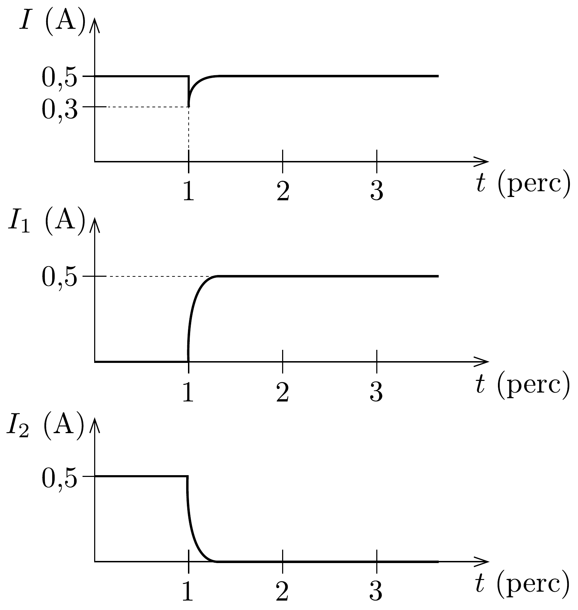
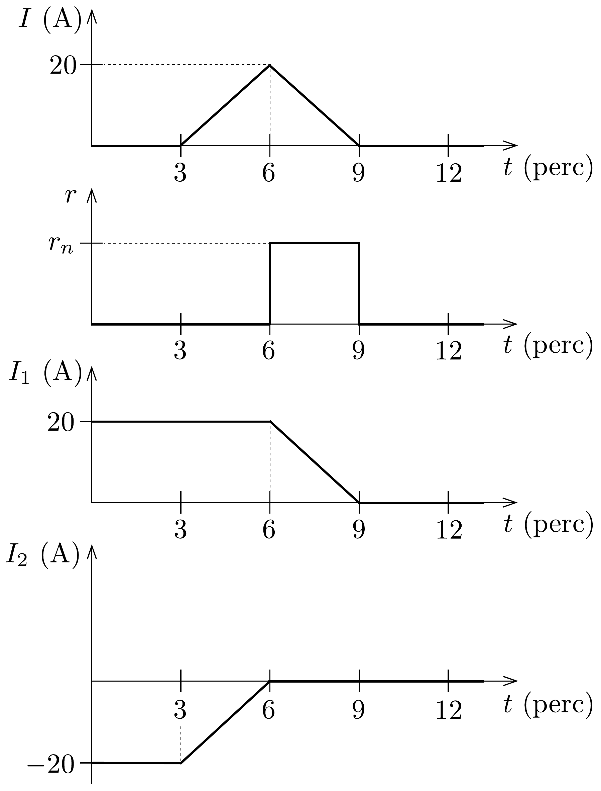
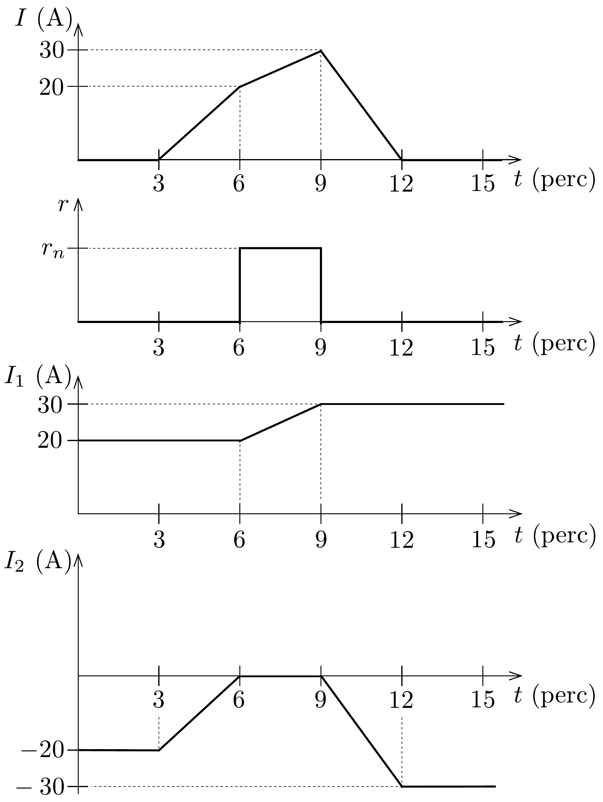

## Megoldás 2

a) Mivel $t=0$-tól $t_{3}$-ig $r=0$, a szupravezető kapcsolón eső feszültség (ami megegyezik a szupravezető tekercsre jutó $L \mathrm{~d} I_{1} / \mathrm{d} t$ feszültséggel) nulla kell legyen. Emiatt a mágnesen nem tud megváltozni az áramerősség, tehát
\[
I_{1}(t)=I_{1}(t=0)=\frac{1}{2} I_{0}
\]
illetve
\[
I_{2}(t)=I(t)-I_{1}(t)=I(t)-\frac{1}{2} I_{0} .
\]
Innen $I(t)$ megadott alakját felhasználva $t=t_{3}$-kor $I_{2}=0$, a kapcsoló normál állapotba kerülése után sem esik feszültség rajta, tehát a tekercs árama a továbbiakban sem változik (181. ábra).
b) Az elsó 1 percben $I_{1}$ nem tud megváltozni (hiszen $r=0$ ), és mivel a teljes $I$ sem változik, $I_{2}$ is konstans marad.

$t=1$ percnél $r$ hirtelen felugrik 0-ról $r_{\mathrm{n}}$-re, $I$ lecsökken $U / R=0,5$ A-ről $U /\left(R+r_{\mathrm{n}}\right)$-re, a megadott számadatokkal 0,3 A-re.
$t=1$ és 2 perc között $I, I_{1}$ és $I_{2}$ fokozatosan tart az egyensúlyi állapotnak megfelelő értékekhez, amelyek: $I_{2}=0$ (a tekercs rövidzárt jelent), $I_{1}=I=$ $U / R=0,5 \mathrm{~A}$. Az időállandó
\[
\tau=\frac{L}{R_{\text {eredő }}}=\frac{L\left(R+r_{\mathrm{n}}\right)}{R r_{\mathrm{n}}} \approx 3 \mathrm{~s},
\]
ami elég rövid ahhoz, hogy $t=2$ perckor (60 s múlva) az áramerősségeket már az egyensúlyi értékekkel azonosnak tekinthessük. Ezután a szupravezető kapcsoló ismét $r=0$ ellenállású lesz, de ez nem változtat a konstans áramértékeken, hiszen
rajta úgysem esett feszültség (182. ábra).
- c) Elsó́ lépés: A $K$ fókapcsoló zárt állása mellett fokozatosan megnöveljük az áramkör teljes $I$ áramát 20 A-rel 3 perc alatt. Mivel a szupravezető kapcsoló $r=0$ állapotban van, a tekercs árama nem változhat meg, tehát $I_{2} 20$ amperrel megnő, vagyis -20 A-ról nullává válik.

183. ábra.

Második lépés: A szupravezető kapcsolót kikapcsoljuk ( $r=r_{n}$ normál állapotba hozzuk) $t=6$ perckor.

Harmadik lépés: Az eredő $I$ áramerősséget fokozatosan nullára csökkentjük, ezzel egyúttal a tekercsen átfolyó áramot is nullává tesszük. A csökkentés ütemét az korlátozza, hogy $L \mathrm{~d} I_{1} / \mathrm{d} t$ indukált feszültség nem lehet nagyobb, mint $r_{\mathrm{n}}=$ $5 \Omega$ és a megengedett maximális $0,5 \mathrm{~A}$ szorzata, azaz $2,5 \mathrm{~V}$. Mivel $L=10 \mathrm{H}$, $\mathrm{d} I_{1} / \mathrm{d} t<0,25 \mathrm{~A} / \mathrm{s}$. A tekercs árama tehát percenként legfeljebb 15 ampernyit változhat. Ha 3 perc alatt csökkentjük $I_{1}$-et nullára, akkor $\mathrm{d} I_{1} / \mathrm{d} t \approx 0,11 \mathrm{~A} / \mathrm{s}$, amivel $I_{2}=\frac{L}{r_{\mathrm{n}}} \frac{\mathrm{d} I_{1}}{\mathrm{~d} t} \approx 0,22 \mathrm{~A}$, tehát gyakorlatilag rajta nem folyik áram.

Negyedik lépés: Az $r$ szupravezető kapcsolót ismét bekapcsoljuk, a főkapcsolót pedig kikapcsoljuk. Ekkor $I_{2}$ is nullává válik. Az egész folyamat a 183. ábrán látható.
- d) Az elsó́ és a második lépés ugyanaz, mint az előző kérdésnél.

Harmadik lépés: Az eredő $I$ áramot óvatosan 20 A-ről 30 A-re növeljük. A normál állapotú kapcsolón nem folyhat számottevő áram (ez korlátot szab az áramváltoztatás ütemére), az összes áram gyakorlatilag a tekercsen folyik keresztül.

Negyedik lépés: A szupravezető kapcsolót $r=0$ állapotba hozzuk (vagyis a tekercs áramát „befagyasztjuk”).

Ötödik lépés: I-t nullára csökkentjük (ezt most gyorsan is megtehetjük, mert a kapcsoló szupravezetó állapotban van). Mivel $I_{1}$ nem változhat, az $r$-en átfolyó áram fog 30 A-t csökkenni.

Utolsó lépés: Kikapcsoljuk a $K$ főkapcsolót. A kívánt változást megvalósító folyamat a 184. ábrán látható.
