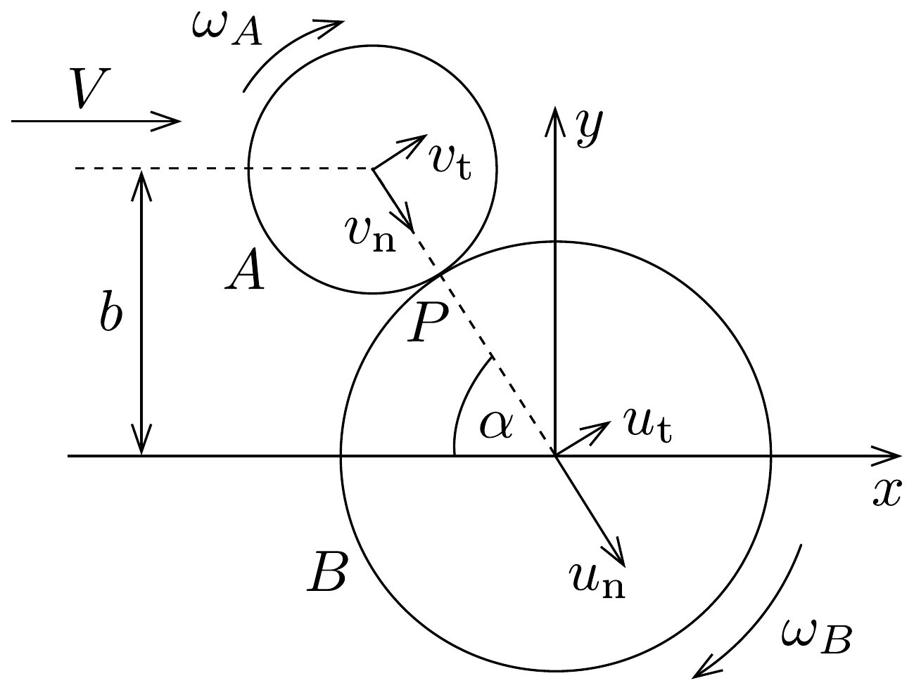

## Megoldás 3

a) Az ütközés során (amely nyilván csak akkor következik be, ha $b<R_{A}+R_{B}$ ), megmarad a rendszer $x$, illetve $y$ irányú impulzusa (lendülete),
vagy ami ezzel egyenértékú: a $P$ ütközési pontban húzott érintő irányú (tangenciális), valamint az arra merőleges sugárirányú (normális) impulzuskomponensekre is felírhatunk megmaradási törvényt. A 185. ábra jelöléseivel

\[
\begin{aligned}
m V \cos \alpha & =m\left(u_{\mathrm{n}}+v_{\mathrm{n}}\right), \\
m V \sin \alpha & =m\left(u_{\mathrm{t}}+v_{\mathrm{t}}\right) .
\end{aligned}
\]

Igaz továbbá, hogy a $P$ pontra vonatkoztatva külön - külön megmarad a két korong perdülete, hiszen az ütközés során fellépő erőknek nincs forgatónyomatéka erre a pontra. Vegyük figyelembe, hogy a perdület a tömegközéppont haladó mozgásából származó impulzusnyomatékból és a tömegközéppont körüli forgás $\Theta \omega$ sajátperdületéből tehető össze:
\[
\begin{aligned}
m R_{A} \cdot V \sin \alpha & =m R_{A} v_{\mathrm{t}}+\Theta_{A} \omega_{A}, \\
0 & =m R_{B} u_{\mathrm{t}}-\Theta_{B} \omega_{B},
\end{aligned}
\]
ahol $\Theta_{A}=m R_{A}^{2} / 2$, illetve $\Theta_{B}=m R_{B}^{2} / 2$. Ezek a megmaradási tételek 4 egyenletet adtak, de az ismeretlenek száma 6 (2+2 sebességkomponens és 2 szögsebesség). (A mechanikai energia megmaradása most nem teljesül, hiszen az ütközés rugalmatlan.) A hiányzó két egyenletet a relatív sebességekre megadott megszorítások szolgáltatják. (Ezek lényegében azt fejezik ki, hogy az ütközés sugárirányban tökéletesen rugalmas, érintő irányban pedig tökéletesen rugalmatlan. Kérdéses, hogy léteznek-e olyan kiterjedt testek, melyek ütközése - legalább jó közelítéssel - így írható le.)
\[
\begin{array}{r}
V \cos \alpha=u_{\mathrm{n}}-v_{\mathrm{n}}, \\
v_{\mathrm{t}}-R_{A} \omega_{A}=u_{\mathrm{t}}+R_{B} \omega_{B} .
\end{array}
\]

A (94-1) és (94-5) egyenletekből álló rendszer önmagában zárt, a normális irányú sebességek csak ezekben az egyenletekben fordulnak elő, más ismeretlent viszont nem tartalmaznak. A megoldásuk:
\[
v_{\mathrm{n}}=0, \quad u_{\mathrm{n}}=V \cos \alpha .
\]

Ez az egyenlő tömegú rugalmas testek ütközésének jól ismert esete: az egyik test megáll, a másik pedig mintegy ,,átveszi" az eredetileg mozgó test sebességét.

A (94-2), (94-3), (94-4) és (94-6) egyenletekből álló rendszer megoldása:
\[
\begin{gathered}
v_{\mathrm{t}}=\frac{5}{6} V \sin \alpha, \\
u_{\mathrm{t}}=\frac{1}{6} V \sin \alpha, \\
R_{A} \omega_{A}=R_{B} \omega_{B}=\frac{1}{3} V \sin \alpha .
\end{gathered}
\]

Ezek ismeretében valamennyi keresett sebességkomponens könnyen számítható:
\[
\begin{gathered}
V_{A x}^{\prime}=v_{\mathrm{t}} \sin \alpha+v_{\mathrm{n}} \cos \alpha=\frac{5}{6} V \sin ^{2} \alpha=\frac{5 V b^{2}}{6\left(R_{A}+R_{B}\right)^{2}}, \\
V_{A y}^{\prime}=v_{\mathrm{t}} \cos \alpha-v_{\mathrm{n}} \sin \alpha=\frac{5}{6} V \sin \alpha \cos \alpha=\frac{5}{6} V \frac{b}{R_{A}+R_{B}} \sqrt{1-\frac{b^{2}}{\left(R_{A}+R_{B}\right)^{2}}}, \\
V_{B x}^{\prime}=u_{\mathrm{t}} \sin \alpha+u_{\mathrm{n}} \cos \alpha=V\left(1-\frac{5}{6} \sin ^{2} \alpha\right)=V\left(1-\frac{5}{6} \frac{b^{2}}{\left(R_{A}+R_{B}\right)^{2}}\right), \\
V_{B y}^{\prime}=-u_{\mathrm{n}} \sin \alpha+u_{\mathrm{t}} \cos \alpha=\frac{5}{6} V \sin \alpha \cos \alpha= \\
=-\frac{5}{6} V \frac{b}{R_{A}+R_{B}} \sqrt{1-\frac{b^{2}}{\left(R_{A}+R_{B}\right)^{2}}} .
\end{gathered}
\]
b) A korongok mozgási energiája az ütközés után:
\[
E_{A}^{\prime}=\frac{1}{2} m\left(v_{\mathrm{n}}^{2}+v_{\mathrm{t}}^{2}\right)+\frac{1}{2} \Theta_{A} \omega_{A}^{2}=\frac{1}{2} m V^{2} \cdot \frac{3}{4} \sin ^{2} \alpha=\frac{1}{2} m V^{2} \cdot \frac{3 b^{2}}{4\left(R_{A}+R_{B}\right)^{2}},
\]
és hasonlóan
\[
\begin{aligned}
E_{B}^{\prime} & =\frac{1}{2} m\left(u_{\mathrm{n}}^{2}+u_{\mathrm{t}}^{2}\right)+\frac{1}{2} \Theta_{B} \omega_{A}^{2}=\frac{1}{2} m V^{2} \cdot\left(1-\frac{11}{12} \sin ^{2} \alpha\right)= \\
& =\frac{1}{2} m V^{2} \cdot\left(1-\frac{11 b^{2}}{12\left(R_{A}+R_{B}\right)^{2}}\right) .
\end{aligned}
\]

\section*{
