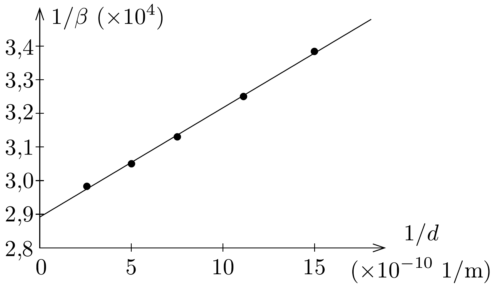

## Megoldás 1

a) Az $f$ frekvenciájú foton energiája $E=h f$, az ehhez társítható effektív tehetetlen tömeg pedig $m=E / c^{2}=h f / c^{2}$. Ha a foton egy $M$ tömegü, $R$ sugarú csillag felszínén jön létre, akkor az energiája (a gravitációs helyzeti energiát is figyelembe véve és a Newton-féle klasszikus gravitációs egyenletekből számolva) $E=h f-G M m / R$. Ez az energia akkor egyezik meg a csillagtól távol kerülő, tehát gravitációs helyzeti energiával nem rendelkező foton energiájával, ha annak frekvenciája $f+\Delta f$ és
\[
h f-G \frac{M}{R} \cdot \frac{h f}{c^{2}}=h(f+\Delta f),
\]
ahonnan $\Delta f / f=-(G M) /\left(R c^{2}\right)$ (a negatív előjel arra utal, hogy a frekvencia csökken, azaz a vörös szín felé tolódik el).

Megjegyzés: Érdekes, hogy az itt leírt „félklasszikus" megfontolás ugyanazt a képletet adja a gravitációs vöröseltolódásra, mint a jelenséget sokkal „mélyebben” értelmező, de matematikailag sokkal bonyolultabb általános relativitáselmélet.
b) Az előző gondolatmenethez hasonlóan adódik, hogy a csillag közepétől $R$
távolságból induló, majd $R+d$ távolságra jutó fény relatív frekvenciaeltolódása
\[
\frac{\Delta f}{f}=-\frac{G M}{c^{2}}\left(\frac{1}{R}-\frac{1}{R+d}\right),
\]
ahonnan némi átalakítással
\[
\frac{f}{\Delta f}=-\frac{c^{2} R}{G M}-\frac{c^{2} R^{2}}{G M} \cdot \frac{1}{d} .
\]
Mivel a Doppler-effektus szerint a fényforráshoz képest $v$ sebességgel mozgó megfigyelő $\Delta f / f=v / c=\beta$ relatív frekvenciaeltolódást észlel, a rezonancia-abszorpcióhoz szükséges mozgás $\beta$-paramétere és a csillag felszínétől mért $d$ távolság között $-1 / \beta=A+B \cdot(1 / d)$ az összefüggés ( $A$ és $B$ állandók). Ábrázoljuk a táblázatban megadott mérési adatokból kiszámítható $\beta^{-1}-\mathrm{t} d^{-1}$ függvényében, és az adatpároknak megfeleló pontsorra illesszünk egyenest (191, ábra)! Az egyenes tengelymetszetéből megkaphatjuk a csillagra jellemző $R / M$, a meredekségéből pedig az $R^{2} / M$ mennyiségeket, tehát külön-külön $M$ és $R$ értékét is. A megadott adatsorból így végül $M \approx 5,3 \cdot 10^{30} \mathrm{~kg}$ és $R \approx 1,1 \cdot 10^{8} \mathrm{~m}$ adódik.

Megjegyzés: A csillag tömegének és sugarának meghatározására nyilván van egyszerúbb módszer is. Ha az úrszonda a csillag méretével összemérhetó távolságra megközelíti a csillagot, és folyamatosan méri a csillagtól mért távolságát és a csillaghoz viszonyított sebességét, akkor a megfigyelhető látószögből közvetlenül megkapható a csillag sugara, a szonda sebességének változásából pedig a csillag tömege.
c) A visszalökődési effektusok számításánál az energia- és a lendületmegmaradás törvényére támaszkodhatunk.
(i) A kezdetben álló, gerjesztett állapotban levő atom energiája $m_{0} c^{2}+\Delta E$, az impulzusa pedig nyilván nulla. A foton kibocsátása után a foton $p=h f / c$ impulzussal rendelkezik, tehát az atomnak is ugyanekkora nagyságú, de a fotonéval ellentétes irányú lendülete kell legyen. Az energiamegmaradás törvénye tehát
jelen esetben:
\[
m_{0} c^{2}+\Delta E=h f+\sqrt{\left(m_{0} c^{2}\right)^{2}+(h f)^{2}} .
\]
(Felhasználtuk a gyorsan mozgó részecskék energiája és impulzusa közötti relativisztikus $E^{2}=m_{0}^{2} c^{4}+p^{2} c^{2}$ összefüggést.) A fenti egyenletből algebrai átalakítások után
\[
h f=\Delta E \frac{2 m_{0} c^{2}+\Delta E}{2 m_{0} c^{2}+2 \Delta E}
\]
adódik. Ha az atomot nem engedjük visszalökődni, akkor a $\Delta E=h f_{0}$ összefüggésnek megfelelő $f_{0}$ frekvenciájú fotont bocsátana ki. A relatív frekvenciaeltolódás tehát a visszalökődés miatt:
\[
\left(\frac{\Delta f}{f}\right)_{\mathrm{vissza}}=\frac{f-f_{0}}{f_{0}}=-\frac{\Delta E}{2\left(m_{0} c^{2}+\Delta E\right)} .
\]

Megjegyzés: Abban a határesetben, amikor $\Delta E \ll m_{0} c^{2}$ (ezt nemrelativisztikus határesetnek nevezik), a visszalökődési korrekció $-\Delta E /\left(2 m_{0} c^{2}\right)$, amit úgy is megkaphatunk, hogy a visszalökődött atom mozgási energiáját az $E=p^{2} /(2 m)$ nemrelativisztikus képletből számítjuk ki. A másik határesetben, amikor $\Delta E \gg m_{0} c^{2}$ (ezt ultrarelativisztikus határesetnek nevezik és az elemi részecskék bomlásánál gyakran megvalósul), a visszalökődési korrekció közel 50 százalékos, mert a visszalökődő rész „fényszerúen” mozogva csaknem ugyanannyi energiát visz el, mint a foton.
(ii) A héliumionok $(Z=2)$ által az $n=2 \rightarrow n=1$ átmenetben kibocsátott fotonokra
\[
\Delta E=-13,6 \cdot 2^{2}\left(1-\frac{1}{4}\right) \approx 40 \mathrm{eV} \approx 10^{-8} \cdot m_{0} c^{2} \ll m_{0} c^{2} .
\]
A visszalökődési korrekció tehát a jelen esetben (akár a relativisztikus, akár az itt most igazán jogosan alkalmazható nemrelativisztikus képletbő̌l számoljuk) $5 \cdot 10^{-9}$ nagyságú, és ez a négy nagyságrenddel nagyobb $\left(\sim 3 \cdot 10^{-5}\right)$ gravitációs eredetú eltolódás mellett elhanyagolható.
