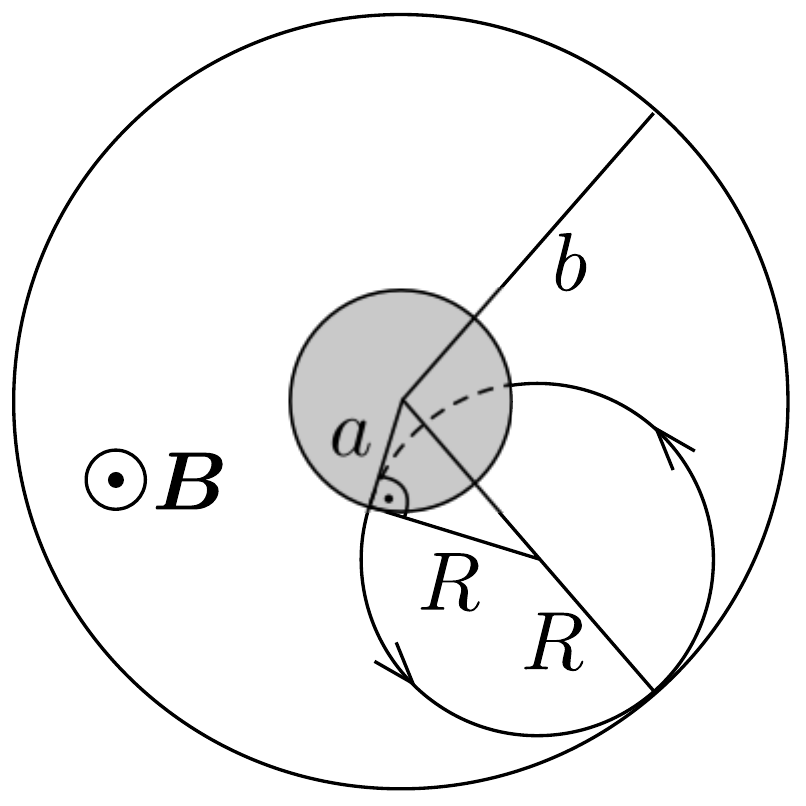

## Megoldás 2

a) Az elektron $e V$ potenciális energiája alakul át mozgási energiává ( $V$ feszültség gyorsítja fel az elektront). Nemrelativisztikus tárgyalásmódban:
\[
\frac{1}{2} m v^{2}=e V, \quad \text { amiből } \quad v=\sqrt{\frac{2 e V}{m}} .
\]

Relativisztikus tárgyalásmódban:
\[
\frac{m c^{2}}{\sqrt{1-v^{2} / c^{2}}}-m c^{2}=e V, \quad \text { innen } \quad v=c \sqrt{1-\left(\frac{m c^{2}}{m c^{2}+e V}\right)^{2}} .
\]
- b) A Lorentz-eró körpályán mozgatja az elektront:
\[
e B v_{0}=\frac{m v_{0}^{2}}{R}, \quad \text { amiből } \quad B=\frac{m v_{0}}{e R} .
\]

A kezdősebesség a kör érintőjének irányába mutat. A 205. ábra alapján láthatjuk, hogy a kritikus esetben a következő geometriai feltétel teljesül:

\[
\sqrt{a^{2}+R^{2}}=b-R, \quad \text { amiből } \quad R=\frac{b^{2}-a^{2}}{2 b} .
\]
Ezt a sugárértéket a (96-2) egyenletbe helyettesítve kaphatjuk meg a mágneses mező kritikus értékét:
\[
B_{\mathrm{c}}=\frac{m v_{0}}{e R}=\frac{2 b m v_{0}}{\left(b^{2}-a^{2}\right) e} .
\]
c) A perdület megváltozását valamilyen forgatónyomaték okozza. Beláthatjuk, hogy esetünkben az $\boldsymbol{F}=(-e) \boldsymbol{v} \times \boldsymbol{B}$ Lorentz-eró sugárra merőleges $F_{\varphi}$ komponense fejt csak ki $F_{\varphi} r$ forgatónyomatékot. Ilyen irányú erőt viszont csak a sugárirányú $v_{r}=\mathrm{d} r / \mathrm{d} t$ sebességösszetevő eredményez. A perdület időbeli megváltozása tehát így írható fel:
\[
\frac{\mathrm{d} L}{\mathrm{~d} t}=e B r \frac{\mathrm{~d} r}{\mathrm{~d} t},
\]
amit a következőképpen alakíthatunk át:
\[
\frac{\mathrm{d}}{\mathrm{~d} t}\left(L-\frac{e B r^{2}}{2}\right)=0 .
\]
Látható, hogy a
\[
C=L-\frac{1}{2} e B r^{2}
\]
mennyiség a mozgás folyamán állandó. A feladatban kérdezett dimenziótlan $k$ szám értéke tehát $k=1 / 2$.
d) A (96-3) egyenletben szereplő $C$ állandót felírhatjuk akkor, amikor az elektron a belső henger felületéről éppen kilép $(L=0)$, illetve amikor $r_{\mathrm{m}}$ maximális távolságra helyezkedik el:
\[
0-\frac{1}{2} e B a^{2}=m v r_{\mathrm{m}}-\frac{1}{2} e B r_{m}^{2},
\]
amiből
\[
v=\frac{e B\left(r_{\mathrm{m}}^{2}-a^{2}\right)}{2 m r_{\mathrm{m}}} .
\]
e) A kritikus $B_{\mathrm{c}}$ mágneses mező esetén a (96-4) egyenletben $r_{\mathrm{m}}$ helyére $b$ értékét kell helyettesítenünk, továbbá a sebesség meghatározásakor felhasználhatjuk a (96-1) egyenlet kifejezését is:
\[
\frac{e B_{\mathrm{c}}\left(b^{2}-a^{2}\right)}{2 m b}=\sqrt{\frac{2 e V}{m}},
\]
amiből a keresett $B_{c}$ könnyen megkapható:
\[
B_{\mathrm{c}}=\frac{2 b}{b^{2}-a^{2}} \sqrt{\frac{2 m V}{e}} .
\]
f) A Lorentz-erőnek nincs $B$-vel párhuzamos komponense, ezért a $v_{B}$ sebességösszetevő a mozgás során állandó, a kérdésben szereplő kritikus mágneses mezőre $v_{B}$ nincs hatással.

Legyen $v$ az elektron sebességének $B$-re és $r$-re is merőleges komponense a kritikus esetben (amikor éppen eléri az anódot). Az energiamegmaradás szerint:
\[
\frac{1}{2} m\left(v_{B}^{2}+v_{\varphi}^{2}+v_{r}^{2}\right)+e V=\frac{1}{2} m\left(v_{B}^{2}+v^{2}\right),
\]
amiből
\[
v=\sqrt{v_{r}^{2}+v_{\varphi}^{2}+\frac{2 e V}{m}} .
\]
Írjuk fel ismét a (96-3) kifejezésben szereplő $C$ állandót mindkét hengerfelületnél:
\[
m v_{\varphi} a-\frac{1}{2} e B_{\mathrm{c}} a^{2}=m v b-\frac{1}{2} e B_{\mathrm{c}} b^{2} .
\]
Végül $v$ helyére írjuk be a (96-5) kifejezést, amiből a kérdéses kritikus mágneses mezó meghatározható:
\[
B_{\mathrm{c}}=\frac{2 m\left(v b-v_{\varphi} a\right)}{e\left(b^{2}-a^{2}\right)}=\frac{2 m b}{e\left(b^{2}-a^{2}\right)}\left[\sqrt{v_{r}^{2}+v_{\varphi}^{2}+\frac{2 e V}{m}}-v_{\varphi} \frac{a}{b}\right] .
\]
