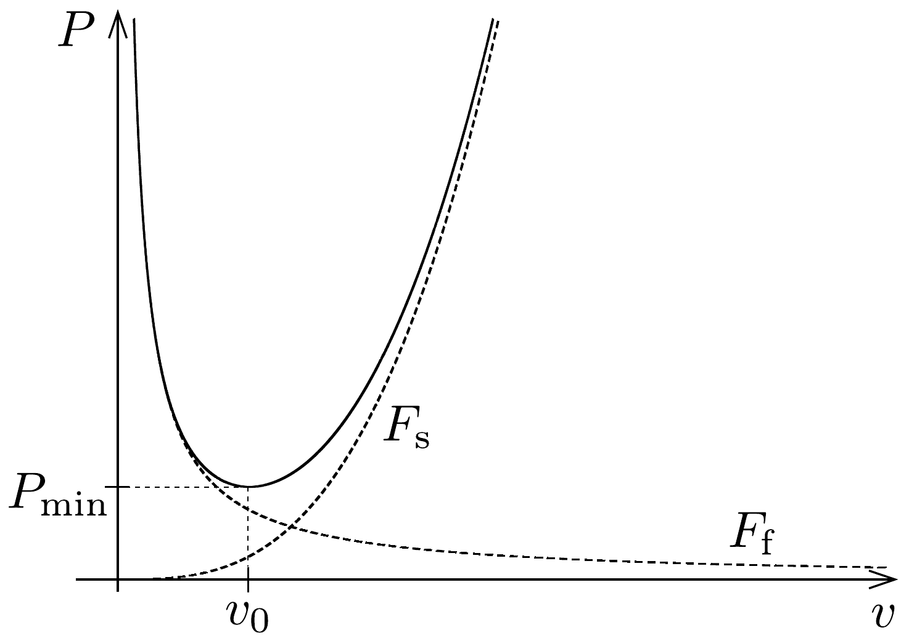

## Megoldás 3

a) Az egységnyi idő alatt átáramló tömeget nevezzük el „tömegáramnak". Egy $\frac{\mathrm{d} m}{\mathrm{~d} t}$ tömegáramú közeg sebességének $\Delta \boldsymbol{v}$-vel való megváltoztatásához szükséges erő: $\boldsymbol{F}=\Delta \boldsymbol{v} \frac{\mathrm{d} m}{\mathrm{~d} t}$. Jelen esetben a tömegáram:
\[
\frac{\mathrm{d} m}{\mathrm{~d} t}=x \ell \varrho v=\frac{\pi}{4} \ell^{2} \varrho v .
\]
A $\Delta \boldsymbol{v}$ vektor függőleges komponense: $\Delta v_{\mathrm{h}}=v \sin \varepsilon$, vízszintes komponense: $\Delta v_{\mathrm{v}}=$ $v(1-\cos \varepsilon)$. Ezek alapján felírhatjuk az $F_{\mathrm{e}}$ függőleges emelőerőt és az $F_{\mathrm{f}}$ vízszintes fékezőerőt:
\[
\begin{gathered}
F_{\mathrm{e}}=\frac{\pi}{4} \varrho v^{2} \ell^{2} \sin \varepsilon, \\
F_{\mathrm{f}}=\frac{\pi}{4} \varrho v^{2} \ell^{2}(1-\cos \varepsilon) .
\end{gathered}
\]
b) A repülőgép vízszintes, állandó sebességú repüléséhez szükséges teljesítmény: $P=F v=\left(F_{\mathrm{f}}+F_{\mathrm{s}}\right) v$. A vízszintes $F_{\mathrm{s}}$ fékezőerőt a szárny mellett elhaladó
levegő súrlódásából származó impulzus változásából írhatjuk fel (az anyagmegmaradás miatt a sebességcsökkenés előtt és után ugyanakkora a tömegáram):
\[
F_{\mathrm{s}}=\Delta v \frac{\mathrm{~d} m}{\mathrm{~d} t}=\frac{\pi}{4} \ell^{2} \varrho v \Delta v=\frac{\pi f}{4 A} \varrho v^{2} \ell^{2} .
\]

Vízszintes repüléskor az emelőeró a gépre ható nehézségi erővel egyezik meg:
\[
F_{\mathrm{e}}=M g=\frac{\pi}{4} \varrho v^{2} \ell^{2} \sin \varepsilon \rightarrow \sin \varepsilon=\frac{4 M g}{\pi \varrho v^{2} \ell^{2}} .
\]
Ezután már minimalizálhatjuk a teljesítményt akár $v$, akár $\varepsilon$ szerint. A feladat minimális sebességet adott meg. Felhasználva az erőkre kapott eredményeket:
\[
P=\frac{\pi}{4} \varrho v^{3} \ell^{2}\left(1-\cos \varepsilon+\frac{f}{A}\right),
\]
majd a megadott közelítést:
\[
P=\frac{\pi}{4} \varrho v^{3} \ell^{2}\left[\frac{1}{2}\left(\frac{4 M g}{\pi \varrho v^{2} \ell^{2}}\right)^{2}+\frac{f}{A}\right]=\frac{2(M g)^{2}}{\pi \varrho v \ell^{2}}+\frac{\pi f}{4 A} \varrho v^{3} \ell^{2} .
\]
A minimum megkereséséhez deriválunk:
\[
\frac{\mathrm{d} P}{\mathrm{~d} v}=-\frac{2(M g)^{2}}{\pi \varrho v^{2} \ell^{2}}+\frac{3 \pi f}{4 A} \varrho v^{2} \ell^{2}=0 .
\]
A minimális teljesítményhez tartozó $v_{0}$ repülési sebesség (felhasználva, hogy $\ell^{2}=$ $A S$ ):
\[
v_{0}=\sqrt[4]{\frac{8(M g)^{2} A}{3 \pi^{2} \varrho^{2} \ell^{4} f}}=\sqrt[4]{\frac{8}{3 A f}\left(\frac{M g}{\pi \varrho S}\right)^{2}} .
\]

- c) A (97-1) egyenlet elsó tagja az $F_{\mathrm{f}}$, a második az $F_{\mathrm{s}}$ erőtől származik. A grafikon a 210 ábrán látható.

Behelyettesítve $v_{0}$-t, a minimális teljesítmény:
\[
P_{\min }=\left(\frac{8}{3 A}\right)^{3 / 4} \frac{(M g)^{3 / 2} f^{1 / 4}}{(\pi \varrho S)^{1 / 2}} .
\]
- d) $P_{\text {min }}$ kifejezését egyenlővé téve a rendelkezésre álló $I S$ teljesítménnyel,
\[
\left(\frac{M g}{S}\right)^{3 / 2}=I\left(\frac{3 A}{8}\right)^{3 / 4} \frac{(\pi \varrho)^{1 / 2}}{f^{1 / 4}},
\]
vagyis
\[
\frac{M g}{S}=I^{2 / 3}\left(\frac{3 A}{8}\right)^{1 / 2} \frac{(\pi \varrho)^{1 / 3}}{f^{1 / 6}} .
\]
Számszerúen pedig $M g / S=35,6 \mathrm{~N} / \mathrm{m}^{2}$, valamint (a $b$ ) rész végeredményét felhasználva) $v_{0}=8,60 \mathrm{~m} / \mathrm{s}$ adódik.

\title{
