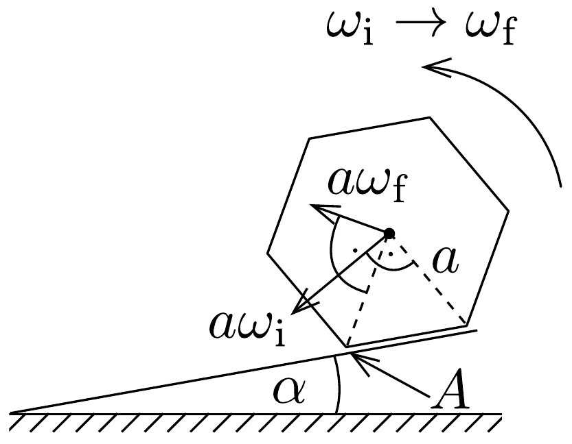
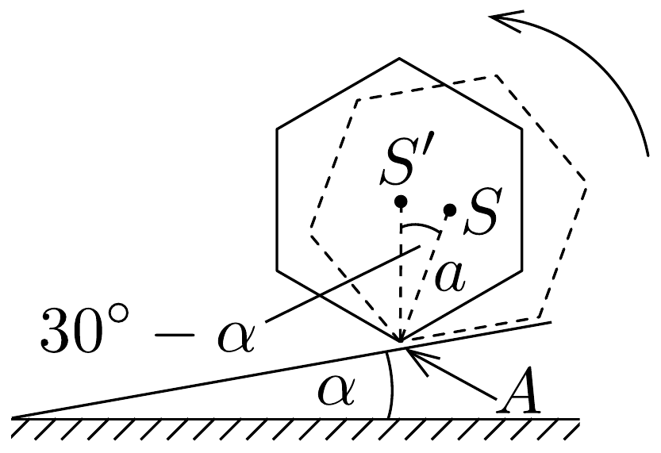
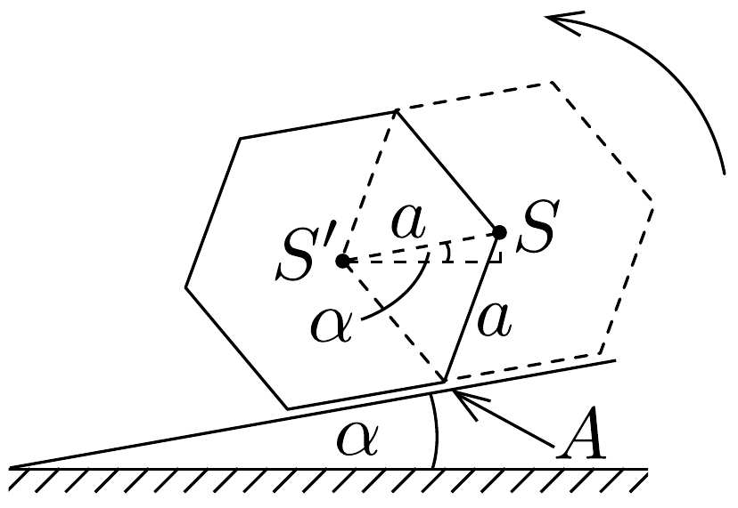

## Megoldás 1

a) I. megoldás. A hasáb gördülése közben, az egymást követő becsapódásokkor nagy erők (sokkal nagyobbak, mint a hasábra ható nehézségi eró) lépnek fel a lejtővel érintkezó élek (pl. a 217. ábrán $A$-val jelölt él) mentén. Ezek az erők pillanatszerúen lecsökkentik a hasáb érintés előtti $\omega_{\mathrm{i}}$ szögsebességét a becsapódást közvetlenül követő $\omega_{\mathrm{f}}$ értékre. Észrevehetjük azonban, hogy a hasábra ható erők nem változtatják meg az $A$ élre számítható perdületet, ami saját- és pályaperdületből áll:
\[
\Theta \omega_{\mathrm{i}}+M a \omega_{\mathrm{i}} \cdot \frac{1}{2} a=\Theta \omega_{\mathrm{f}}+M a \omega_{\mathrm{f}} \cdot a .
\]
A $\Theta$ tehetetlenségi nyomaték megadott értékének behelyettesítése után megkapjuk az eredményt:
\[
s=\frac{\omega_{\mathrm{f}}}{\omega_{\mathrm{i}}}=\frac{11}{17} .
\]

II. megoldás. Az ütközés során fellépő erőlökés megváltoztatja a hasáb impulzusát. Ez az erőlökés gyakorlatilag a lejtő által kifejtett nyomóerőből és tapadási súrlódási eróből származik, a nehézségi erő ezekhez képest elhanyagolható. Ezt felírva a lejtóre merőleges és azzal párhuzamos komponensekre:
\[
\begin{aligned}
& F_{\perp} \Delta t=\text { Mawi }_{\mathrm{i}} \cos 60^{\circ}+\text { Maw }_{\mathrm{f}} \cos 60^{\circ} \\
& F_{\|} \Delta t=\text { Mawi }_{\mathrm{i}} \sin 60^{\circ}-\text { Maw }_{\mathrm{f}} \sin 60^{\circ}
\end{aligned}
\]
Továbbá írjuk fel a perdülettételt a henger tömegközéppontjára:
\[
F_{\perp} \cdot a \sin 30^{\circ}-F_{\|} \cdot a \cos 30^{\circ}=\frac{\Theta\left(\omega_{\mathrm{i}}-\omega_{\mathrm{f}}\right)}{\Delta t} .
\]

Ebből a három egyenletből az I. megoldásnak megfelelő eredményt kapjuk a két szögsebesség hányadosára.
b) A test $K$ mozgási energiája az ütközés előtt is és a becsapódást követően is a hasáb egy-egy oldaléle körüli forgásból számítható (azok az élek egymást követve nyugalomban vannak). A mozgási energiák aránya:
\[
r=\frac{K_{\mathrm{f}}}{K_{\mathrm{i}}}=\frac{\frac{1}{2} \Theta^{\prime} \omega_{\mathrm{f}}^{2}}{\frac{1}{2} \Theta^{\prime} \omega_{\mathrm{i}}^{2}}=\frac{\omega_{\mathrm{f}}^{2}}{\omega_{\mathrm{i}}^{2}}=s^{2}=\frac{121}{289} .
\]
c) A hasáb következő éle akkor érinti a lejtőt, ha energiája elegendő ahhoz, hogy súlypontját „átemelje” pályájának legmagasabb pontján. A 218. ábráról leolvasható, hogy a súlypont emelkedése $a-a \cos \left(30^{\circ}-\alpha\right)$. Ha az érintés előtti

minimális energiát $\delta \cdot M g a$ alakban írjuk fel, akkor a kritikus esetre érvényes egyenlet az energiamegmaradás szerint:
\[
M g a\left[1-\cos \left(30^{\circ}-\alpha\right)\right]=K_{\mathrm{f}, \min }=r K_{\mathrm{i}, \min }=r \delta \cdot M g a,
\]
amiből
\[
\delta=\frac{1-\cos \left(30^{\circ}-\alpha\right)}{r} .
\]
d) I. megoldás. Tegyük fel, hogy a hasáb úgy mozog, hogy az érintés előtti mozgási energiája már felvette az állandósult $K_{\mathrm{i}, 0}=\kappa \cdot M g a$ értéket. Az állandósult mozgásnak az a feltétele, hogy a becsapódásonként a mozgási energia vesztesége éppen egyenlő legyen az egy-egy lépésre eső helyzeti energia csökkenésével. A 219. ábra alapján:
\[
M g a \sin \alpha=K_{\mathrm{i}, 0}-K_{\mathrm{f}, 0}=(1-r) K_{\mathrm{i}, 0}=(1-r) \kappa \cdot M g a,
\]
azaz
\[
\kappa=\frac{\sin \alpha}{1-r} .
\]

II. megoldás. Az $n$-edik és az $(n+1)$-edik ütközés között a hasáb helyzeti energiája csökken $\Delta=M g a \sin \alpha$ értékkel. Az első ütközést követően:
\[
\begin{aligned}
K_{\mathrm{i}, 2}-K_{\mathrm{f}, 1} & =\Delta \rightarrow K_{\mathrm{i}, 2}=\Delta+r K_{\mathrm{i}, 1} \\
K_{\mathrm{i}, 3}-K_{\mathrm{f}, 2} & =\Delta \rightarrow K_{\mathrm{i}, 3}=\Delta+r K_{\mathrm{i}, 2}=\Delta(1+r)+r^{2} K_{\mathrm{i}, 1} \\
K_{\mathrm{i}, 4}-K_{\mathrm{f}, 3} & =\Delta \rightarrow K_{\mathrm{i}, 4}=\Delta+r K_{\mathrm{i}, 3}=\Delta\left(1+r+r^{2}\right)+r^{3} K_{\mathrm{i}, 1} \\
K_{\mathrm{i}, n}-K_{\mathrm{f}, n-1}=\Delta & \rightarrow K_{\mathrm{i}, n}=\Delta+r K_{\mathrm{i}, n-1}=\Delta\left(1+r+\ldots+r^{n-2}\right)+r^{n-1} K_{\mathrm{i}, 1} .
\end{aligned}
\]
Elvégezve az $n \rightarrow \infty$ átmenetet $(r<1)$ :
\[
K_{\mathrm{i}, n} \rightarrow K_{\mathrm{i}, 0}=\frac{\Delta}{1-r}+0 .
\]
Ezt $\kappa M g a$-val egyenlővé téve, az I. megoldásbeli eredményhez jutunk.
$e$ ) Ahhoz, hogy a henger folyton gördüljön a lejtőn, a $d$ ) részben megadott feltételen kívül az kell, hogy a henger a $c$ ) alkérdésben lévő „akadályt” is legyőzze.

Tehát a $d$ ) részben kiszámolt $K_{\mathrm{i}, 0}$ mozgási energia legyen nagyobb, mint a $c$ ) részben megadott $K_{\mathrm{i}, \text { min }}$ mozgási energia. (Minél kisebb a lejtő hajlásszöge, annál kisebb egy-egy lépésben a hasáb helyzeti energiájának csökkenése, másrészt annál nagyobb a súlypont emelkedésébő̌l származó „fékező korlát”.) A kettő egyenlősége (a két előzó alkérdés eredményének egybevetése) adja meg az állandósult mozgásra még alkalmas $\alpha_{0}$ minimális hajlásszöget:
\[
\frac{\sin \alpha_{0}}{1-r}=\frac{1-\cos \left(30^{\circ}-\alpha_{0}\right)}{r} .
\]
Átalakítás után a következő egyenletet kapjuk:
\[
\frac{1}{2} \frac{1+r}{1-r} \sin \alpha_{0}+\frac{\sqrt{3}}{2} \cos \alpha_{0}=1 .
\]

Ennek megoldásához felhasználhatjuk a feladatban megadott tényt, hogy $\alpha$ kicsi, tehát alkalmazhatjuk a $\sin \alpha \approx \alpha$ és a $\cos \alpha \approx 1-\alpha^{2} / 2$ közelítéseket, vagy enélkül is, például úgy, hogy a $\sin \alpha_{0}$ és a $\cos \alpha_{0}$ együtthatóinak négyzetösszegéből vont négyzetgyökkel elosztjuk az egyenletet, így egy $\sin \left(\alpha_{0}+\beta\right)=$ konst. alakú egyenletet kapunk, ahol $\beta \approx 35,36^{\circ}$. Innen a kérdéses szögre valóban kicsiny érték, $\alpha_{0}=6,6^{\circ}$ adódik.
