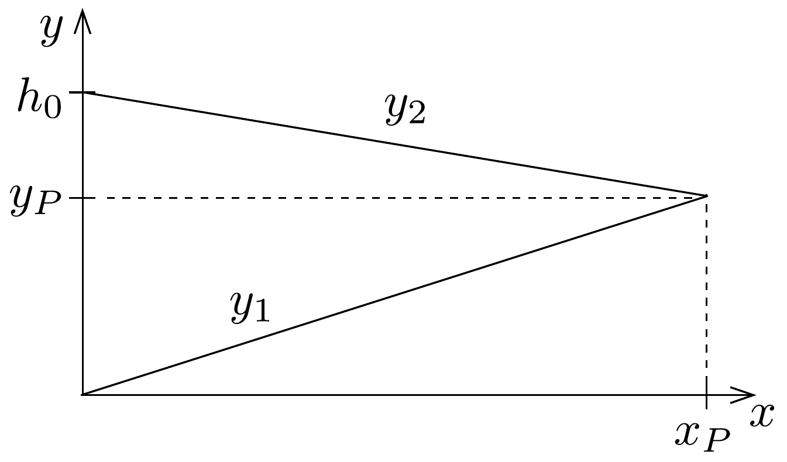
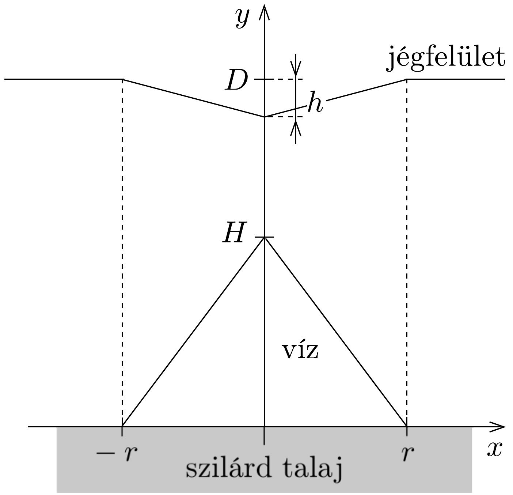

## Megoldás 2

a) A jég megolvasztásához szükséges hốt a Föld mélyéből érkező hőáram fedezi: $J_{Q} A t=L_{\mathrm{j}} \varrho_{\mathrm{j}} A d(t=1$ év), amiből az évente megolvadó jégréteg vastagsága: $d \approx 6 \mathrm{~mm}$.
b) A jégtábla alján a nyomás a külső légnyomás $\left(p_{0}\right)$ és a jég súlyából származó hidrosztatikai nyomás összege:
\[
p_{\mathrm{j}}(x)=p_{0}+\varrho_{\mathrm{j}} g\left[y_{2}(x)-y_{1}(x)\right]=p_{0}+\varrho_{\mathrm{j}} g h_{0}+\varrho_{\mathrm{j}} g x(\operatorname{tg} \beta-\operatorname{tg} \alpha) .
\]

A jégtábla alján vékony vízréteget képzelhetünk el, ami akkor nem folyik egyik irányba sem, ha a felette lévő jégréteg nyomása megegyezik a víz nyomásával (Gondoljunk egy kicsiny darabkára az $x$ helyen. A darabka tetéjére felülről a jég általi, alulról a vízbeli nyomás hat.). A víz nyomása $x=0$-nál $p_{\mathrm{v}}(0)=p_{\mathrm{j}}(0)=$ $p_{0}+\varrho_{\mathrm{j}} g h_{0}$, magasabban pedig a hidrosztatikai nyomásnak megfelelően kisebb:
\[
p_{\mathrm{v}}(x)=p_{0}+\varrho_{\mathrm{j}} g h_{0}-\varrho_{\mathrm{v}} g x \operatorname{tg} \alpha .
\]
Egyensúly esetén tehát $p_{\mathrm{v}}(x)=p_{\mathrm{j}}(x)$, azaz $\varrho_{\mathrm{j}}(\operatorname{tg} \beta-\operatorname{tg} \alpha)=-\varrho_{\mathrm{v}} \operatorname{tg} \alpha$, azaz
\[
s=\frac{\operatorname{tg} \beta}{\operatorname{tg} \alpha}=\frac{\varrho_{\mathrm{j}}-\varrho_{\mathrm{v}}}{\varrho_{\mathrm{j}}}=-0,091 .
\]
A negatív előjel azt jelzi, hogy egyensúlyi állapotban a jégréteg felső felületének süllyednie kell, ha az alatta lévő talaj emelkedik (220. ábra).

Ha a sziklatalaj menetét az $y_{1}=0,8 x$ egyenlet írja le, továbbá a jég vastagsága az $x_{0}=0$ helyen $h_{0}=2 \mathrm{~km}$, akkor a jégfelszínt leíró egyenlet: $y_{2}=2 \mathrm{~km}-0,073 x$. A két egyenes az $x_{P}=2,3 \mathrm{~km}, y_{P}=1,8 \mathrm{~km}$ koordinátájú pontban metszi egymást.

- c) Mivel csak függőleges elmozdulásokat feltételezünk, a vízszintes jégfelület a $-r$ és $r$ közötti részen módosul. A víz súrúsége nagyobb a jégénél, így olvadáskor a keletkezett víz kisebb térfogatot foglal el, és a jégtábla felszínén (éppen a megolvadt kúp alakú víztömeg felett) fordított kúp alakú bemélyedés jön létre. Az egyensúly beállta után a behorpadás legnagyobb $h$ mélységét a $b$ ) alkérdésre adott válasz alapján számíthatjuk ki:
\[
h=|r \operatorname{tg} \beta|=r \cdot|s| \operatorname{tg} \alpha=|s| H \approx 91 \mathrm{~m} .
\]
A felszínen kialakult bemélyedést a 221. ábra mutatja.

- d) A jégréteg aljára behatoló forró magma miatt nagy mennyiségú jég olvad meg. A folyamatot három lépésben képzelhetjük el. Először a magmabenyomulás helyén lévő $V_{1}=\frac{1}{3} \pi r^{2} h_{1}$ térfogatú jég olvad meg, és - a nyomásegyensúly hiányában - a keletkező víz elfolyik, és így a magmabenyomulás mindenütt érintkezik

a jégtömbbel, tehát annak felülete még mindenütt vízszintes marad. Második lépésben fordított kúp alakú benyomódás jön létre a jégréteg felszínén (a magma ebben a térfogatban lévő jeget olvasztja meg), miközben a magmabenyomulás felett keletkező víz folyamatosan elfolyik. Ez a szakasz a nyomásegyensúly kialakulásáig tart, a horpadás $h_{2}$ mélységét az előző alkérdésre adott válasz alapján számíthatjuk ki:
\[
V_{2}=\frac{1}{3} \pi r^{2} h_{2}=\frac{1}{3} \pi r^{2}|s| h_{1} .
\]
Feltételezhetjük, hogy a magmabenyomulás anyaga még ekkor is igen meleg, tehát a magma további jégmennyiséget olvaszt meg, ami viszont már nem folyik el, hiszen a megolvadása nem befolyásolja a kialakult nyomásegyensúlyt. A harmadik lépésben elolvadó jég térfogatát is kezelhetjük egy kúp térfogataként: $V_{3}=\frac{1}{3} \pi r^{2} h_{3}$, amelyből a magmabenyomulás felett $h_{3}^{\prime}=\frac{\varrho_{\mathrm{j}}}{\varrho_{\mathrm{v}}} h_{3}$ magasságú „vízkúp" jön létre, ami tovább növeli a felszíni behorpadás mélységét. Az olvadási folyamat végére létrejövő horpadás teljes $h$ mélységét (ismét az előző alkérdés eredménye alapján) így írhatjuk fel:
\[
h=|s|\left(h_{1}+h_{3}^{\prime}\right)=|s| \cdot H,
\]
amelyből a vízkúp tetőpontjának $H$ magasságát a jégtábla alapjának eredeti szintjéhez képest már könnyen kiszámíthatjuk: $H=1,1 \mathrm{~km}$. A magmabehatolás $h_{1}$ magasságát kalorimetrikus egyenlet alapján határozhatjuk meg (a magma belsőenergia-csökkenése fedezi a jég megolvasztásához szükséges hőt, $\Delta T=$ $\left.1200^{\circ} \mathrm{C}\right)$ :
\[
\begin{aligned}
& \left(L_{\mathrm{k}}+c_{k} \Delta T\right) \frac{1}{3} \pi r^{2} h_{1} \varrho_{\mathrm{k}}=L_{\mathrm{j}} \frac{1}{3} \pi r^{2}\left(h_{1}+h_{2}+h_{3}\right) \varrho_{\mathrm{j}}= \\
& \quad=L_{\mathrm{j}} \frac{1}{3} \pi r^{2}\left[h_{1} \varrho_{\mathrm{j}}+h_{1}\left(\varrho_{\mathrm{v}}-\varrho_{\mathrm{j}}\right)+\left(H-h_{1}\right) \varrho_{\mathrm{v}}\right]
\end{aligned}
\]
A szükséges behelyettesítések és számítások elvégzése után a magmabehatolás magasságára $h_{1}=103 \mathrm{~m}$ adódik. A keletkezett és az elfolyt víztömegeket ezek után már könnyú meghatározni, hiszen $V_{1}+V_{2}+V_{3}$ adja a teljes elolvadt jégtérfogatot, míg $V_{1}+V_{2}$ azt a jégtérfogatot, amiből a megolvadt víz elfolyt. A numerikus számítások szerint a keletkezett teljes víztömeg: $m=\varrho_{\mathrm{j}}\left(V_{1}+V_{2}+V_{3}\right)=2,9 \cdot 10^{11} \mathrm{~kg}$, míg az elfolyt víz tömege: $m^{\prime}=\varrho_{\mathrm{j}}\left(V_{1}+V_{2}\right)=2,7 \cdot 10^{10} \mathrm{~kg}$.
