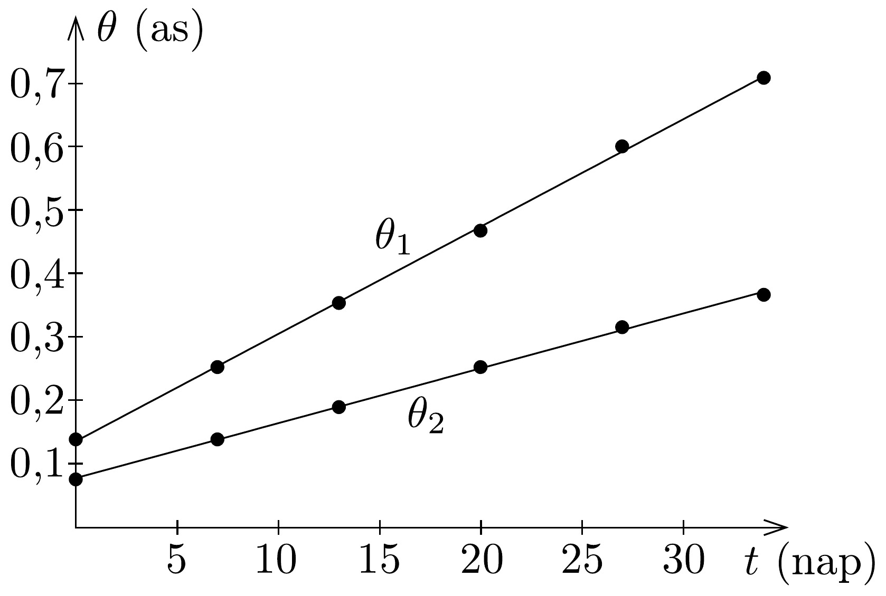
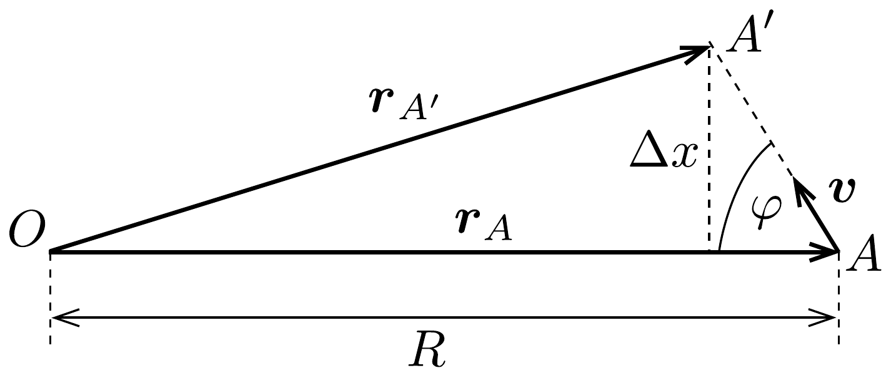
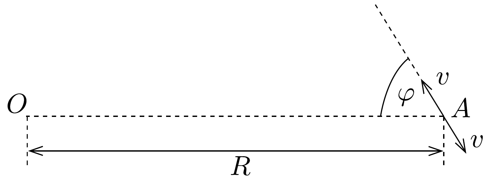
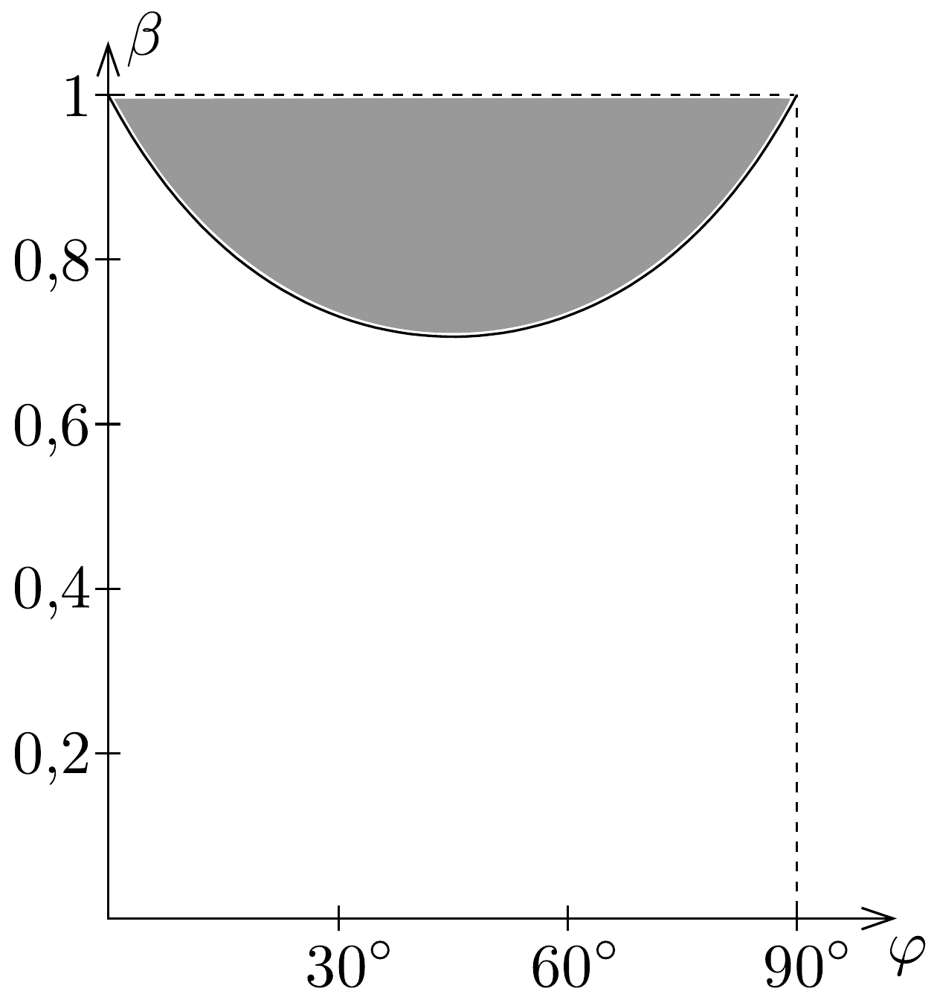

## Megoldás 3

a) Vonalzó segítségével a megadott ábrán lemérhetjük a két forrás centrumtól való távolságát, és a skála alapján ezeket átválthatjuk szögtávolságra (látószögre). Ezeket az alábbi táblázat tartalmazza:

\begin{tabular}[t]{|l|l|l|}
\hline $t$ (nap) & $\theta_{1}$ (as) & $\theta_{2}$ (as) \\
\hline 0 & 0,139 & 0,076 \\
\hline 7 & 0,253 & 0,139 \\
\hline 13 & 0,354 & 0,190 \\
\hline 20 & 0,468 & 0,253 \\
\hline 27 & 0,601 & 0,316 \\
\hline 34 & 0,709 & 0,367 \\
\hline
\end{tabular}

Ábrázolva a szögeket az idő függvényében (222. ábra), majd az adatokra egyenest illesztve, a meredekség megadja a szögsebességeket. Ezek rendre a bal és a

jobb oldali forrásra:
\[
\begin{aligned}
\omega_{1} & =\frac{\mathrm{d} \theta_{1}}{\mathrm{~d} t}=16,9 \frac{\mathrm{mas}}{\mathrm{nap}}=9,5 \cdot 10^{-13} \frac{1}{\mathrm{~s}} \\
\omega_{2} & =\frac{\mathrm{d} \theta_{2}}{\mathrm{~d} t}=8,6 \frac{\mathrm{mas}}{\mathrm{nap}}=4,8 \cdot 10^{-13} \frac{1}{\mathrm{~s}}
\end{aligned}
\]
A keresztirányú sebességek pedig:
\[
\begin{aligned}
& v_{1, \perp}^{\prime}=R \omega_{1}=3,7 \cdot 10^{8} \frac{\mathrm{~m}}{\mathrm{~s}}=1,2 c, \\
& v_{2, \perp}^{\prime}=R \omega_{2}=1,9 \cdot 10^{8} \frac{\mathrm{~m}}{\mathrm{~s}}=0,6 c .
\end{aligned}
\]

Egyszerú számításaink alapján arra a meglepő eredményre jutottunk, mintha a bal oldali objektum a fénynél sebesebben (!) mozogna.
b) Tekintsük a feladat utasításának megfelelően a forrás mozgását $\Delta t$ ideig, miközben az $A$ pontból az $A^{\prime}$ pontba jut (223. ábra): $\boldsymbol{r}_{A A^{\prime}}=\boldsymbol{r}_{A^{\prime}}-\boldsymbol{r}_{A}=\boldsymbol{v} \Delta t$. Jelölje $\Delta t^{\prime}$ az $A$-ból, illetve az $A^{\prime}$-ből induló jelek beérkezésének időbeli különb-

ségét az $O$ pontban. Induljon egy fényjel a $T_{0}$ időpillanatban az $A$-ból $O$-ba és $A^{\prime}$-be. Ez a fényjel az $O$ pontba $r_{A} / c$ idő alatt ér. Amikor a másik fényjel $A^{\prime}$-be ér, tehát $T_{0}+\Delta t$ idő múlva, induljon egy másik fényjel az $O$-ba. Ez a fényjel az $O$ pontba $T_{0}+\Delta t+r_{A^{\prime}} / c$ idő alatt ér. Tehát
\[
\Delta t^{\prime}=T_{0}+\Delta t+\frac{r_{A^{\prime}}}{c}-T_{0}-\frac{r_{A}}{c}=\Delta t+\frac{r_{A^{\prime}}-r_{A}}{c} .
\]
Kis $\Delta t$ idók esetén $v \Delta t \ll r_{A}=R$, tehát
\[
r_{A^{\prime}}-r_{A} \approx-v \Delta t \cos \varphi .
\]
Mindezek figyelembe vételével
\[
\Delta t^{\prime} \approx \Delta t(1-\beta \cos \varphi) .
\]
Így a forrás $O$-beli látszólagos keresztirányú sebessége
\[
v_{\perp}^{\prime}=\frac{\Delta x}{\Delta t^{\prime}}=\frac{\Delta x}{\Delta t(1-\beta \cos \varphi)}=\frac{c \beta \sin \varphi}{1-\beta \cos \varphi},
\]
ahol felhasználtuk, hogy a megfigyelő vonatkoztatási rendszerében a valódi keresztirányú sebesség $v_{\perp}=\Delta x / \Delta t=c \beta \sin \varphi$. Az $O$-ban észlelhető szögsebesség:
\[
\omega=\frac{v_{\perp}^{\prime}}{R}=\frac{c \beta \sin \varphi}{R(1-\beta \cos \varphi)} .
\]
c) A feladatrészben leírt helyzetet a 224. ábrán láthatjuk. Az előző részben kapott eredmény alapján a következő összefüggéseket írhatjuk fel a látszólagos szögsebességekre:
\[
\omega_{1}=\frac{c \beta \sin \varphi}{R(1-\beta \cos \varphi)}, \quad \omega_{2}=\frac{c \beta \sin \varphi}{R(1+\beta \cos \varphi)} .
\]

A jobbra mozgó forrás esetében felhasználtuk, hogy $180^{\circ}-\varphi$ szög alatt látszik az $O$ irányából.

Ebből a két egyenletből algebrai átalakítások után a következő kifejezéseket kapjuk:
\[
\varphi=\operatorname{arctg} \frac{2 R \omega_{1} \omega_{2}}{c\left(\omega_{1}-\omega_{2}\right)}, \quad \beta=\frac{\omega_{1}-\omega_{2}}{\cos \varphi\left(\omega_{1}+\omega_{2}\right)} .
\]

A megadott, illetve az $a$ ) részben kapott numerikus értékek segítségével: $\varphi=$ $68,8^{\circ}, \beta=0,89$. Tehát az észlelt rádióforrások mindössze a fénysebesség $89 \%$-ával mozognak.
- d) A b) részben kapott (98-1) eredmény alapján:
\[
\frac{\beta \sin \varphi}{1-\beta \cos \varphi} \geq 1 .
\]

Ezt átalakítva megkapjuk a kívánt feltételt:
\[
\beta \geq f(\varphi)=\frac{1}{\sin \varphi+\cos \varphi}=\frac{1}{\sqrt{2} \sin \left(\varphi+\frac{\pi}{4}\right)} .
\]
A fizikailag releváns tartományban $\beta \in[0,1]$ és $\varphi \in[0, \pi / 2]$. A 225. ábrán a szürkén jelölt tartomány adja meg a $v_{\perp}^{\prime}>c$ feltétel teljesülését.

- e) A (98-1) kifejezés $\varphi$ szerinti deriváltját véve, megkapjuk a szélsőérték helyét (jelen esetben maximumot kapunk):
\[
\frac{\mathrm{d} \beta}{\mathrm{~d} \varphi}=\frac{c \beta(\cos \varphi-\beta)}{(1-\beta \cos \varphi)^{2}}=0 .
\]

Adott $\beta$ esetén a maximumhely: $\varphi_{\text {max }}=\arccos \beta$. Eszerint a látszólagos keresztirányú sebesség végtelenhez tarthat, ha $\beta$ megközelíti az 1-et, ami persze azt is jelenti, hogy $\varphi$ nullához tart, vagyis a mozgó objektum a megfigyelő felé mozog közel fénysebességgel.
f) A megadott formula alapján a megfigyelőhöz közeledő, illetve távolodó forrásra:
\[
\frac{\lambda_{1,2}}{\lambda_{0}}=\frac{1 \mp \beta \cos \varphi}{\sqrt{1-\beta^{2}}} .
\]
Α $\varphi$ szög kiküszöbölésével kapjuk, hogy
\[
\beta=\sqrt{1-\frac{4 \lambda_{0}^{2}}{\left(\lambda_{1}+\lambda_{2}\right)^{2}}},
\]
tehát a kérdéses szám: $\alpha=4$.
A c) alkérdésben $\omega_{1}$-re és $\omega_{2}$-re megadott formulákban $\varphi$ és $\beta$ voltak az ismeretlenek, $R$-et más mérésekből meghatározott, adott értéknek vettük. Ha viszont a legutóbbi összefüggésünket harmadik egyenletnek tekintjük, ami közvetlenül megadja $\beta$ értékét, akkor $\varphi$ mellett az $R$ távolság is meghatározható.

\section*{
