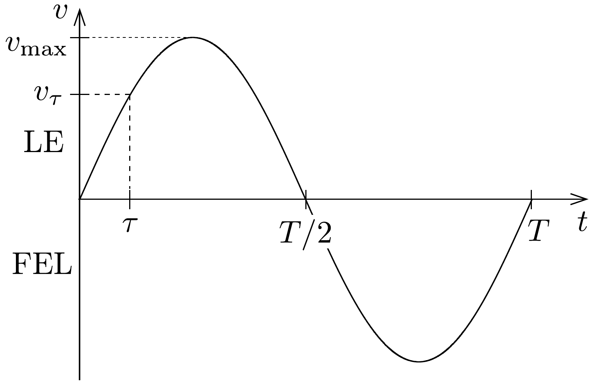
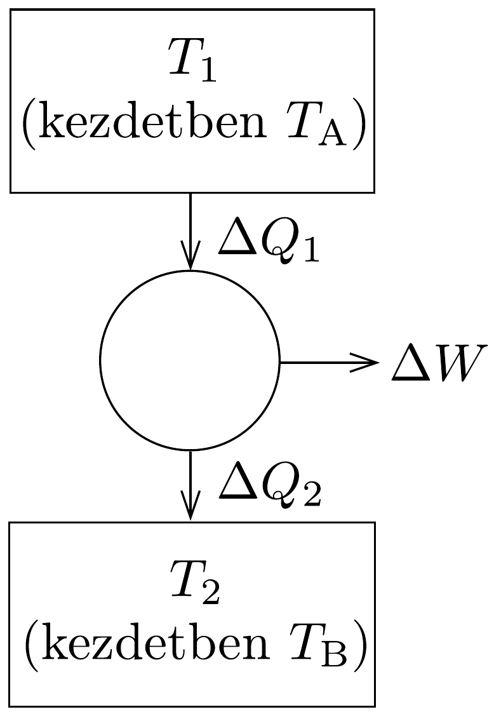

## Megoldás 1

1.1. feladat. a) A „halálugró” ember sebessége akkor csökken először nullára, amikor a gravitációs helyzeti energia csökkenése megegyezik a kötélben tárolt rugalmas energiával:
\[
m g y=\frac{1}{2} k(y-L)^{2} .
\]
Ennek a másodfokú egyenletnek a megoldásai:
\[
y=L+\frac{m g}{k}\left(1 \pm \sqrt{1+2 \frac{k L}{m g}}\right) .
\]
Esetünkben a gyökjel előtt a pozitív előjelet kell választani, hiszen negatív előjel esetén az elmozdulás kisebb, mint $L$, ami nem nyugalmi helyzet.
b) Az ugró ember sebessége akkor maximális, amikor a gyorsulása nulla, vagyis amikor az erőegyensúly $m g=k x$ feltétele teljesül. Ebben a pillanatban a munkatétel szerint
\[
\frac{1}{2} m v_{\max }^{2}=m g(L+x)-\frac{1}{2} k x^{2},
\]
ahonnan $x=m g / k$ felhasználásával a kérdéses sebesség
\[
v_{\max }=\sqrt{2 g L+\frac{m g^{2}}{k}} .
\]
- c) Az ugró ember első megállásáig eltelő idő két tag összegeként számítható ki: a kötél megfeszüléséig a mozgás szabadesés, ennek időtartama $t_{1}=\sqrt{2 L / g}$, majd az ezt követő harmonikus rezgőmozgás bizonyos szakaszának $t_{2}$ ideje együtt teszi ki a kérdéses időtartamot.
A harmonikus rezgőmozgás periódusideje $T=2 \pi \sqrt{m / k}$, körfrekvenciája $\omega=$ $\sqrt{k / m}$. A sebesség időbeli változása
\[
v(t)=v_{\max } \sin (\omega t)
\]
alakban írható fel, kezdetét pedig az a $\tau$ időpillanat jellemzi, melynél a rezgő test sebessége éppen megegyezik a szabadesés végsebességével, vagyis a $v_{\tau}=g t_{1}=$ $\sqrt{2 g L}$ mennyiséggel (235. ábra). Innen
\[
\tau=\frac{1}{\omega} \arcsin \frac{\sqrt{2 g L}}{v_{\max }},
\]
az esés teljes ideje pedig az első megállásig
\[
t_{\text {teljes }}=t_{1}+t_{2}=t_{1}+\left(\frac{T}{2}-\tau\right)=\sqrt{\frac{2 L}{g}}+\sqrt{\frac{m}{k}}\left(\pi-\arcsin \frac{\sqrt{2 g L}}{\sqrt{2 g L+m g^{2} / k}}\right) .
\]

- 235. ábra.

1.2. feladat. Jelöljük az A test által leadott hőt $\Delta Q_{1}$-gyel, a B test által felvett hốt pedig $\Delta Q_{2}$-vel (lásd a 236. ábrát). Ezeket a mennyiségeket kifejezhetjük a megfelelő hőmérséklet-változásokkal:
\[
\begin{array}{cc}
\Delta Q_{1}=-c m \Delta T_{1}, & \Delta T_{1} \text { negatív } \\
\Delta Q_{2}=c m \Delta T_{2}, & \Delta T_{2} \text { pozitív. }
\end{array}
\]
- a) A hőerőgép akkor végzi a lehető legtöbb munkát, ha Carnot-gépként múködik. Ilyenkor (a második főtétel értelmében)
\[
\frac{\Delta Q_{1}}{T_{1}}=\frac{\Delta Q_{2}}{T_{2}},
\]

vagyis
\[
-c m \frac{\Delta T_{1}}{T_{1}}=c m \frac{\Delta Q_{2}}{T_{2}} .
\]
Ez az összefüggés
\[
T_{1} \cdot \Delta T_{2}+T_{2} \cdot \Delta T_{1}=\Delta\left(T_{1} \cdot T_{2}\right)=0,
\]
tehát $T_{1} \cdot T_{2}=$ állandó alakba is írható. Eszerint a végső (közös) hőmérséklet: $T_{0}=\sqrt{T_{A} T_{B}}$.

Ugyanez az eredmény integrálszámítással is megkapható:
\[
-c m \int_{T_{A}}^{T_{0}} \frac{\mathrm{~d} T_{1}}{T_{1}}=c m \int_{T_{B}}^{T_{0}} \frac{\mathrm{~d} T_{2}}{T_{2}},
\]
ahonnan $\ln \left(T_{A} / T_{0}\right)=\ln \left(T_{0} / T_{B}\right)$, vagyis $T_{0}=\sqrt{T_{A} T_{B}}$ következik.
b) A munkavégzés a leadott és a felvett hő különbségéből számítható:
\[
\begin{aligned}
& W=Q_{1}-Q_{2}=c m\left(T_{A}-T_{0}\right)-c m\left(T_{0}-T_{B}\right)= \\
& =c m\left(T_{A}+T_{B}-2 T_{0}\right)=c m\left(\sqrt{T_{A}}-\sqrt{T_{B}}\right)^{2}
\end{aligned}
\]
c) A megadott számadatokkal $W=20 \mathrm{MJ}$.
1.3. feladat. a) A kezdetben $N_{0}$ darab ${ }^{238} \mathrm{U}$ izotópból $t$ idő múlva már csak $N=N_{0} \mathrm{e}^{-\lambda t}$ marad, tehát a bomlástermékének száma $n=N_{0}\left(1-\mathrm{e}^{-\lambda t}\right)=$ $N\left(\mathrm{e}^{\lambda t}-1\right)$. Mivel a $\lambda$ bomlásállandó és a $T$ felezési idő közötti kapcsolat: $\lambda=$ $\frac{\ln 2}{T}=\frac{0,693}{T}$, a $^{238} \mathrm{U}$ atomok pillanatnyi ${ }^{238} N$ száma és a bomlása során keletkező
${ }^{206} \mathrm{~Pb}$ atomok pillanatnyi ${ }^{206} n$ száma közötti kapcsolat (ha az időt milliárd év egységekben mérjük):
\[
{ }^{206} n={ }^{238} N\left(\mathrm{e}^{0,154 t}-1\right)={ }^{238} N\left(2^{t / 4,50}-1\right) .
\]
- b) Hasonlóan az előbbi pontban leírtakhoz
\[
{ }^{207} n={ }^{235} N\left(\mathrm{e}^{0,976 t}-1\right)={ }^{235} N\left(2^{t / 0,710}-1\right) .
\]
- c) Az urán-ólom keverékben (ahol a radioaktív bomlások során folyamatosan keletkeznek ólomatomok), a különböző tömegszámú ólomizotópok számának aránya:
\[
204: 206: 207 \quad \Rightarrow \quad 1,00: 29,6: 22,6 .
\]
A tiszta ólomban a megfeleló arányok:
\[
204: 206: 207 \quad \Rightarrow \quad 1,00: 17,9: 15,5 .
\]
A fenti arányszámok különbségét képezve látható, hogy a radioaktív bomlásokból származó ólomizotópok aránya:
\[
206: 207 \quad \Rightarrow \quad 11,7: 7,1 .
\]
$\operatorname{Az} a)$ és a $b$ ) alkérdések megoldásában szereplő egyenlőségek hányadosát képezve:
\[
\frac{{ }^{206} n}{{ }^{207} n}=\frac{{ }^{238} N}{235 N} \frac{\mathrm{e}^{0,154 t}-1}{\mathrm{e}^{0,976 t}-1},
\]
ahonnan a Föld $T$ életkorára a következő egyenletet kapjuk:
\[
\frac{11,7}{7,1}=137 \frac{\mathrm{e}^{0,154 T}-1}{\mathrm{e}^{0,976 T}-1},
\]
vagyis
\[
0,012\left(\mathrm{e}^{0,976 T}-1\right)=\left(\mathrm{e}^{0,154 T}-1\right) .
\]
- d) Feltételezve, hogy $T \gg 4,5 \cdot 10^{9}$ év, a fenti formulában a zárójelekben az 1-eseket elhanyagolhatjuk, és $T$-t könnyen kifejezhetjük (milliárd években):
\[
T=\frac{\ln 0,012}{-0,822}=5,38 .
\]
- $e$ ) Láthatjuk, hogy ez a közelítő érték nem sokkal nagyobb, mint a hosszabb felezési idő (tehát a kiszámítása során alkalmazott elhanyagolás nem volt jogos), de felhasználható egy pontosabb $T$ érték meghatározására. Jelöljük a Föld életkorára durva közelítésben kapott 5,38 milliárd évet $T^{*}$-gal, és az eredeti egyenlet helyett tekintsük a
\[
0,012\left(\mathrm{e}^{0,976 T}-1\right)=\left(\mathrm{e}^{0,154 T^{*}}-1\right)
\]

egyenletet. Ez zárt alakban megoldható, és $T$-re $4,80 \cdot 10^{9}$ év adódik. Ha ezen értéket írjuk $T^{*}$ helyébe, $T$-re még jobb közelítést, $4,62 \cdot 10^{10}$ évet kapunk. Ezt a (fokozatosan közelítő) eljárást (iterációt) tovább folytatva az eredmények 4,52 • $10^{9}$ évhez konvergálnak. (Ezt a gyököt természetesen más módszerekkel, pl. az eredeti exponenciális egyenlet grafikus megoldásával is megkaphatjuk.)
1.4. feladat. A homogén töltéseloszlású gömb térfogati elektromos töltéssürúsége:
\[
\varrho=\frac{Q}{\frac{4}{3} \pi R^{3}} \quad(\text { ha } r<R) .
\]
a) Az elektromos térerősséget Gauss-törvénnyel adhatjuk meg. Ez alapján a gömb középpontjától mért $r$ távolságban $r \leq R$ esetén az $r$ sugarú gömbben levő töltések Coulomb-terével, $r \geq R$ esetben pedig a teljes $Q$ töltés Coulomb-terével egyezik meg:
\[
E= \begin{cases}\frac{\frac{4}{3} \pi r^{3} \varrho}{4 \pi \varepsilon_{0} r^{2}}=\frac{Q r}{4 \pi \varepsilon_{0} R^{3}}, & \text { ha } r<R \\ \frac{Q}{4 \pi \varepsilon_{0} r^{2}}, & \text { ha } r \geq R .\end{cases}
\]
b) A teljes elektromos mező $W$ energiája az elektromos mező térerősségének ismeretében gömbhéjak energiájából integrálható össze:
\[
W=\int_{0}^{\infty} \frac{1}{2} \varepsilon_{0} E^{2} \cdot 4 \pi r^{2} \mathrm{~d} r=\frac{Q^{2}}{8 \pi \varepsilon_{0}}\left(\frac{1}{R^{6}} \int_{0}^{R} r^{4} \mathrm{~d} r+\int_{R}^{\infty} \frac{1}{r^{2}} \mathrm{~d} r\right)=\frac{3}{20} \frac{Q^{2}}{\pi \varepsilon_{0} R} .
\]

A teljes energiát úgy is ki lehet számítani, hogy meghatározzuk, mekkora munkavégzéssel lehet vékony, egyenletesen töltött gömbhéjakban található töltéseket nagyon messziről (a „végtelenből”) $r$ sugárnak megfelelő helyzetbe hozni, miközben $r$ fokozatosan nő 0-tól $R$-ig.

Az $r$ sugarú homogénen töltött gömb felületén az elektromos potenciál
\[
U(r)=\frac{1}{4 \pi \varepsilon_{0}} \frac{Q(r)}{r}=\frac{\frac{4}{3} \pi r^{3} \varrho}{4 \pi \varepsilon_{0} r}=\frac{r^{2} \varrho}{3 \varepsilon_{0}} .
\]
Tehát az elemi munka, ami ahhoz kell, hogy a végtelenbő̌l $\mathrm{d} Q=\varrho \cdot 4 r^{2} \pi \mathrm{~d} r$ töltést $r$ sugarú gömbefelületen $\mathrm{d} r$ rétegben egyenletesen elhelyezzünk
\[
\mathrm{d} W=\mathrm{d} Q \cdot U(r)=\frac{4 \varrho^{2} \pi r^{4}}{3 \varepsilon_{0}} \mathrm{~d} r,
\]
vagyis a teljes munka
\[
W=\frac{4 \pi \varrho^{2}}{3 \varepsilon_{0}} \int_{0}^{R} r^{4} \mathrm{~d} r=\frac{4 \pi \varrho^{2}}{3 \varepsilon_{0}} \frac{R^{5}}{5}=\frac{3}{20} \frac{Q^{2}}{\pi \varepsilon_{0} R} .
\]
1.5. feladat. A mágneses indukcióvektor vízszintes komponense
\[
B=44,5 \mu \mathrm{~T} \cdot \cos 64^{\circ},
\]
amely az $a$ sugarú, a $B$-re merőleges állapothoz képest $\vartheta$ szöggel jellemezhető síkban álló rézgyűrún keresztül
\[
\Phi=B a^{2} \pi \cos \left(90^{\circ}-\vartheta\right)=B a^{2} \pi \sin \vartheta
\]
mágneses fluxust eredményez. Ha a gyúrú $\omega$ szögsebességgel (közel egyenletesen) forog, a benne indukálódó pillanatnyi feszültség (elektromotoros eró)
\[
U(t)=\frac{\mathrm{d} \Phi}{\mathrm{~d} t}=B a^{2} \pi \frac{\mathrm{~d}(\sin \omega t)}{d t}=B a^{2} \pi \omega \cos \omega t .
\]
Ez a váltakozó feszültség a hőhatását tekintve
\[
U_{\mathrm{eff}}=\frac{1}{\sqrt{2}} U_{\max }=\frac{B a^{2} \pi \omega}{\sqrt{2}}
\]
effektív feszültséggel egyenértékú, tehát az $R$ ellenállású rézgyúrúben átlagosan
\[
P=\frac{U_{\mathrm{eff}}^{2}}{R}=\frac{B^{2} \pi^{2} a^{4} \omega^{2}}{2 R}
\]
teljesítménnyel termel hốt, és ugyanilyen mértékben csökkenti időegységenként az $m$ tömegú, az átmérójére vonatkoztatva $\Theta=\frac{1}{2} m a^{2}$ tehetetlenségi nyomatékú gyürú mechanikai (forgási) energiáját:
\[
P=-\frac{\mathrm{d}}{\mathrm{~d} t}\left(\frac{1}{4} m a^{2} \omega^{2}\right)=-\frac{1}{2} m a^{2} \omega \frac{\mathrm{~d} \omega}{\mathrm{~d} t} .
\]
Ezek szerint a szögsebesség (lassú) változását megadó egyenlet:
\[
\frac{\mathrm{d} \omega(t)}{\mathrm{d} t}=-\lambda \cdot \omega(t),
\]
ahol $\lambda=B^{2} \pi^{2} a^{2} /(m R)$ állandó. Ez a réz $s=m /(2 a \pi A)$ súrúségével és $\varrho=$ $R A /(2 a \pi)$ fajlagos ellenállásával ( $A$ a gyúrú keresztmetszetének területe) is kifejezhető: $\lambda=B^{2} /(4 s \varrho)$. Ez az egyenlet (differenciálegyenlet) alakilag megegyezik a radioaktív bomlások egyenletével, tehát a megoldása is azokéval egyező:
\[
\omega(t)=\omega_{0} \mathrm{e}^{-\lambda t} .
\]
A szögsebesség felezési ideje (tehát az a $T_{1 / 2}$ idő, amikor $\omega(t)=\omega_{0} / 2: T_{1 / 2}=$ $\frac{\ln 2}{\lambda}=\frac{4 \ln 2 s \varrho}{B^{2}}$, ami a megadott számadatokkal $1,10 \cdot 10^{6} \mathrm{~s} \approx 306$ óra $\approx 13$ napnak adódik.

Az eredmény a szögsebesség változását megadó egyenletből integrálszámítással is megkapható:
\[
\frac{\mathrm{d} \omega(t)}{\mathrm{d} t}=-\lambda \cdot \omega(t) \Rightarrow \quad \int_{\omega_{0}}^{\omega_{0} / 2} \frac{\mathrm{~d} \omega}{\omega}=-\lambda \int_{0}^{T_{1 / 2}} \mathrm{~d} t \Rightarrow \ln 2=\lambda T_{1 / 2} .
\]

A rézgyürú fékeződése más módszerrel, pl. a gyűrúre ható átlagos forgatónyomaték kiszámításával, majd a forgómozgás dinamikai egyenletének felírásával és megoldásával is meghatározható. Az indukált feszültség hatására a gyűrúben áram jelenik meg:
\[
I(t)=\frac{U(t)}{R}=\frac{B a^{2} \pi \omega}{R} \cos \omega t .
\]
Ezzel a gyúrú mágneses dipólnyomatéka:
\[
\mu=I a^{2} \pi=\frac{B a^{4} \pi^{2} \omega}{R} \cos \omega t .
\]
Mágneses térben lévó dipólra ható forgatónyomaték-vektor $\boldsymbol{M}=\boldsymbol{\mu} \times \boldsymbol{B}$, azaz a forgatónyomaték nagysága:
\[
M(t)=\mu B \sin \left(90^{\circ}-\vartheta\right)=\mu B \cos \omega t=\frac{B^{2} a^{4} \pi^{2} \omega}{R} \cos ^{2} \omega t .
\]
Ez a forgatónyomaték lassítja a gyűrú forgását, azaz, ahhoz hogy a gyúrú állandó szögsebességü forgása fennmaradjon, ekkora forgatonyomatékot kell kifejtenünk. Az időátlagolt forgatónyomaték
\[
M=\frac{B^{2} a^{4} \pi^{2} \omega}{2 R},
\]
és a forgómozgás alapegyenlete szerint
\[
M=-\Theta \frac{\mathrm{d} \omega}{\mathrm{~d} t},
\]
vagyis
\[
\frac{B^{2} a^{4} \pi^{2} \omega}{2 R}=-\frac{1}{2} m a^{2} \frac{\mathrm{~d} \omega}{\mathrm{~d} t},
\]
ami a korábban kapott differenciálegyenlettel azonos.
